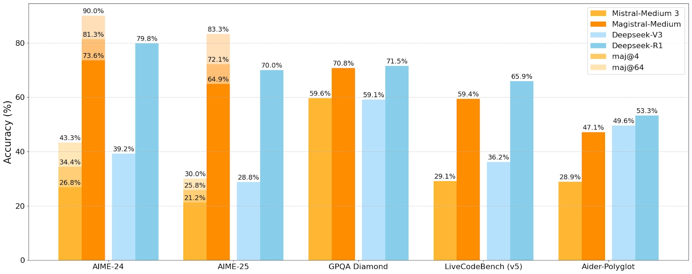

# Magistral

**Source**: `raw/magistral/full-article.html` (220 KB), `raw/magistral/full-article.md` (markdown view)  
**URL**: https://mistral.ai/news/magistral/  
**Ingested**: 2026-06-06  
**Tags**: #summary

## Summary

Mistral AI announces **Magistral**, its first reasoning model, in open and enterprise variants. Magistral targets domain-specific, transparent, and multilingual chain-of-thought reasoning—addressing gaps in early thinking models around specialized depth, interpretability, and language consistency.

Two releases ship together: **Magistral Small** (24B, Apache 2.0 on Hugging Face) and **Magistral Medium** (enterprise, preview in Le Chat and La Plateforme API). On AIME2024 the blog reports 73.6% (Medium) and 70.7% (Small), rising to 90% and 83.3% with majority voting @64. Reasoning traces are native across languages and alphabets; Le Chat's Think mode and Flash Answers claim up to **10× faster** token throughput than most competitors.

Use cases span regulated industries (auditability), business strategy, software/data engineering, and creative writing. Medium is also on Amazon SageMaker with IBM WatsonX, Azure AI, and Google Cloud Marketplace coming. Training infrastructure, GRPO-based RL, and evaluation details are in the accompanying research paper and [[Papers Explained 388 - Magistral]].

## Key Claims

- First Mistral reasoning model; dual release (24B open Small + enterprise Medium).
- AIME2024: Medium 73.6% (90% @64 majority vote); Small 70.7% (83.3% @64).
- Transparent, traceable chain-of-thought in the user's language; strong multilingual reasoning (English, French, Spanish, German, Italian, Arabic, Russian, Simplified Chinese).
- Le Chat Flash Answers: up to 10× faster reasoning throughput vs. most competitors.
- Suited for legal, finance, healthcare, government, coding, and creative multi-step tasks.
- Magistral Small: Apache 2.0, [`mistralai/Magistral-Small-2506`](https://huggingface.co/mistralai/Magistral-Small-2506); Medium via Le Chat, La Plateforme, SageMaker.

## Figures

| Figure | Caption | Page |
|--------|---------|------|
|  | Speed comparison: Magistral Medium (Flash Answers) vs. ChatGPT in Le Chat | — |

## Entities

- [[Large Language Models]] — 24B open and enterprise reasoning LLM release.
- [[Reasoning Models]] — chain-of-thought, AIME benchmarks, transparent multi-step logic.
- [[Multilingual Models]] — native multilingual reasoning traces across major languages.

## Questions & Gaps

- Blog is announcement-oriented; GRPO modifications, reward shaping, and full benchmarks are in [[Papers Explained 388 - Magistral]] and the research paper.
- Magistral Medium weights and full API pricing not detailed in the post.
- Physics-simulation and Arabic demos referenced but not technically specified.

## Related

- [[Papers Explained 388 - Magistral]] — detailed explainer of GRPO training, reward shaping, and evaluation from the research paper.
- [[Reasoning Models]] — topic hub for chain-of-thought and RL-trained reasoning models.
- [[Large Language Models]] — Mistral model family and open-weight releases.
- [[Multilingual Models]] — multilingual reasoning and evaluation.
