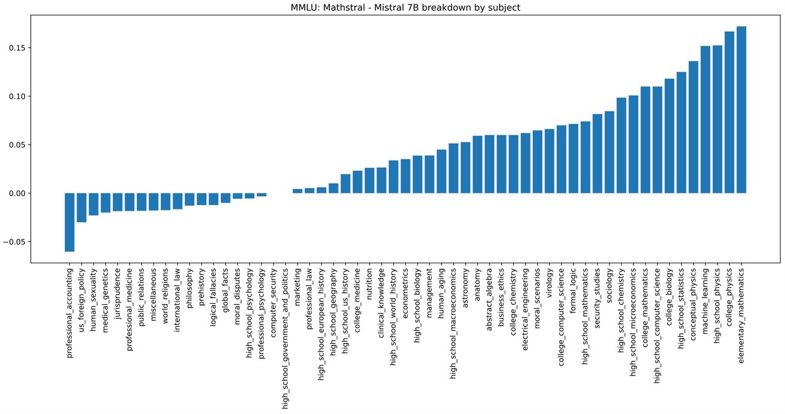
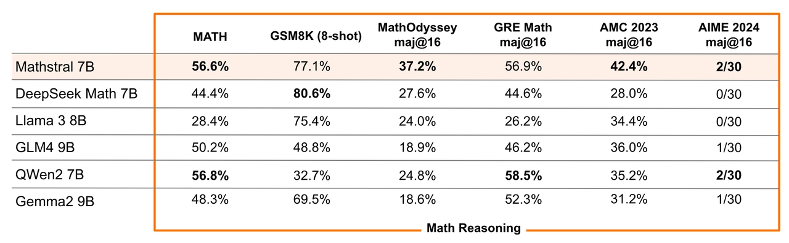

# MathΣtral

**Source**: `raw/mathstral/full-article.md` (213 KB), `raw/mathstral/full-article.md` (markdown view)  
**URL**: https://mistral.ai/news/mathstral/  
**Ingested**: 2026-06-06  
**Tags**: #summary

## Summary

Mistral AI releases **Mathstral 7B**, a STEM-specialized instruct model built on **Mistral 7B** for advanced mathematical reasoning. Developed in collaboration with **Project Numina**, Mathstral targets multi-step logical problems in science and math. It achieves **56.6% on MATH** and **63.47% on MMLU**, with subject-level gains over Mistral 7B shown across MMLU categories.

Mathstral exemplifies Mistral's purpose-built model philosophy—strong performance/speed tradeoffs for domain-specific workloads, aligned with la Plateforme fine-tuning capabilities. With additional inference-time compute, scores rise to **68.37% on MATH** (majority voting) and **74.59%** (strong reward model over 64 candidates).

Weights are on Hugging Face; inference via **mistral-inference**, adaptation via **mistral-finetune**. GRE Math Subject Test problems were curated by Professor Paul Bourdon for evaluation.

## Key Claims

- Mathstral 7B: Mistral 7B derivative specialized for STEM; instructed model for direct use or fine-tuning.
- 56.6% MATH, 63.47% MMLU—SOTA reasoning in its size class per Mistral.
- Subject-level MMLU improvements over Mistral 7B across STEM categories.
- Test-time scaling: 68.37% MATH (majority voting); 74.59% with reward model over 64 candidates.
- Released for science community; collaboration with Project Numina; Hugging Face weights.

## Figures

| Figure | Caption | Page |
|--------|---------|------|
|  | MMLU performance difference by subject: Mathstral 7B vs. Mistral 7B | — |
|  | Detailed benchmark comparison for Mathstral 7B | — |

## Entities

- [[Reasoning Models]] — specialized math reasoning and multi-step problem solving.
- [[Large Language Models]] — 7B domain-specialized model in the Mistral family.
- [[Model Compression and Efficiency]] — purpose-built small model vs. generalist frontier scale.

## Questions & Gaps

- Full training recipe (data mix, Numina collaboration details) not in the blog; short 2-minute read.
- Benchmark table in fig-2 is image-only; numeric values beyond MATH/MMLU headlines not extracted in prose.
- No dedicated wiki explainer page for Mathstral architecture or fine-tuning ablations.

## Related

- [[mixtral-of-experts]] — Mistral 7B lineage and open-weight release pattern.
- [[ministraux]] — complementary Mistral edge/small model family.
- [[Reasoning Models]] — math reasoning benchmarks and test-time compute scaling.
- [[Large Language Models]] — topic hub for specialized instruct models.
