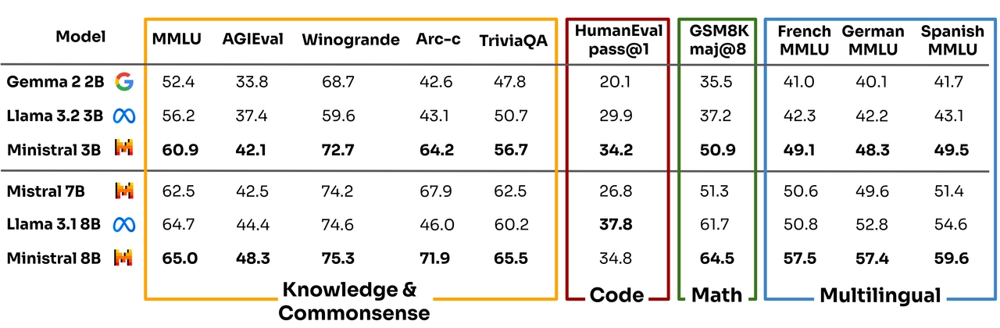
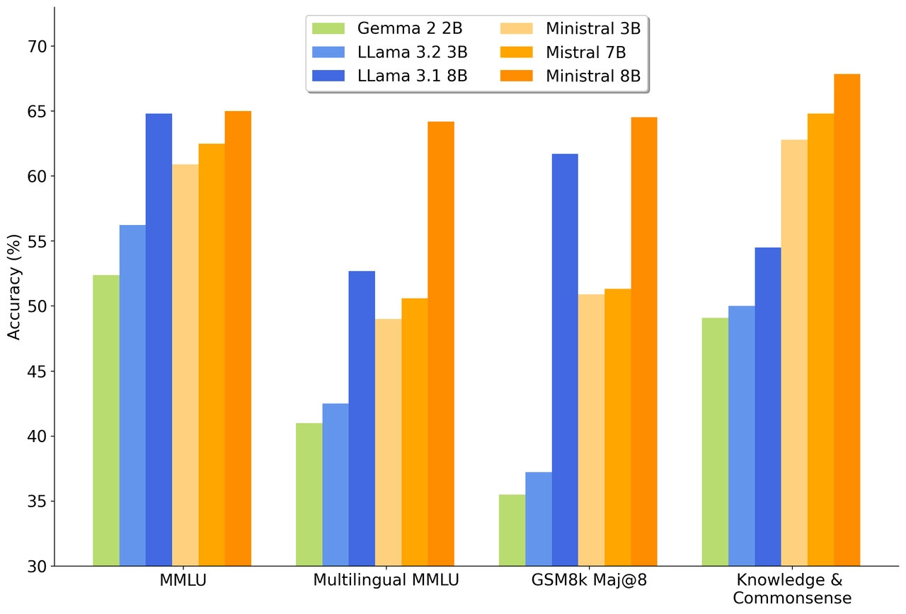
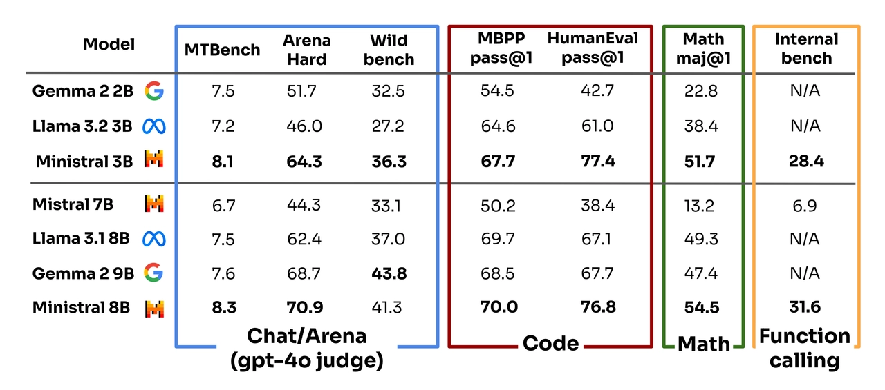
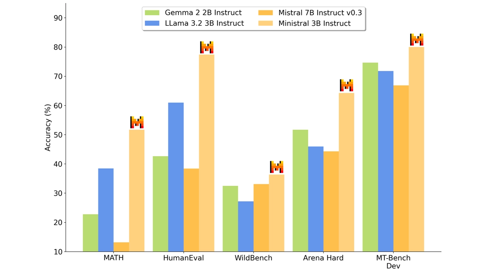
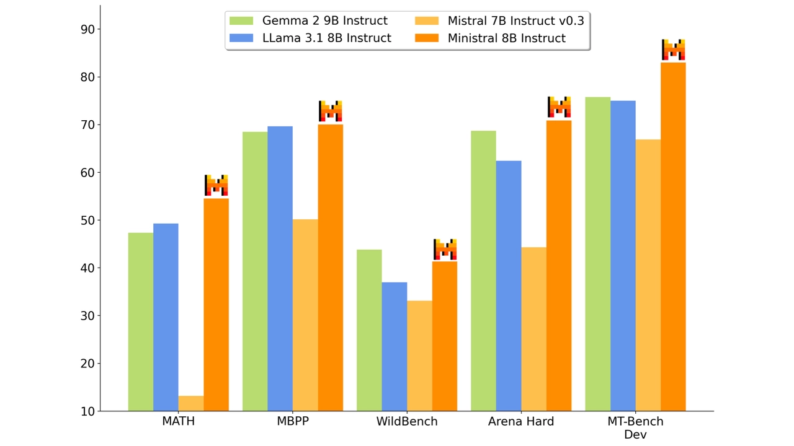
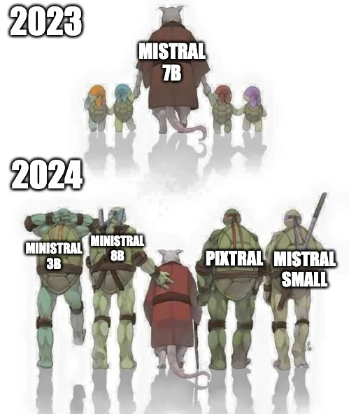

# Un Ministral, des Ministraux

**Source**: `raw/ministraux/full-article.html` (220 KB), `raw/ministraux/full-article.md` (markdown view)  
**URL**: https://mistral.ai/news/ministraux/  
**Ingested**: 2026-06-06  
**Tags**: #summary

## Summary

On the first anniversary of **Mistral 7B**, Mistral AI releases **Ministral 3B** and **Ministral 8B**—"les Ministraux"—state-of-the-art edge models for on-device and privacy-first inference. Both support up to **128k context** (32k on vLLM at launch). Ministral 8B uses **interleaved sliding-window attention** for faster, memory-efficient inference.

Target use cases: on-device translation, offline smart assistants, local analytics, autonomous robotics, and as low-latency **function-calling intermediaries** in multi-step agentic workflows alongside Mistral Large. The sub-10B models claim SOTA on knowledge, commonsense, reasoning, and function-calling vs. Gemma 2, Llama 3.1/3.2, and Mistral 7B baselines (re-evaluated with Mistral's internal framework).

**Ministral 8B** API: `ministral-8b-latest` at **$0.10/M tokens**; **Ministral 3B**: `ministral-3b-latest` at **$0.04/M tokens**. Licenses: Mistral Commercial/Research (8B Instruct weights available for research). Cloud partners and lossless quantization support offered for self-deployment.

## Key Claims

- Ministral 3B and 8B: SOTA sub-10B models for edge/on-device inference; 128k context support.
- Ministral 8B: interleaved sliding-window attention for efficient inference.
- Outperform Gemma 2 2B/9B, Llama 3.1 8B, Llama 3.2 3B, and Mistral 7B on pretrained and instruct benchmarks.
- Ministral 3B instruct beats Mistral 7B on multiple categories despite smaller size.
- API pricing: $0.04/M (3B), $0.10/M (8B); commercial licenses for self-deployment.
- Function-calling and agentic routing at low latency; pairs with Mistral Large in multi-step workflows.

## Figures

| Figure | Caption | Page |
|--------|---------|------|
|  | Pretrained models comparison table (Ministral 3B/8B vs. Gemma 2, Llama 3.x, Mistral 7B) | — |
|  | Pretrained models comparison chart | — |
|  | Instruct models comparison table | — |
|  | 3B instruct family: Ministral 3B vs. Gemma 2 2B, Llama 3.2 3B (vs. Mistral 7B baseline) | — |
|  | 8B instruct family: Ministral 8B vs. Gemma 2 9B, Llama 3.1 8B, Mistral 7B | — |
|  | Promotional "more to come" graphic | — |

## Entities

- [[Large Language Models]] — edge-tier 3B/8B models in the Mistral family.
- [[Model Compression and Efficiency]] — sub-10B SOTA, sliding-window attention, on-device deployment.
- [[Agentic AI]] — function-calling intermediaries and multi-step agentic workflows.

## Questions & Gaps

- Benchmark numeric values are embedded in chart images; prose references tables without inline numbers.
- 128k context advertised but vLLM limited to 32k at launch—deployment gap not fully resolved in post.
- Commercial license terms and quantization process require sales contact; not self-serve documented.

## Related

- [[Papers Explained 526 - Ministral 3]] — successor Ministral 3 family (3B/8B/14B) with cascade distillation.
- [[mixtral-of-experts]] — original Mistral 7B release one year prior.
- [[mathstral]] — complementary specialized 7B STEM model.
- [[Model Compression and Efficiency]] — edge deployment and small-model SOTA.
