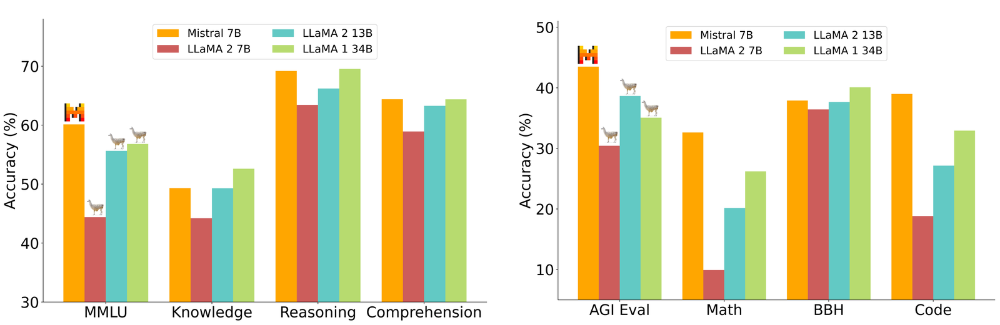
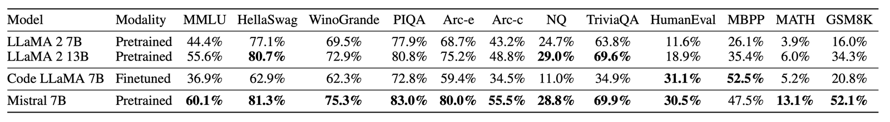
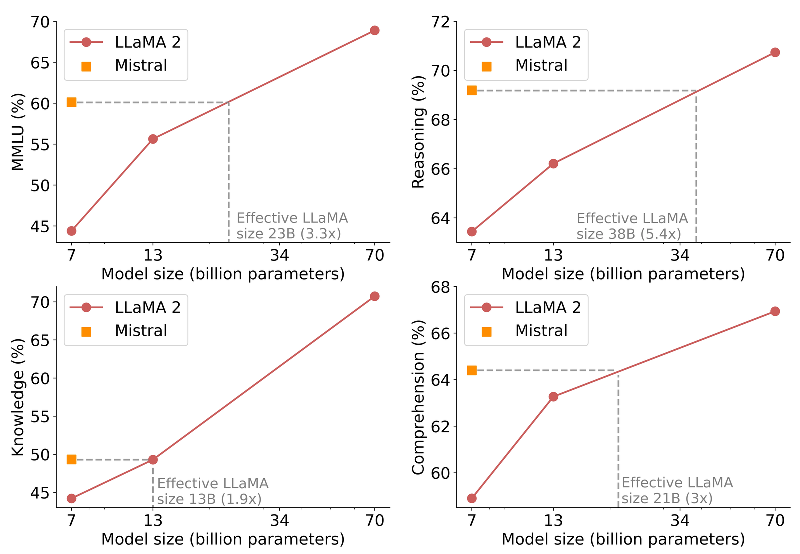
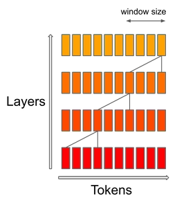
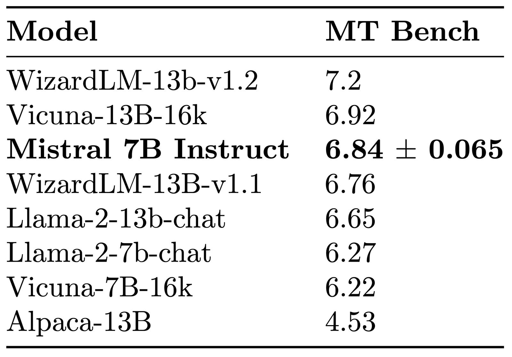

# Mistral 7B

**Source**: `raw/mistral-7b/full-article.html` (223 KB), `raw/mistral-7b/full-article.md` (markdown view)  
**URL**: https://mistral.ai/news/announcing-mistral-7b/  
**Ingested**: 2026-06-06  
**Tags**: #summary

## Summary

Mistral AI announces **Mistral 7B**, a 7.3B-parameter language model positioned as the most capable model in its size class at launch (September 2023). The release is under **Apache 2.0**, with weights, a reference implementation, Hugging Face hosting, and cloud deployment paths (AWS/GCP/Azure via vLLM and Skypilot). Architectural choices emphasize [[Model Compression and Efficiency]]: **grouped-query attention (GQA)** for faster inference and **sliding window attention (SWA)** with a 4,096-token window for long-context handling at lower cost.

On re-run benchmarks, Mistral 7B outperforms Llama 2 13B across metrics and approaches Llama 1 34B on reasoning, math, and code; it nears CodeLlama 7B on code while retaining strong English performance. On cost/performance, it is claimed to match Llama 2 models more than 3× its size on MMLU, commonsense reasoning, world knowledge, and reading comprehension. SWA integrates with FlashAttention and xFormers for ~2× speed at 16k sequence length; a rotating KV cache halves cache memory at 8k context without quality loss. Full architectural and benchmark detail appears in [[Papers Explained - Mistral 7B]].

**Mistral 7B Instruct**, fine-tuned on public Hugging Face instruction data without proprietary tricks, beats all 7B chat models on MT-Bench and rivals 13B chat models. The post notes no built-in moderation and invites community work on guardrails.

## Key Claims

- 7.3B parameters; Apache 2.0; downloadable weights and reference code on GitHub.
- Outperforms Llama 2 13B on all reported benchmarks; competitive with Llama 1 34B on reasoning, math, and code.
- GQA + SWA (4k window) enable efficient long-context inference; FlashAttention/xFormers yield 2× speed at 16k tokens.
- Equivalent-model-size analysis: ~3× memory/throughput savings vs. Llama 2 on MMLU and reasoning tasks.
- Mistral 7B Instruct surpasses all 7B models on MT-Bench; comparable to 13B chat models.
- Easy to fine-tune; intended as a strong base for downstream customization.

## Figures

| Figure | Caption | Page |
|--------|---------|------|
|  | Benchmark histograms: Mistral 7B vs. Llama 2 family across reasoning, knowledge, math, and code | — |
|  | Detailed benchmark comparison table (MMLU, Hellaswag, GSM8K, HumanEval, etc.) | — |
|  | Effective model sizes: Mistral 7B vs. Llama 2 on MMLU, commonsense, world knowledge, reading | — |
|  | Sliding window (local) attention: stacked layers extend effective context beyond window size | — |
|  | Mistral 7B Instruct MT-Bench performance vs. 7B and 13B chat models | — |

## Entities

- [[Large Language Models]] — 7B open-weights release in the efficient-LLM landscape.
- [[Model Compression and Efficiency]] — GQA, SWA, and rotating KV cache for throughput and memory savings.
- [[Papers Explained - Mistral 7B]] — deeper architecture, cache, and full benchmark tables from the explainer article.

## Questions & Gaps

- Blog is a release announcement; full training recipe, data mix, and ablations are in the paper and [[Papers Explained - Mistral 7B]].
- Instruct model lacks moderation; deployment guardrails left to the community.
- Knowledge benchmarks roughly on par with Llama 2 13B, likely limited by parameter count.

## Related

- [[Papers Explained - Mistral 7B]] — detailed explainer of GQA, SWA, rolling buffer cache, and evaluation methodology.
- [[Large Language Models]] — topic hub for open-weights model releases.
- [[Model Compression and Efficiency]] — attention and inference optimizations for small models.
