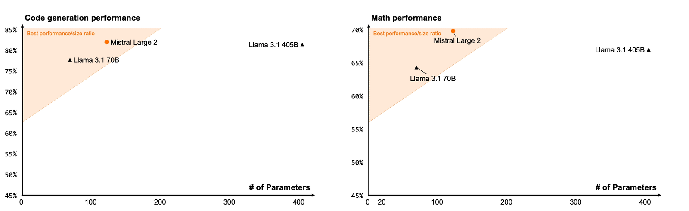
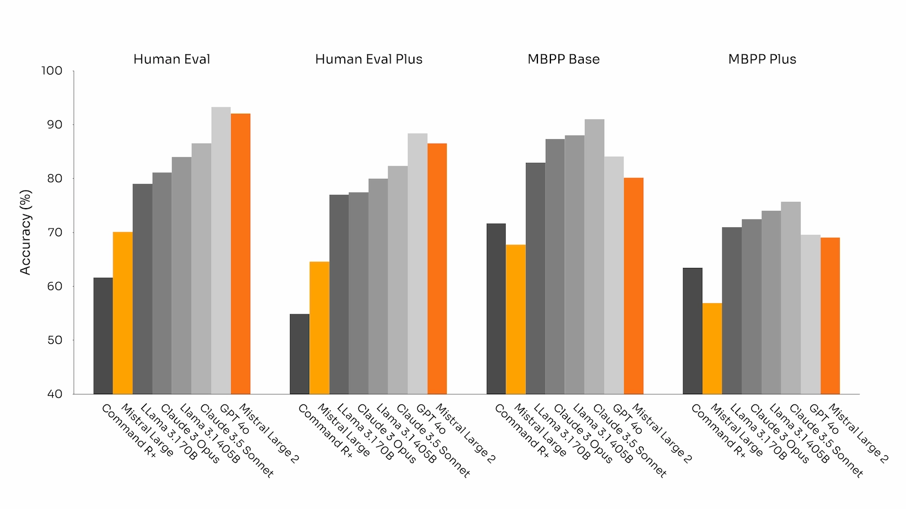
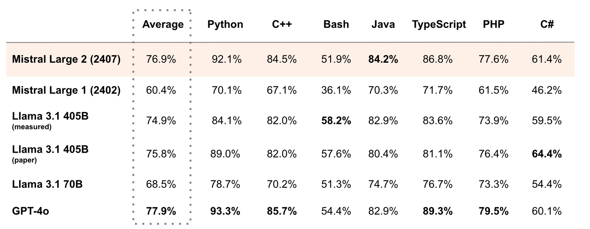
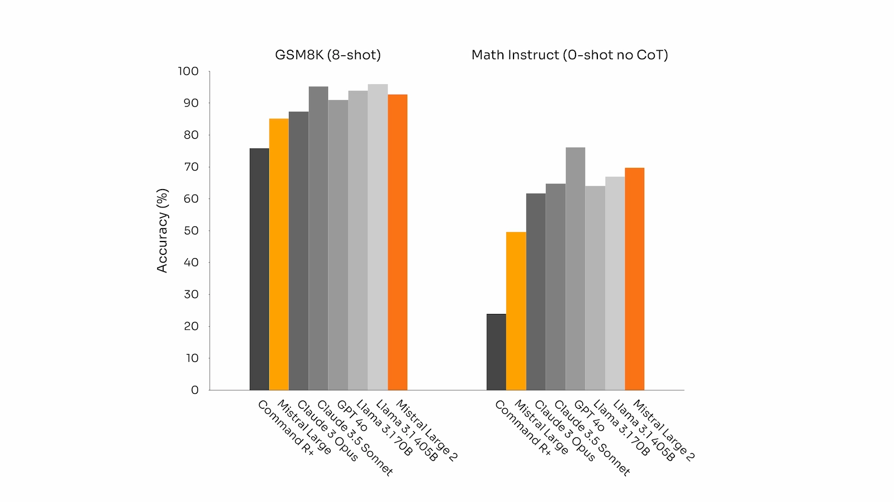
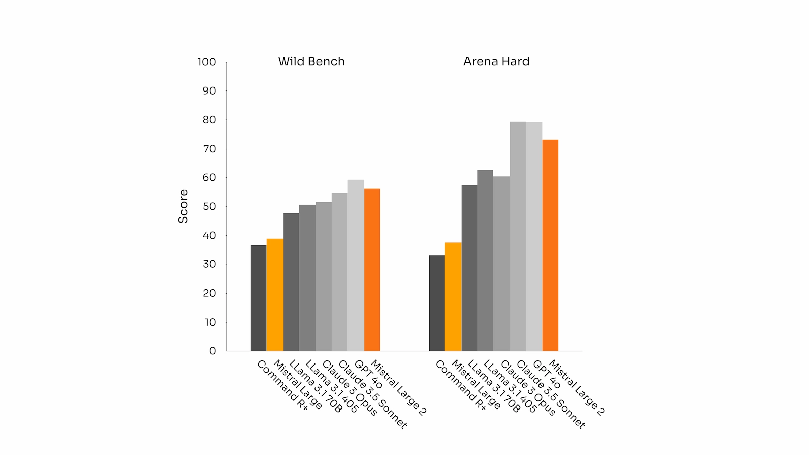
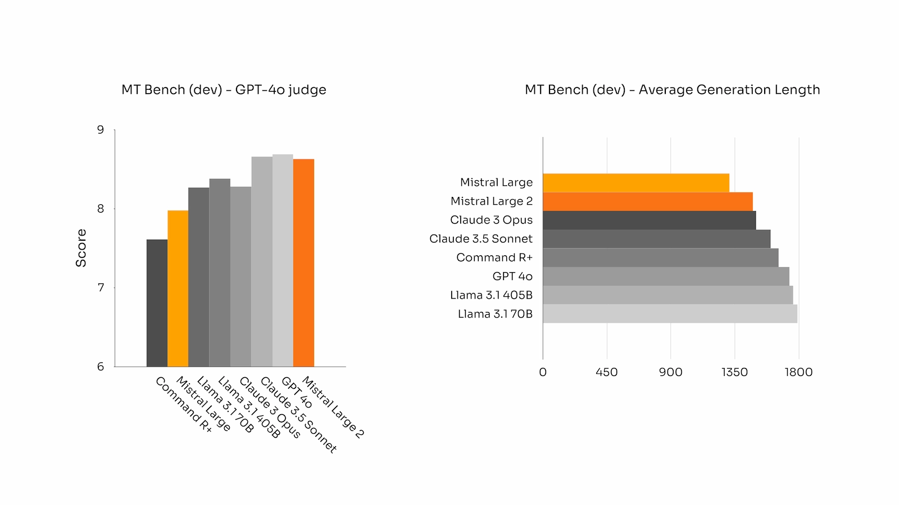
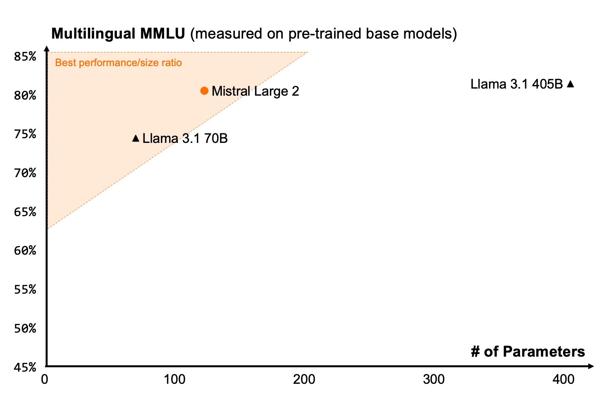
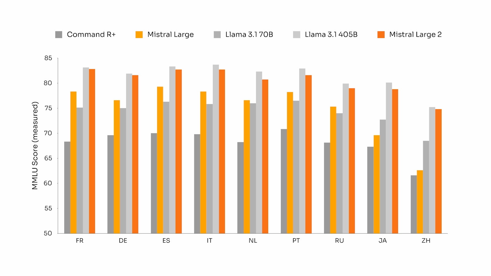
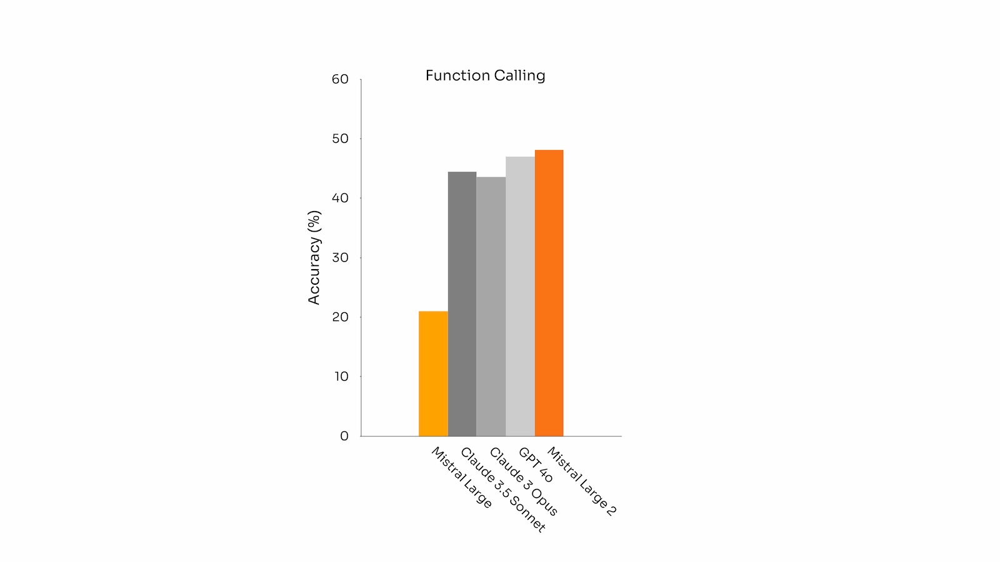
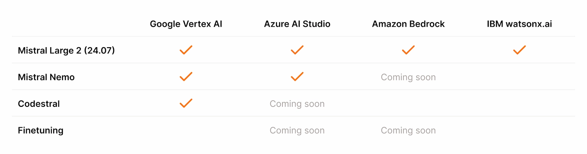

# Large Enough (Mistral Large 2)

**Source**: `raw/mistral-large-2407/full-article.html` (224 KB), `raw/mistral-large-2407/full-article.md` (markdown view)  
**URL**: https://mistral.ai/news/mistral-large-2407/  
**Ingested**: 2026-06-06  
**Tags**: #summary

## Summary

Mistral AI releases **Mistral Large 2** (`mistral-large-2407`, July 2024), a **123B-parameter** model with **128k context**, designed for single-node inference at high throughput. Weights for the instruct checkpoint ship under the **Mistral Research License (MRL)** for research/non-commercial use; commercial self-deployment requires a commercial license. The model supports dozens of natural languages and 80+ coding languages.

On **MMLU**, the pretrained model reaches **84.0%** accuracy, claiming a new performance/cost point on the open-model Pareto front. Code and reasoning training (building on Codestral work) yields parity with GPT-4o, Claude 3 Opus, and Llama 3 405B on code benchmarks; fine-tuning emphasizes reduced hallucination and explicit uncertainty when answers are unavailable. Instruction-following and alignment improve on MT-Bench, WildBench, and Arena Hard, with attention to **concise** generations for business use.

**Multilingual MMLU** results highlight strength across EN, FR, DE, ES, IT, PT, NL, RU, ZH, JA, KO, AR, and HI vs. prior Mistral Large, Llama 3.1, and Command R+. Enhanced **parallel and sequential function calling** targets complex enterprise applications. Platform consolidation centers on Mistral Nemo + Mistral Large (general) and Codestral + Embed (specialist); fine-tuning extends to Mistral Large, Nemo, and Codestral. Cloud availability expands via GCP Vertex AI alongside Azure, Bedrock, and watsonx.ai.

## Key Claims

- 123B parameters; 128k context; single-node inference at high throughput.
- Pretrained MMLU 84.0%; new performance/cost frontier for open models.
- Code/reasoning on par with GPT-4o, Claude 3 Opus, Llama 3 405B; reduced hallucination via cautious fine-tuning.
- Improved instruction-following, multi-turn chat, and alignment (MT-Bench, WildBench, Arena Hard).
- Strong multilingual MMLU across 13+ languages vs. Llama 3.1 and Command R+.
- Parallel and sequential function calling for enterprise tool-use workflows.
- Instruct weights on Hugging Face and mistralcdn; API name `mistral-large-2407` (YY.MM versioning).
- Fine-tuning now available for Mistral Large, Mistral Nemo, and Codestral on la Plateforme.

## Figures

| Figure | Caption | Page |
|--------|---------|------|
|  | Mistral Large 2 overview / general performance on MMLU and cost-efficiency | — |
|  | Code generation benchmark accuracy (shared eval pipeline) | — |
|  | MultiPL-E multilingual code benchmark accuracy | — |
|  | GSM8K and MATH accuracy (8-shot / 0-shot) | — |
|  | Alignment benchmarks: MT-Bench, WildBench, Arena Hard | — |
|  | MT-Bench average generation length vs. other models (conciseness) | — |
|  | Multilingual MMLU vs. Mistral Large v1, Llama 3.1, Command R+ | — |
|  | Multilingual MMLU extended comparison | — |
|  | Tool use and function-calling capabilities | — |
|  | Additional benchmark detail | — |
|  | Mistral AI model availability timeline | — |

## Entities

- [[Large Language Models]] — 123B flagship with open-weight instruct release under MRL.
- [[Multilingual Models]] — broad language and coding-language coverage; multilingual MMLU leadership.
- [[Agentic AI]] — parallel/sequential function calling for business applications.
- [[Model Compression and Efficiency]] — single-node serving and cost/performance Pareto positioning.

## Questions & Gaps

- MRL restricts commercial self-deployment without a separate license; Apache open models (7B, Mixtral, etc.) remain for unrestricted deployment.
- Blog emphasizes benchmarks; full architecture, data mix, and alignment recipe not specified.
- Older la Plateforme models progressively deprecated; migration path details sparse.

## Related

- [[Large Language Models]] — flagship model releases and licensing models.
- [[Multilingual Models]] — multilingual MMLU and global language support.
- [[Agentic AI]] — function calling and retrieval for enterprise agents.
- [[Model Compression and Efficiency]] — throughput and single-node deployment tradeoffs.
