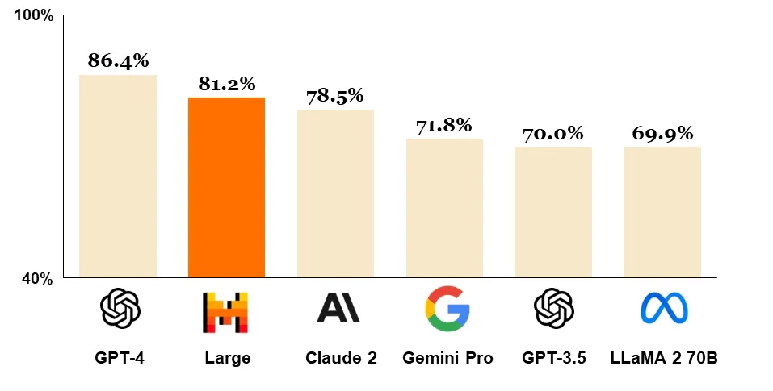
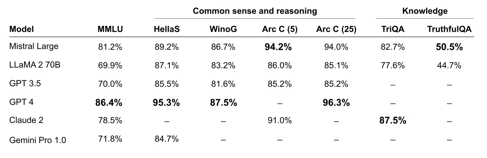
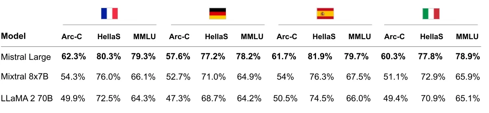
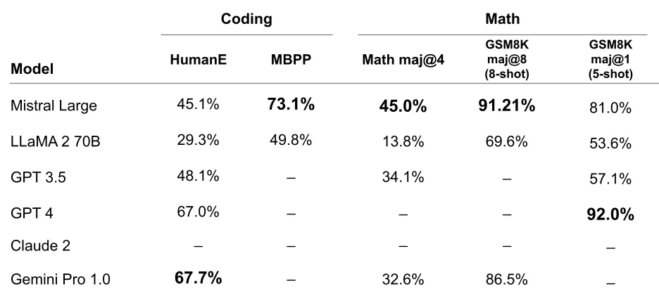

# Au Large (Mistral Large)

**Source**: `raw/mistral-large/full-article.md` (221 KB), `raw/mistral-large/full-article.md` (markdown view)  
**URL**: https://mistral.ai/news/mistral-large/  
**Ingested**: 2026-06-06  
**Tags**: #summary

## Summary

Mistral AI releases **Mistral Large** (February 2024), its flagship commercial text model, positioned as second only to GPT-4 among generally available API models on MMLU at launch. The model targets complex multilingual reasoning, text transformation, and code generation via **la Plateforme** (European-hosted API), **Azure AI Studio / Azure ML** (first distribution partner), and self-deployment with model weights for sensitive workloads.

Mistral Large is natively fluent in **English, French, Spanish, German, and Italian** with a **32K context window**, precise instruction-following (used for le Chat moderation), and **native function calling** plus constrained output on la Plateforme. Alongside the flagship, Mistral ships **Mistral Small** (`mistral-small-2402`), optimized for latency and cost, outperforming [[Mixture of Experts|Mixtral 8x7B]] with lower latency as a mid-tier option between open-weight and flagship endpoints.

The post also introduces **JSON format mode** and expanded **function calling** on mistral-small and mistral-large, simplified endpoint tiers (open-mistral-7B, open-mixtral-8x7b, mistral-small-2402, mistral-large-2402), multi-currency org pricing, and reduced API latency across endpoints.

## Key Claims

- Mistral Large ranks second to GPT-4 among API-available models on MMLU at announcement.
- Native multilingual fluency (EN/FR/ES/DE/IT); 32K context; instruction-following enables custom moderation policies.
- Native function calling and constrained output for application development at scale.
- Available on la Plateforme, Azure AI Studio, le Chat, and self-deployment with weights.
- Mistral Small outperforms Mixtral 8x7B with lower latency; same RAG and function-calling features.
- Strong multilingual benchmarks vs. Llama 2 70B (HellaSwag, Arc Challenge, MMLU in FR/DE/ES/IT).
- Top-tier coding and math vs. leading LLMs (HumanEval, MBPP, MATH, GSM8K).
- JSON format mode forces valid JSON output; function calling integrates with internal tools and APIs.

## Figures

| Figure | Caption | Page |
|--------|---------|------|
|  | MMLU comparison: GPT-4, Mistral Large, Claude 2, Gemini Pro, GPT-3.5, Llama 2 70B | — |
|  | Reasoning and knowledge benchmarks (MMLU, HellaSwag, WinoGrande, Arc, TriviaQA, TruthfulQA) | — |
|  | Multilingual HellaSwag, Arc Challenge, and MMLU: Mistral Large vs. Mixtral 8x7B vs. Llama 2 70B | — |
|  | Coding and math benchmarks (HumanEval, MBPP, MATH, GSM8K) vs. leading models | — |

## Entities

- [[Large Language Models]] — flagship closed/API model in Mistral's commercial lineup.
- [[Multilingual Models]] — native FR/DE/ES/IT fluency and multilingual benchmark leadership.
- [[Mixture of Experts]] — Mixtral 8x7B referenced as open-weight mid-tier comparison.
- [[Agentic AI]] — function calling, JSON mode, and tool-use APIs for application stacks.

## Questions & Gaps

- Blog is a product announcement; model size, architecture, and training details are not disclosed.
- Benchmark methodology summarized in captions; no per-task error analysis or human-eval breakdown.
- mistral-medium endpoint retained but not updated in this release.

## Related

- [[Large Language Models]] — frontier and commercial API model landscape.
- [[Multilingual Models]] — multilingual reasoning and benchmark comparisons.
- [[Mixture of Experts]] — Mixtral family as open-weight alternative tier.
- [[Agentic AI]] — function calling and structured output for agent workflows.
