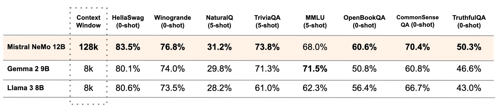
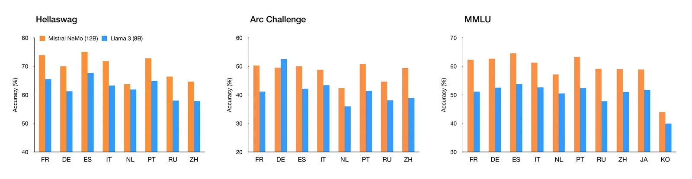
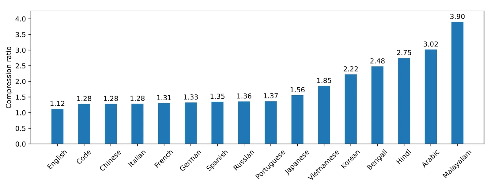

# Mistral NeMo

**Source**: `raw/mistral-nemo/full-article.md` (216 KB), `raw/mistral-nemo/full-article.md` (markdown view)  
**URL**: https://mistral.ai/news/mistral-nemo/  
**Ingested**: 2026-06-06  
**Tags**: #summary

## Summary

Mistral AI and NVIDIA release **Mistral NeMo**, a **12B-parameter** model (July 2024) with up to **128k context**, Apache 2.0 base and instruct checkpoints, and **FP8 inference** support from quantization-aware training. Built on standard architecture, it is positioned as a drop-in replacement for Mistral 7B systems while delivering state-of-the-art reasoning, world knowledge, and coding accuracy in its size class vs. Gemma 2 9B and Llama 3 8B.

The model targets global [[Multilingual Models|multilingual]] applications: function calling, long context, and strength in EN, FR, DE, ES, IT, PT, ZH, JA, KO, AR, and HI. A new **Tekken** tokenizer (Tiktoken-based, 100+ languages) compresses text and code ~30% more efficiently than SentencePiece on several languages, with 2× and 3× gains on Korean and Arabic vs. prior Mistral tokenizers and better compression than Llama 3's tokenizer on ~85% of languages.

Instruction tuning improves precise instruction-following, reasoning, multi-turn conversation, and code vs. Mistral 7B. Weights are on Hugging Face; API exposure as `open-mistral-nemo-2407`; NVIDIA NIM microservice packaging available.

## Key Claims

- 12B parameters; 128k context; co-developed with NVIDIA; Apache 2.0 base + instruct weights.
- SOTA in size class vs. Gemma 2 9B and Llama 3 8B on reasoning, knowledge, and coding.
- Quantization-aware training enables FP8 inference without performance loss.
- Drop-in replacement for Mistral 7B due to standard architecture.
- Tekken tokenizer: ~30% better compression on code and several languages; 2–3× on Korean/Arabic.
- Strong multilingual benchmarks across 11+ languages.
- Instruction model improves vs. Mistral 7B on reasoning, multi-turn chat, and code (GPT-4o judge evals).
- Available on la Plateforme, Hugging Face, mistral-inference/finetune, and NVIDIA NIM.

## Figures

| Figure | Caption | Page |
|--------|---------|------|
|  | Base model performance vs. Gemma 2 9B and Llama 3 8B | — |
|  | Multilingual benchmark performance | — |
|  | Tekken tokenizer compression rate vs. SentencePiece and Llama 3 | — |
|  | Instruction-tuned model accuracy (GPT-4o judge) | — |

## Entities

- [[Large Language Models]] — 12B efficient open model between 7B and flagship tiers.
- [[Multilingual Models]] — Tekken tokenizer and multilingual benchmark focus.
- [[Model Compression and Efficiency]] — FP8 inference and improved tokenization efficiency.
- [[Papers Explained - Mistral 7B]] — architectural lineage and 7B comparison baseline.

## Questions & Gaps

- NVIDIA collaboration scope (training infra vs. co-design) not detailed in the blog.
- Function-calling capabilities claimed but not benchmarked in the post.
- Instruct evals use GPT-4o as judge; human-eval breakdown not provided.

## Related

- [[Papers Explained - Mistral 7B]] — prior 7B architecture and efficiency techniques.
- [[Large Language Models]] — open-weights model family progression.
- [[Multilingual Models]] — tokenizer design and multilingual evaluation.
- [[Model Compression and Efficiency]] — FP8 deployment and tokenization gains.
