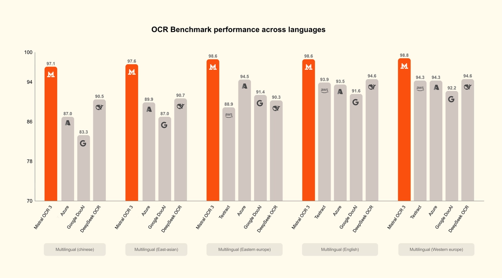
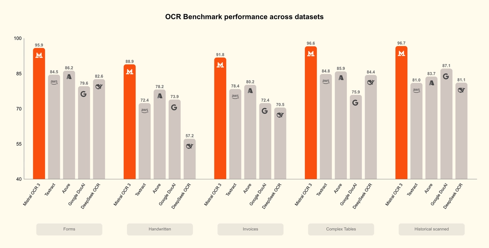
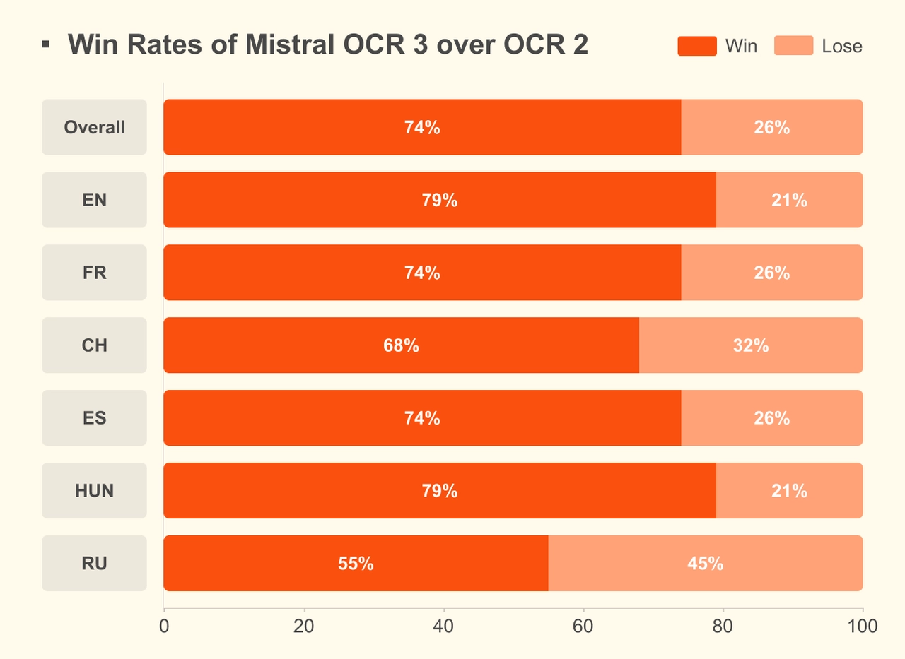

# Introducing Mistral OCR 3

**Source**: `raw/mistral-ocr-3/full-article.md` (218 KB), `raw/mistral-ocr-3/full-article.md` (markdown view)  
**URL**: https://mistral.ai/news/mistral-ocr-3/  
**Ingested**: 2026-06-06  
**Tags**: #summary

## Summary

Mistral AI releases **Mistral OCR 3** (`mistral-ocr-2512`), a document-extraction model that outputs markdown with **HTML table reconstruction** (colspan/rowspan) so downstream systems preserve structure—not just text. The blog claims **74% overall win rate** over Mistral OCR 2 on forms, scanned documents, complex tables, and handwriting, and SOTA accuracy vs. enterprise document processors and AI-native OCR competitors on harder internal customer-derived benchmarks (fuzzy-match vs. ground truth).

Pricing: **$2 per 1,000 pages** ($1 with 50% Batch API discount)—positioned as industry-leading for a smaller model. Available via API and **Document AI Playground** in Mistral AI Studio (drag-and-drop PDF/image → text or structured JSON). Fully **backward compatible** with Mistral OCR 2.

Upgrade areas vs. prior generations: cursive and layered handwriting, dense forms (invoices, receipts, compliance, government docs), low-quality scans (compression, skew, low DPI), and complex tables with merged cells and hierarchies. Early customer uses include invoice field extraction, archive digitization, technical-report text extraction, and enterprise search.

## Key Claims

- 74% overall win rate over Mistral OCR 2 on forms, scans, tables, and handwriting.
- SOTA on challenging internal benchmarks vs. enterprise and AI-native OCR solutions.
- Markdown + HTML table tags preserve document structure for agent/knowledge pipelines.
- $2/1,000 pages ($1 batch); smaller than most competitive OCR models.
- Document AI Playground in Mistral AI Studio; API model `mistral-ocr-2512`.
- Backward compatible with Mistral OCR 2; selective self-host for privacy-sensitive deployments.

## Figures

| Figure | Caption | Page |
|--------|---------|------|
|  | Benchmark comparison vs. enterprise and AI-native OCR solutions | — |
|  | Upgrade highlights: handwriting, forms, scans, complex tables | — |
|  | Document AI Playground in Mistral AI Studio | — |

## Entities

- [[Document AI]] — OCR 3 as general-purpose document extraction for enterprise pipelines.
- [[Vision Language Models]] — multimodal parsing of PDFs, images, handwriting, and tables.

## Questions & Gaps

- Internal benchmark definitions and competitor list not fully specified in the blog.
- No per-language breakdown in this post (contrast with [[Mistral OCR]] launch benchmarks).
- Self-host terms remain selective/sales-led.

## Related

- [[Mistral OCR]] — first-generation Mistral OCR API (2503) and launch benchmarks.
- [[Document AI]] — topic hub for OCR, forms, and document structure extraction.
- [[Vision Language Models]] — multimodal document and image understanding stack.
