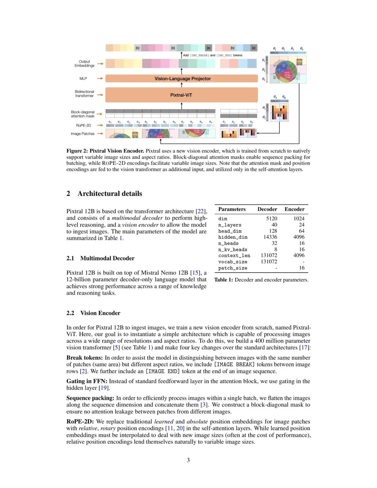
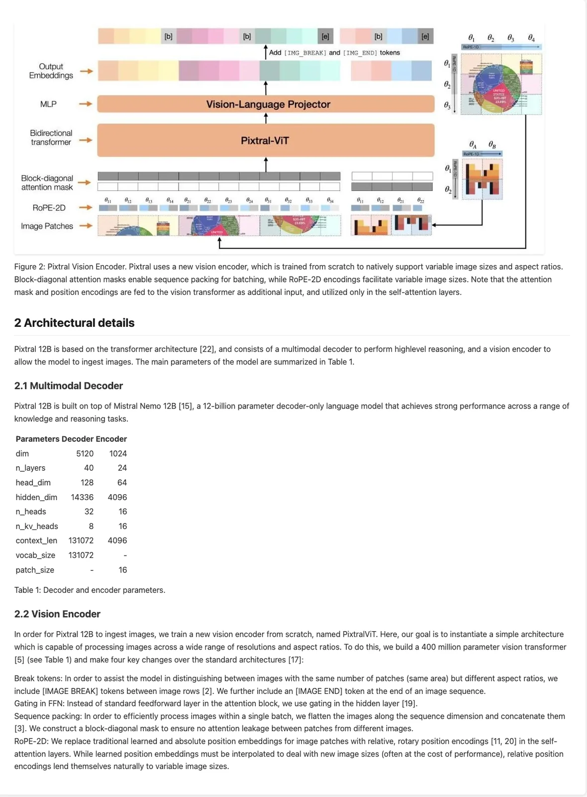
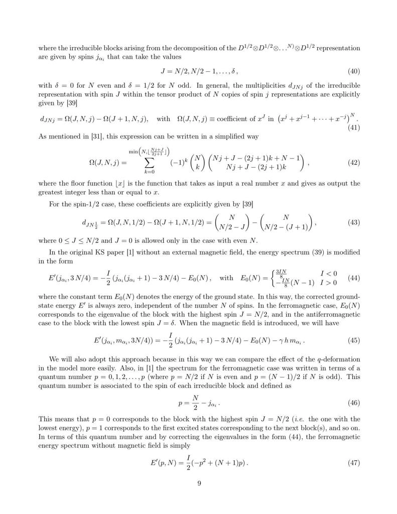
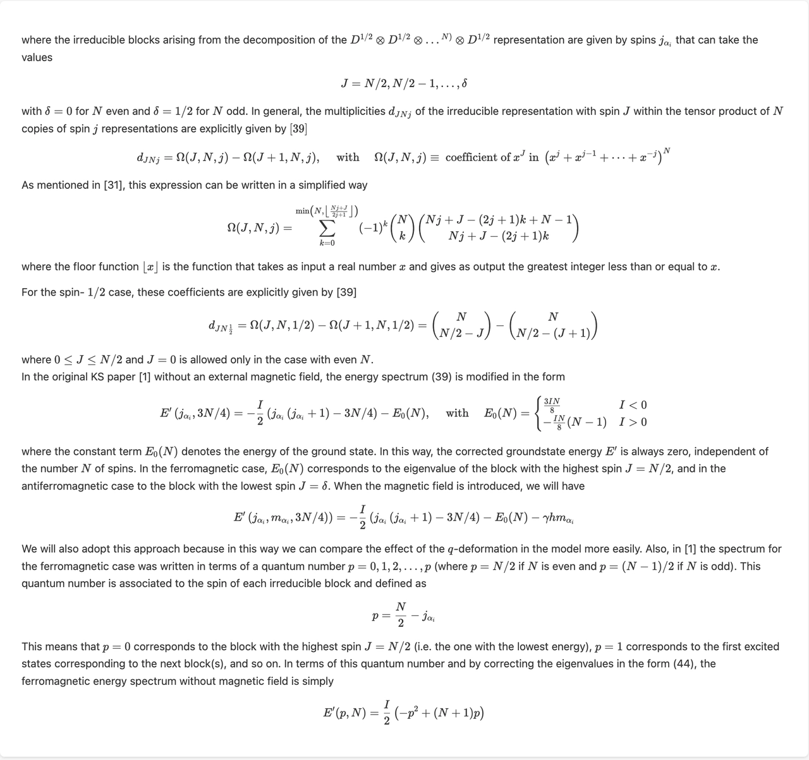
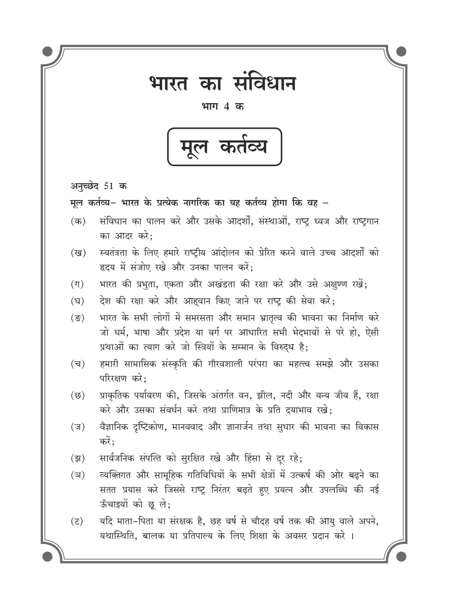
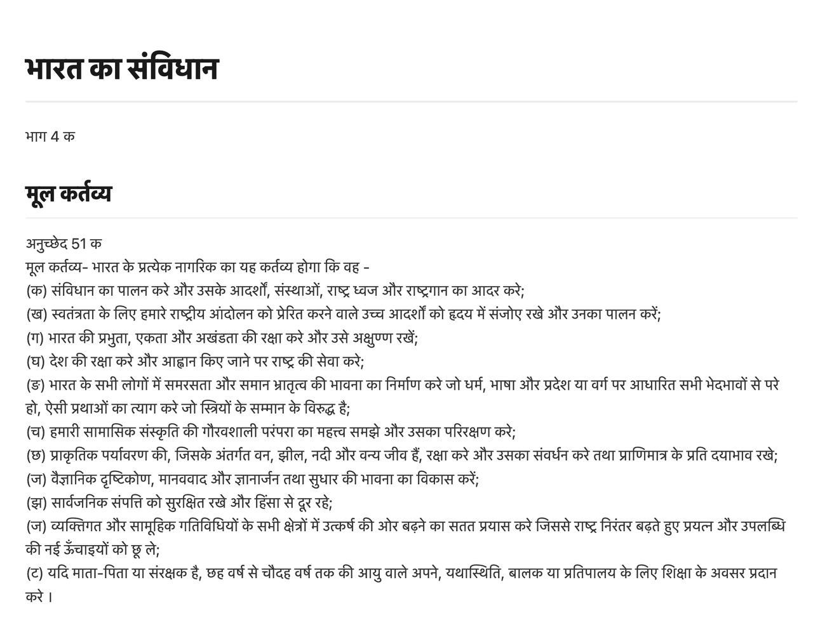
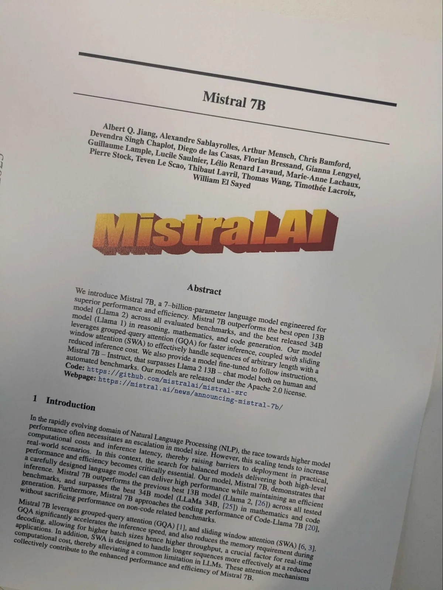
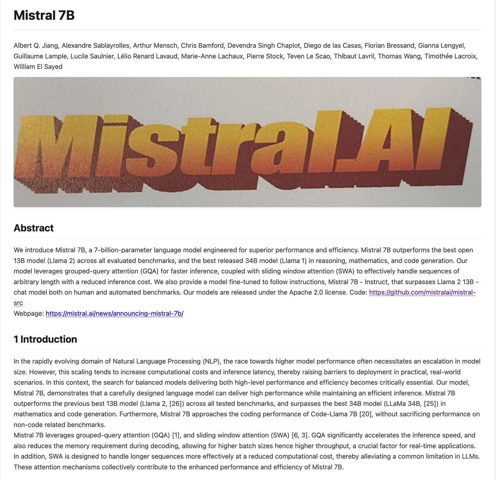

# Mistral OCR

**Source**: `raw/mistral-ocr/full-article.html` (244 KB), `raw/mistral-ocr/full-article.md` (markdown view)  
**URL**: https://mistral.ai/news/mistral-ocr/  
**Ingested**: 2026-06-06  
**Tags**: #summary

## Summary

Mistral AI introduces **Mistral OCR**, an OCR/document-understanding API that parses images and PDFs into ordered, interleaved text and embedded images—aimed at RAG pipelines over slides, scientific papers, and complex PDFs. The model handles math, tables, LaTeX layouts, multilingual scripts, and scanned documents. Default document model on **Le Chat**; API **`mistral-ocr-latest`** (Mistral OCR 2503) priced at **$1 per 1,000 pages** (~2× with batch inference).

Benchmark claims on an internal text-only test set (fair comparison because Mistral extracts embedded images while compared LLM OCR baselines do not): **94.89% overall** vs. GPT-4o 89.77%, Gemini-2.0-Flash 88.69%, Azure OCR 89.52%, Google Document AI 83.42—with leads on math (94.29%), scanned (98.96%), and tables (96.12%). Multilingual fuzzy-match generation: **99.02%**. Throughput up to **2,000 pages/minute** on one node.

Differentiators include **doc-as-prompt** (documents as prompts for structured JSON extraction and agent chaining), selective **self-hosting** for regulated workloads, and broad use cases: research digitization, heritage preservation, customer-service knowledge bases, and technical/legal document AI-readiness.

## Key Claims

- OCR API comprehends media, text, tables, equations; outputs interleaved text + images for RAG.
- Mistral OCR 2503: 94.89% overall internal benchmark; leads math, scanned, and table categories.
- 99.02% multilingual fuzzy-match generation; per-language tables show leads over Azure, Google Doc AI, Gemini.
- Up to 2,000 pages/minute on a single node—faster than peers in category.
- Doc-as-prompt enables structured JSON output and downstream agent workflows.
- $1/1,000 pages API pricing; default on Le Chat; selective on-premises deployment.

## Figures

| Figure | Caption | Page |
|--------|---------|------|
|  | PDF-to-markdown extraction example (structured OCR notebook demo) | — |
|  | Side-by-side: tables + figures input vs. OCR output | — |
|  | Side-by-side: math document input vs. OCR output | — |
|  | Side-by-side: Hindi document input vs. OCR output | — |
|  | Side-by-side: general document input vs. OCR output | — |
|  | Side-by-side: Arabic document input vs. OCR output | — |
|  | Overall and category benchmark comparison table | — |
|  | Multilingual fuzzy-match benchmark comparison | — |
|  | Per-language accuracy benchmark table | — |
|  | Throughput: pages per minute comparison | — |

## Entities

- [[Document AI]] — OCR/document parsing API for enterprise document pipelines and RAG.
- [[Vision Language Models]] — multimodal document understanding (text, layout, embedded images).
- [[Embedding and Retrieval]] — intended pairing with RAG over parsed multimodal documents.

## Questions & Gaps

- Internal benchmark methodology and dataset composition not fully published in the blog.
- Compared LLM OCR baselines lack embedded-image extraction—fairness caveat noted by Mistral.
- Superseded in part by [[Introducing Mistral OCR 3]] (Dec 2025); backward-compat path documented there.

## Related

- [[Introducing Mistral OCR 3]] — next-generation OCR with 74% win rate over OCR 2; Document AI Playground.
- [[Document AI]] — topic hub for OCR, layout parsing, and document understanding.
- [[Vision Language Models]] — multimodal parsing of charts, figures, and document images.
- [[Embedding and Retrieval]] — RAG use case emphasized in launch post.
