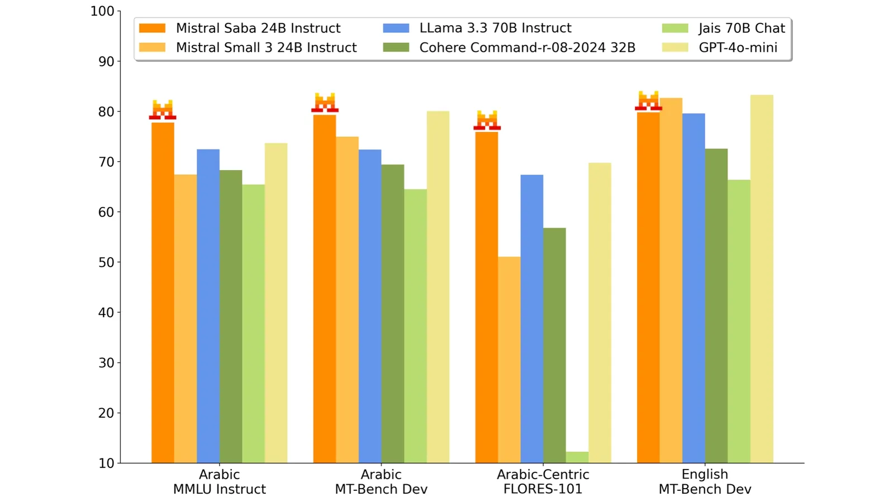
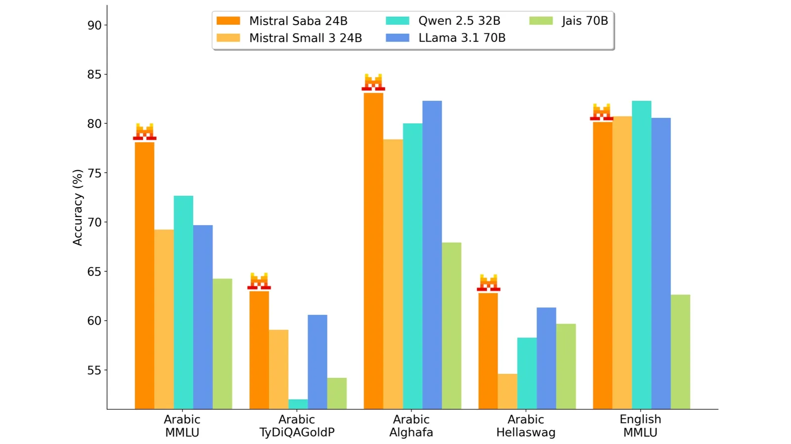
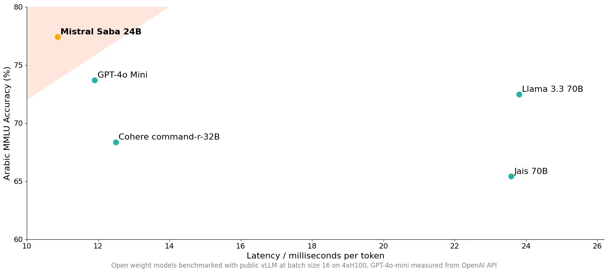

# Mistral Saba

**Source**: `raw/mistral-saba/full-article.md` (217 KB), `raw/mistral-saba/full-article.md` (markdown view)  
**URL**: https://mistral.ai/news/mistral-saba/  
**Ingested**: 2026-06-06  
**Tags**: #summary

## Summary

Mistral AI introduces **Mistral Saba** (February 2025), the first **specialized regional language model** in its lineup—a **24B-parameter** model trained on curated Middle East and South Asia data. It delivers more accurate, culturally grounded responses than models **5× larger**, at higher speed and lower cost, and can be fine-tuned for highly specific regional adaptations. Like [[Mistral Small 3]], it runs on single-GPU systems at **>150 tokens/s** and supports **local deployment** inside customer security premises.

The model supports **Arabic** and many **Indian-origin languages**, with particular strength in **South Indian languages such as Tamil**, reflecting cultural cross-pollination across Middle East and South Asia. Available via API and on-prem deployment; not Apache open-weights—positioned as a commercial regional specialist alongside Mistral's custom enterprise training offerings.

Use cases emerging with regional customers include Arabic conversational virtual assistants, domain-specific fine-tuning (energy, finance, healthcare), and culturally authentic content creation with local idioms and references.

## Key Claims

- 24B regional specialist; first Mistral regional language model.
- Trained on curated Middle East and South Asia datasets.
- More accurate and relevant than models 5× larger; faster and lower cost.
- Arabic + Indian-origin languages; especially strong on Tamil and South Indian languages.
- Single-GPU deployment (>150 tok/s); API and on-prem options.
- Strong base for regional fine-tuning and bespoke adaptations.
- Use cases: Arabic conversational support, domain experts, cultural content creation.
- Part of broader custom/applied AI training for strategic regional and enterprise customers.

## Figures

| Figure | Caption | Page |
|--------|---------|------|
|  | Mistral Saba Instruct benchmark results | — |
|  | Mistral Saba pretrained benchmark results | — |
|  | Regional benchmark comparison (Saba vs. larger general models) | — |

## Entities

- [[Multilingual Models]] — regional Arabic and South Asian language specialization.
- [[Large Language Models]] — 24B commercial regional model vs. general-purpose frontier models.
- [[Model Compression and Efficiency]] — single-GPU local deployment for sensitive regional workloads.

## Questions & Gaps

- Weights not open; API and enterprise deployment only—licensing and pricing undisclosed in blog.
- Benchmark details and comparison models not fully enumerated in extracted text.
- Overlap with Mistral Small 3 architecture/size implied but not confirmed.

## Related

- [[Multilingual Models]] — regional and low-resource language modeling.
- [[Mistral Small 3]] — shared 24B lightweight deployment profile.
- [[Large Language Models]] — specialized vs. general-purpose model tradeoffs.
- [[Model Compression and Efficiency]] — on-prem inference for data-sovereign deployments.
