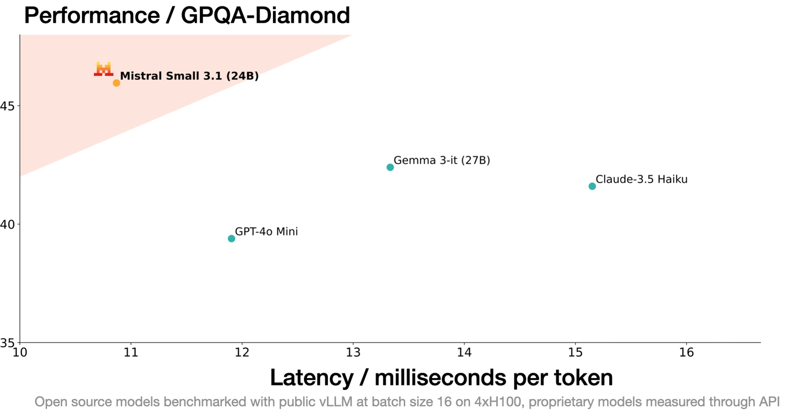

# Mistral Small 3.1

**Source**: `raw/mistral-small-3-1/full-article.html` (217 KB), `raw/mistral-small-3-1/full-article.md` (markdown view)  
**URL**: https://mistral.ai/news/mistral-small-3-1/  
**Ingested**: 2026-06-06  
**Tags**: #summary

## Summary

Mistral AI releases **Mistral Small 3.1** (March 2025), building on [[Mistral Small 3]] with improved text performance, **multimodal** understanding, and **128k context**. Released under Apache 2.0, it claims to be the first open model surpassing leading small proprietary models (Gemma 3, GPT-4o Mini) across text, multimodal, multilingual, and long-context dimensions while sustaining **~150 tokens/s** inference.

The instruct checkpoint excels at instruction following, conversational assistance, image understanding, and function calling—suitable for enterprise and consumer applications (document verification, diagnostics, on-device image processing, visual QA, security object detection). Base and instruct checkpoints support community fine-tuning; Nous Research's DeepHermes 24B is cited as a recent reasoning build on Mistral Small 3.

Deployment fits a single RTX 4090 or 32GB Mac. Weights on Hugging Face; API on la Plateforme; Vertex AI today; NVIDIA NIM and Azure AI Foundry coming soon.

## Key Claims

- Best-in-class for weight category; Apache 2.0 base + instruct checkpoints.
- Improved text, multimodal, 128k context vs. Mistral Small 3; ~150 tok/s.
- Surpasses Gemma 3 and GPT-4o Mini on combined text/multimodal/multilingual/long-context evals.
- Lightweight: single RTX 4090 or 32GB Mac when quantized.
- Strong text instruct, multimodal instruct (MM-MT-Bench), multilingual, and long-context benchmarks.
- Pretrained base also released for downstream customization.
- Use cases: virtual assistants, function calling, domain fine-tuning, on-device multimodal apps.
- Available on Hugging Face, la Plateforme, Google Vertex AI; NIM and Azure Foundry forthcoming.

## Figures

| Figure | Caption | Page |
|--------|---------|------|
|  | GPQA Diamond and combined performance vs. Gemma 3 and GPT-4o Mini | — |

## Entities

- [[Large Language Models]] — 24B multimodal small model iteration.
- [[Vision Language Models]] — image understanding and multimodal instruct benchmarks.
- [[Model Compression and Efficiency]] — on-device deployment on consumer GPUs.
- [[Agentic AI]] — function calling and low-latency agent workflows.

## Questions & Gaps

- Blog references multiple benchmark tables but most chart images are embedded in a single summary figure in the HTML export; detailed per-benchmark numbers are sparse in extracted text.
- Multimodal training data and architecture (vision encoder details) not described.
- Azure and NIM availability listed as "coming weeks" at announcement.

## Related

- [[Mistral Small 3]] — prior 24B text-only release and Apache 2.0 base.
- [[Vision Language Models]] — multimodal instruct and image-understanding capabilities.
- [[Large Language Models]] — small-model open-weights progression.
- [[Model Compression and Efficiency]] — local and single-GPU deployment.
