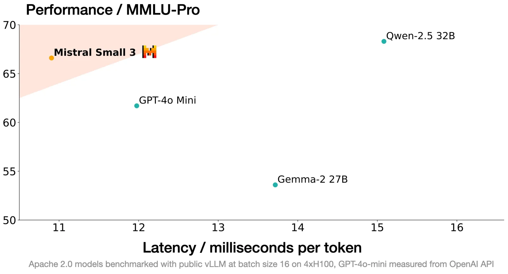
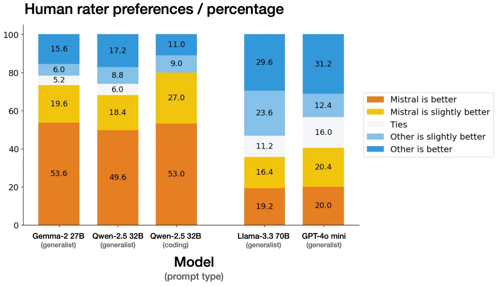
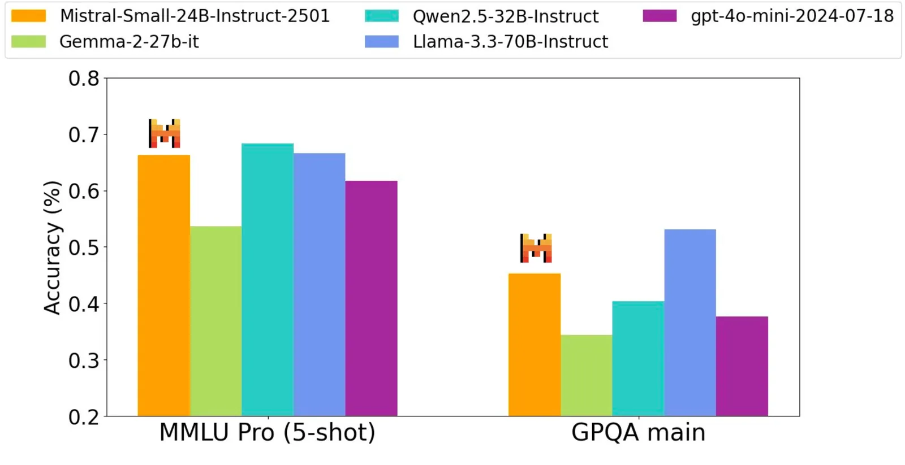
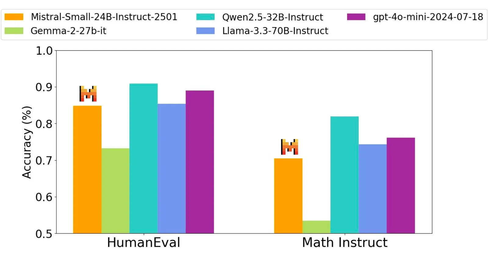
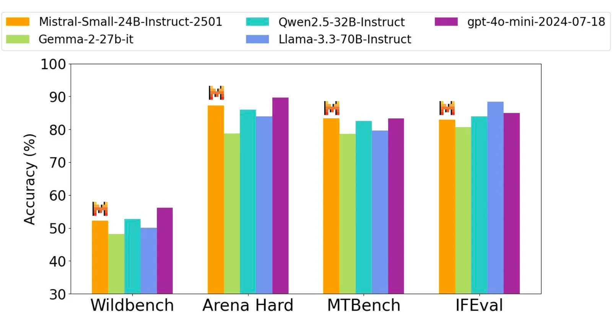
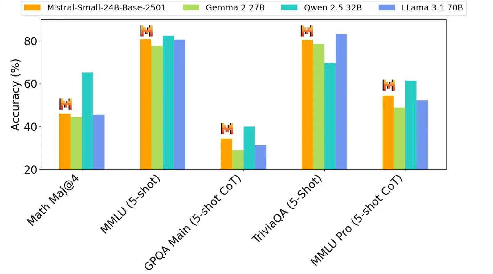
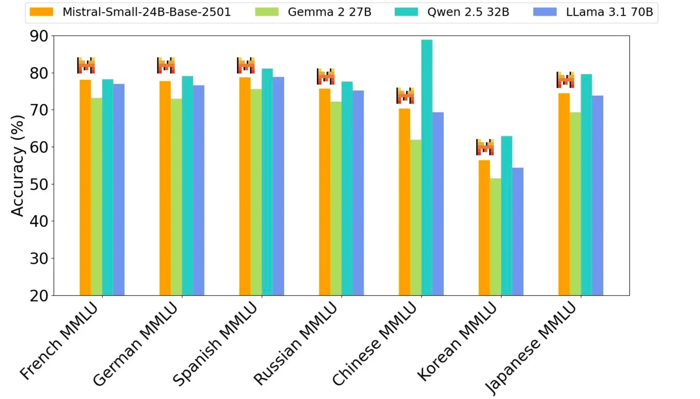

# Mistral Small 3

**Source**: `raw/mistral-small-3/full-article.md` (224 KB), `raw/mistral-small-3/full-article.md` (markdown view)  
**URL**: https://mistral.ai/news/mistral-small-3/  
**Ingested**: 2026-06-06  
**Tags**: #summary

## Summary

Mistral AI releases **Mistral Small 3** (January 2025), a **24B-parameter**, latency-optimized model under **Apache 2.0**. It targets the "80%" of generative AI tasks needing strong language and instruction following at very low latency—not RL or synthetic-data post-training, but a strong base for downstream reasoning work (complementary to models like DeepSeek R1).

The model claims parity with **Llama 3.3 70B Instruct** while running **>3× faster** on the same hardware, and serves as an open replacement for opaque models like GPT-4o-mini. With **>81% MMLU** and **~150 tokens/s**, it is positioned as the most efficient model in its category. Fewer layers than competitors reduce per-forward-pass latency; quantized deployment fits a single RTX 4090 or 32GB MacBook.

Third-party blind human evals on 1k+ coding and generalist prompts favor Mistral Small 3 vs. named competitors. Use cases span fast conversational assistance, low-latency function calling, domain fine-tuning, and local private inference. Mistral renews commitment to Apache 2.0 for general-purpose models, moving away from MRL-licensed releases.

## Key Claims

- 24B parameters; Apache 2.0 pretrained + instruct checkpoints; no RL or synthetic data in base pipeline.
- Competitive with Llama 3.3 70B and Qwen 32B; open replacement for GPT-4o-mini.
- >3× faster than Llama 3.3 70B Instruct on same hardware; >81% MMLU; ~150 tok/s.
- Fewer layers → lower latency; best performance for size class on pretrain benchmarks.
- Human preference wins on 1k+ proprietary prompts (third-party blind eval).
- Strong instruct performance on code, math, knowledge, and instruction-following vs. models 3× larger.
- Runs locally when quantized (RTX 4090 / 32GB Mac); API as `mistral-small-latest` / `mistral-small-2501`.
- Partners: Hugging Face, Ollama, Kaggle, Together AI, Fireworks, IBM WatsonX; more coming.

## Figures

| Figure | Caption | Page |
|--------|---------|------|
|  | Performance vs. cost/latency ("up and to the left" efficiency plot) | — |
|  | Human evaluation win rates vs. competitors | — |
|  | Instruct model: general knowledge benchmarks | — |
|  | Instruct model: code and math benchmarks | — |
|  | Instruct model: instruction-following benchmarks | — |
|  | Pretrained base model benchmark comparison | — |
|  | Pretrained MMLU and intermediate benchmarks | — |

## Entities

- [[Large Language Models]] — 24B Apache open model in the small/efficient tier.
- [[Model Compression and Efficiency]] — layer reduction, quantization, and local deployment.
- [[Agentic AI]] — low-latency function calling and agentic workflows.
- [[Reasoning Models]] — base model for community reasoning fine-tunes (e.g., DeepHermes).

## Questions & Gaps

- Not trained with RL/synthetic data; reasoning emerges only after community fine-tuning.
- Human-eval methodology relies on third-party vendor; some divergence from public benchmarks acknowledged.
- Enterprise vertical examples (fraud, healthcare, robotics) are customer evaluations, not benchmark claims.

## Related

- [[Model Compression and Efficiency]] — latency-optimized architecture and local inference.
- [[Large Language Models]] — open-weights small-model landscape.
- [[Agentic AI]] — function calling and low-latency agent stacks.
- [[Reasoning Models]] — base for open reasoning model builds (DeepSeek R1, DeepHermes).
