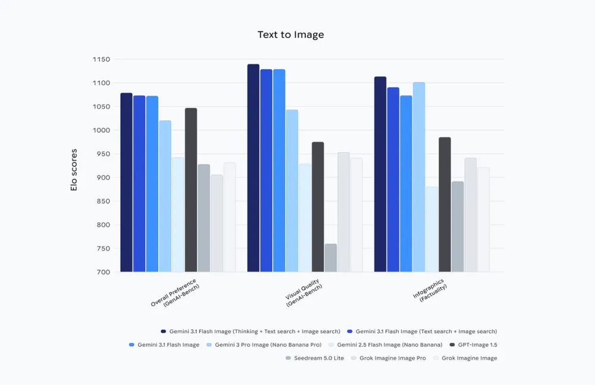

# Nano Banana 2

**Source**: `raw/nano-banana-2/full-article.html`, `raw/nano-banana-2/full-article.md`; `raw/build-with-nano-banana-2/full-article.html`  
**Canonical URLs**: https://blog.google/innovation-and-ai/technology/ai/nano-banana-2/ (product launch); https://developers.googleblog.com/en/build-with-nano-banana-2/ (developer guide)  
**Author**: Naina Raisinghani (Product Manager, [[Google DeepMind]])  
**Published**: 2026-02-26  
**Ingested**: 2026-06-06  
**Tags**: #summary

## Summary

On **Feb 26, 2026**, [[Google DeepMind]] launches **Nano Banana 2** — public brand for **Gemini 3.1 Flash Image** — merging [[Nano Banana Pro]]-class world knowledge, text rendering, and creative control with Gemini Flash speed. The model enables rapid iteration on edits while closing the fidelity gap vs the original Nano Banana: subject consistency (up to 5 characters, 14 objects), precise instruction following, photorealistic lighting/textures, and production-ready specs.

**Web search grounding** pulls real-time images and facts for accurate subject rendering (infographics, diagrams, data visualizations). Text upgrades include reliable in-image copy and multilingual localization. New developer-facing specs: **512px** resolution tier (joining 1K/2K/4K), expanded native aspect ratios (**4:1, 1:4, 8:1, 1:8** added), and configurable thinking levels (Minimal vs High/Dynamic) for complex prompts.

Product rollout replaces Nano Banana Pro as default across Gemini app Fast/Thinking/Pro modes (Pro/Ultra subscribers retain Pro via regenerate menu). Also ships in Search AI Mode/Lens, AI Studio + Gemini API (preview), Vertex AI, Antigravity, Flow (zero-credit default), Google Ads, and Firebase. Provenance stack pairs **SynthID** with **C2PA Content Credentials**; Gemini SynthID verification exceeded 20M uses since Nov 2025.

Developers build via paid API key: demo apps include "Window Seat" (location/weather-grounded views) and "Global Ad Localizer" (in-image translation). Partners (Whering, etc.) cite structured outputs and texture-preserving photo enhancement at scale.

## Key Claims

- Nano Banana 2 = Gemini 3.1 Flash Image; announced Feb 26 2026; combines Pro intelligence at Flash speed.
- Advanced world knowledge + **web search grounding** for factual, reference-accurate visuals.
- Precision text rendering and in-image multilingual localization/translation.
- Subject consistency: up to 5 characters and 14 objects; improved complex instruction following.
- Production specs: **512px–4K** resolutions; new aspect ratios 4:1, 1:4, 8:1, 1:8; configurable thinking levels.
- Gemini app: Nano Banana 2 replaces Nano Banana Pro by default; Pro tier access via three-dot regenerate.
- Search: AI Mode and Lens in 141 new countries/territories and 8 additional languages.
- API preview in AI Studio, Gemini API, Vertex AI, Antigravity, Firebase; paid API key required in AI Studio.
- Flow: new default image model at zero credits for all users.
- SynthID + C2PA provenance; 20M+ SynthID verification uses in Gemini since Nov 2025.
- Developer blog shows text-to-image benchmark leadership for Gemini 3.1 Flash Image class.

## Figures

| Figure | Caption |
|--------|---------|
|  | Gemini image model text-to-image benchmark comparison (developer blog, Feb 26 2026). |

## Entities

- [[Google DeepMind]] — ships Nano Banana 2 as the Flash-tier Gemini image model.
- [[Vision Language Models]] — multimodal generation/editing with language reasoning and search grounding.
- Naina Raisinghani — Product Manager; authored product launch post.

## Questions & Gaps

- Exact API pricing per resolution tier referenced but not enumerated in saved HTML.
- Numeric benchmark scores only visible in figure, not transcribed in article text.
- Relationship between "Nano Banana" (original) and Nano Banana 2 default replacement of Pro in Gemini app may confuse tier selection for power users.

## Related

- [[Nano Banana Pro]] — higher-fidelity Gemini 3 Pro Image tier retained for specialized tasks.
- [[How Nano Banana Got Its Name]] — brand origin for the Nano Banana line.
- [[Vision Language Models]] — multimodal image+text systems context.
- [[Google DeepMind]] — org behind Gemini Flash Image releases.
