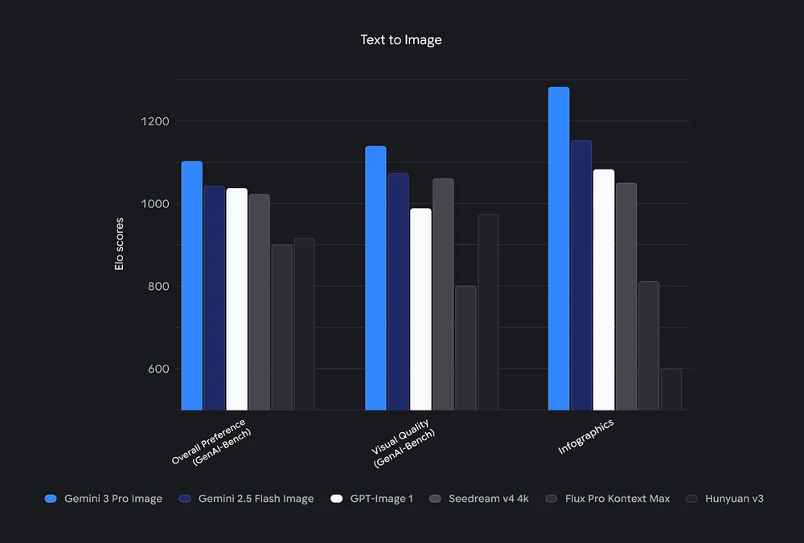
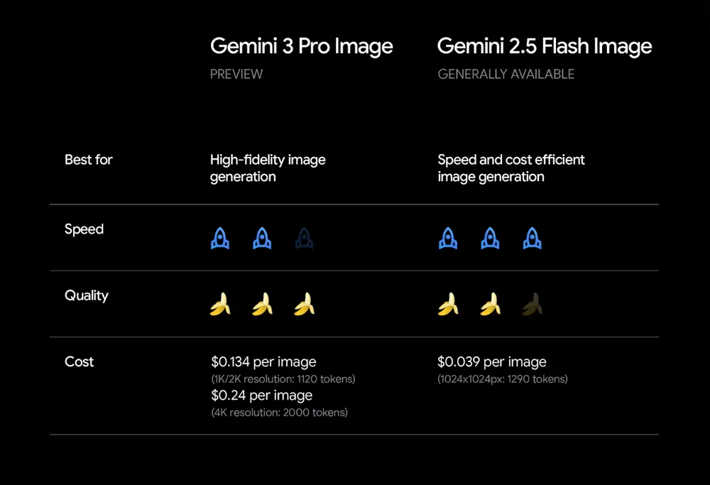

# Nano Banana Pro

**Source**: `raw/nano-banana-pro/full-article.md`, `raw/nano-banana-pro/full-article.md`; `raw/gemini-3-pro-image-developers/full-article.md`  
**Canonical URLs**: https://blog.google/innovation-and-ai/products/nano-banana-pro/ (consumer launch, Nov 20 2025); https://developers.googleblog.com/en/gemini-3-pro-image-developers/ (developer launch)  
**Author**: Naina Raisinghani (Product Manager, [[Google DeepMind]])  
**Published**: 2025-11-20  
**Ingested**: 2026-06-06  
**Tags**: #summary

## Summary

[[Google DeepMind]] introduces **Nano Banana Pro** — the public brand for **Gemini 3 Pro Image** — as the high-fidelity successor to Nano Banana (Gemini 2.5 Flash Image; see [[How Nano Banana Got Its Name]]). Built on Gemini 3 Pro's reasoning and world knowledge, it targets studio-quality image generation and editing: accurate infographics and diagrams, legible multilingual text rendered directly in images, and Google Search grounding for real-time facts (weather, recipes, sports).

Creative controls advance beyond the original Nano Banana: blend up to **14 input images**, maintain resemblance for up to **5 people**, localized editing (lighting, focus, color grading, aspect ratio), and **2K/4K** output. Consumers choose Nano Banana (fast) vs Nano Banana Pro (complex, highest quality) across Gemini app, Search AI Mode, NotebookLM, Google Ads, Workspace (Slides/Vids), Flow, Gemini API, AI Studio, Antigravity, and Vertex AI.

Every output carries imperceptible **SynthID** watermarks; Gemini app users can upload images and ask whether Google AI generated them. Visible Gemini sparkle watermarks remain on free/Pro tiers; Ultra and AI Studio outputs omit the visible mark for professional use. Developer docs highlight benchmark leadership on text-to-image tasks and a speed/quality/cost tradeoff vs Flash Image.

## Key Claims

- Nano Banana Pro = Gemini 3 Pro Image; successor to Nano Banana (Gemini 2.5 Flash Image), announced Nov 20 2025.
- Enhanced reasoning + world knowledge: infographics, handwritten-note-to-diagram, Search-grounded real-time visuals.
- State-of-the-art in-image text: short taglines through long paragraphs; multilingual generation, localization, and translation.
- High-fidelity controls: up to 14 blended inputs, 5-person consistency, localized editing, aspect ratios, 2K/4K resolution.
- Google Search grounding connects prompts to live web knowledge for factual, data-driven image outputs.
- SynthID on all generated/edited media; in-app verification in Gemini; visible watermark policy varies by subscription tier.
- Developer rollout: paid preview via Gemini API, AI Studio, Vertex AI; Antigravity agents generate UI mockups; Adobe and Figma integrations.
- Gemini 3 Pro Image leads text-to-image benchmarks; use 2.5 Flash Image for lower cost/latency, 3 Pro Image for maximum quality.

## Figures

| Figure | Caption |
|--------|---------|
|  | Gemini 3 Pro Image text-to-image benchmark scores vs leading competitors (developer blog). |
|  | Speed, quality, and cost comparison: Gemini 2.5 Flash Image vs Gemini 3 Pro Image. |

## Entities

- [[Google DeepMind]] — builds and ships the Nano Banana image model family on Gemini.
- [[Vision Language Models]] — multimodal image generation/editing grounded in language reasoning and world knowledge.
- Naina Raisinghani — Product Manager; authored consumer launch post and coined the Nano Banana codename (see [[How Nano Banana Got Its Name]]).

## Questions & Gaps

- Exact benchmark suite names and numeric scores are only visible in the bar-chart figure, not transcribed in prose.
- Free-tier quota limits for Nano Banana Pro in Gemini are unspecified beyond "limited."
- Comparison table references "Gemini 2 Pro Image" in alt text — relationship to 3 Pro Image tier naming unclear from source alone.

## Related

- [[How Nano Banana Got Its Name]] — origin of the Nano Banana brand and LMArena codename.
- [[Nano Banana 2]] — Feb 2026 Flash successor combining Pro capabilities at Flash speed.
- [[Vision Language Models]] — image+text generation and editing as a multimodal capability class.
- [[Google DeepMind]] — research and product org behind Gemini image models.
- [[Papers Explained 367 - Gemini Models]] — broader Gemini model family context.
