# In-layer Normalization Techniques for Training Very Deep Neural Networks

**Source**: `raw/normalization/full-article.md` (markdown view: `raw/normalization/full-article.md`)  
**URL**: https://theaisummer.com/normalization/  
**Author**: Nikolas Adaloglou (AI Summer), 2020-10-15  
**Ingested**: 2026-06-06  
**Tags**: #summary

## Summary

Nikolas Adaloglou's AI Summer survey explains why **in-layer normalization** matters for training deep models across CNNs, RNNs, transformers, and GANs. Just as input features on wildly different scales cause gradient descent to ignore low-magnitude dimensions, intermediate activations inside deep networks suffer the same pathology — independent of architecture. Normalization methods differ primarily in **which tensor axes they aggregate statistics over** (batch N, channels C, height H, width W), and the article maps each choice to typical use cases.

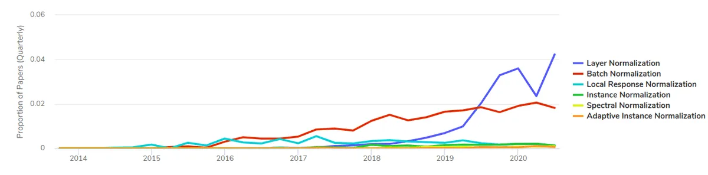

The core activation-normalization family spans **[[Batch Normalization]]** (per-channel stats over N×H×W — strong for image classification, fragile at small or varying batch sizes), **[[Layer Normalization]]** (per-sample stats over C×H×W — batch-independent; dominant in transformers), **[[Instance Normalization]]** (per-sample per-channel over H×W — style transfer), and **[[Group Normalization]]** (stats within channel groups over H×W — batch-independent CNN alternative). **[[Synchronized Batch Normalization]]** aggregates BN statistics across GPUs for large-scale distributed training.

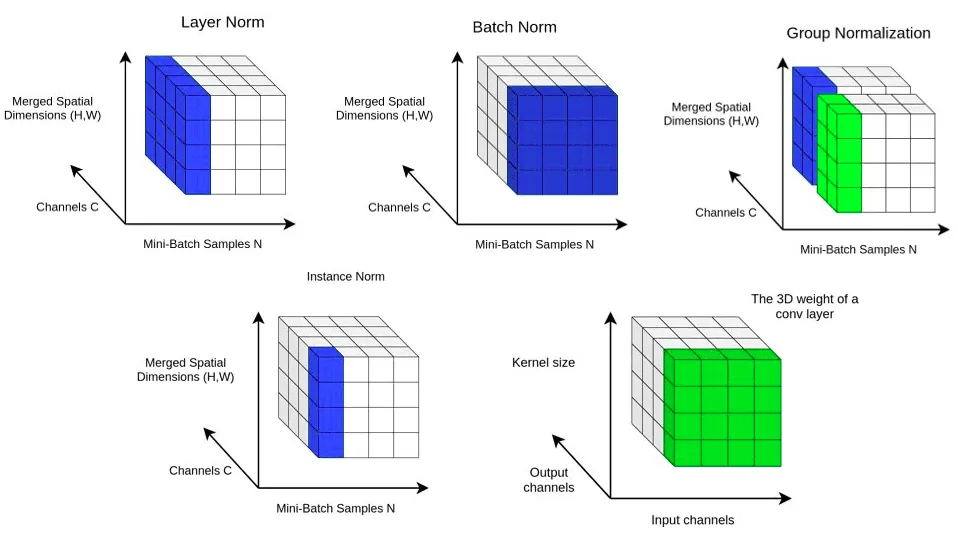

Beyond vanilla activation norm, the article covers **weight reparameterization** (**[[Weight Normalization]]**, **[[Weight Standardization]]**) that normalizes filter weights rather than activations — WS smooths the loss landscape and pairs with GN in [[Big Transfer]] (replacing BN for TPU-scale pretraining).

Style- and layout-conditioned variants inject external signals into the affine step: **[[Adaptive Instance Normalization]]** (AdaIN) aligns content feature moments to a style image for arbitrary style transfer; **[[SPADE]]** (Spatially-Adaptive Normalization) predicts spatially varying γ, β from segmentation masks for semantic image synthesis. Santurkar et al. (NeurIPS 2018) is cited to note that BN's benefit is not fully explained by eliminating internal covariate shift — BN makes gradients more predictive.

## Key Claims

- Intermediate layers are conceptually like input layers: unnormalized activations on mismatched scales destabilize training across all deep architectures.
- **BN** (Ioffe & Szegedy 2015): per-channel μ, σ over batch and spatial dims; γ, β per channel; accelerates training and acts as regularization; fails with small batch (segmentation, video, 3D medical) or varying batch between train/inference/pretrain/finetune.
- **Synchronized BN** (Zhang et al. 2018): all-reduce mean/variance across workers so global batch statistics match single-GPU BN at scale.
- **LN** (Ba et al. 2016): per-sample stats over all channels and spatial positions; batch-independent; became standard in transformers after relative obscurity in the RNN era.
- **IN** (Ulyanov et al. 2016): per (sample, channel) stats over spatial dims only; affine γ, β can encode style; conditional IN extends to finite style sets.
- **Weight Norm** (Salimans & Kingma 2016): reparameterize w = (g/‖v‖)v to decouple magnitude from direction; rarely discussed but principled.
- **AdaIN** (Huang & Belongie 2017): AdaIN(x,y) = σ(y)·(x−μ(x))/σ(x) + μ(y); single-layer style alignment enables real-time arbitrary style transfer in encoder–decoder nets.
- **GN** (Wu & He 2018): G groups of C/G channels; stats over H×W within each group; G=C → IN, G=1 → LN; stable accuracy across batch sizes; ResNet-50 ImageNet curves shown at batch 32/GPU.
- **Weight Standardization** (Qiao et al. 2019): per-output-channel weight mean/std before convolution; reduces Lipschitz constants, smooths loss landscape; GN+WS beats BN and GN alone on ImageNet/COCO; adopted in BiT for large-scale transfer.
- **SPADE** (Park et al. 2019): BN-style per-channel norm, then spatially varying γ(mask), β(mask) from conv heads on segmentation map — preserves semantic layout in GAN synthesis.

## Figures

| Figure | Caption | Page |
|--------|---------|------|
|  | Trends in normalization methods used in papers over time (Papers with Code) | — |
| 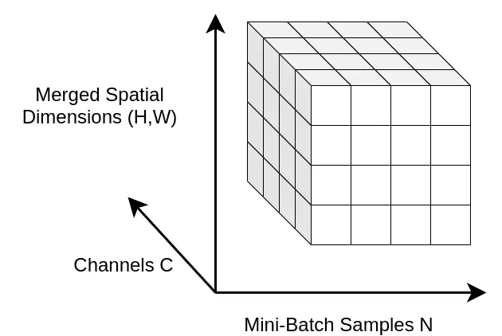 | 3D visualization of 4D activation tensor (N, C, H×W merged) | — |
| 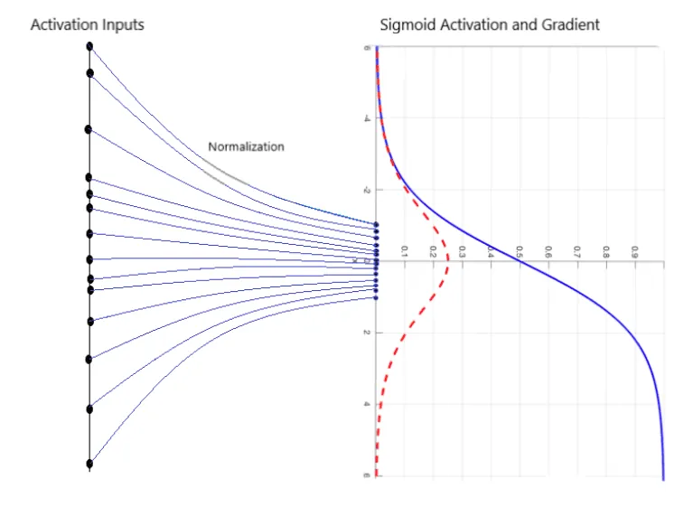 | How batch norm brings feature values into a compact range (MC.AI) | — |
| 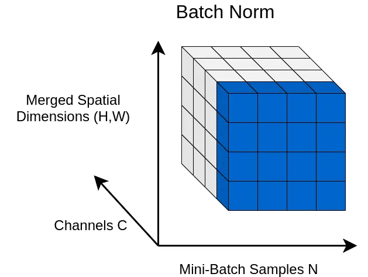 | Batch normalization: statistics aggregated over batch and spatial dims | — |
| 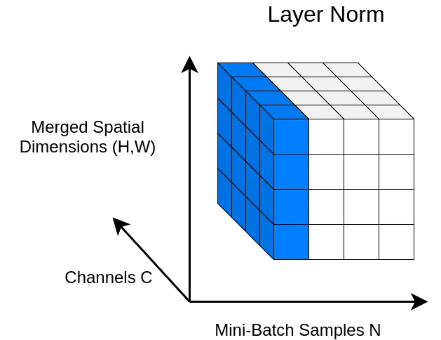 | Layer normalization: statistics per sample over channels and spatial dims | — |
| 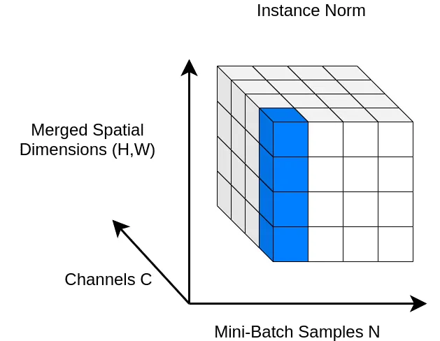 | Instance normalization: statistics per sample and channel over spatial dims | — |
| 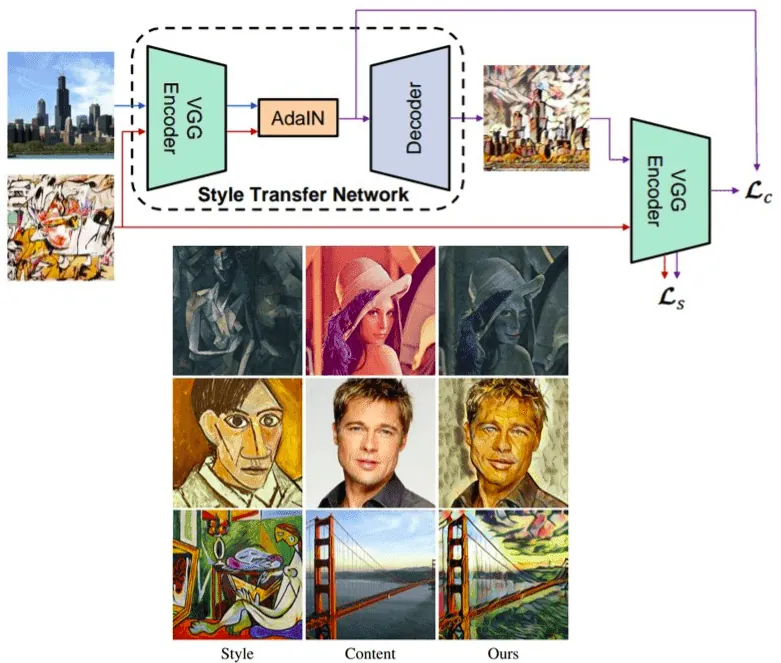 | AdaIN encoder–decoder architecture and style-transfer results | — |
| 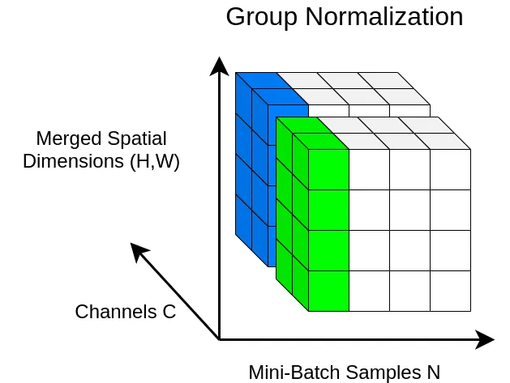 | Group normalization with channels split into groups | — |
| 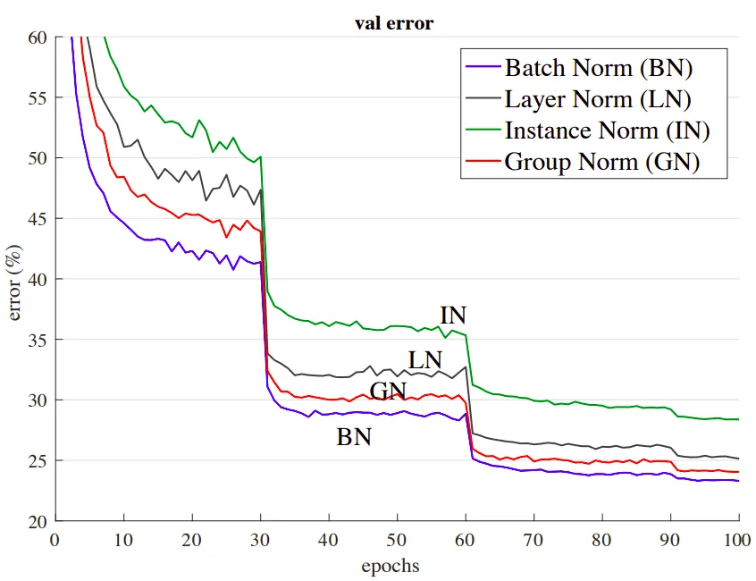 | ResNet-50 ImageNet validation error: GN vs BN at batch 32/GPU | — |
| 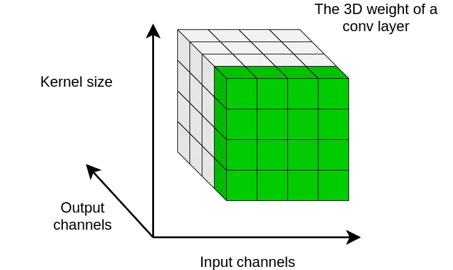 | Weight standardization: per output-channel weight statistics | — |
| 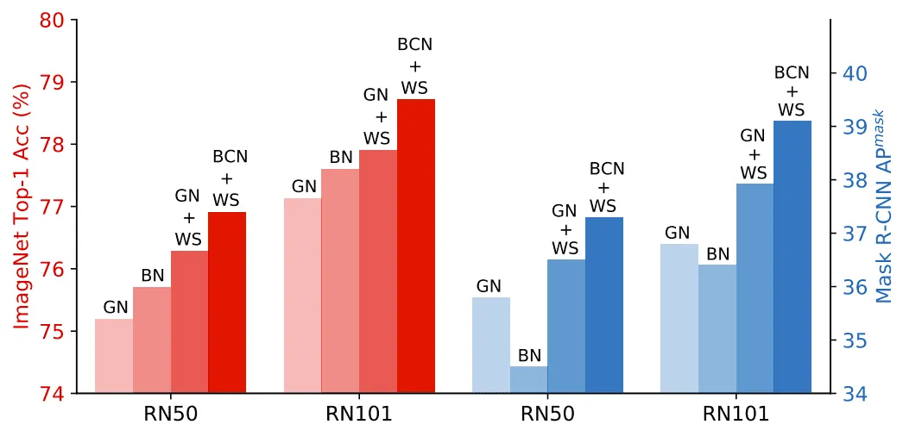 | GN+WS vs BN and GN on ImageNet and COCO | — |
| 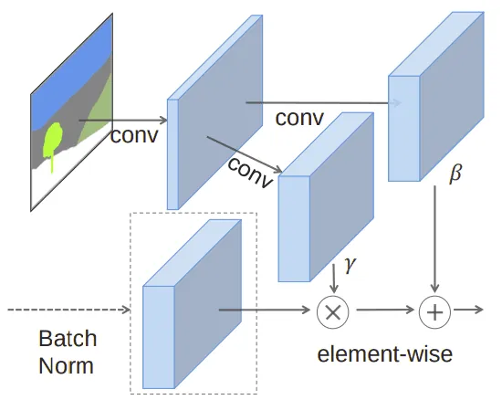 | SPADE layer: spatially adaptive γ, β from segmentation mask | — |
|  | Comparative overview of all presented normalization methods | — |
|  | BiT ResNet depth/width scaling: batch-norm layers (red) swapped for GN+WS (Google AI blog / Giphy) | — |

BN averages over the batch dimension and spatial positions for each channel — blending global image characteristics useful for classification.

GN partitions channels into groups and normalizes within each group, making statistics independent of batch size.

## Media

Embedded talks and demos from the article (linked; not bundled locally):

- [How does batch normalization help optimization? (Santurkar et al., NeurIPS 2018)](https://www.youtube.com/watch?v=prLb1MbAm8M) — why BN works beyond internal covariate shift; gradients become more predictive.
- [Parallel reduction concept (Udacity)](https://www.youtube.com/watch?v=ZOabsYbmBRM) — background for synchronized BN all-reduce across devices.
- [Group Normalization oral presentation (Wu & He, ECCV 2018)](https://www.youtube.com/watch?v=m3TN9FFmqsI&t=72) — official FAIR talk; starts at 1:12.

## Entities

- [[AI Summer]] — published this normalization survey (2020).
- [[Nikolas Adaloglou]] — author.
- [[Batch Normalization]] — per-channel activation norm over N×H×W; default CNN training stabilizer.
- [[Layer Normalization]] — per-sample activation norm; transformer standard.
- [[Instance Normalization]] — per-channel spatial norm; style transfer.
- [[Group Normalization]] — grouped-channel spatial norm; small-batch CNNs.
- [[Synchronized Batch Normalization]] — distributed BN with cross-device statistics.
- [[Weight Normalization]] — weight reparameterization (Salimans & Kingma 2016).
- [[Weight Standardization]] — per-filter weight norm before convolution (Qiao et al. 2019).
- [[Adaptive Instance Normalization]] — style-conditioned instance norm (AdaIN).
- [[SPADE]] — segmentation-conditioned spatially adaptive normalization.
- [[Big Transfer]] — BiT replaces BN with GN+WS for large-scale visual pretraining.

## Questions & Gaps

- Article predates RMSNorm and other transformer-specific norms now common in LLMs ([[Papers Explained 335 - Transformers without Normalization]] explores removing norm entirely).
- No PyTorch code walkthrough (unlike other AI Summer tutorials); purely conceptual + equations.

## Related

- [[Papers Explained Review 10 - Normalization Layers]] — paper-by-paper survey with implementation snippets for BN, LN, IN, GN, WS.
- [[Best Deep CNN Architectures and Their Principles: from AlexNet to EfficientNet]] — BiT's GN+WS substitution for BN at scale.
- [[How Transformers Work in Deep Learning and NLP: An Intuitive Introduction]] — layer norm in transformer blocks.
- [[GANs in Computer Vision: Conditional Image Synthesis and 3D Object Generation]] — style transfer context for AdaIN/IN.
- [[Papers Explained 253 - SPADE]] — SPADE paper coverage.
- [[Computer Vision]] — topic hub.
- [[Deep Learning]] — optimization and architecture fundamentals.
