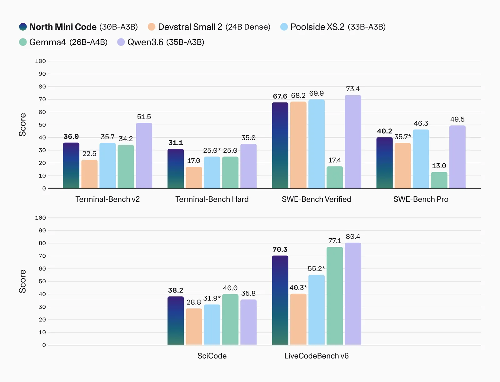
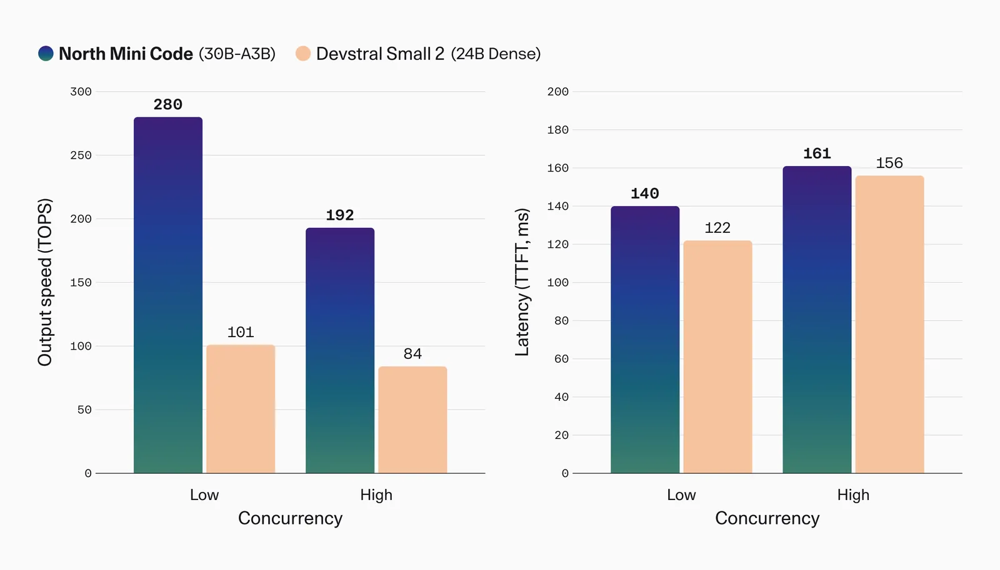
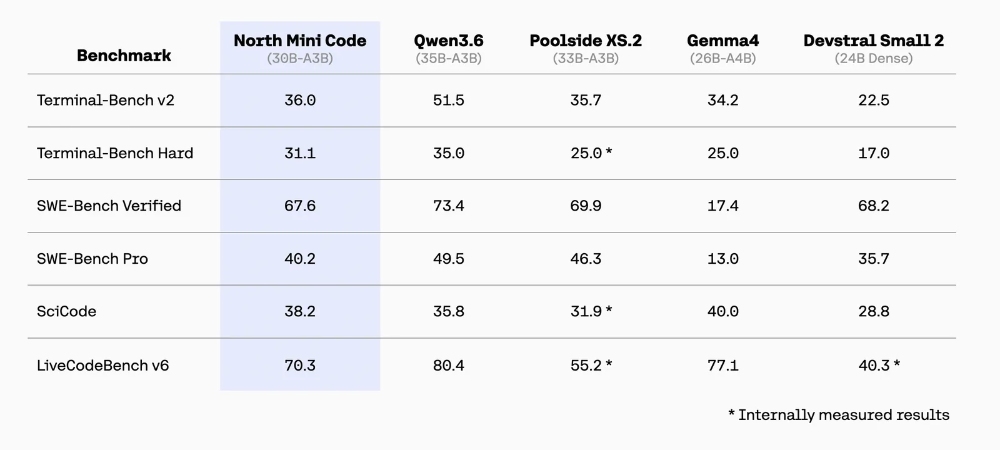
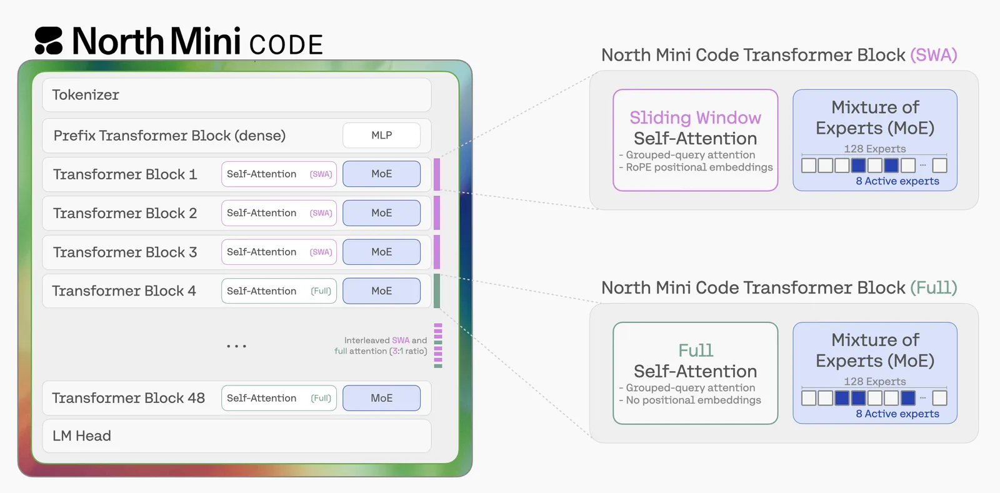
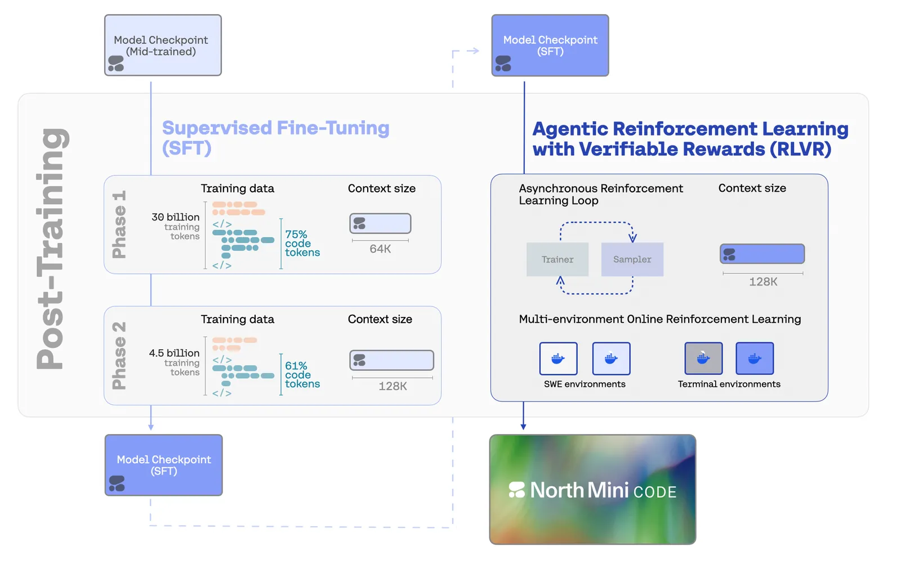
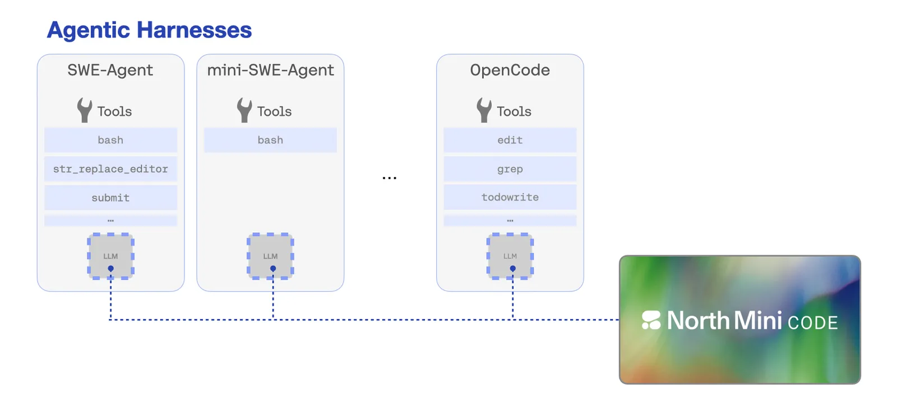
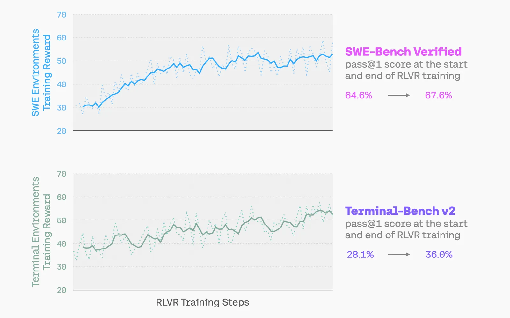
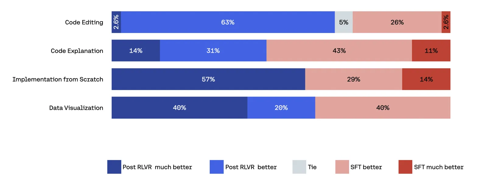

# Introducing North Mini Code

**Source**: `raw/north-mini-code/full-article.md` (367 KB), `raw/north-mini-code/full-article.md`; `raw/introducing-north-mini-code/full-article.md` (178 KB), `raw/introducing-north-mini-code/full-article.md`  
**URLs**: https://cohere.com/blog/north-mini-code · https://huggingface.co/blog/CohereLabs/introducing-north-mini-code  
**Ingested**: 2026-06-09  
**Tags**: #summary

## Summary

On June 9, 2026, [[Cohere]] released **North Mini Code** (**North-Mini-Code-1.0**): its first open-weight model for developers and the inaugural member of a new model family. The model is a **30B-parameter sparse MoE** with **3B active** parameters, Apache 2.0 licensed, with **256K** total context and **64K** max generation. Cohere positions it for agentic software engineering, terminal-based agent tasks, and high-quality code generation—deployable on-prem, via Hugging Face, Cohere API, Model Vault, or OpenRouter, with a stated minimum of one H100 at FP8.

The product announcement emphasizes sovereign/open developer access, competitive agentic benchmarks in the small-model class, and inference efficiency: **33.4** on the Artificial Analysis Coding Index, up to **2.8×** output throughput vs Devstral Small 2, and a **30%** inter-token latency advantage. The companion Hugging Face technical post details architecture, post-training, and async RL—making North Mini Code one of the more transparent open agentic-coding releases in its weight class.

Architecturally, North Mini Code is a decoder-only sparse MoE Transformer: **128 experts / 8 active** per token, sigmoid-gated router, one dense layer before sparse layers, SwiGLU FFN experts, and hybrid attention interleaving **3:1** sliding-window RoPE attention with global no-positional-embedding layers. Post-training uses **two-stage cascaded SFT** (64K then 128K context) strictly as priming for **RLVR**, followed by multi-environment async RL with **[[CISPO]]**. Training spans **70k+** verifiable tasks across **~5k** repositories with SWE-Bench source deduplication to limit eval leakage. A deliberate **multi-harness** SFT mix (SWE-Agent, mini-SWE-agent, [[OpenCode]], Terminus-2 plain-text) improves cross-scaffold robustness without sacrificing SWE-Bench Verified performance.

## Key Claims

- **North-Mini-Code-1.0**: 30B total / 3B active MoE; Apache 2.0; 256K context, 64K max generation; min deploy 1× H100 @ FP8.
- First Cohere open model for developers; first in a new Cohere model family beyond enterprise Command/North platform lines.
- Artificial Analysis Coding Index **33.4**; competitive vs Qwen3.5-35B-A3B, Gemma 4 26B-A4B, Devstral Small 2, and larger open models (Nemotron 3 Super, Mistral Small 4, Devstral 2).
- Up to **2.8×** output throughput vs Devstral Small 2 at matched concurrency/hardware; **30%** better inter-token latency; TTFT roughly matched.
- MoE: 128 experts, 8 active/token; sigmoid router; dense-then-sparse stack; 3:1 SWA-RoPE : global no-PE attention.
- SFT stage 1: 70% code tokens (43% agentic tool-use, 27% single-turn competitive/scientific code) plus reasoning/instruction mix; stage 2: 4.5B-token agentic/reasoning mix, 61% code.
- SFT checkpoint: **80.2%** pass@10 SWE-Bench Verified, **55.1%** pass@10 Terminal-Bench v2.
- Multi-harness SFT (+6% alternate-harness data) yields **+10%** on OpenCode eval while holding SWE-Agent SWE-Bench performance; **61.0%** pass@1 with mini-SWE-agent.
- Async RL: vLLM sidecar, windowed FIFO queue, weight export every K=4 steps, **CISPO** token-level loss; joint Terminal + SWE training.
- RLVR gains: **+7.9%** abs pass@1 Terminal-Bench v2, **+3.0%** abs SWE-Bench Verified over SFT; shorter trajectories, fewer invalid tool calls.
- Human pairwise eval (OpenCode/Harbor): final model **66.1%** win rate vs SFT-only across 85 samples; largest gains on code editing.
- Availability: Hugging Face (BF16 + FP8), Cohere API, Model Vault, OpenRouter, [[OpenCode]].

## Figures

| Figure | Caption | Source |
|--------|---------|--------|
|  | Agentic coding benchmark comparison (Cohere blog) | Cohere blog |
|  | Throughput and latency vs Devstral Small 2 | Cohere blog |
|  | Benchmark results vs similar-size open models | HF technical post |
|  | MoE decoder architecture (hybrid attention) | HF technical post |
|  | Post-training pipeline (SFT + RLVR) | HF technical post |
|  | Multi-harness exposure during stage-2 SFT | HF technical post |
|  | Multi-environment RL learning curves | HF technical post |
|  | Human pairwise preference vs SFT checkpoint | HF technical post |

## Entities

- [[North Mini Code]] — Cohere's first open agentic coding model (30B/3B MoE).
- [[Cohere]] — model author; Apache 2.0 open-weight release under Cohere Labs.
- [[OpenCode]] — primary open coding-agent harness North Mini Code is trained and evaluated with.
- [[CISPO]] — RL objective used for async agentic RLVR training.
- [[Mixture of Experts]] — sparse 128-expert architecture with 3B active parameters.

## Questions & Gaps

- Pre-training data mix and total compute budget are not disclosed.
- Competitor benchmark entries marked (*) in Cohere charts were run internally where public scores were missing.
- Exact SWE-Bench Verified / Terminal-Bench pass@1 headline numbers for the final release checkpoint are reported primarily via figures rather than inline text.
- Relationship between Cohere's **North** enterprise platform branding and the **North Mini Code** open model family is described qualitatively but not architecturally detailed.

## Related

- [[Code Models]] — agentic coding models, SWE-Bench, and terminal-agent benchmarks.
- [[Agent Harness]] — multi-harness robustness as a first-class training objective.
- [[Agentic AI]] — tool-use agents and terminal-based software engineering.
- [[Mixture of Experts]] — sparse MoE efficiency at 30B/3B scale.
- [[Model Compression and Efficiency]] — 3B-active inference and FP8 deployment path.
- [[Components of A Coding Agent]] — pedagogical breakdown of coding-harness components North Mini Code is trained across.
- [[Continually Improving Our Agent Harness]] — production harness–model co-design context.
- [[CISPO]] — clipped importance-sampling RL used in North Mini Code post-training.
- [[Evaluation and Benchmarks]] — SWE-Bench Verified, Terminal-Bench, LiveCodeBench, SciCode evaluation context.
