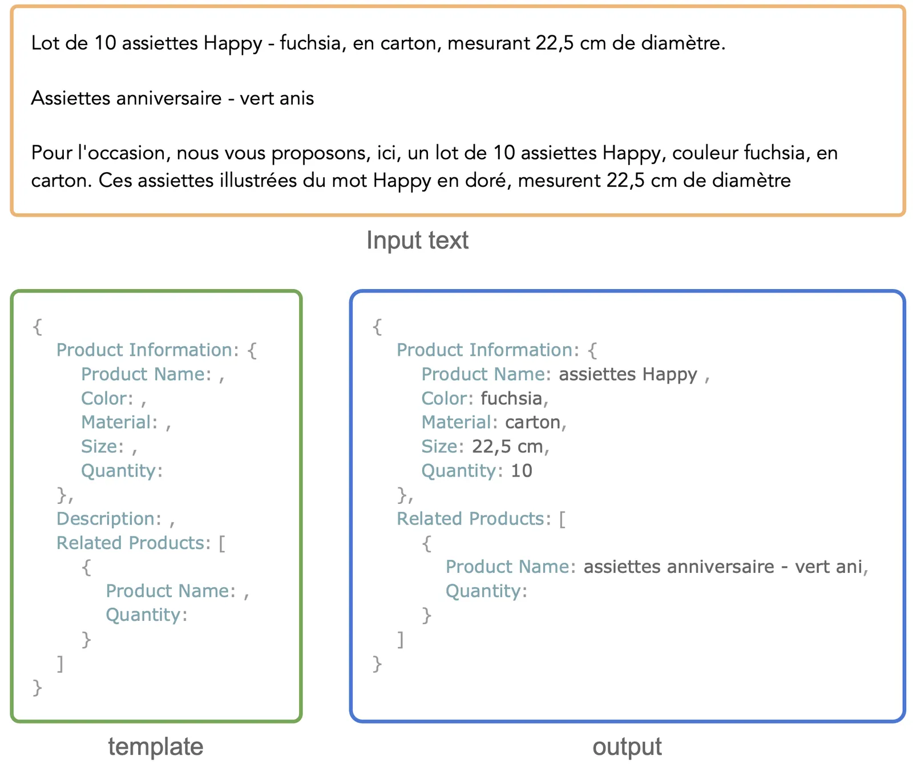
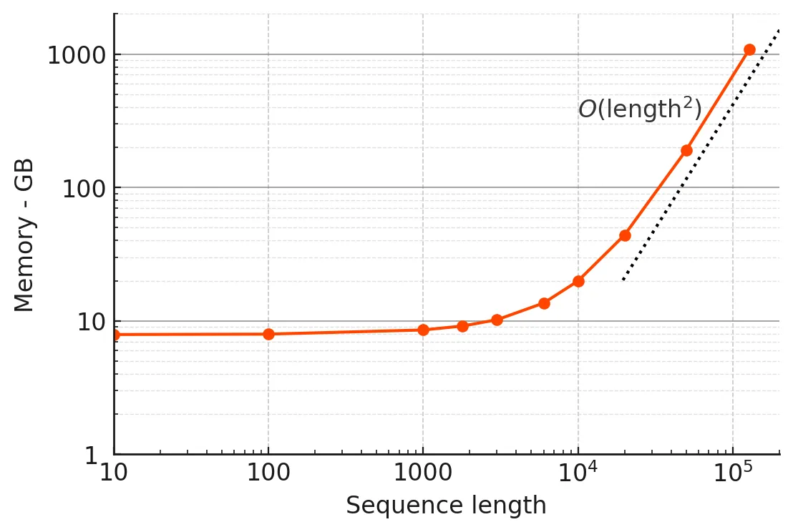
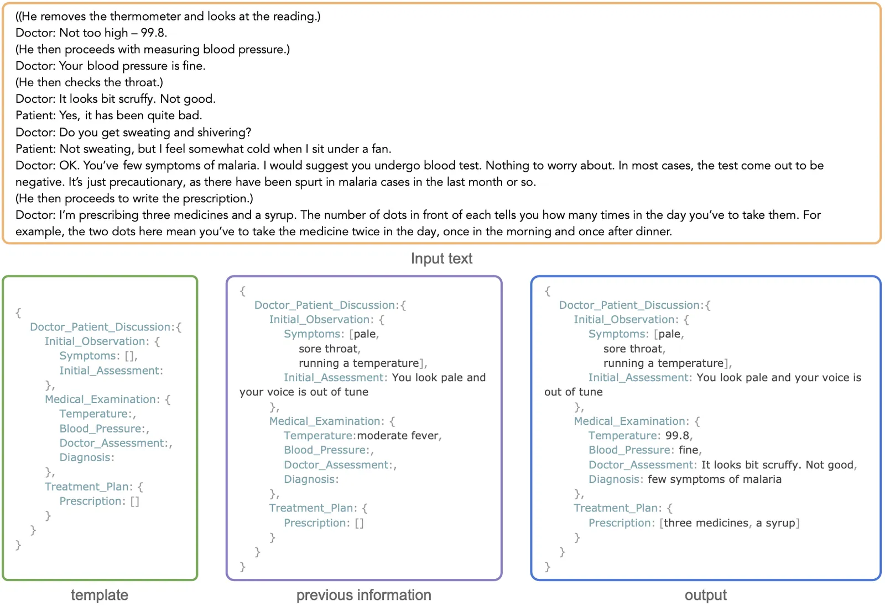
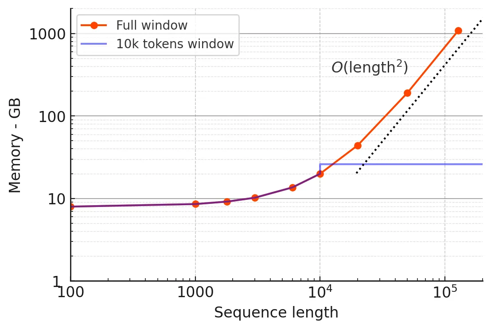
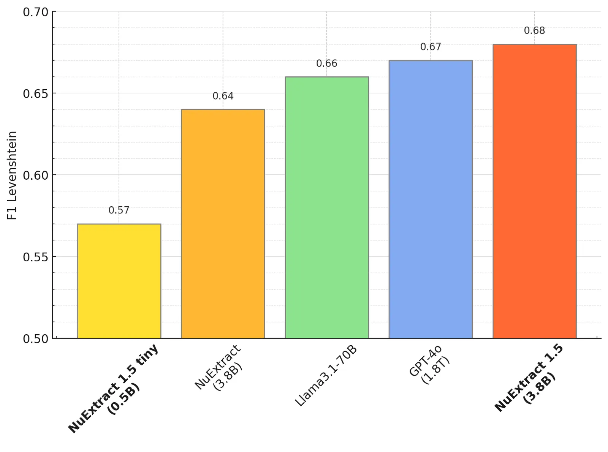
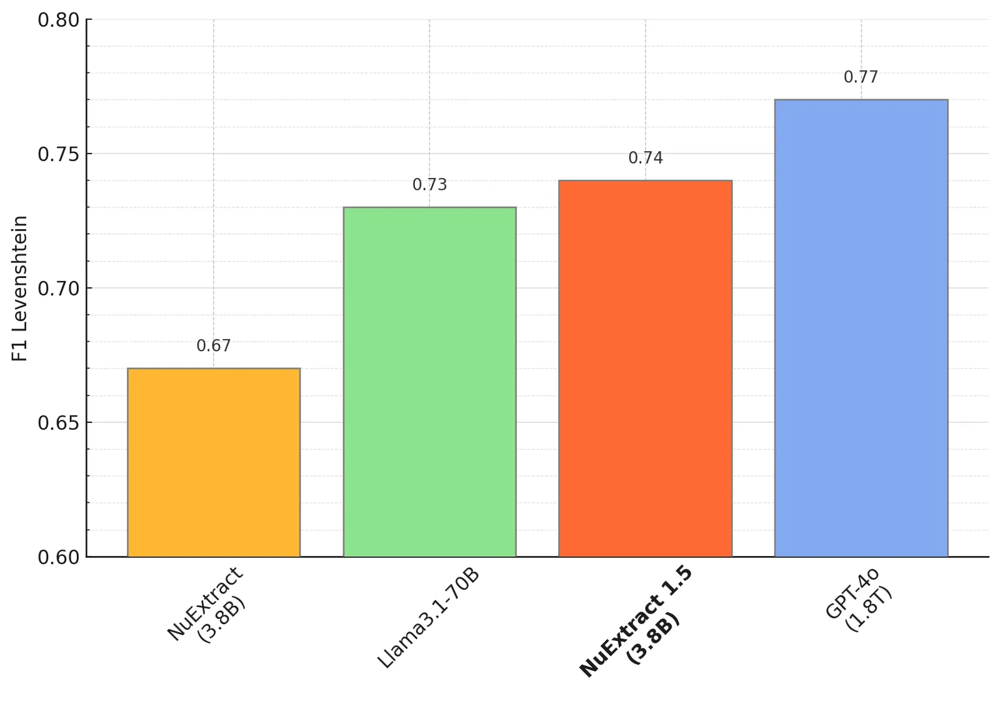
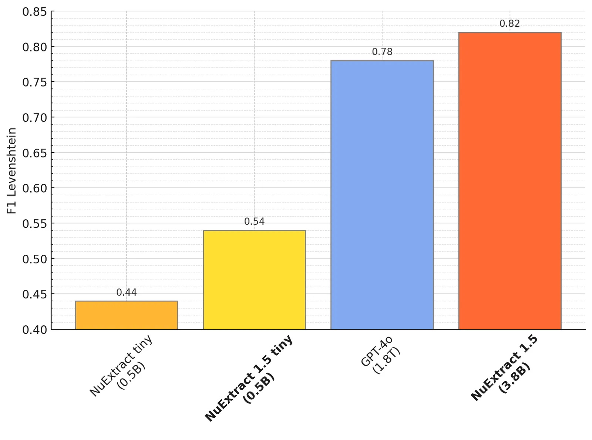
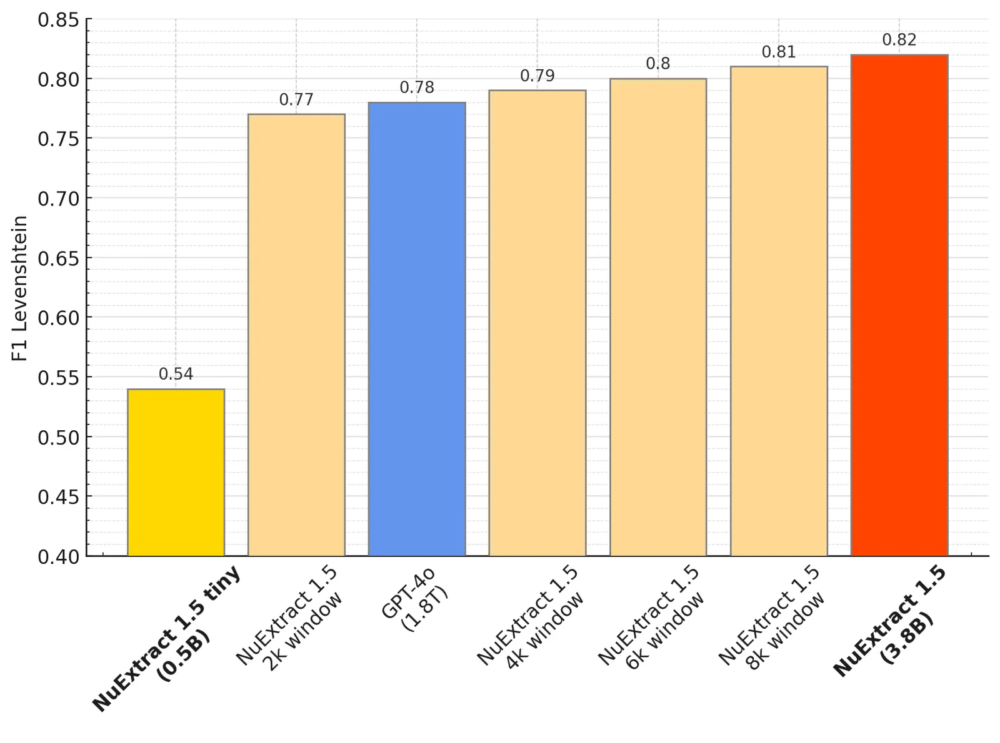

# NuExtract 1.5 — Multilingual, Infinite context, still small, and better than GPT-4o!

**Source**: `raw/nuextract-1-5-multilingual-infinite-context/full-article.md` (SPA shell; readable markdown from WebFetch), https://about.nuextract.ai/blog/nuextract-1-5-multilingual-infinite-context  
**Ingested**: 2026-06-12  
**Tags**: #summary

## Summary

**NuExtract 1.5** (October 2024) extends [[NuExtract: A Foundation Model for Structured Extraction]] with **multilingual** support and **effectively unbounded document length** while staying **3.8B parameters** — **500× smaller than GPT-4o** yet **slightly better** on NuMind's English zero-shot structured-extraction benchmark. MIT license; [Hugging Face weights](https://huggingface.co/numind/NuExtract-v1.5) and [demo Space](https://huggingface.co/spaces/numind/NuExtract-v1.5).

**Multilingual**: Base **Phi-3.5 mini** (23 languages). Training mix: **50% English / 50% other** C4 (FR, DE, ES, IT, PT…), longer docs than 1.0. **Half** of examples use **English templates on non-English text** so users can standardize templates in English; other half uses document-language templates. Still **purely extractive** (copy-paste).

**Infinite context**: Native **128k** context (~200 pages) is memory-prohibitive at full attention (~**1 TB** GPU RAM at 128k). NuExtract 1.5 learns **continuation extraction**: each pass conditions on **template + text window + previously extracted JSON state**, then slides the window — **bounded memory** (~**<30 GB** at 10k window) regardless of doc length. Tradeoff: multiple generation passes; small windows hurt quality (worse than GPT-4o only below **~2k** window on 10k–20k token docs).

**Results** (600-example, 12-problem benchmark): zero-shot **> original NuExtract** and **≈ GPT-4o**; many-shot (45 examples/problem) GPT-4o edges ahead slightly. **Multilingual**: large gain over 1.0 but **GPT-4o still leads** — size matters for multilinguality. **Long docs**: beats GPT-4o at 8k–10k tokens and at 10k–20k with 10k extraction window. Tiny **Qwen 2.5 0.5B** English-only variant also released.

## Key Claims

- **3.8B** model **beats GPT-4o** English zero-shot structured extraction; **500× smaller**.
- **Continuation extraction** enables arbitrary-length documents with **fixed window memory**.
- **128k** theoretical context vs **~30 GB** at **10k** practical extraction window.
- Multilingual training + Phi-3.5 base; English-template mode for cross-lingual deployment.
- Pure extractive training reduces hallucinations vs generic LLMs.

## Figures

| Figure | Caption | Page |
|--------|---------|------|
|  | French document with English template training example | — |
|  | Inference memory vs token count (full attention) | — |
|  | Continuation extraction: template + text + prior JSON | — |
|  | GPU memory: full window vs 10k extraction window | — |
|  | English zero-shot benchmark vs GPT-4o | — |
|  | Multilingual zero-shot benchmark | — |
|  | Long-document performance (8k–10k tokens) | — |
|  | Performance vs extraction window size | — |

## Entities

- [[NuExtract]] — model family; 1.5 generation.
- [[NuMind]] — developer.
- [[Long Context]] — continuation windowing for unbounded docs.
- [[Multilingual Models]] — Phi-3.5 + mixed-language C4 training.

## Questions & Gaps

- Multilingual gap to GPT-4o expected to close with larger NuExtract variants (stated in post).
- Continuation adds latency (multiple passes) — not quantified vs single-pass GPT-4o.

## Related

- [[NuExtract: A Foundation Model for Structured Extraction]] — 1.0 predecessor.
- [[NuExtract 2.0: Outclassing Frontier LLMs in Information Extraction]] — next major version (vision + abstraction).
- [[Structured Extraction]] — task definition.
- [[Document AI]] — long-document parsing use cases.
