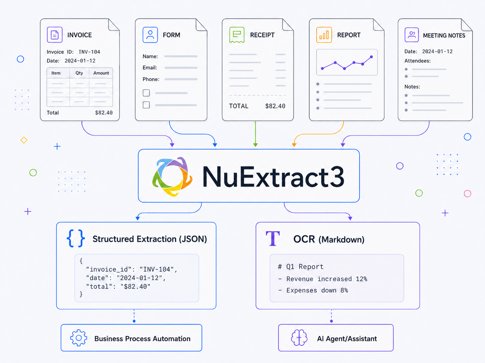
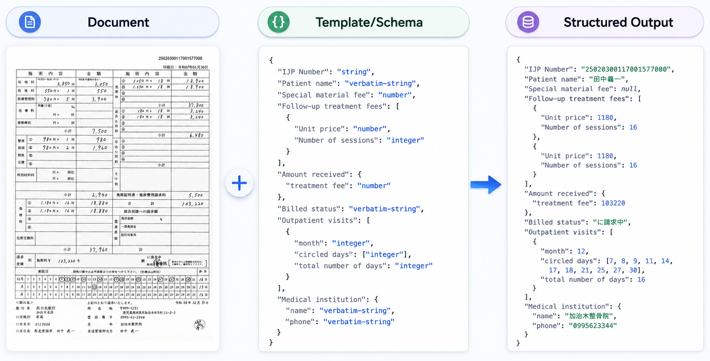
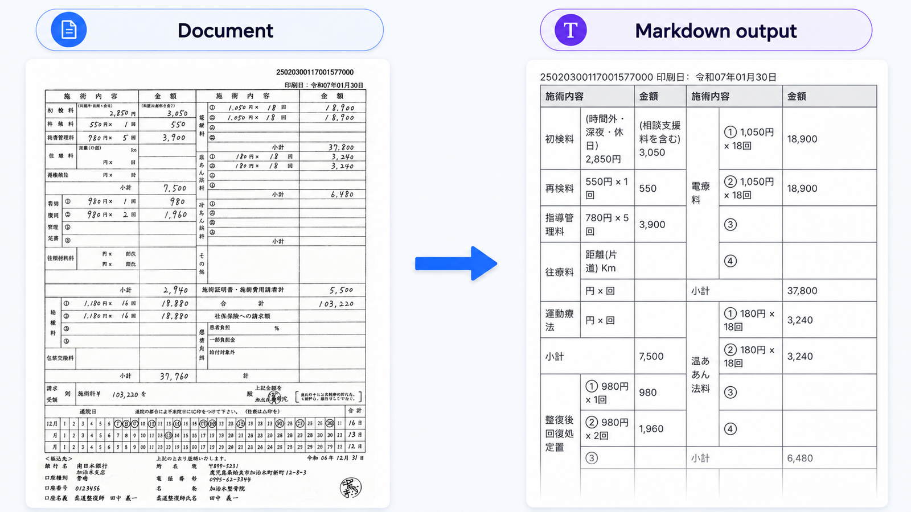
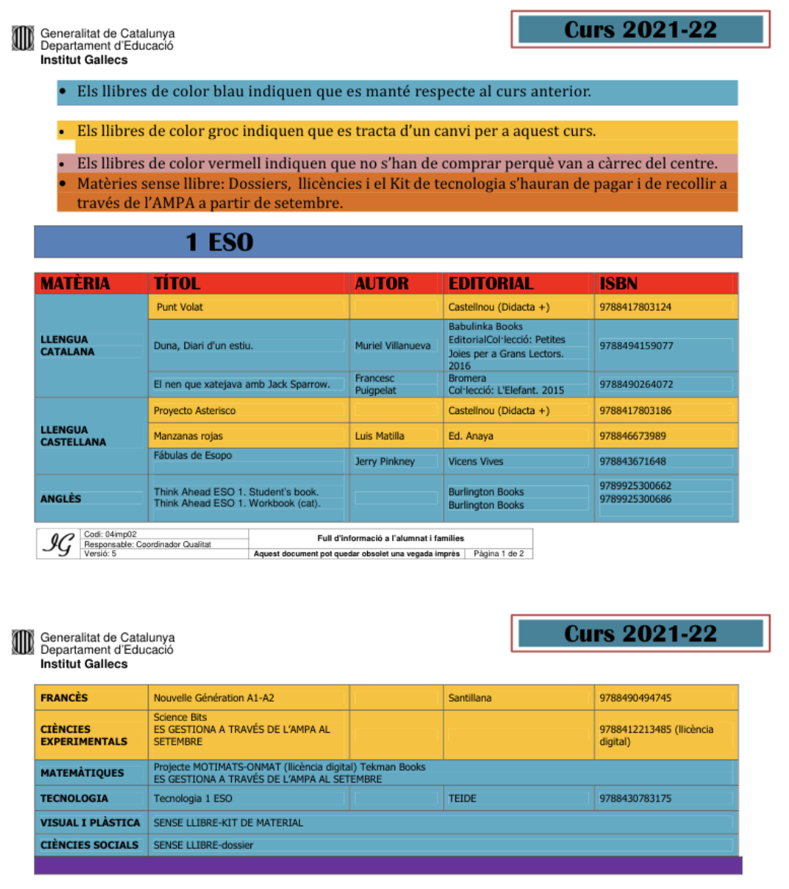
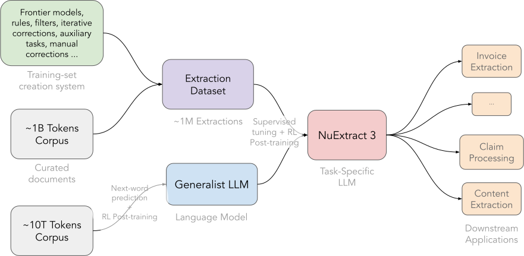
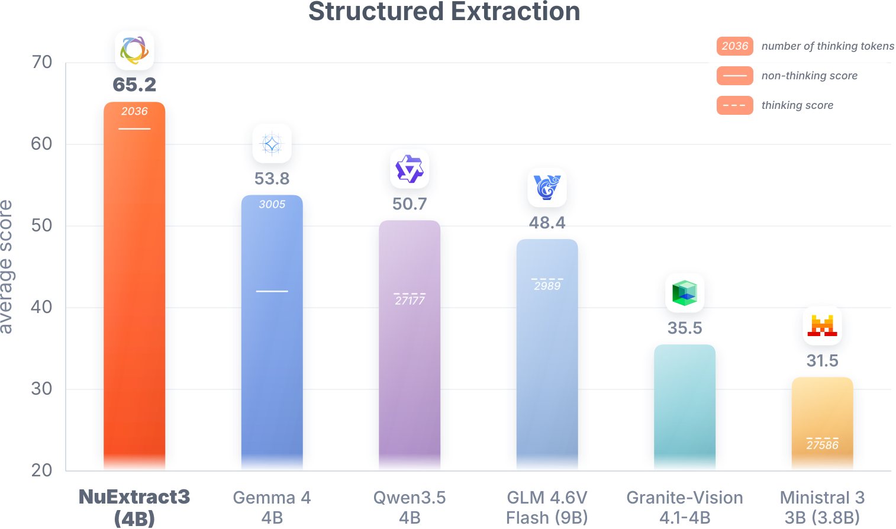
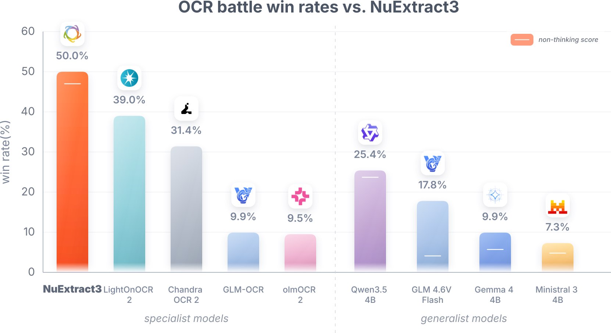
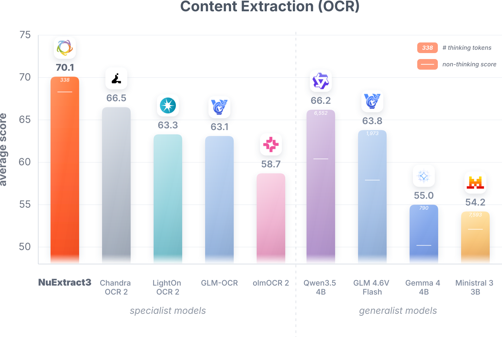
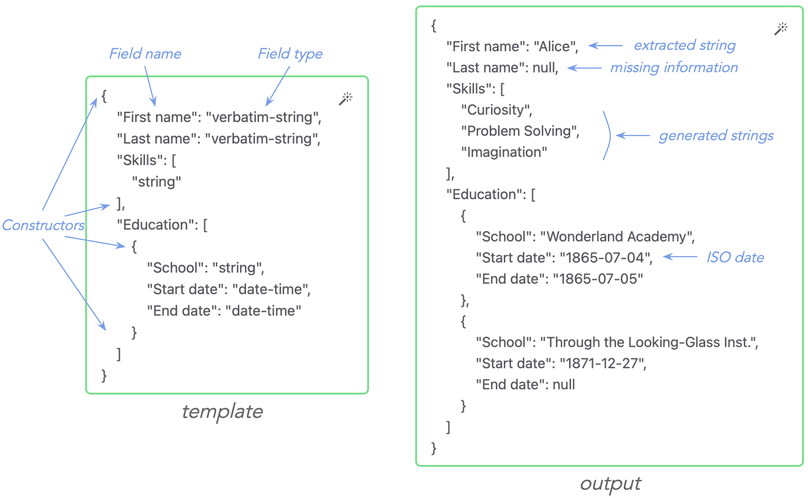
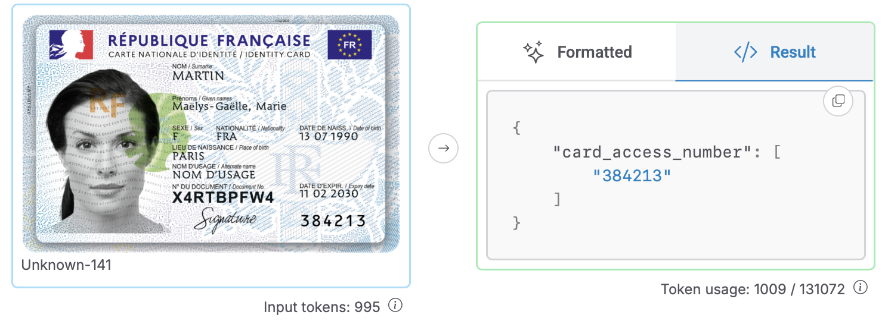

# NuExtract3: The Reasoning Open-Source OCR & Structured Extraction LLM

**Source**: `raw/nuextract-3-release/full-article.html` (SPA shell), `raw/nuextract-3-release/full-article.md`, https://about.nuextract.ai/blog/nuextract-3-release  
**Ingested**: 2026-06-12  
**Tags**: #summary

## Summary

**NuExtract3** (May 2026) is a **4B VLM** ([Qwen3.5-4B](https://huggingface.co/numind/NuExtract3) base, **Apache 2.0**) that **unifies structured extraction (document → JSON)** and **content extraction (document → Markdown / OCR)** in one model — the first combined open release from [[NuMind]] after separate [[NuExtract]] and **NuMarkdown-Thinking-8B** lines (2M+ and 1.5M+ HF downloads respectively). Training: diverse **Fine-PDF** real docs (LLM annotators + judges + filters) plus **synthetic hard layouts**; **SFT** then **RL** for template adherence and **toggleable reasoning** (~**1:1 thinking-to-output token** ratio vs 10× bloat on generalist reasoners). Reasoning traces move general → specific (sections → headers) to disambiguate split tables and overlapping cells.

**Structured extraction**: ~**600** challenging zero-shot extractions / **15** problems; **EXTRA** metric (leaf accuracy). NuExtract3 **beats same-size generalists by >10 points** (e.g. Gemma 4); RL-trained thinking avoids loop failures seen in raw Qwen/GLM/Ministral reasoning.

**Content extraction (OCR)**: Two eval layers — (1) **150-doc LLM judge** (Gemini 3.1 Pro) "OCR battle" on weird tables — wins vs specialists (LightOnOCR 2, Chandra OCR 2) and generalists; (2) **downstream-use benchmark**: Markdown from all 600 benchmark docs → **Qwen3.6 27B** structured extract → **~100k** leaf EXTRA scores. NuExtract3 leads with **~338** avg thinking tokens vs **6,552** (Qwen) / **1,973** (GLM) for competitive generalists — measures **AI-usable** content, not layout cosplay.

**Template upgrades**: **20 field types** (7 from 2.0 + 14 new ISO/RFC types: `date`, `iban`, `phone-number`, `region:XX`, …). **Model instructions** — freeform guidance separate from field names (e.g. French ID card access number disambiguation).

## Key Claims

- **First unified** open model for **JSON structured extraction + Markdown OCR** at 4B.
- **SFT + RL** specialization; **reasoning on/off**; ~equal thinking and output tokens by design.
- Structured EXTRA benchmark: **best in class** among ~4B models; RL fixes reasoning loops.
- OCR evaluated via **downstream structured extraction on Markdown** — styling-bias-resistant.
- **20 typed fields** + **instruction field** for templates; Apache 2.0 on Qwen3.5-4B base.

## Figures

| Figure | Caption | Page |
|--------|---------|------|
|  | Unified JSON + Markdown extraction for automation/agents | — |
|  | Structured extraction task (schema → JSON) | — |
|  | Content extraction / OCR task (document → Markdown) | — |
|  | Challenging split/overlapping table document | — |
|  | Training: dataset → SFT + RL on Qwen3.5-4B | — |
|  | Structured extraction benchmark (similar-size models) | — |
|  | OCR battle win rates vs NuExtract3 (LLM judge) | — |
|  | Downstream OCR benchmark via Markdown → LLM extract | — |
|  | NuExtract 2.0 typed template example | — |
|  | French ID card — instruction-based field extraction | — |

## Entities

- [[NuExtract]] — model family; 3.0 generation.
- [[NuMind]] — developer; prior NuMarkdown-Thinking-8B OCR line.
- [[Structured Extraction]] — JSON template task (extended types + instructions).
- [[Reinforcement Learning Topic]] — RL phase for reasoning and template adherence.
- [[Vision Language Models]] — 4B document VLM.

## Questions & Gaps

- Authors note thinking-token budget may be **too aggressive** — more thinking might help OCR.
- EXTRA benchmark paper in progress at announcement.
- NuExtract4 roadmap teased: confidence scores, bounding boxes, OCR instructions.

## Related

- [[NuExtract 2.0: Outclassing Frontier LLMs in Information Extraction]] — typed templates and VLM extraction predecessor.
- [[NuExtract 1.5 — Multilingual, Infinite context, still small, and better than GPT-4o!]] — text-only lineage.
- [[Papers Explained 287 - NuExtract]] — Medium coverage of 1.0.
- [[Mistral OCR]] / [[Introducing Mistral OCR 3]] — parallel commercial OCR APIs in wiki.
- [[Document AI]] — banks, insurance, healthcare automation context.
