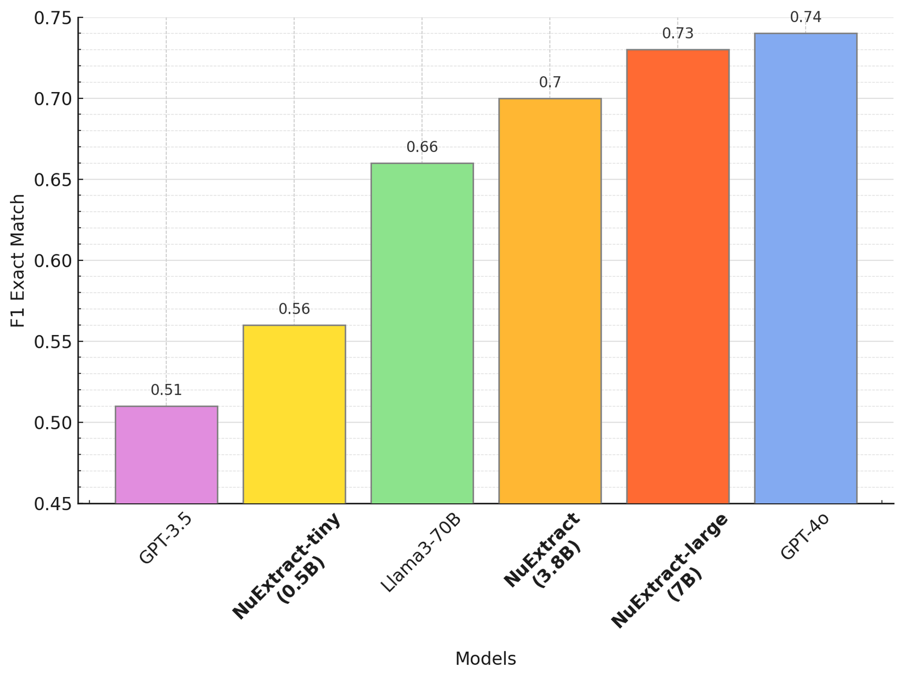
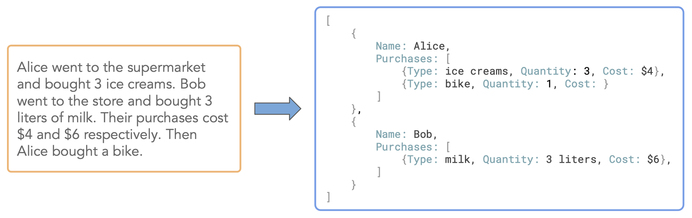
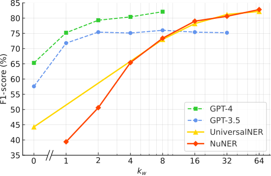
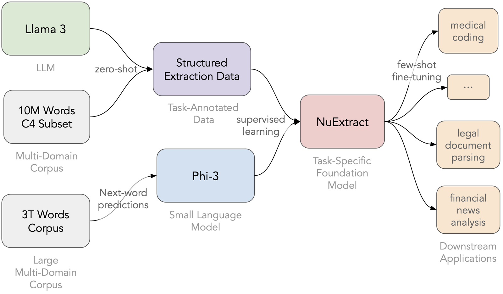
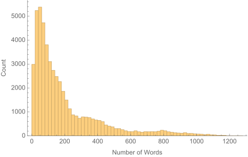
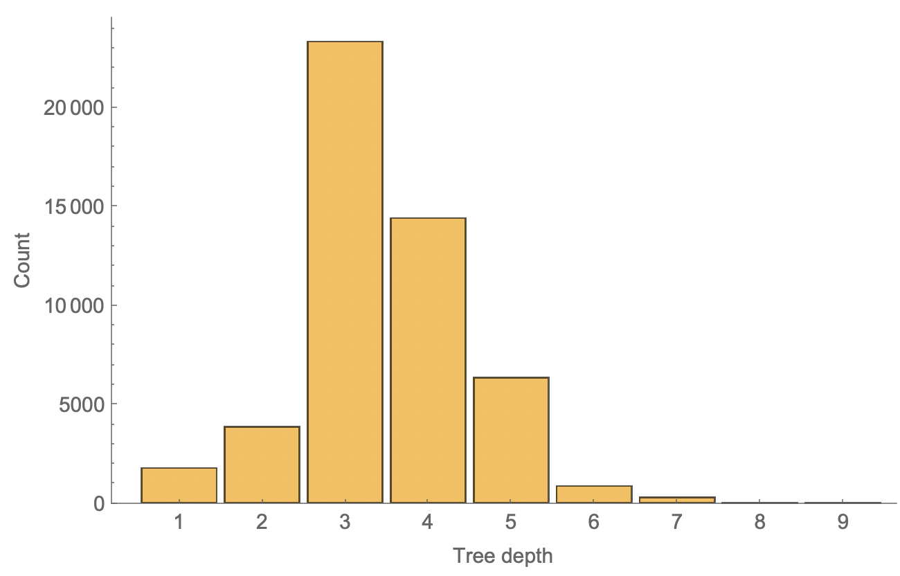
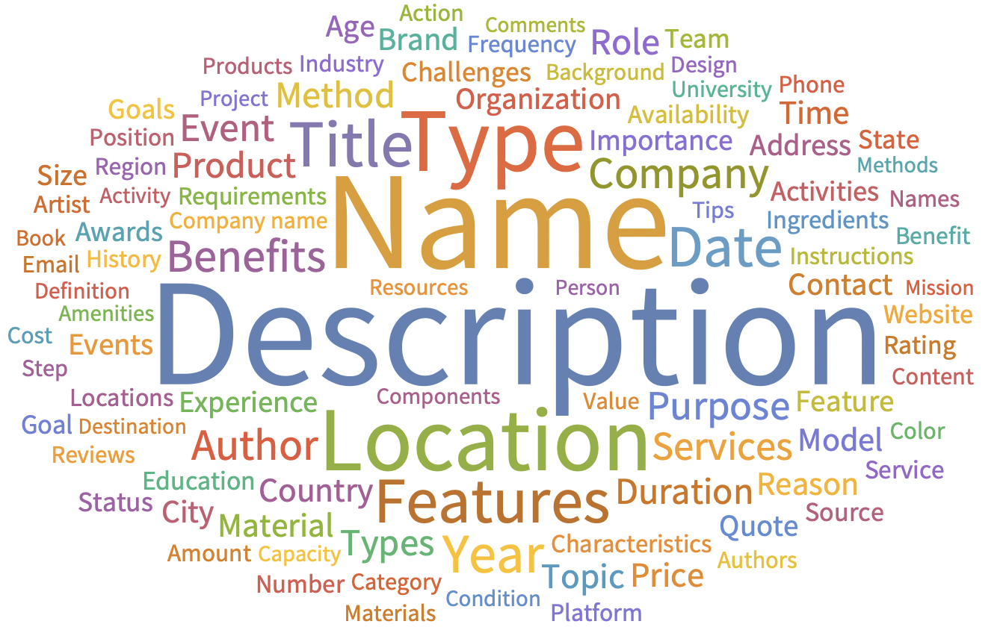

# NuExtract: A Foundation Model for Structured Extraction

**Source**: `raw/nuextract-a-foundation-model-for-structured-extraction/full-article.html` (SPA shell; readable markdown from WebFetch), https://about.nuextract.ai/blog/nuextract-a-foundation-model-for-structured-extraction  
**Ingested**: 2026-06-12  
**Tags**: #summary

## Summary

**NuExtract 1.0** (June 2024) is [[NuMind]]'s family of **text-to-JSON decoder LLMs** (0.5B–7B) specialized for **[[Structured Extraction]]** — filling a hierarchical template/schema from unstructured text. Built via the **[[Task-Specific Foundation Models]]** recipe (C4 corpus → Llama 3 70B synthetic templates + extractions → fine-tune compact base LMs), NuExtract-tiny/ base / large reach **GPT-3.5 / Llama3-70B / GPT-4o**-class zero-shot extraction while being **35–100× smaller**. MIT-licensed weights on Hugging Face. Complements [[Papers Explained 287 - NuExtract]] Medium explainer with the official launch post.

**Structured extraction** generalizes NER/relation extraction: extract entities, quantities, dates, and nested relations into a **tree-shaped JSON template**. Applications span **technical document parsing** (medical, legal, financial — often for RAG) and **real-time chatbot slot filling**. GPT-4 prompting works but **ICL saturates** (per [[Papers Explained 286 - NuNER]]), costs more, and requires sharing data.

**Template format**: empty JSON with array element prototypes and `""` leaf placeholders; strings only (numbers as strings). **Dataset**: 300k C4 snippets → Llama 3 70B proposes per-text templates (few-shot prompted) → second pass extracts (copy-paste enforced); **half** of examples use **truncated text** to teach empty fields (anti-hallucination). After filtering: **50k** examples, depths **3–5**, **200k+** unique field names. Hybrid **0–3 output-only few-shot** examples supported at inference.

**Models**: Qwen1.5-0.5B → **NuExtract-tiny**; Phi-3-mini 3.8B → **NuExtract**; Phi-3-small 7B → **NuExtract-large**. Custom tree-matching benchmark (hand problems like resume parsing). **Fine-tuning** on 50-example chemistry (Iktos): tiny beats GPT-4o; larger models jump further.

## Key Claims

- **NuExtract-tiny (0.5B)** zero-shot **> GPT-3.5** at ≥100× smaller.
- **NuExtract (3.8B)** zero-shot **> Llama3-70B** at 35× smaller.
- **NuExtract-large (7B)** zero-shot **≈ GPT-4o** at ≥100× smaller.
- Fine-tuned tiny **> GPT-4o** on 50-shot chemistry; larger fine-tunes "different level entirely."
- Synthetic data: Llama 3 70B template generation + copy-paste extraction + partial-text negative sampling.

## Figures

| Figure | Caption | Page |
|--------|---------|------|
|  | Zero-shot NuExtract vs frontier LLMs | — |
|  | Structured extraction toy tree (depth 4) | — |
|  | ICL performance saturation vs training size | — |
|  | Creation pipeline: Phi-3 fine-tuned on Llama 3 synthetic data | — |
|  | Example C4 annotation (16 words, depth 5) | — |
|  | Text length distribution in training set | — |
|  | Extraction-tree depth distribution | — |

## Entities

- [[NuMind]] — creator; MIT open release.
- [[NuExtract]] — model family entity (1.0 generation).
- [[Structured Extraction]] — task definition and template paradigm.
- [[Task-Specific Foundation Models]] — C4 + LLM annotate + small LM fine-tune recipe.
- [[Papers Explained 287 - NuExtract]] — independent Medium summary of same launch.

## Questions & Gaps

- Public benchmark "to be released when finalized" at launch time.
- Template format has no inline field descriptions — relies on examples.

## Related

- [[A Foundation Model for Entity Recognition]] — earlier NuMind task-specific foundation model for NER.
- [[NuExtract 1.5 — Multilingual, Infinite context, still small, and better than GPT-4o!]] — direct successor.
- [[Synthetic Data]] — Llama 3 70B annotation pipeline.
- [[Document AI]] — primary application domain.
