# Papers Explained: OLMo 3

**Source**: `raw/olmo-3/full-article.html`  
**Ingested**: 2026-05-12  
**Tags**: #summary

## Summary

OLMo 3 is AllenAI's third generation of fully-open language models at the 7B and 32B parameter scales. "Fully-open" means all data, code, weights, and training details are publicly released. The family spans four distinct model types: OLMo 3 Base (the pretrained foundation), OLMo 3 Think (step-by-step reasoning via SFT + DPO + RLVR), OLMo 3 Instruct (short, direct responses with function-calling), and OLMo 3 RL-Zero (RLVR applied directly from Base, for research). OLMo 3.1 Think 32B is the flagship, with extended RL training for maximum reasoning performance.

The base model is trained across three sequential stages. Stage 1 is pretraining on Dolma 3 Mix — a 6T token corpus built from CommonCrawl, olmOCR science PDFs, Stack-Edu code, arXiv, FineMath, and Wikipedia — assembled using conditional mixing and quality-aware upsampling via the Duplodocus deduplication toolkit and WebOrganizer topic classifier. Stage 2 is midtraining on Dolma 3 Dolmino Mix (100B high-quality tokens), introducing synthetic math rewrites (TinyMATH, CraneMath, MegaMatt), CraneCode, meta-reasoning traces, and Reddit/Wiki QA synthetics. Stage 3 is a new long-context extension (50–100B tokens) using YaRN attention scaling, gzip-compressibility filtering of PDFs, and synthetic aggregation tasks (CWE and REX).

Post-training for the Think models follows a three-stage recipe: supervised finetuning on Dolci Think SFT (diverse reasoning traces from QwQ-32B and DeepSeek R1), preference tuning via Delta Learning (pairing mediocre Qwen3 32B completions with deliberately poor Qwen3 0.6B rejections to extract a contrastive signal past imitation saturation), and reinforcement learning with verifiable rewards (RLVR) using OlmoRL — an improved GRPO variant with zero-gradient filtering, active sampling, token-level loss normalization, no KL loss, and truncated importance sampling.

OLMo 3 Base 32B achieves double-digit improvements over other fully-open 32B models on Math and Code, approaching leading open-weight models. OLMo 3 Think 32B is the best fully-open thinking model at its scale and closes the gap to Qwen 3 despite training on 6× fewer tokens. OLMo 3.1 Instruct 32B scores 57.9 on AIME 2025, 36.6 points higher than Qwen 3 32B (No Thinking).

## Key Claims

- OLMo 3 Base 32B tops all fully-open 32B base models on Math and Code, with double-digit margins.
- OLMo 3 Think 32B outperforms Gemma 2 27B, Gemma 3 27B, and Qwen 2.5 32B-Instruct while using 6× fewer tokens than Qwen 3.
- OLMo 3.1 Instruct 32B scores 57.9 on AIME 2025 — 36.6 points above Qwen 3 32B (No Thinking).
- Sliding Window Attention (SWA) is introduced at 3 out of every 4 layers with a window size of 4096, to scale pretraining to longer sequences; the final layer always uses full attention.
- Gzip compressibility filtering removes the top and bottom 20% of documents in the long-context pool, keeping only documents in a "middle" compressibility band (not too repetitive, not too noisy).
- Delta Learning: contrastive signal for DPO is derived by pairing adequate-but-not-great chosen responses with deliberately low-quality rejected responses, sidestepping imitation saturation.
- OlmoRL improves on GRPO by removing KL loss, adding active sampling to maintain batch size after zero-gradient filtering, using token-level (not sample-level) loss, and clipping the upper ratio bound slightly higher.
- Decontamination using the `decon` package operates at midtraining and long-context extension stages, where memorization is strongest.
- OLMo 3 RL-Zero (RLVR from raw base) enables researchers to study how pretraining data affects RL performance directly.

## Figures

| Figure | Caption |
|--------|---------|
| 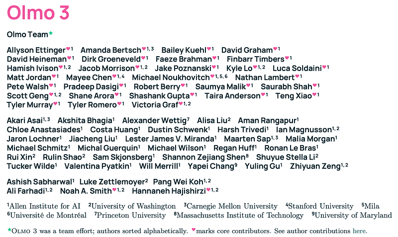 | OLMo 3 title card. |
| 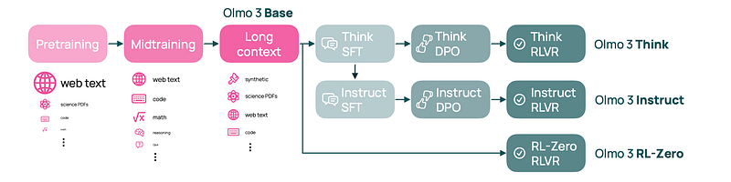 | Depiction of model flow for OLMo 3 (Base → Think / Instruct / RL-Zero). |
| 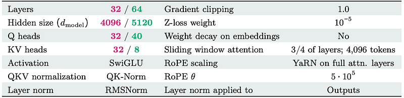 | Model architecture for OLMo 3 7B and 32B. |
| 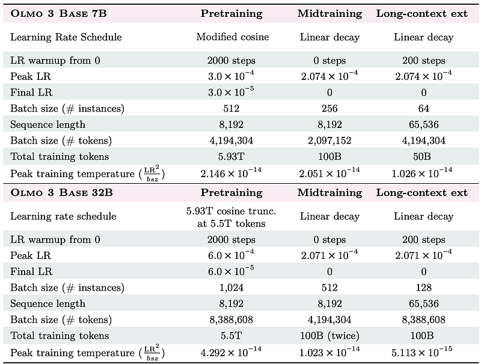 | Training hyperparameters for each stage of OLMo 3 Base. |
| 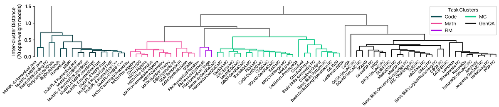 | Task clustering for OlmoBaseEval. |
| 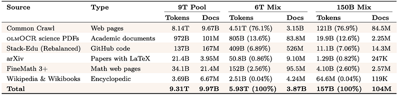 | Composition of Dolma 3 Mix (pretraining). |
| 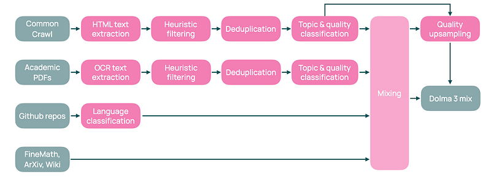 | Data curation flow for pretraining data sources in Dolma 3 Mix. |
| 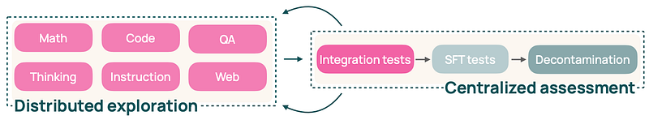 | Flow for midtraining data curation. |
| 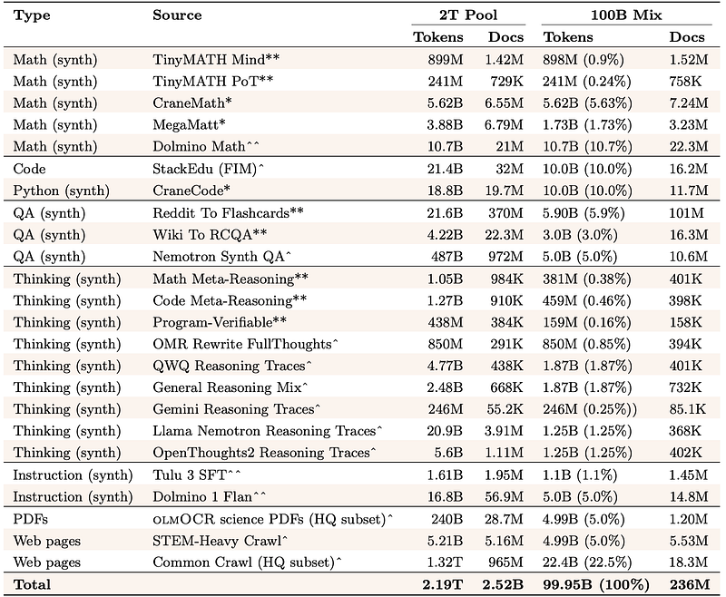 | Composition of the midtraining data (Dolma 3 Dolmino Mix). |
| 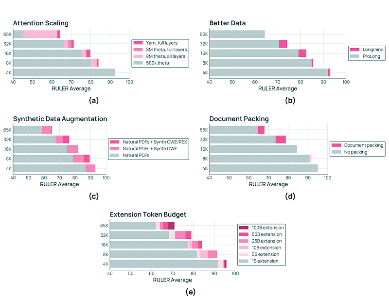 | Five key components of the OLMo 3 long-context extension recipe. |
| 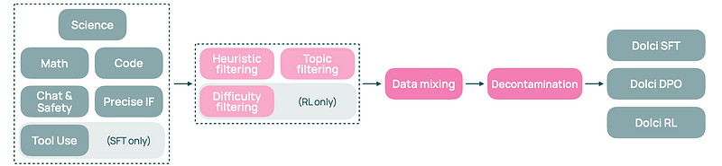 | Data pipeline for all OLMo 3 post-training stages. |
| 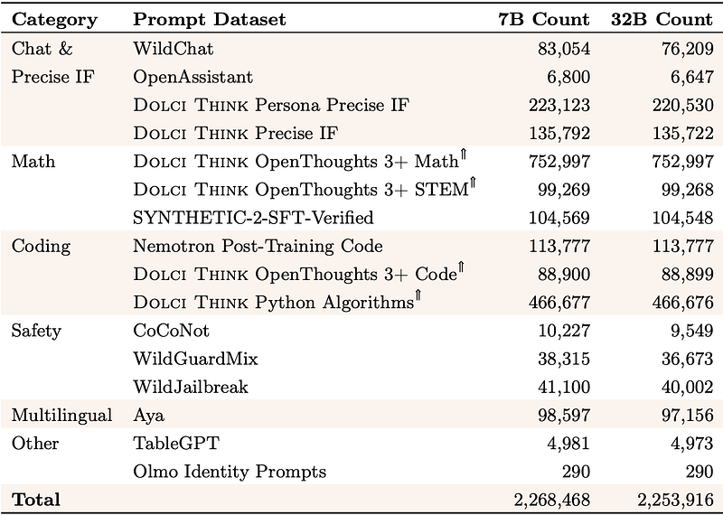 | OLMo 3 Think SFT prompt sources. |
| 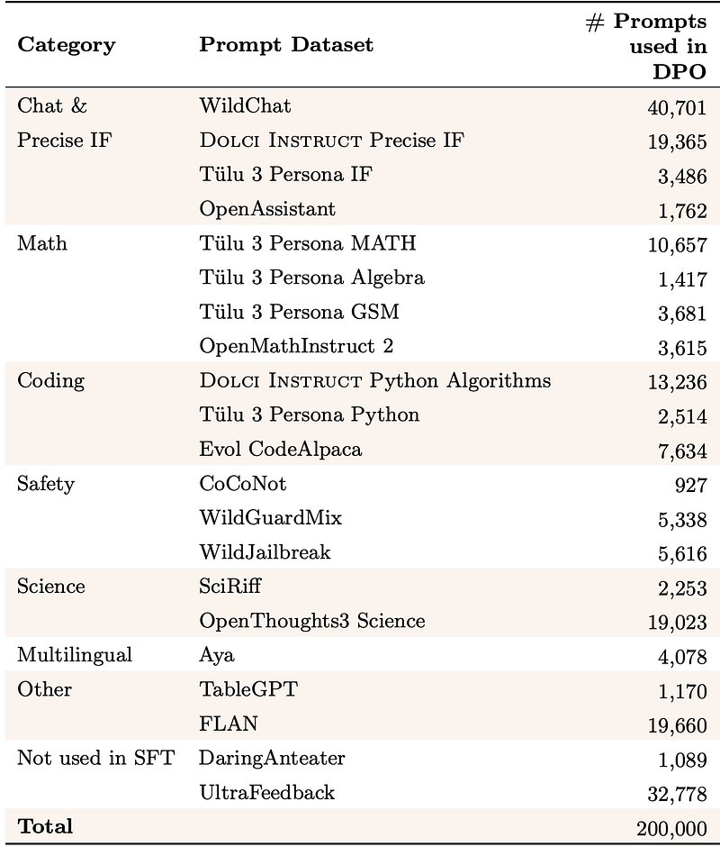 | OLMo 3 Think DPO prompt sources. |
| 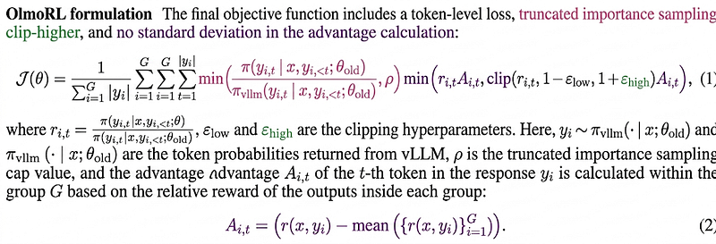 | OlmoRL algorithmic components overview. |
| 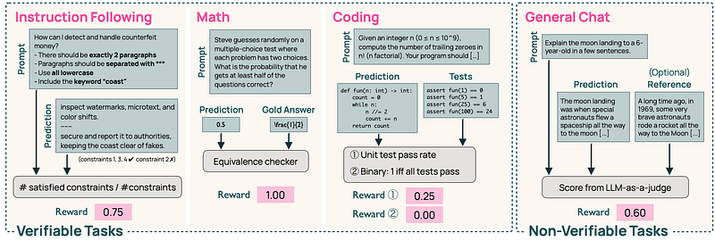 | Verifiers and reward design for OlmoRL. |
| 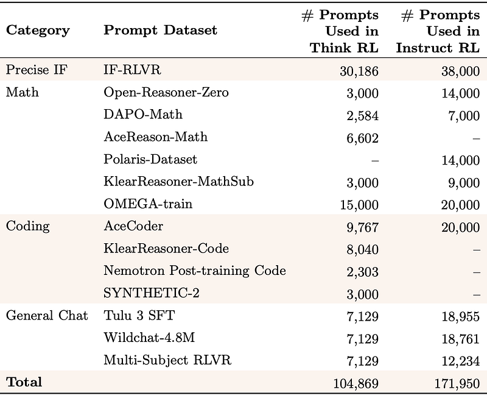 | Breakdown of Dolci-Think-RL datasets used for RL training. |
| 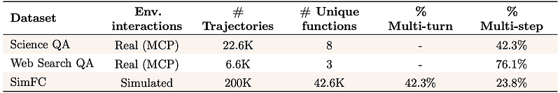 | Details of function calling datasets for OLMo 3 Instruct. |
| 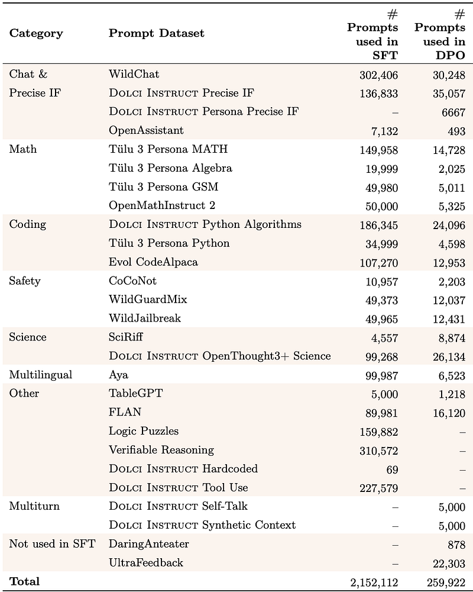 | OLMo 3 Instruct prompt sources for SFT and DPO. |
| 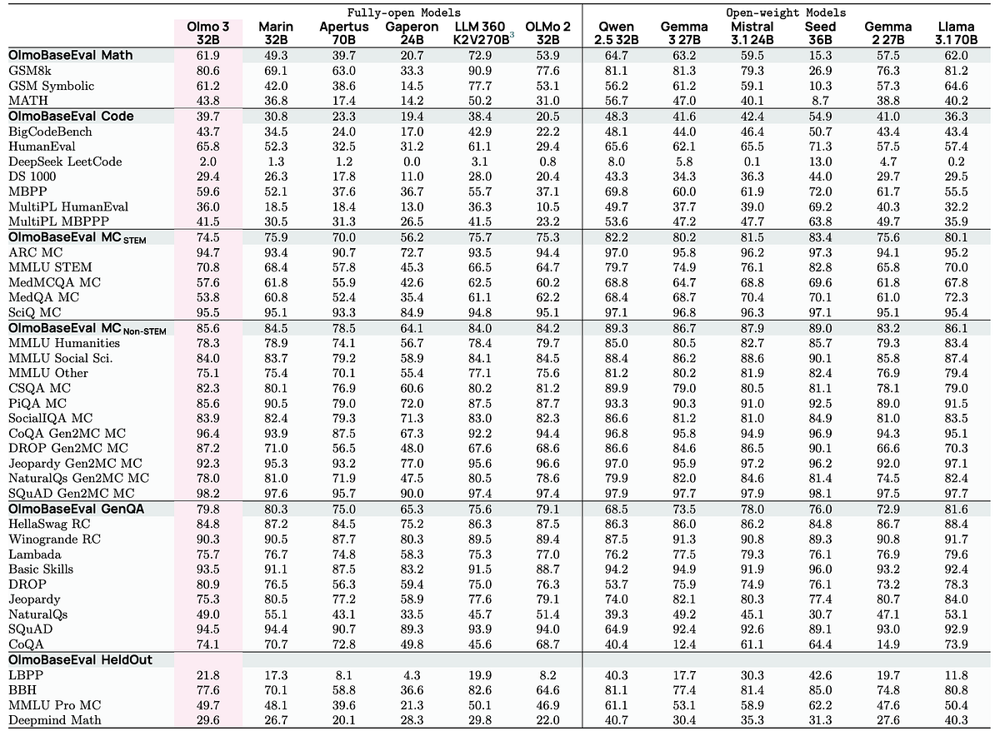 | OLMo 3 Base evaluation results (32B scale). |
| 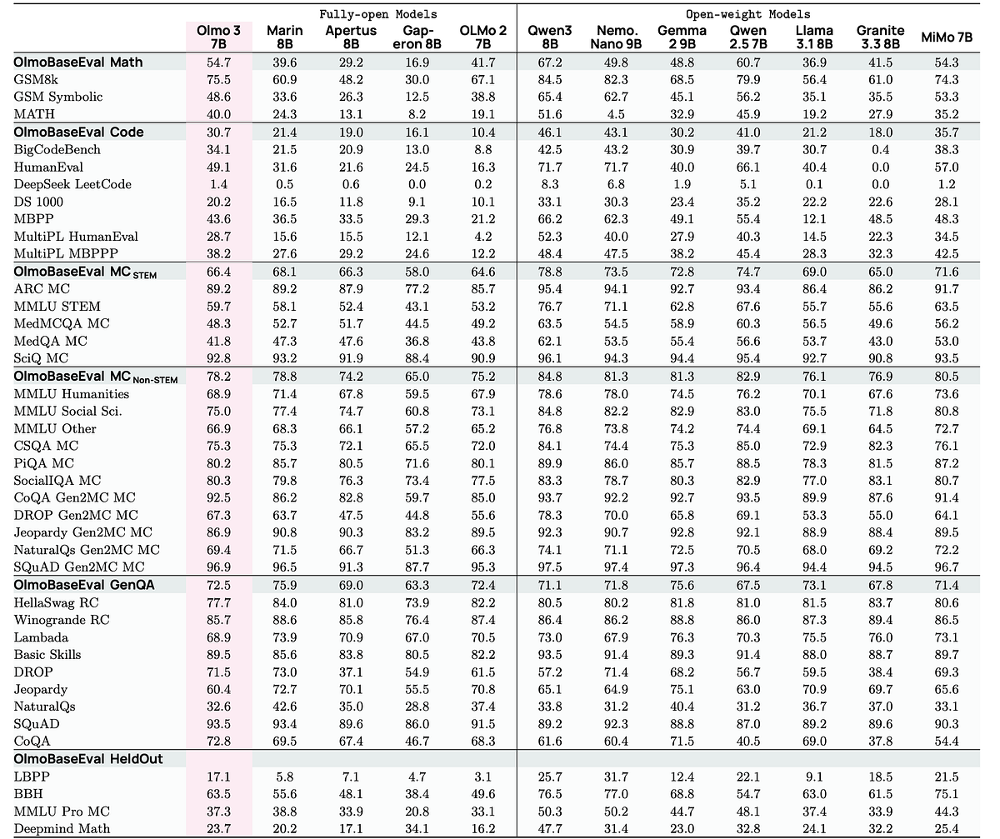 | OLMo 3 Base evaluation results (7B scale). |
| 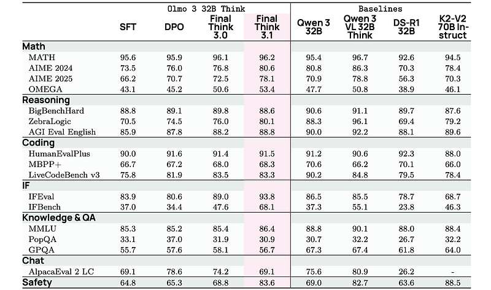 | OLMo 3 Think 32B evaluation results. |
| 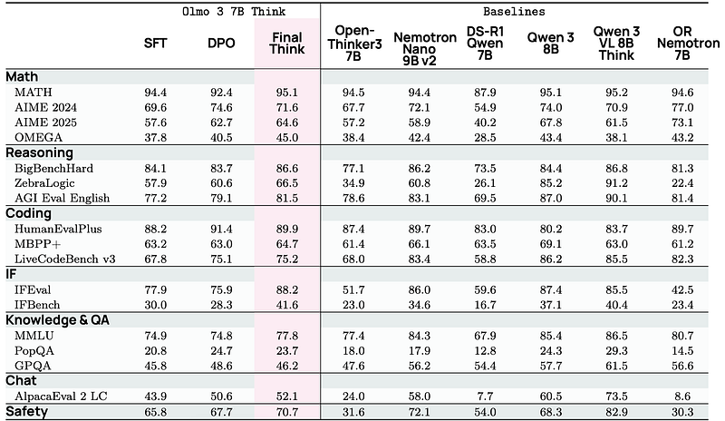 | OLMo 3 Think 7B evaluation results. |
| 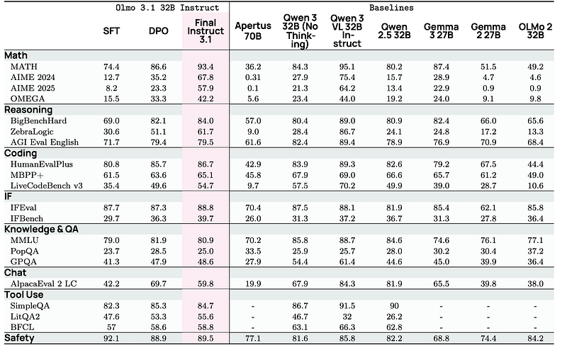 | OLMo 3 Instruct 32B evaluation results. |
| 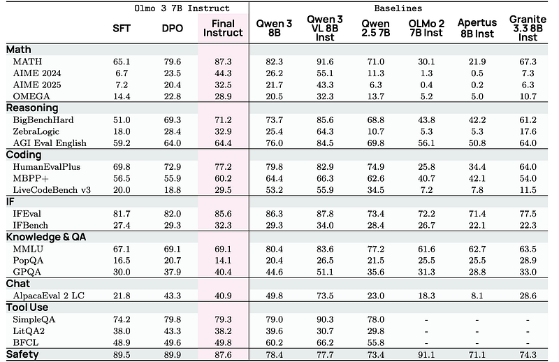 | OLMo 3 Instruct 7B evaluation results. |

## Entities

- [[AllenAI]] — created OLMo 3; committed to the fully-open model philosophy.
- [[Papers Explained 284 - OLMo 2]] — OLMo 3 Base directly extends the OLMo 2 architecture and training recipe; context window grows from 4096 to 8192 tokens; SWA is newly introduced.
- [[Papers Explained 479 - olmOCR]] — olmOCR is used to convert 238M crawled PDFs to linearized text for the Dolma 3 pretraining and long-context pools.
- [[GRPO]] — OlmoRL builds on GRPO with multiple modifications including zero-gradient filtering, no KL loss, and token-level loss normalization.
- [[DAPO]] — Zero-gradient signal filtering in OlmoRL is similar to the approach in DAPO.
- [[Reinforcement Learning Topic]] — OLMo 3 Think and Instruct both use RLVR as their final post-training stage.
- [[Scaling Laws]] — OlmoBaseEval uses proxy metrics and capability emergence signals to guide data mix decisions during pretraining, an operationalization of scaling law reasoning.
- [[Supervised Fine-Tuning]] — Dolci Think SFT and Dolci Instruct SFT form the first post-training stage; traces are sourced from QwQ-32B, DeepSeek R1, and GPT-4.1.

## Questions & Gaps

- How does OLMo 3 compare to Qwen 3 32B on multilingual benchmarks? (Qwen 3's distillation advantage in knowledge tasks is noted but not fully explored.)
- What is the exact token budget for extended RL training in OLMo 3.1 variants?
- The gzip compressibility filter uses 20th–80th percentile thresholds for long-context data — has this threshold been ablated?
- OLMo 3 RL-Zero's exact RL performance vs. OLMo 3 Think is not reported in this article.
- The `decon` decontamination package is described but not publicly detailed; is it released?

## Related

- [[Papers Explained 284 - OLMo 2]] — predecessor model; OLMo 3 extends its architecture with SWA and a new long-context stage.
- [[Papers Explained 479 - olmOCR]] — core data pipeline tool for science PDF ingestion in Dolma 3.
- [[GRPO]] — base RL algorithm that OlmoRL improves upon.
- [[DAPO]] — zero-gradient filtering idea borrowed from DAPO into OlmoRL.
- [[Reinforcement Learning Topic]] — broader context for RLVR and OlmoRL.
- [[Supervised Fine-Tuning]] — Dolci Think SFT and Dolci Instruct SFT pipelines.
- [[Scaling Laws]] — data mixing decisions are guided by scaling law proxy metrics during pretraining.
- [[Papers Explained Corpus]] — part of the Papers Explained series.
- [[Large Language Models]] — OLMo 3 is a flagship open LLM.
