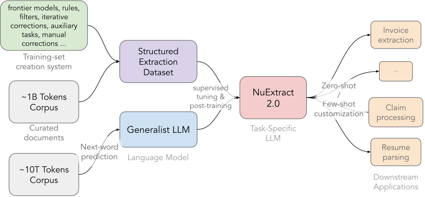
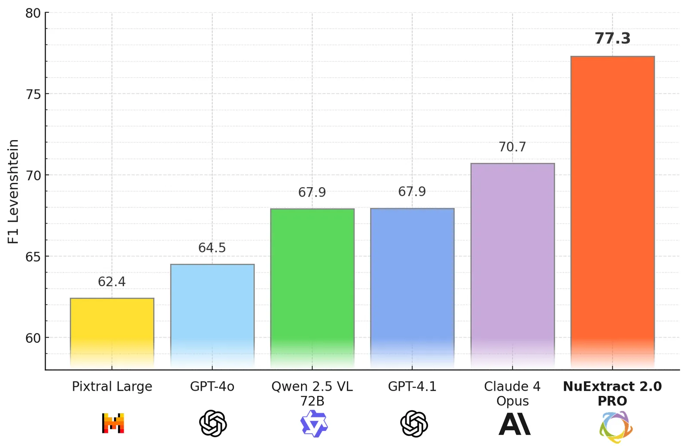
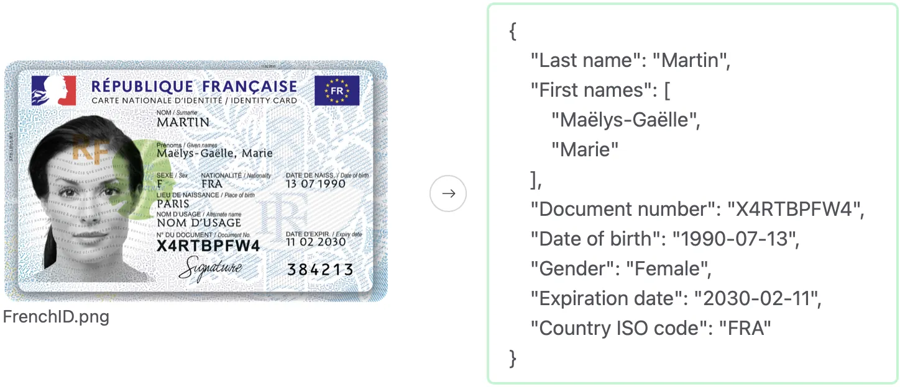
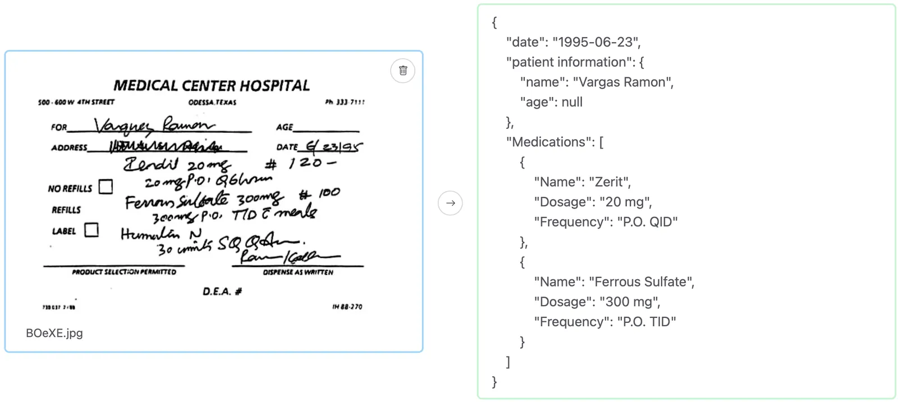
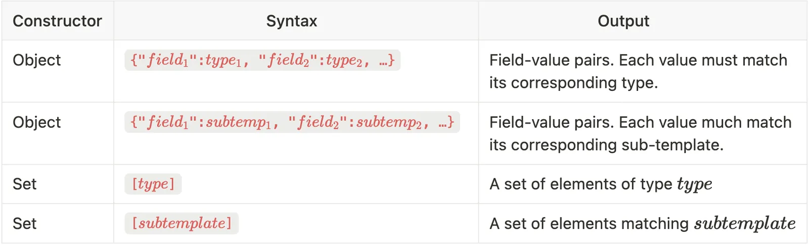
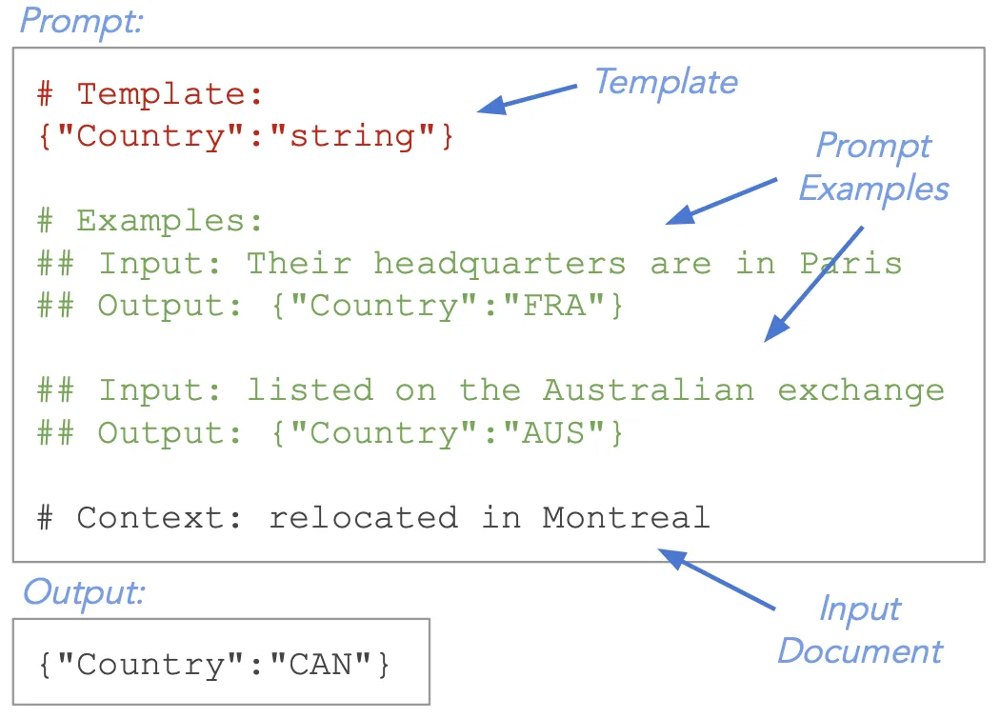
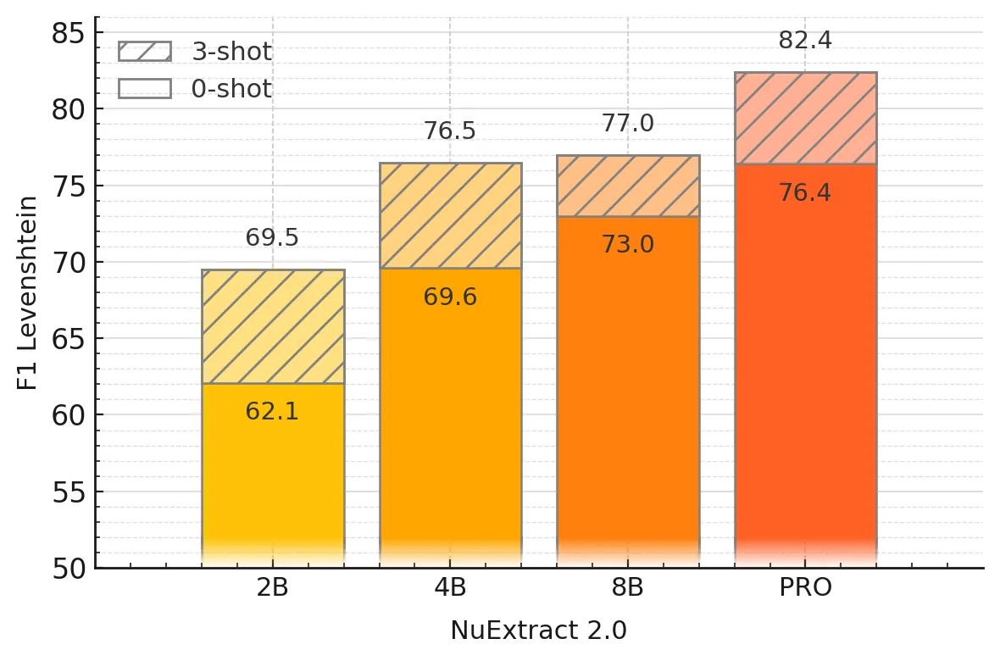
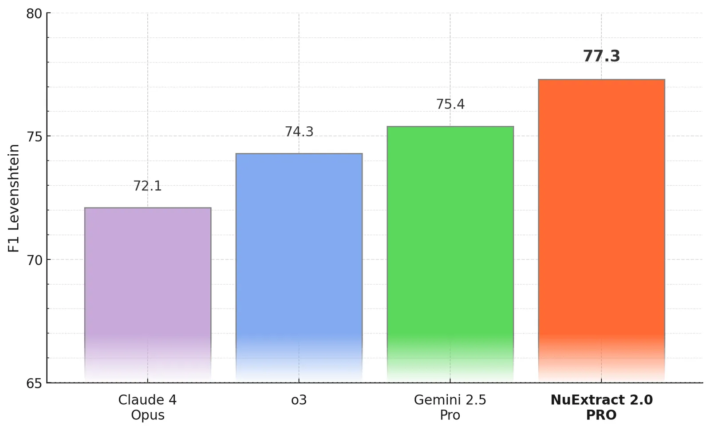
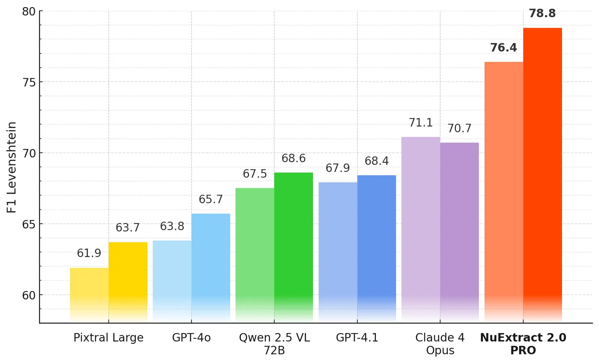

# NuExtract 2.0: Outclassing Frontier LLMs in Information Extraction

**Source**: `raw/outclassing-frontier-llms-nuextract-2-0/full-article.md` (SPA shell; readable markdown from WebFetch), https://about.nuextract.ai/blog/outclassing-frontier-llms-nuextract-2-0  
**Ingested**: 2026-06-12  
**Tags**: #summary

## Summary

**NuExtract 2.0** (July 2025) is [[NuMind]]'s multimodal structured-extraction line adding **vision**, **abstraction beyond copy-paste**, and **in-context learning (ICL)** on top of the text-only 1.x models. Open weights **2B / 4B / 8B** (Qwen VL bases, **32k** context); API **NuExtract 2.0 PRO** beats **GPT-4.1 by +9 F-Score** on NuMind's 1000+ example / 21-problem benchmark (text + images) and leads **Claude 4 Opus** (+5) and **Gemini 2.5 PRO** (+2) among reasoning models at **≥10× lower** extraction cost. Platform: [nuextract.ai](https://nuextract.ai/).

**Vision**: NuExtract 2.0 is a **VLM** (Qwen 2.5 VL / Qwen 2.0 VL) — **28×28** image patches, unified token sequence, **no hard image-size cap**. Extracts from scans, PDFs, receipts, floor plans, multi-page docs, prescriptions (hard cases may need fine-tuning). Multimodal training does **not** hurt text-only performance — only multimodal models ship.

**Abstraction & typed templates**: Beyond 1.x empty-string JSON, fields carry **types**: `"verbatim-string"` (strict copy-paste), `"string"` (free generation), enums, dates, numbers; **`null`** = missing. Enables reformatting, classification, light reasoning, translation while keeping extractive mode available.

**ICL**: Training includes prompt-embedded input/output examples (text + image). **3 examples** → **+6 F-Score** on PRO — lightweight alternative to fine-tuning.

**Performance**: Open **8B** → **73 F-Score** zero-shot (above non-reasoning frontier). PRO tuned for **precision > recall** — taught to emit `null` rather than hallucinate. **Failure modes**: 32k context limit; "laziness" on huge sparse templates; rare looping on low-res non-Latin images; rare invalid JSON off-platform (`jsonrepair` suggested).

## Key Claims

- **NuExtract 2.0 PRO**: **+9 F-Score** vs GPT-4.1; **+3** vs o3; **+5** vs reasoning Claude 4 Opus on extraction benchmark.
- Open **8B** VLM: **73 F-Score** zero-shot; specialized fine-tune from generic VL base yields large gains.
- **Vision + abstraction + ICL** address 1.x limits (text-only, copy-paste only, template-only customization).
- Typed template format with `verbatim-string` vs `string` splits extractive vs generative fields.
- **32k** tokens (~60 text pages / ~20 image pages) — main remaining scale limitation.

## Figures

| Figure | Caption | Page |
|--------|---------|------|
|  | NuExtract 2.0 creation / training procedure | — |
|  | PRO zero-shot vs frontier LLMs (+9 over GPT-4.1) | — |
|  | Scanned ID card structured extraction | — |
|  | Typed template field specifications | — |
|  | Example NuExtract 2.0 template + output | — |
|  | ICL training example format | — |
|  | ICL gains on benchmark (+6 F-Score at 3 examples) | — |
|  | PRO vs reasoning frontier models | — |
|  | Precision vs recall (precision-favored design) | — |

## Entities

- [[NuExtract]] — model family; 2.0 generation (open + PRO).
- [[NuMind]] — developer; nuextract.ai platform.
- [[Vision Language Models]] — Qwen VL bases for document images.
- [[Structured Extraction]] — core task; typed JSON templates.

## Questions & Gaps

- Roadmap items at launch: uncertainty estimates, longer context, reasoning — partially addressed by [[NuExtract3: The Reasoning Open-Source OCR & Structured Extraction LLM]].
- 4B variant uses **research license** (not MIT like 2B/8B).

## Related

- [[NuExtract 1.5 — Multilingual, Infinite context, still small, and better than GPT-4o!]] — prior text-only generation.
- [[NuExtract3: The Reasoning Open-Source OCR & Structured Extraction LLM]] — unified OCR + JSON + RL reasoning successor.
- [[Mistral OCR]] — alternative document-to-markdown API in wiki.
- [[Document AI]] — application area.
