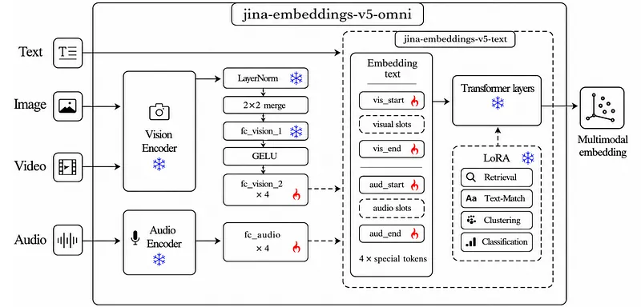
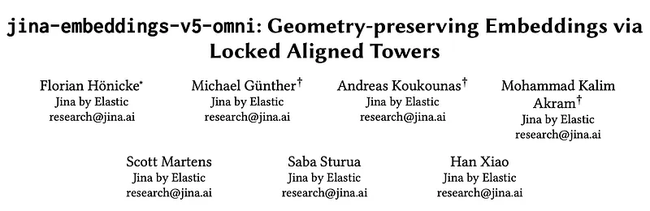
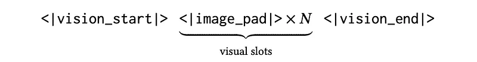
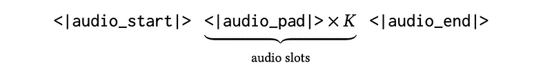
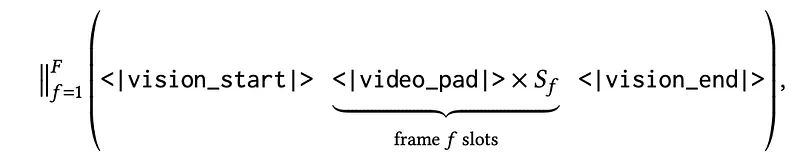
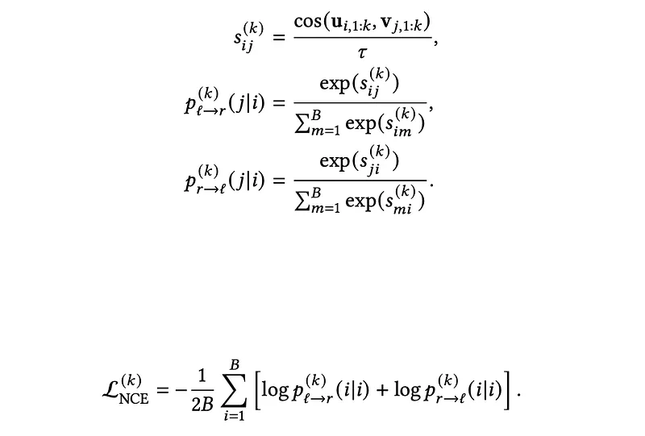
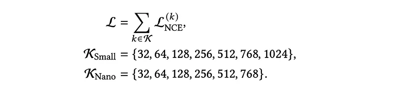
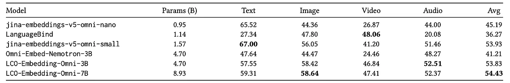
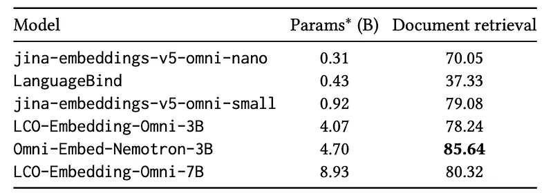
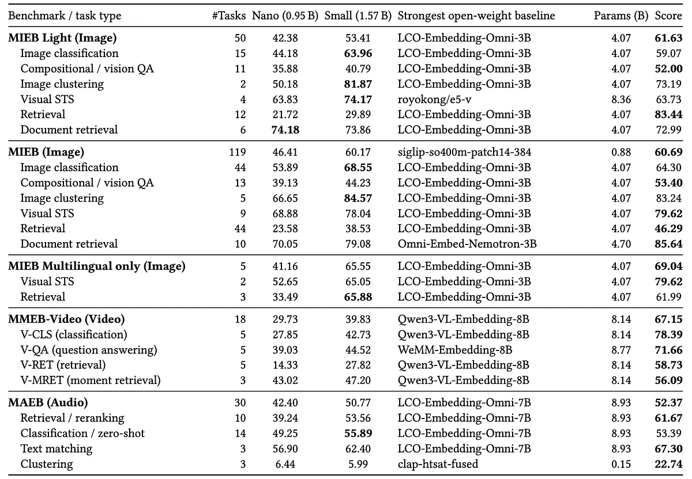

# Papers Explained 574: Jina Embeddings v5 Omni

**Source**: `raw/2026-06-04_Papers-Explained-574--Jina-Embeddings-v5-Omni-1a08a156e52e.md`  
**Paper**: https://arxiv.org/abs/2605.08384  
**Ingested**: 2026-06-13  
**Tags**: #summary

## Summary

**GELATO** (Geometry-preserving Embeddings via Locked Aligned TOwers) extends **Jina Embeddings v5 Text** into **jina-embeddings-v5-omni**, encoding text, image, audio, and video in one semantic space. Frozen scale-matched **Qwen3.5** vision encoders and **Qwen2.5-Omni** audio encoders attach to the same text backbone; only **fc_vision_2**, **fc_audio**, and modality delimiter embeddings train per task (retrieval, text-matching, clustering, classification).

The text path is unchanged from v5 Text: token embeddings → frozen transformer → inherited task LoRA → last-token pooling → L2 norm. Vision uses LayerNorm, 2×2 spatial merge (pixel-unshuffle), and two FC layers; audio maps 1280-d encoder output into 1024-d (small) or 768-d (nano) text space. Mixed-modality inputs concatenate text spans and modality segments in document order; videos can prepend an audio track before per-frame visual segments.

Training uses bidirectional in-batch **InfoNCE** with **Matryoshka** prefix losses (τ = 0.02). On open-weight omni models under 5B, **jina-embeddings-v5-omni-small** leads overall four-modality score (**53.93**), best text-only performance, and strong image/audio—though **video** lags baselines. **ViDoRe** document retrieval: small **79.08**, nano **70.05** (beats LanguageBind at its size).

## Key Claims

- Locked aligned towers preserve text embedding geometry while adding vision/audio/video.
- Perceptual-only encoders (SigLIP2, Whisper-large) are avoided in favor of language-aligned multimodal encoders.
- Only projectors + delimiters train; backbone, encoders, and inherited LoRA stay frozen.
- Small model is strongest sub-5B omni embedder on combined MIEB / MMEB-Video / MAEB / MMTEB-style subsets.
- Video retrieval is the main weakness vs larger omni baselines.

## Figures

| Figure | Caption | Page |
|--------|---------|------|
|  | Title card: Jina Embeddings v5 Omni. | Header |
|  | Architecture of jina-embeddings-v5-omni. | Architecture |
|  | Image input sequence construction. | Input sequence |
|  | Audio input sequence construction. | Input sequence |
|  | Video frame concatenation. | Input sequence |
|  | Video with audio track prefix. | Input sequence |
|  | InfoNCE + Matryoshka training objective. | Training |
|  | Matryoshka loss sum over prefix dimensions. | Training |
|  | Open-weight omni model scores on selected subsets. | Evaluation |
|  | ViDoRe document-retrieval scores. | Evaluation |
|  | Main benchmark results table. | Evaluation |

## Entities

- [[Jina AI]] — authors of GELATO and the v5 Omni embedding family.
- [[Embedding and Retrieval]] — primary application domain for unified multimodal search.

## Questions & Gaps

- Why video underperforms despite strong document-image retrieval—frame sampling vs temporal modeling?
- Comparison to closed Gemini Embedding 2 on identical benchmark splits not in this explainer.

## Related

- [[Embedding and Retrieval]]
- [[Vision Language Models]]
- [[Multilingual Models]]
- [[Papers Explained 575: Gemini Embedding 2]] — competing native multimodal embedding approach.
