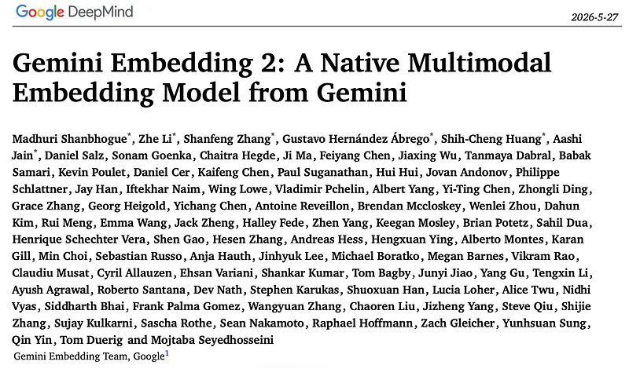
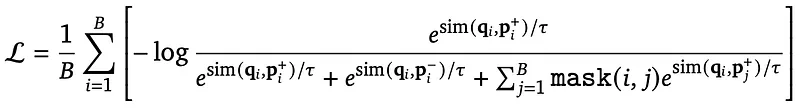
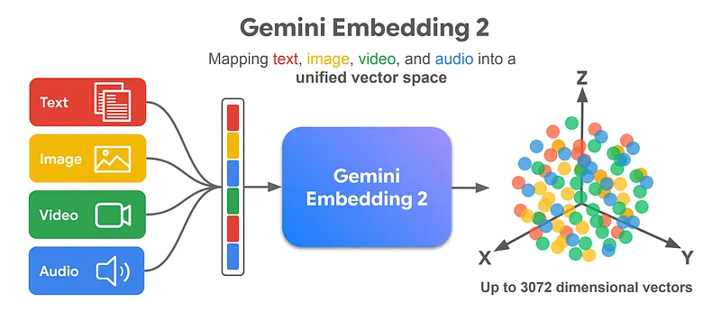
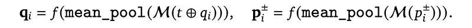
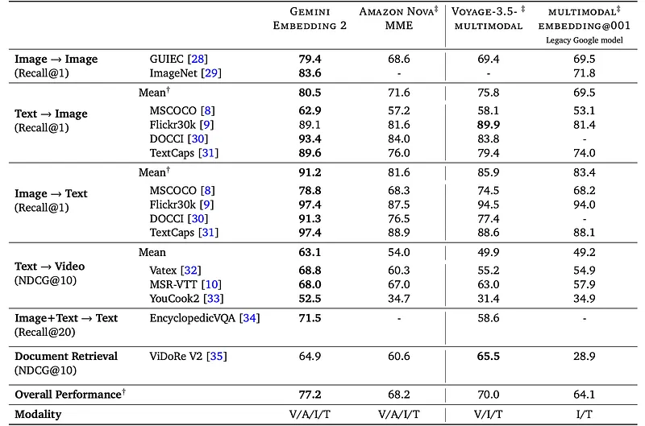
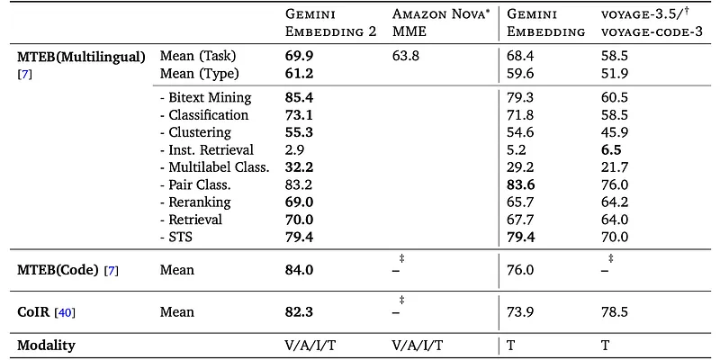
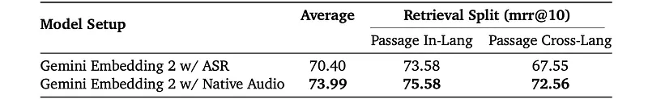

# Papers Explained 575: Gemini Embedding 2

**Source**: `raw/2026-06-05_Papers-Explained-575--Gemini-Embedding-2-a9e9ed849227.md`  
**Ingested**: 2026-06-13  
**Tags**: #summary

## Summary

**Gemini Embedding 2** is Google's **native multimodal embedding** model: video, audio, image, and text (including interleaved sequences) map into one representation space initialized from **Gemini** and fine-tuned with modality-specific and cross-modality tasks. A bidirectional-attention transformer **M** produces token embeddings; a pooler **P** and linear projection **f** yield **d = 3,072**-dimensional vectors with **MRL** support at 768 and 1,536 dims.

Training uses **NCE** with in-batch negatives; task strings (e.g. "question answering") are randomly dropped for robustness. A masking term down-weights over-represented classification labels. Recipe: **pre-fine-tuning** on noisy multi-task image/text/code pairs at large batch size → **fine-tuning** on text/code/document/image/audio/video with per-task batch tuning → **model soup** averaging specialized checkpoints.

Leads global means on unimodal image, text-to-image, image-to-text, and text-to-video retrieval; strong on long-caption sets (DOCCI, TextCaps). **ViDoRe V2**: 64.9 vs Nova MME 60.6. On **MTEB / multilingual MTEB / code / CoIR**, beats other multimodal embedders on text-only tasks (69.9 vs prior Gemini Embedding 68.32) and sets SOTA on code retrieval. **Native audio** (no ASR) beats transcription pipeline: MSEB passage retrieval mrr@10 **73.99** vs **70.40** ASR-cascade.

## Key Claims

- Multimodal fine-tuning does not sacrifice text-only embedding quality vs text-only Gemini Embedding.
- Interleaved multimodal inputs embed in a single pooled vector via shared Gemini backbone.
- Direct audio encoding improves intra- and cross-lingual retrieval vs ASR-first pipelines.
- Model soup generalizes across modality-specialized fine-tunes.

## Figures

| Figure | Caption | Page |
|--------|---------|------|
|  | Conceptual workflow: tokenize → M → P → f. | Architecture |
|  | NCE loss setup with query, positive, optional hard negative. | Training |
|  | Batch NCE loss formula. | Training |
|  | Retrieval benchmark comparison. | Evaluation |
|  | MTEB / multilingual / code / CoIR comparison. | Evaluation |
|  | Label masking term for classification tasks. | Training |
|  | Similarity denominator with masking. | Training |
|  | MSEB passage retrieval (native audio vs ASR). | Evaluation |

## Entities

- [[DeepMind]] — Gemini family and embedding research.
- [[Embedding and Retrieval]] — unified multimodal search use case.

## Questions & Gaps

- Closed API model; no open weights in this explainer.
- Full training data mixture and compute not detailed in Medium summary.

## Related

- [[Embedding and Retrieval]]
- [[Vision Language Models]]
- [[Audio Models]]
- [[Papers Explained 574: Jina Embeddings v5 Omni]] — open-weight omni embedding alternative.
