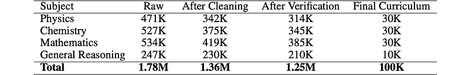
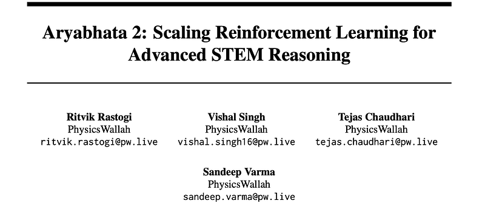
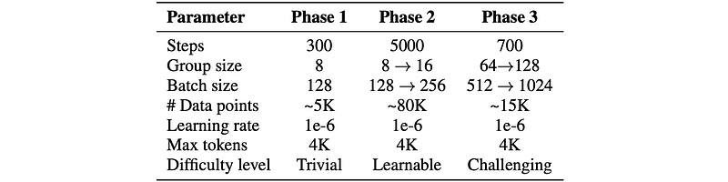
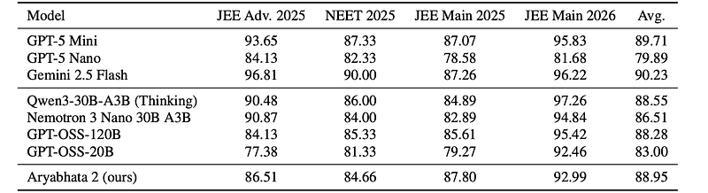
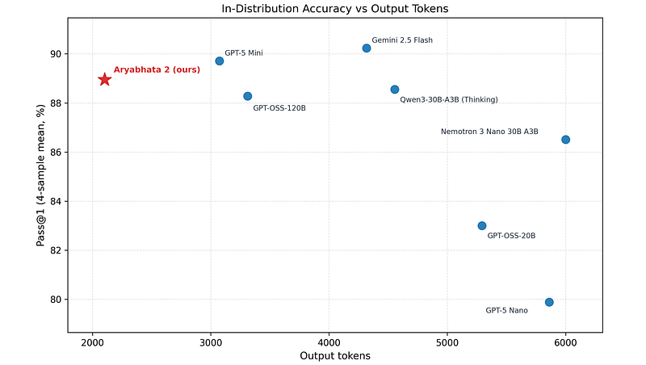
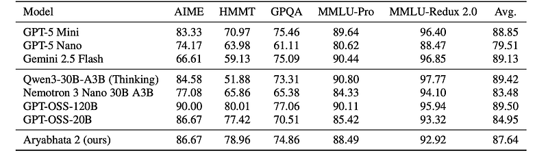
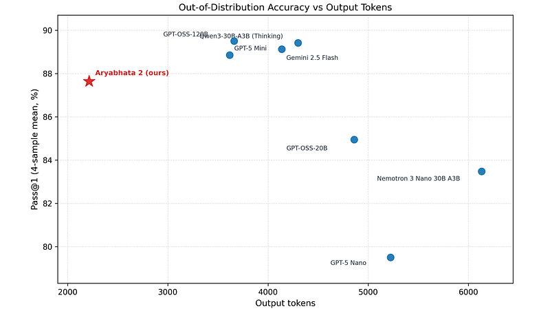

# Papers Explained 576: Aryabhata 2

**Source**: `raw/draft_Papers-Explained-576--Aryabhata-2-9d3d23738731.html`  
**Paper**: https://arxiv.org/abs/2605.28829  
**Ingested**: 2026-06-13  
**Tags**: #summary

## Summary

**Aryabhata 2** is a **20B** open model from [[PhysicsWallah]] post-trained from **GPT-OSS-20B** with [[GRPO]]-style RL on **1.25M** verified STEM questions (Physics, Chemistry, Math, Reasoning) aligned to Indian competitive exams (**JEE**, **NEET**). Data starts at 1.78M internal items; cleaning removes HTML/LaTeX failures, ill-posed items, and non-STEM content (~24% dropped). Answer keys are verified via GPT-OSS-120B CoT + Qwen3-30B-A3B-Thinking judge with 1/4/16-sample escalation.

Curriculum buckets: **trivial** (4/4 solves), **learnable** (1–3/4), **challenging** (0/4); trivial items mostly omitted except early format alignment; chemistry upsampled. RL modifies standard [[GRPO]]: no KL/ref model, **DAPO**-style clipped asymmetric ratio, mean-only advantage (no variance norm), truncation masking, multiplicative reward **R = R_accuracy × R_format** (string/numeric/symbolic/MCQ partial credit + length/ratio format shaping).

Three phases: format alignment (300 steps, G=8) → prolonged RL (5k steps, G=8→16, adaptive difficulty) → broadened RL (700 steps, G=64→128). **In-distribution Pass@1**: **88.95%** (beats GPT-OSS-120B 88.28, Qwen3-30B-A3B 88.55) with best token efficiency among open models. **OOD**: **87.64%** (below largest baselines but +27.08 HMMT vs Qwen3-30B-A3B).

## Key Claims

- Rigorous answer-key verification is critical before RL on large STEM corpora.
- Multiplicative accuracy×format rewards shape concise, well-structured solutions.
- 20B specialist beats 120B generalist on in-distribution JEE/NEET-style eval.
- Strong Olympiad OOD gains suggest curriculum + RL transfers beyond training distribution.

## Figures

| Figure | Caption | Page |
|--------|---------|------|
|  | Title card: Aryabhata 2. | Header |
|  | Dataset distribution across preprocessing stages. | Data |
|  | Format reward length component. | RL reward |
|  | Format reward formula. | RL reward |
|  | S_len and S_ratio definitions. | RL reward |
|  | RL hyperparameters across three phases. | Training |
|  | In-distribution Pass@1 overall accuracy. | Evaluation |
|  | In-distribution accuracy–token trade-off. | Evaluation |
|  | Out-of-distribution Pass@1 accuracy. | Evaluation |
|  | OOD accuracy–token trade-off. | Evaluation |

## Entities

- [[PhysicsWallah]] — developer; internal JEE/NEET question banks.
- [[GRPO]] — base RL algorithm with DAPO-style modifications.
- [[Reasoning Models]] — STEM competitive-exam reasoning specialization.

## Questions & Gaps

- Text-only; HTML-tagged visual questions excluded.
- General chat / safety capabilities not covered.

## Related

- [[Reinforcement Learning Topic]]
- [[Reasoning Models]]
- [[Large Language Models]]
- [[DAPO]]
