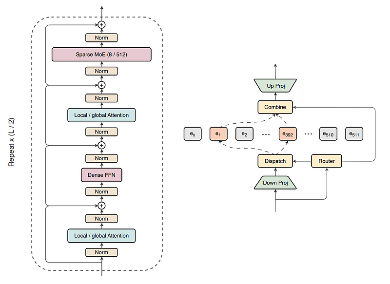
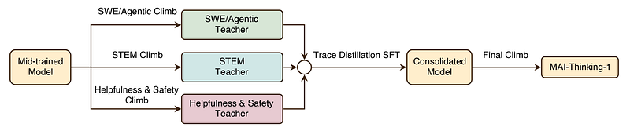
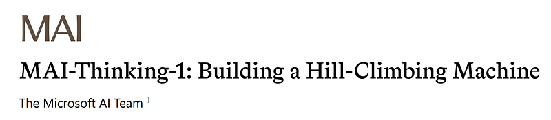
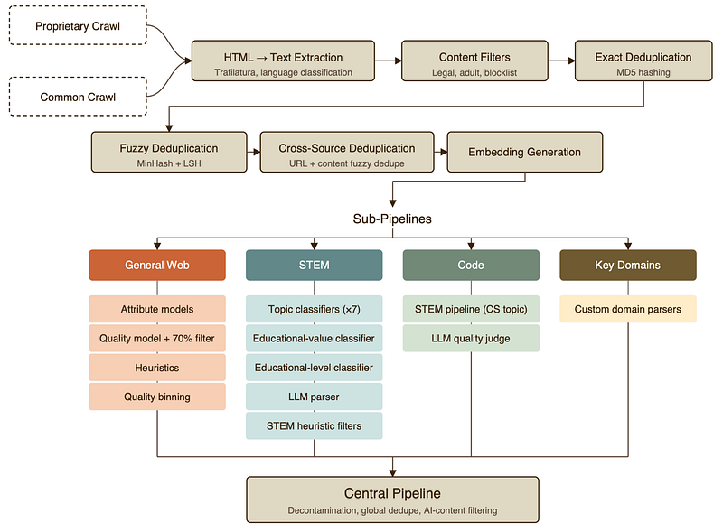
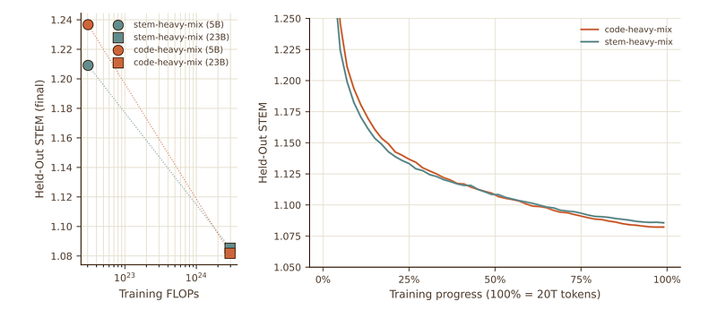
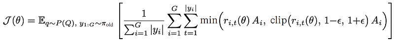

# Papers Explained 577: MAI-Thinking-1

**Source**: `raw/draft_Papers-Explained-577--MAI-Thinking-1-e5afeca9bbfc.html`  
**Paper**: https://microsoft.ai/wp-content/uploads/2026/06/main_20260602_2.pdf  
**Ingested**: 2026-06-13  
**Tags**: #summary

## Summary

**MAI-Thinking-1** is [[Microsoft]] AI's **35B active / 1T total** reasoning model trained **from scratch** on **30T** tokens of non-synthetic human data—no distillation from third-party models. Design principles: capabilities must be learned (not inherited), simplicity is sustainable, scientific rigor avoids shortcuts.

**MAI-Base-1** is decoder-only: RMSNorm, tied embeddings, **periodic attention** (5 local + 1 global layers, GQA 8 KV heads), alternating **dense FFN** and **LatentMoE** (NVIDIA-style shared down-projection, 8-of-512 experts). **o200k_base** tokenizer. Pre-training mixes web, code (16.4T tokens), math (300B), books, papers—heavy dedup (exact, MinHash 0.8, template skeletonization, semantic clusters via Qwen3-Embedding-0.6B). **No synthetic LM-generated pre-training data**; AI-generated web content filtered.

**RL "climbs"** start from a checkpoint with no prior reasoning traces. Three specialist climbs—**STEM/competitive code**, **agentic coding + tool use**, **helpfulness/safety**—merge via self-distillation SFT then a final lightweight RL climb. [[GRPO]] with **adaptive entropy control** (dynamic upper clip) and **outer ratio clip** against gradient spikes. Rewards combine task, language-consistency, and length penalties tied to per-problem pass rate.

**STEM climb**: 5M+ verifiable (q,a) pairs from textbooks, PDFs, forums, competitions; hierarchical OCR + LLM span extraction + difficulty scoring. **Agentic climb**: SWE environments from 102M GitHub PRs → 265k validated Docker envs; synthetic tool-use envs (130k tasks, 150+ backends). **Safety climb**: reward model on human prefs, rubric AI judges, verifiable IF/safety/honesty/style rewards with lexicographic / gated aggregation.

**Self-distillation** (~1M traces) resumes climbs after crashes or base-model updates. Eval: competitive with Sonnet 4.6 on broad benchmarks; beats Sonnet 4.6 on AIME 2025; near Opus 4.6 on SWE-Bench Pro.

## Key Claims

- 30T-token from-scratch pre-train without open-model distillation or synthetic pre-training mix.
- LatentMoE + periodic local/global attention at trillion-parameter scale.
- Domain specialist RL climbs + self-distillation consolidate STEM, agentic, and alignment behaviors.
- Adaptive entropy + outer clip stabilize long GRPO runs from zero reasoning prior.
- Agentic training transfers to Terminal-Bench without environment-specific overfitting.

## Figures

| Figure | Caption | Page |
|--------|---------|------|
|  | Title banner: MAI-Thinking-1. | Header |
|  | MAI-Base-1 architecture overview. | Pre-training |
|  | HTML pre-training data pipeline. | Data |
|  | Knowledge cut-off dates by source. | Data |
|  | Data mixture rank non-invariance. | Data mix |
|  | Overview of RL climbs. | Post-training |
|  | GRPO objective. | RL recipe |
|  | Importance-sampling ratio. | RL recipe |
|  | STEM Mix dataset distribution. | STEM data |
|  | STEM (q,a) extraction pipeline. | STEM data |
|  | Agentic multi-step RL loop. | Agentic climb |
|  | Harmful/borderline prompt sources. | Safety |
|  | Style guide behavior examples. | Safety |
|  | STEM + agentic benchmark results. | Evaluation |
|  | General public benchmark results. | Evaluation |

## Entities

- [[Microsoft]] — builder of MAI-Base-1 and MAI-Thinking-1.
- [[Mixture of Experts]] — LatentMoE routing at 1T scale.
- [[GRPO]] — core RL objective with stability patches.
- [[Agentic AI]] — SWE and tool-use climbs.

## Questions & Gaps

- Does not lead every public benchmark vs largest closed models.
- Full open-weight release status not covered in Medium explainer.

## Related

- [[Reasoning Models]]
- [[Reinforcement Learning Topic]]
- [[Mixture of Experts]]
- [[Agentic AI]]
- [[On-Policy Distillation]] — self-distillation for climb recovery.
