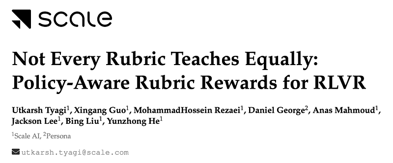
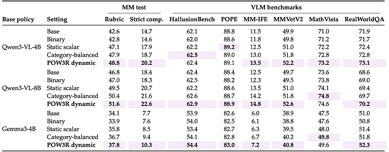
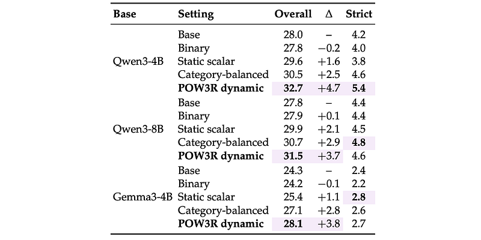

# Papers Explained 579: Policy-Aware Rubric Reward (POW3R)

**Source**: `raw/draft_Papers-Explained-579--Policy-Aware-Rubric-Reward--POW3R--6fa98f57e4f9.html`  
**Paper**: https://arxiv.org/abs/2605.20164  
**Ingested**: 2026-06-13  
**Tags**: #summary

## Summary

**POW3R** (Policy-Aware Rubric Reward) fixes a failure mode of static rubric RL: human importance weights **w_j** do not correlate with which criteria currently discriminate rollouts, so training pressure wastes on saturated or unreachable rubric items. POW3R keeps the rubric, judge scores, and human weights—but **dynamically reallocates** emphasis toward high-variance criteria each epoch.

**Category-normalized baseline** ensures equal mass per rubric category regardless of criterion count. **Policy-aware factors α_j^(t)** start at 1; after each epoch, per-criterion pass rates and variances across G rollouts update α via category-normalized variance ratios, blended with prior (λ), EMA-smoothed (β_ema), and clipped to [α_min, α_max]. Effective weight: **w̃_j = w_j α_j**.

Trained on **HealthBench** (English hard split) and a **10k multimodal** rubric dataset (MM) with GPT-5.4-nano judges; held-out eval rescored by GPT-5.4-mini. Models: Qwen3-VL-4B/8B, Gemma 3 4B-IT, Qwen3-4B/8B text.

**POW3R** wins **24/30** base-policy×metric comparisons; Pareto-dominates static rubric rewards on mean quality vs strict all-criteria satisfaction. Smallest gain still **+3.7 pp**; consistent across MM and HB. Per-category validation curves show largest lifts on contrastive categories (visual perception/reasoning, truthfulness, instruction following).

## Key Claims

- Static rubric weights misallocate RL signal when many criteria are already satisfied or impossible.
- Variance-based α_j preserves human priors while focusing on learnable contrasts.
- Category normalization prevents large rubric sections from drowning smaller ones.
- Works for both text-only (HealthBench) and multimodal rubric RL.

## Figures

| Figure | Caption | Page |
|--------|---------|------|
|  | POW3R framework overview. | Method |
|  | Category-normalized reward formula. | Method |
|  | Pass rate and variance per criterion. | Policy-aware factors |
|  | Category-normalized variance ratio. | Policy-aware factors |
|  | α update and POW3R reward. | Method |
|  | MM test + external VLM benchmarks. | Results |
|  | HealthBench English test split. | Results |
|  | Two-objective Pareto summary. | Results |
|  | Per-category validation trajectories. | Results |

## Entities

- [[Rubric-Based Reinforcement Learning]] — problem setting POW3R improves.
- [[Reward Hacking]] — complementary risk studied in [[Papers Explained: Reward Hacking in Rubric-Based RL]].

## Questions & Gaps

- Does dynamic reweighting interact with verifier weakness exploitation from 578?
- Long-horizon stability of α_j not discussed in Medium summary.

## Related

- [[Papers Explained: Reward Hacking in Rubric-Based RL]]
- [[Papers Explained 581: Rubric-Guided Self-Distillation]]
- [[Papers Explained 553 - Rubrics as Rewards]]
- [[Reinforcement Learning Topic]]
- [[Safety and Alignment]]
