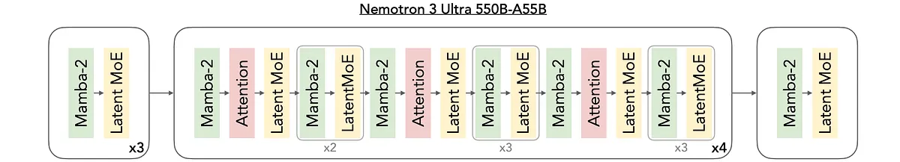
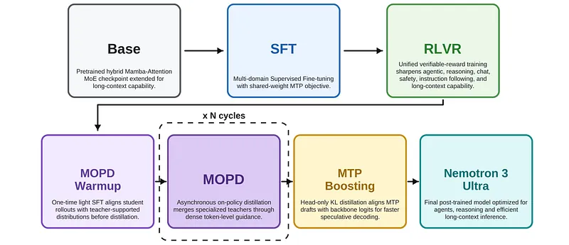
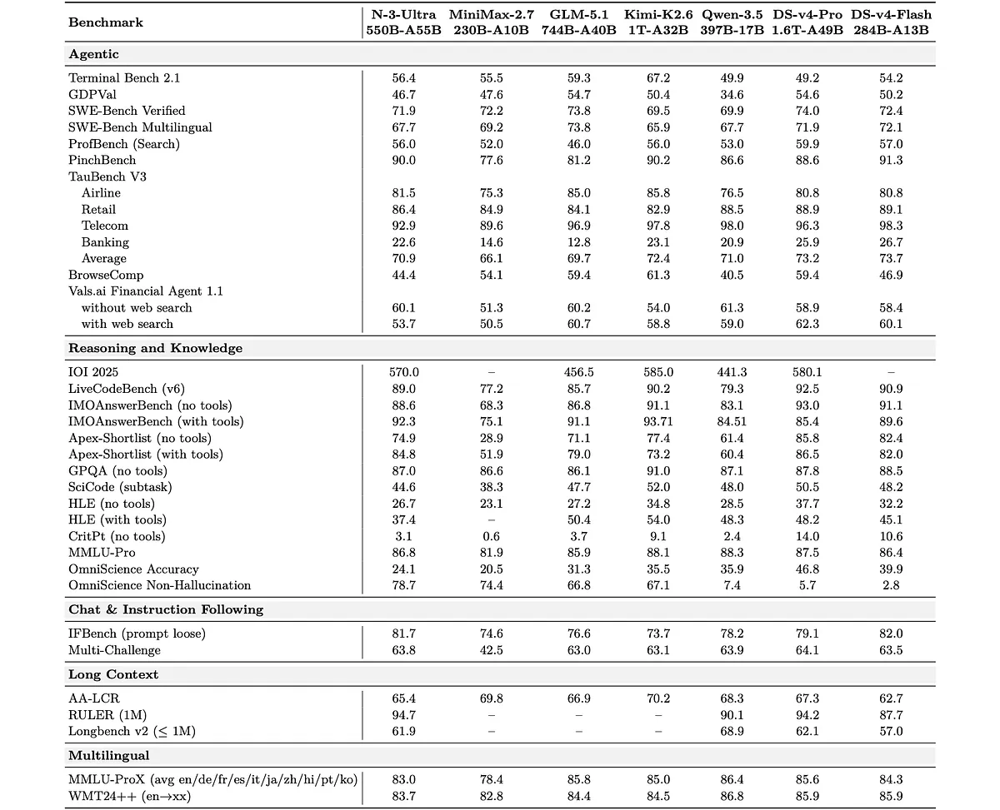
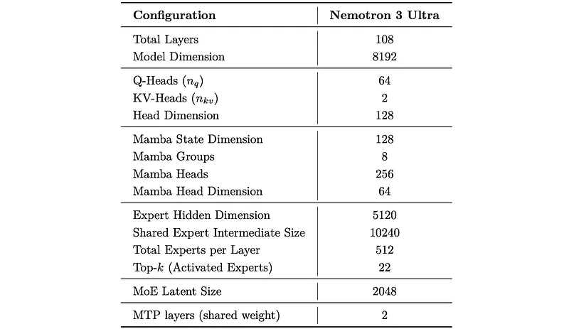
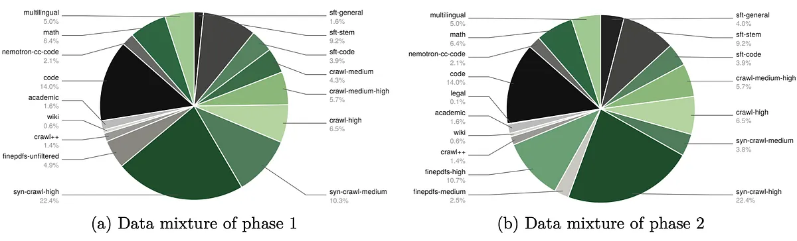
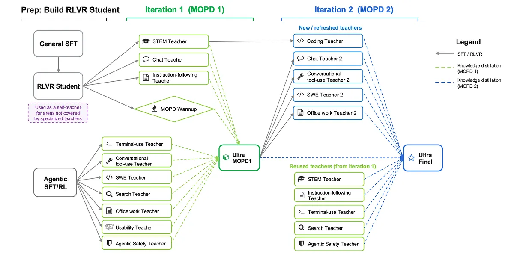

# Papers Explained 580: Nemotron 3 Ultra

**Source**: `raw/draft_Papers-Explained--580-Nemotron-3-Ultra-2443ef0c834b.md`  
**Paper**: https://research.nvidia.com/labs/nemotron/files/NVIDIA-Nemotron-3-Ultra-Technical-Report.pdf  
**Ingested**: 2026-06-13  
**Tags**: #summary

## Summary

**Nemotron 3 Ultra** is NVIDIA's **550B total / 55B active** **Hybrid Mamba-Attention MoE** model: same architecture family as [[Papers Explained - Nemotron 3 Super]], scaled up with **LatentMoE**, **Multi-Token Prediction** (two heads), **NVFP4** pre-training, **20T** text tokens, **1M** context extension, then SFT → unified **RLVR** → **Multi-teacher On-Policy Distillation (MOPD)**.

**Pre-training** refreshes GitHub code (+173B tokens to Sep 2025), adds Nemotron synthetic pre-training sets (multiple-choice, generative QA, fact-seeking, legal, moral scenarios), and a two-phase curriculum (diversity → quality) through ~15T tokens. **Long-context phase**: 46% long-doc QA blend, 1M CPT with 8% 4K refresh for short-benchmark retention.

**SFT** at up to **515k** packed tokens: long-context, reasoning-budget truncation, multilingual safety (135k), search trajectories (Wikidata + OpenResearcher + BrowseComp), **370k** terminal agent traces, SWE issue-resolution rollouts, math/proof/science/chat/code/**CUDA**/RTL blends. **RLVR**: async GRPO, global batch 8192, 16 rollouts, 48K→64K generation length across terminal, office, SWE, search, tools, STEM, safety, IF, long-context, structured output.

**MOPD**: student rollouts scored by **10+ domain teachers** (SWE, GDPval office tasks, search w/ context management, terminal, tool-use, usability, agentic safety, chat GenRM, IF/factuality, competitive coding, STEM); iterative teacher refresh + brief SFT warmup before each merge.

Competitive with leading open models; **PinchBench 90.0**, **ProfBench 56.0**; **IOI 2025 570** with tools; **AA-Omniscience** non-hallucination **78.7** (highest cited).

## Key Claims

- 55B-active MoE matches or beats much larger open models on several agentic/reasoning benchmarks.
- MOPD co-evolution merges domain-specialist teachers without full retraining from scratch.
- 1M context with maintained short-context accuracy via mixed 4K/1M CPT.
- Extensive synthetic pre-training + post-training data (legal, CUDA, RTL, SWE) targets production agent workloads.

## Figures

| Figure | Caption | Page |
|--------|---------|------|
|  | Nemotron 3 Ultra layer pattern. | Architecture |
|  | Architecture dimensions table. | Architecture |
|  | Pre-training data mixtures (phase 1 & 2). | Data |
|  | Post-training pipeline overview. | Post-training |
|  | Two-iteration MOPD pipeline. | MOPD |
|  | MOPD distillation objective. | MOPD |
|  | Evaluation suite results. | Evaluation |

## Entities

- [[NVIDIA]] — developer; Nemotron v3 family.
- [[Mixture of Experts]] — LatentMoE at 550B scale.
- [[On-Policy Distillation]] — MOPD student-on-own-rollouts training.
- [[Agentic AI]] — terminal, SWE, search post-training.

## Questions & Gaps

- Serving cost / latency vs Nemotron 3 Super not quantified in explainer.
- Full teacher checkpoint inventory and license terms abbreviated.

## Related

- [[Papers Explained - Nemotron 3 Super]]
- [[Papers Explained 518 - Nemotron Cascade]]
- [[Mixture of Experts]]
- [[Reasoning Models]]
- [[Agentic AI]]
- [[Long Context]]
- [[Controlling Reasoning Effort in LLMs]] — medium-effort SFT, random-budget truncation, and hard inference-time reasoning budgets.
- [[Reasoning Budget]]
- [[Reasoning Effort]]
