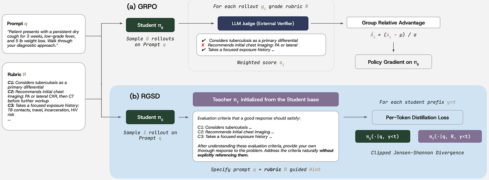
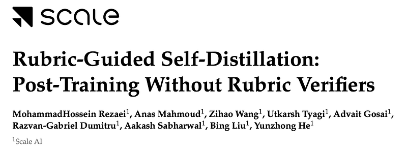
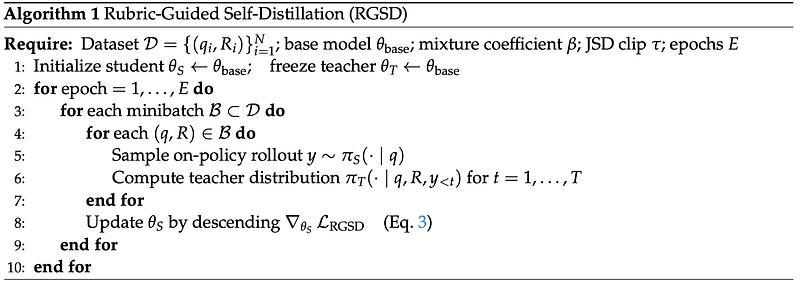
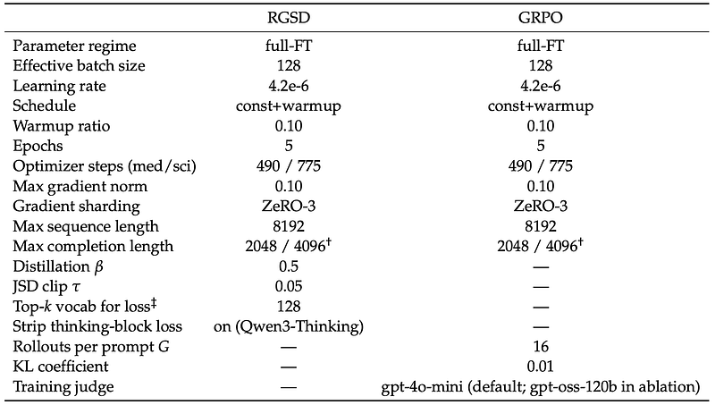
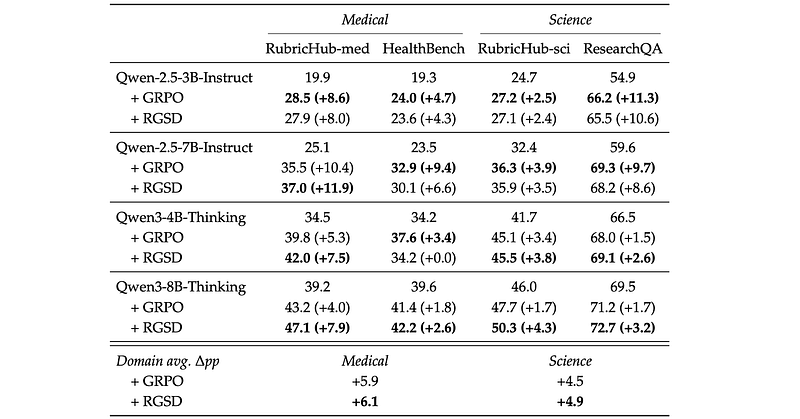
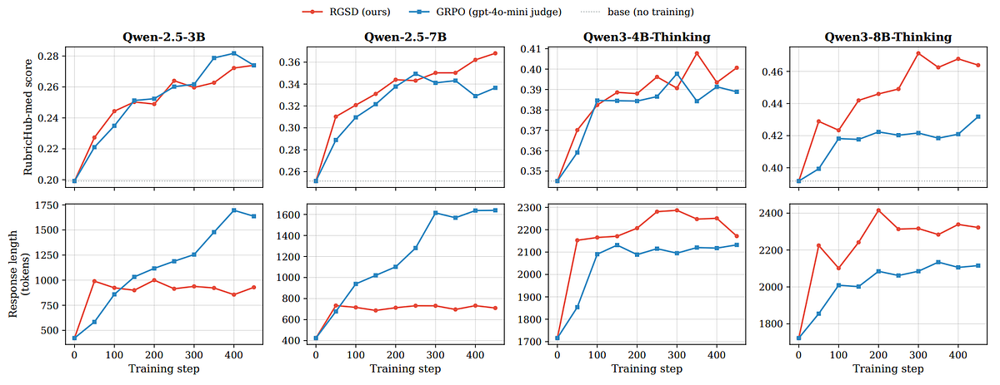
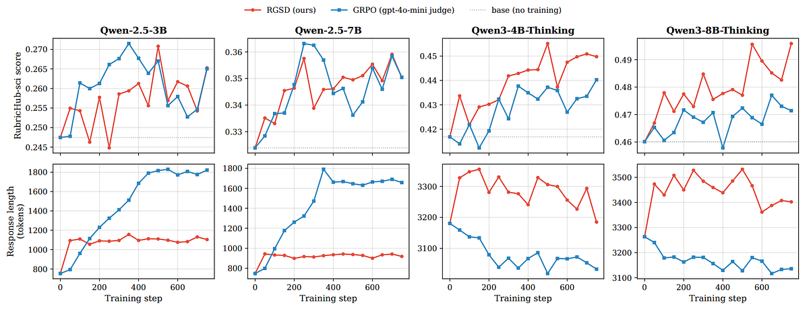

# Papers Explained 581: Rubric-Guided Self-Distillation

**Source**: `raw/draft_Papers-Explained-581--Rubric-Guided-Self-Distillation-bd61a188450f.html`  
**Paper**: https://arxiv.org/abs/2606.12507  
**Ingested**: 2026-06-21  
**Tags**: #summary

## Summary

**Rubric-Guided Self-Distillation (RGSD)** is a verifier-free post-training method for rubric-graded open-ended generation. Instead of scoring student rollouts with an LLM judge during [[GRPO]], RGSD conditions a frozen teacher copy of the base model on the prompt and rubric, then distills that teacher's per-token distribution into an unconditioned student that only sees the prompt at inference time.

A rubric instance is a tuple (q, R) with prompt q and weighted criteria R = {(cᵢ, wᵢ)}. Standard rubric RL aggregates binary judge verdicts vᵢ ∈ {0,1} into a trajectory score s_J and optimizes expected rubric reward — but each GRPO step requires G batched judge calls per prompt, dominating cost. RGSD removes the judge entirely: student π_S(·|q) samples on-policy rollouts; frozen teacher π_T(·|q, R, y_<t) provides dense token targets; the student is updated with clipped Jensen–Shannon divergence (β = 0.5). For reasoning models, reasoning-trace tokens are masked so only final response tokens contribute to the loss.

Evaluated on [[RubricHub]] medical and science domains with Qwen-2.5–3B/7B-Instruct and Qwen3–4B/8B-Thinking. RGSD matches GRPO rubric gains (+6.1 vs +5.9 pp medical; +4.9 vs +4.5 pp science) while eliminating all judge queries at train time and producing shorter responses on Qwen-2.5 without sacrificing peak rubric satisfaction.

## Key Claims

- Rubric-conditioned self-distillation replaces sparse trajectory-level rubric rewards with dense per-token learning signals.
- RGSD achieves quality parity with judge-based GRPO on RubricHub medical/science across four base models.
- Zero judge calls during training yields substantial efficiency gains over GRPO's G×K judge overhead.
- RGSD responses are shorter (1.4–2.3× on Qwen-2.5) while maintaining peak rubric scores.
- Reasoning-trace masking prevents rubric leakage when distilling thinking models.

## Figures

| Figure | Caption | Page |
|--------|---------|------|
|  | RGSD overview banner. | Intro |
|  | Rubric score aggregation formula. | Method |
|  | Rubric-RL objective. | Method |
|  | RGSD method overview diagram. | Method |
|  | Student–teacher token distillation setup. | Method |
|  | Clipped Jensen–Shannon divergence objective. | Method |
|  | Hyperparameters across methods. | Setup |
|  | Main results on RubricHub and OOD benchmarks. | Results |
|  | Training dynamics on RubricHub-med-300. | Results |
|  | Training dynamics on RubricHub-sci-300. | Results |

## Entities

- [[Rubric-Guided Self-Distillation]] — core training method.
- [[Rubric-Based Reinforcement Learning]] — problem setting RGSD addresses without judges.
- [[RubricHub]] — medical/science rubric training and eval benchmark.
- [[On-Policy Distillation]] — same-family teacher on student rollouts; RGSD adds rubric conditioning.

## Questions & Gaps

- OOD generalization beyond HealthBench and ResearchQA is evaluated but not deeply analyzed in the Medium export.
- Whether RGSD avoids [[Reward Hacking]] patterns from judge exploitation remains untested (no judge at train time, but eval still uses gpt-5.4).
- Interaction with dynamic rubric reweighting ([[Papers Explained 579: Policy-Aware Rubric Reward (POW3R)]]) not discussed.

## Related

- [[Papers Explained 553 - Rubrics as Rewards]]
- [[Papers Explained: Reward Hacking in Rubric-Based RL]]
- [[Papers Explained 579: Policy-Aware Rubric Reward (POW3R)]]
- [[Self-Distilled Fine-Tuning]]
- [[GRPO]]
- [[Reinforcement Learning Topic]]
- [[Safety and Alignment]]
