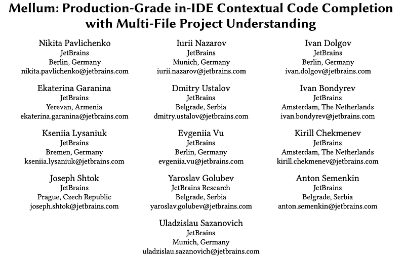
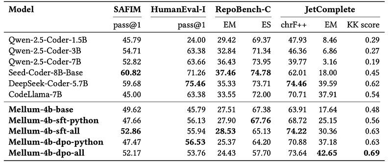
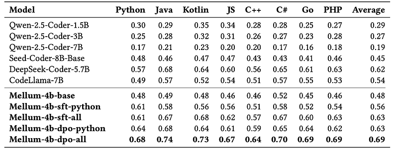

# Papers Explained 582: Mellum

**Source**: `raw/draft_Papers-Explained-582--Mellum-765aef2f7e6c.html`  
**Paper**: https://arxiv.org/abs/2510.05788  
**Models**: https://huggingface.co/collections/JetBrains/mellum  
**Ingested**: 2026-06-21  
**Tags**: #summary

## Summary

**Mellum** is a family of open-weight **4B-parameter** code completion models from [[JetBrains]], built for interactive in-editor use: multi-line fill-in-the-middle (FIM) completion with low latency and compact deployment. Trained from scratch on **4T tokens** of permissively licensed multi-language code plus Wikipedia for comment/string quality, Mellum follows a scaled-down Llama 2 architecture (30 layers, 3,072 hidden, 8,192 context, 49,152-token custom tokenizer).

Production constraints shaped the design: **90% of requests under 500 ms**, model plus batch fits cost-efficient GPUs (~80 GB VRAM), and a widely supported architecture for optimized inference. Pre-training applies random FIM on half of each chunk (S-P-M order). SFT upgrades FIM to semantically complete segments (function bodies, loop bodies) via JetBrains **Code Engine**, and adds **project-level context** through IoU-line similarity, path-distance file collection, and RAG chunk scoring. **Direct Preference Optimization** further improves stopping behavior and JetComplete metrics.

Project-context SFT outperforms the base model and larger baselines (Qwen-2.5-Coder-7B, Seed-Coder-8B, DeepSeek-Coder-5.7B) on JetComplete. Multilingual SFT + DPO extends gains beyond Python while keeping strong Python HumanEval-Infilling scores.

## Key Claims

- 4B from-scratch code model optimized for IDE latency and multi-line FIM, not general chat.
- Project-level context strategies (IoU, path distance, RAG) materially improve real-world completion quality.
- Semantic FIM segment selection beats random chunk FIM for SFT.
- DPO improves stopping behavior and JetComplete over SFT alone.
- Multilingual fine-tuning beats Python-only SFT on breadth without sacrificing Python.

## Figures

| Figure | Caption | Page |
|--------|---------|------|
|  | Overall performance of code completion models. | Evaluation |
|  | Performance on JetComplete. | Evaluation |
|  | SAFIM and RepoBench-C results. | Evaluation |

## Entities

- [[JetBrains]] — developer; IDE-integrated deployment target.
- [[Mellum]] — 4B dense code completion model family.
- [[Code Models]] — FIM and repo-context completion topic.

## Questions & Gaps

- Serving latency vs accuracy tradeoffs at scale not quantified beyond the 500 ms target.
- Successor [[Papers Explained 583: Mellum 2]] expands to 12B MoE agentic coding; Mellum 4B remains the low-latency completion tier.

## Related

- [[Papers Explained 583: Mellum 2]]
- [[Code Models]]
- [[Model Compression and Efficiency]]
- [[Agentic AI]]
