# Papers Explained 583: Mellum 2

**Source**: `raw/draft_Papers-Explained-583--Mellum2-7c59fdbfb6e6.md`  
**Paper**: https://arxiv.org/abs/2605.31268  
**Models**: https://huggingface.co/collections/JetBrains/mellum-2  
**Ingested**: 2026-06-21  
**Tags**: #summary

## Summary

**Mellum 2** is [[JetBrains]]'s open-weight **12B total / 2.5B active** [[Mixture of Experts]] successor to [[Papers Explained 582: Mellum]], spanning code generation, editing, debugging, multi-step reasoning, tool use, function calling, agentic coding, and conversational programming assistance. Architecture follows Qwen3-MoE: 28 layers, GQA (32Q/4KV), 3:1 sliding-window attention (1,024-token window on 3 of 4 layers), 64 routed experts with top-8 routing, and **Multi-Token Prediction** (α = 0.1) for speculative decoding at inference.

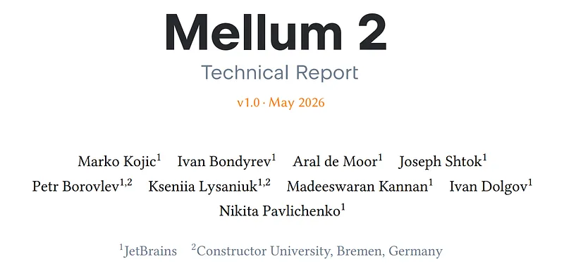

**Pre-training** spans ~10.6T tokens in three WSD-aligned phases: foundation (70% web, 23% code), quality uplift (42% code, curated SFT/reasoning data), and capability sharpening (59% code during LR decay). Post-training delivers **Instruct** (direct answers) and **Thinking** (chain-of-thought) variants via SFT, then multi-domain **RLVR** using [[DAPO]]/[[Dr. GRPO]] practices: token-level loss, leave-one-out advantages, dynamic sampling, asymmetric clip-higher, overlong reward shaping, no KL anchor.

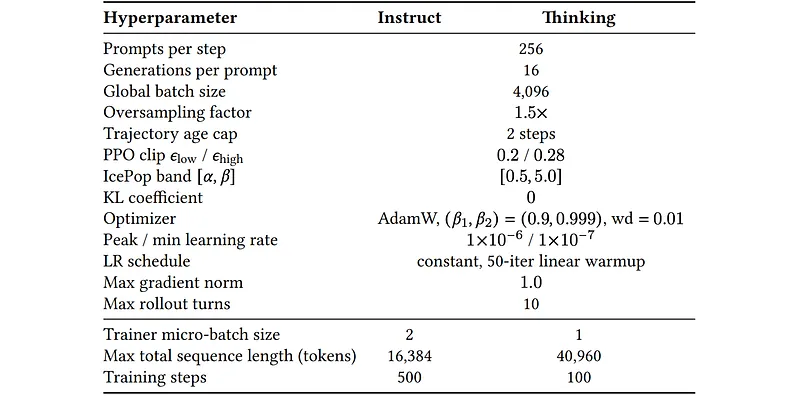

Despite 2.5B active params, Mellum 2 is competitive with 7–9B dense models on many code/reasoning benchmarks. **Mellum 2-RL** leads EvalPlus (78.4%); thinking variant hits **75.1** LiveCodeBench v6; BFCL v3 rises from 43.1 to 66.3 (instruct) after RL; AIME reaches 58.4 (RL-Thinking). Tradeoffs: weaker GPQA/MMLU-Redux vs Qwen3.5–9B; alignment tax on HarmBench after RL (23.1% harmful rate vs 8.4% SFT).

## Key Claims

- 2.5B-active MoE coding agent model competitive with much larger dense baselines on code and agentic tool benchmarks.
- Three-phase "web early, curated late" pretrain with intentional dataset repetition (≤4×) maximizes scarce high-quality code.
- Separate Instruct and Thinking SFT recipes with domain-specialist checkpoint merging before RL.
- RLVR mix spans competitive programming, SWE-style agent tasks, math, function calling, and instruction following.
- MTP layer enables speculative decoding; removed at evaluation for fair benchmarking.

## Figures

| Figure | Caption | Page |
|--------|---------|------|
|  | Architecture configuration of Mellum 2. | Architecture |
| 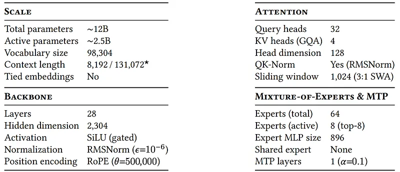 | Three-phase pre-training curriculum. | Pre-training |
| 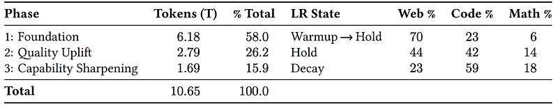 | Training schedule. | Pre-training |
| 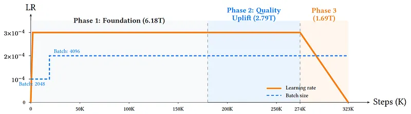 | Optimizer and training hyperparameters. | Pre-training |
| 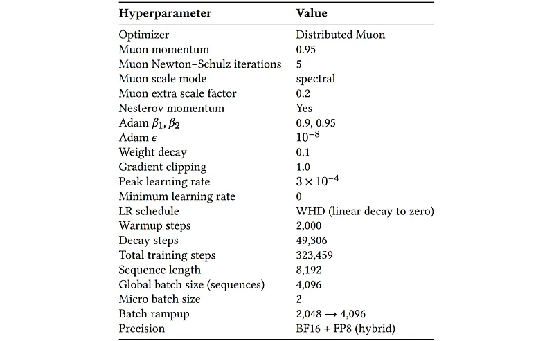 | Supervised fine-tuning configuration. | Post-training |
| 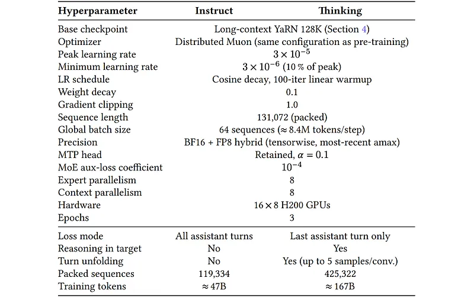 | Per-stage RL hyperparameters. | Post-training |
|  | RL data mix by capability domain. | Post-training |
| 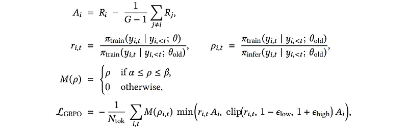 | Pre-training evaluation results. | Evaluation |
|  | Post-training instruct evaluation. | Evaluation |
| 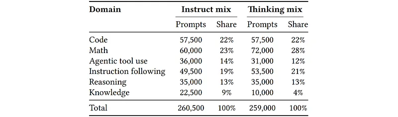 | Post-training thinking/reasoning evaluation. | Evaluation |
| 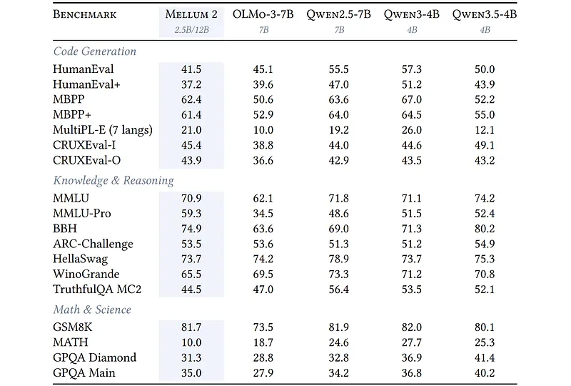 | Safety and refusal benchmarks. | Evaluation |
| 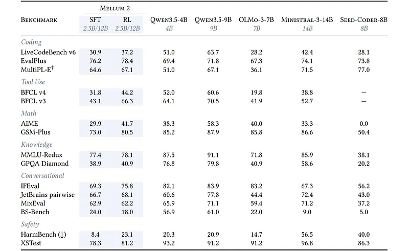 | JetBrains internal pairwise win rates. | Evaluation |
| 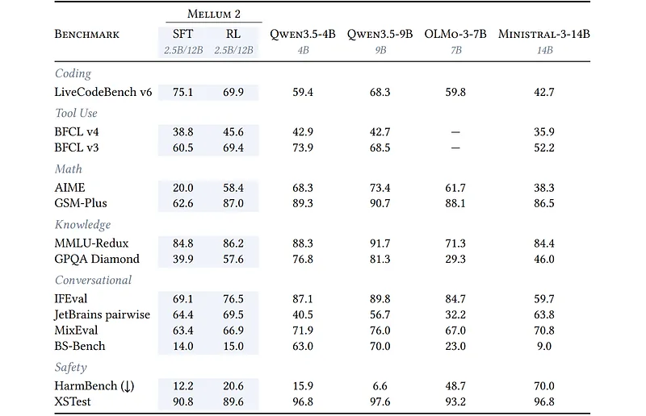 | Long-context extension results. | Evaluation |

## Entities

- [[JetBrains]] — developer.
- [[Mellum]] — predecessor 4B completion family.
- [[Mixture of Experts]] — 64-expert top-8 routing at 12B scale.
- [[Agentic AI]] — SWE-style agent trajectories and tool-use RL.
- [[DAPO]] / [[Dr. GRPO]] — RL optimizer configuration.

## Questions & Gaps

- Production serving latency vs Mellum 4B not compared; Mellum 2 targets capability over sub-500ms completion.
- RL alignment tax on HarmBench and over-refusal on XSTest flagged for future joint optimization.
- GPQA/MMLU knowledge gap vs Qwen3.5–9B reflects small active-parameter knowledge ceiling.

## Related

- [[Papers Explained 582: Mellum]]
- [[Code Models]]
- [[Reasoning Models]]
- [[Mixture of Experts]]
- [[Agentic AI]]
- [[Reinforcement Learning Topic]]

## HF Blog Cross-References

- "Introducing Mellum2: A 12B Mixture-of-Experts Model by JetBrains" (`huggingface.co/blog/jetbrains/mellum2-launch`, 2026-06-01) is JetBrains's own launch post, pointing back to the same technical report covered above. It adds a framing this page doesn't state explicitly: Mellum2 as a "focal model", a fast, well-scoped component meant to sit inside larger multi-model systems (routing, RAG context compression/summarization, agent sub-tasks like planning and validation, private/self-hosted deployment) rather than to compete with frontier models directly. It also claims "more than 2x faster inference" versus similarly sized open models, a headline number not broken out in the Key Claims above.
