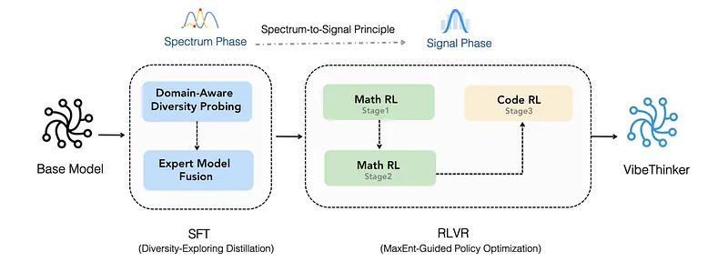
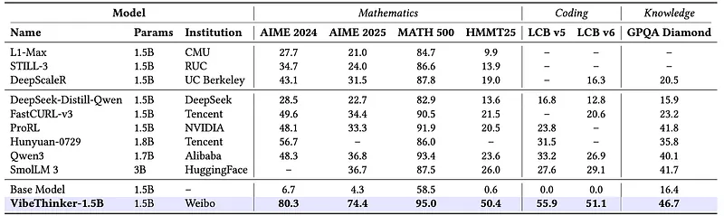
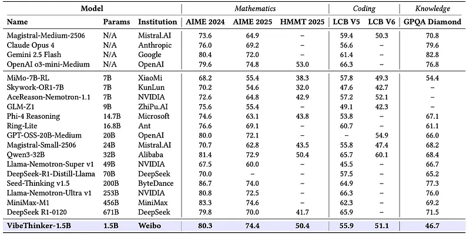
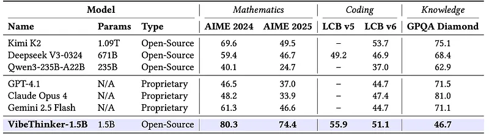

# Papers Explained 584: VibeThinker-1.5B

**Source**: `raw/draft_Papers-Explained-584--VibeThinker-1-5B-ef56288a0329.md`  
**Paper**: https://arxiv.org/abs/2511.06221  
**Ingested**: 2026-06-21  
**Tags**: #summary

## Summary

**VibeThinker-1.5B** is a **1.5B dense** reasoning model built on Qwen2.5-Math-1.5B using the **[[Spectrum-to-Signal Principle]] (SSP)**: SFT maximizes solution diversity (Pass@K) to build a broad "spectrum" of plausible answers; RL then amplifies the correct "signal" from that spectrum. SSP reframes SFT and RL as complementary rather than redundant stages.

**Spectrum phase (SFT):** Two-stage **Diversity-Exploring Distillation** — domain-aware diversity probing selects per-subdomain specialist checkpoints maximizing Pass@K, then unweighted parameter fusion merges specialists into MSFTMerge. **Signal phase (RL):** **MaxEnt-Guided Policy Optimization (MGPO)** weights GRPO advantages by entropy deviation from p_c = 0.5, prioritizing problems where the model is maximally uncertain (highest pedagogical value). Rigorous 10-gram semantic decontamination applied to SFT and RL data.

VibeThinker-1.5B dramatically outperforms its base (AIME25: **74.4 vs 4.3**; HMMT25: **50.4 vs 0.6**; LiveCodeBench V5: **55.9 vs 0**) and beats 3B SmolLM and Qwen3–1.7B on math/coding. Despite 10–100× fewer parameters, it matches or exceeds larger models on competition math and rivals Gemini 2.5 Flash / O3-mini-Medium on AIME; GPQA remains a knowledge ceiling for small models.

## Key Claims

- SSP assigns SFT the diversity objective (Pass@K) and RL the signal-selection objective (Pass@1).
- Diversity-maximizing specialist merge produces a better RL starting point than Pass@1-optimized SFT.
- MGPO's maximum-entropy weighting focuses RL on borderline problems (p_c ≈ 0.5).
- 1.5B model achieves frontier-competitive math reasoning with careful post-training design.
- 20–40 point gap to largest models on broad knowledge (GPQA) reflects small-model limits.

## Figures

| Figure | Caption | Page |
|--------|---------|------|
|  | Training pipeline of VibeThinker-1.5B. | Method |
|  | Core benchmark performance (math). | Evaluation |
|  | Core benchmark performance (coding). | Evaluation |
|  | Comparison vs larger proprietary models. | Evaluation |
|  | MGPO entropy weighting illustration. | Method |
|  | Diversity probing Pass@K curves. | Method |
|  | Specialist model fusion scheme. | Method |
|  | Ablation: SSP vs standard SFT→RL. | Analysis |
|  | Decontamination impact. | Data |

## Entities

- [[VibeThinker]] — small-model reasoning model family.
- [[Spectrum-to-Signal Principle]] — SFT-diversity + RL-signal framework.
- [[GRPO]] — base optimizer modified by MGPO entropy weighting.

## Questions & Gaps

- MGPO and specialist-merge ablations are summarized but not exhaustively isolated in the Medium export.
- Code performance limited by Qwen2.5-Math base's code pre-training exposure.
- Scaled follow-up in [[Papers Explained 585: VibeThinker-3B]].

## Related

- [[Papers Explained 585: VibeThinker-3B]]
- [[Reasoning Models]]
- [[Reinforcement Learning Topic]]
- [[On-Policy Distillation]]
- [[Model Distillation]]
