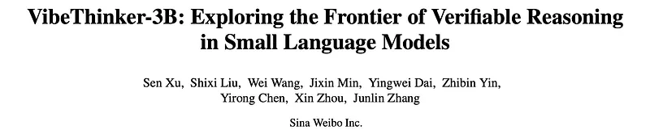
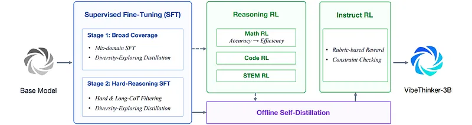
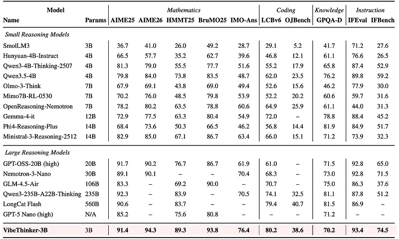
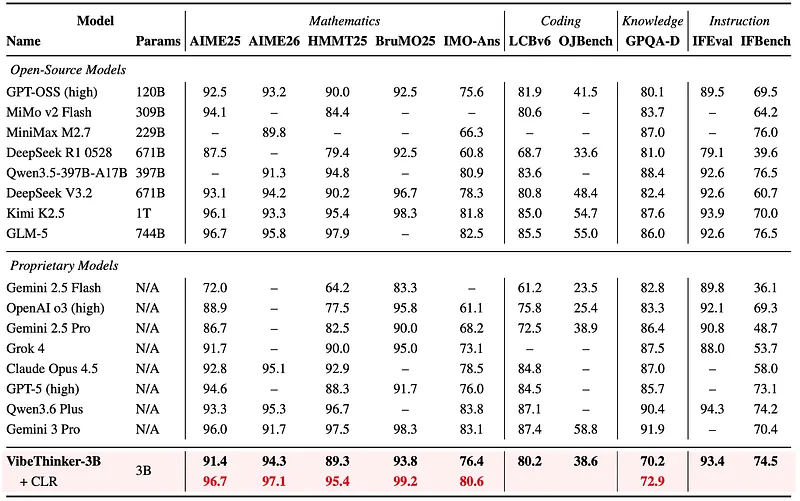
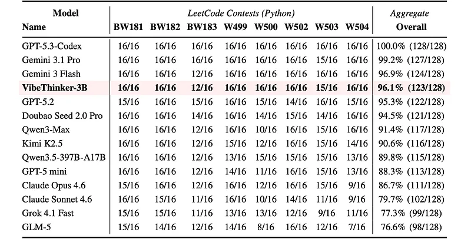

# Papers Explained 585: VibeThinker-3B

**Source**: `raw/draft_Papers-Explained-585--VibeThinker-3B-a82a4fe1299f.md`  
**Paper**: https://arxiv.org/abs/2606.16140  
**Ingested**: 2026-06-21  
**Tags**: #summary

## Summary

**VibeThinker-3B** scales the **[[Spectrum-to-Signal Principle]]** from [[Papers Explained 584: VibeThinker-1.5B]] to a **3B dense** model on Qwen2.5-Coder-3B, pushing verifiable reasoning in a strict small-model regime. The post-training pipeline adds curriculum SFT, multi-domain MGPO RL, offline self-distillation, and instruct RL.

**SFT:** Automated data synthesis from high-confidence seeds (math with verified answers; code with unit tests). Multiple teacher reasoning traces per query preserve exploration diversity. Two-stage curriculum: broad capability coverage, then hard-reasoning subset (≥5K-token traces, error rate ≥0.75 vs VibeThinker-1.5B reference). Domain specialist checkpoints selected by Pass@K on probing sets, then parameter-merged.

**RL:** MGPO applied to math, code, and STEM with domain-specific verifiers; math phase includes **Long2Short** efficiency optimization. **Offline self-distillation** backfeeds elicited capabilities; **Instruct RL** reinforces complex multi-step instruction following.

VibeThinker-3B leads small/mid models (&lt;14B) on competition math (AIME26 **97.1**, BruMO25 **99.2**, IMO-AnswerBench **80.6**), coding (LiveCodeBench v6 **80.2**), and instruction following (**93.4**). OOD LeetCode contests (Apr–May 2026): **96.1%** first-attempt acceptance (123/128). Holds own vs 500B+ models on competition math/coding but lags GPQA-Diamond on encyclopedic knowledge.

## Key Claims

- SSP scales from 1.5B to 3B with curriculum SFT and expanded RL domains.
- Hard-sample second-stage SFT + Pass@K specialist merge improves long-horizon reasoning.
- Multi-domain MGPO with Long2Short balances reasoning depth and efficiency.
- Offline self-distillation + instruct RL preserve controllability after reasoning RL.
- 96.1% LeetCode OOD acceptance confirms generalization beyond static benchmarks.

## Figures

| Figure | Caption | Page |
|--------|---------|------|
|  | Overall training pipeline. | Method |
|  | Core benchmark performance (math). | Evaluation |
|  | Core benchmark performance (coding/IF). | Evaluation |
|  | LeetCode OOD generalization (Apr–May 2026). | Evaluation |
|  | Comparison vs larger reasoning models. | Evaluation |
|  | Curriculum SFT stage ablation. | Analysis |
|  | Pipeline component ablation. | Analysis |

## Entities

- [[VibeThinker]] — 1.5B and 3B reasoning model family.
- [[Spectrum-to-Signal Principle]] — shared post-training paradigm.
- [[Reasoning Models]] — small-model verifiable reasoning push.

## Questions & Gaps

- LeetCode OOD window is narrow (Apr 25–May 31, 2026); longer-horizon OOD not reported.
- GPQA knowledge gap vs 500B models expected but limits general assistant use.
- MGPO ablation detail lighter than architecture/data pipeline detail in Medium export.

## Related

- [[Papers Explained 584: VibeThinker-1.5B]]
- [[Reasoning Models]]
- [[Reinforcement Learning Topic]]
- [[Code Models]]
- [[On-Policy Distillation]]
