# Papers Explained 586: Gemma 4

**Source**: `raw/2026-08-03_Papers-Explained--Gemma-4-ba2108a444a9.html`  
**Paper**: https://arxiv.org/abs/2607.02770  
**Ingested**: 2026-08-23  
**Tags**: #summary

## Summary

**Gemma 4** is Google's natively multimodal open model family spanning dense configurations—**Effective 2B (E2B)**, **Effective 4B (E4B)**, **12B**, and **31B**—and a **26B Mixture of Experts (26B-A4B)** model activating 3.8B parameters per token. The family builds upon a decoder-only Transformer foundation with pre- and post-RMSNorm and QKNorm, introducing architectural optimizations for memory efficiency, native vision/audio ingestion, and speculative decoding.

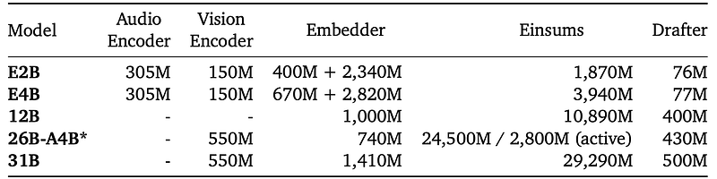

**Per-Layer Embeddings & Long Context Efficiency:** E2B and E4B introduce **[[Per-Layer Embedding]] (PLE)**, augmenting token inputs with layer-wise 256-dimensional embeddings stored in flash memory and retrieved via a single lookup during initial inference. Gating mechanisms between decoder blocks weight and project these embeddings back to model dimension, anchoring token identity across deep layers without VRAM consumption (2.3B and 4.5B effective parameters out of 5B and 8B total). Long-context attention uses 4:1 (E2B) and 5:1 (others) local-to-global attention ratios, $K=V$ key-value sharing on global layers, and **[[p-RoPE]]** ($p=0.25$, 1M global / 10k local frequencies) to reduce global [[KV Cache]] footprint by 37.5%.

**Multimodal Encoders & Unified 12B Paradigm:** E2B and E4B utilize a 150M Vision Transformer (ViT), while 31B and 26B-A4B use a 550M ViT (patch size 16, axial 2D-RoPE with non-causal attention, 2D absolute position embeddings, and aspect-ratio preserving resizing). Audio is processed via a 305M USM-based Conformer encoder (55% smaller than Gemma 3n) handling 40ms Mel-filterbank chunks without vector quantization. In contrast, **Gemma 4 12B** introduces an **encoder-free architecture**: a 35M linear projection replaces the 550M ViT for $48\times 48\times 3$ RGB patches with 2D coordinate embeddings, while raw 16kHz audio chunks (640-d) are projected directly into LLM embedding space without positional encoding.

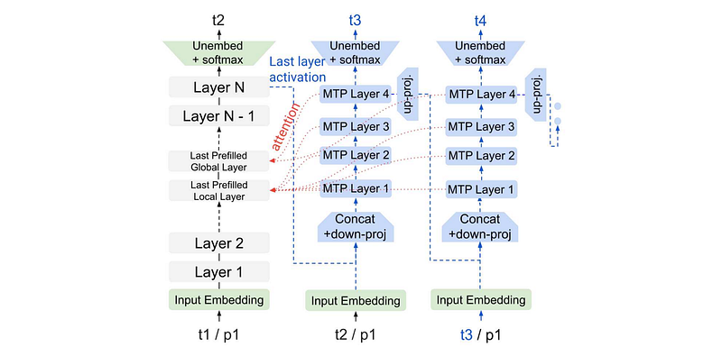

**Speculative Decoding & Evaluations:** Models train with an autoregressive **[[Multi-Token Prediction]] (MTP)** drafter head (4-layer Transformer, dim 256 on E2B/E4B, 1024 on larger models) cross-attending target KV states. E2B/E4B drafters use clustered top-$k$ vocabulary projections reducing final matmuls from $d \times 262,000$ to $d \times 4096$. Pre-training uses a 262k SentencePiece tokenizer through January 2025 cutoff. On benchmarks, **31B** leads open dense models on Arena Text Elo scores; **E2B** matches Gemma 3 27B with 10× fewer parameters; and **E4B** outperforms Gemma 3 27B on vision and long-context tasks.

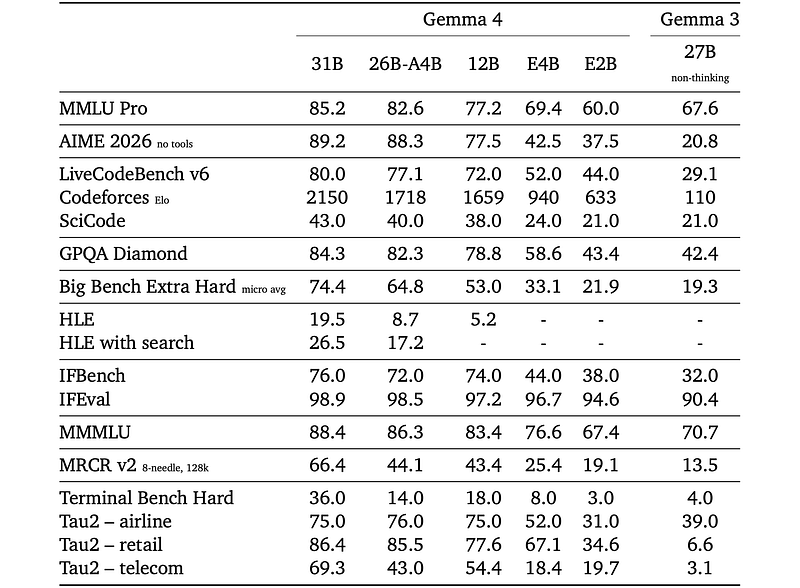

## Key Claims

- Gemma 4 covers dense (E2B, E4B, 12B, 31B) and MoE (26B-A4B with 3.8B active parameters) architectures.
- Per-Layer Embeddings (PLE) in flash memory allow E2B and E4B to maintain token identity across layers without VRAM bloat.
- $p$-RoPE ($p=0.25$) combined with $K=V$ global layer sharing reduces global KV cache by 37.5%.
- Gemma 4 12B demonstrates an encoder-free paradigm, directly projecting raw image patches (35M matmul) and audio chunks into embedding space.
- Audio encoder parameter count is reduced by 55% (305M vs 680M in Gemma 3n) while preserving multilingual transcription/translation.
- Autoregressive 4-layer MTP drafters enable speculative decoding without drafter prefill, with clustered vocab heads on edge models.
- Gemma 4 E2B achieves performance on par with Gemma 3 27B at 10× parameter reduction.

## Figures

| Figure | Caption | Page |
|--------|---------|------|
| 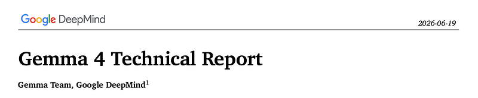 | Papers Explained 586: Gemma 4 banner. | Overview |
|  | Parameter counts for the Gemma 4 models. | Architecture |
|  | Vision encoder architecture. | Modality |
| 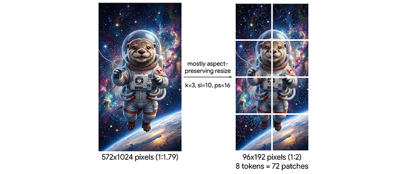 | Image resizing. | Modality |
| 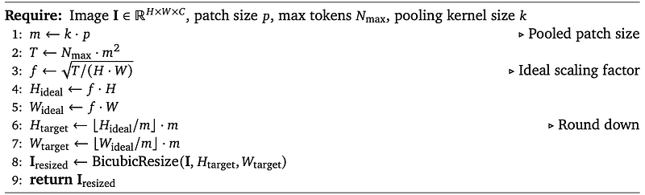 | Aspect-Ratio Preserving Image Resizing procedure. | Modality |
|  | The autoregressive MTP drafter. | Decoding |
| 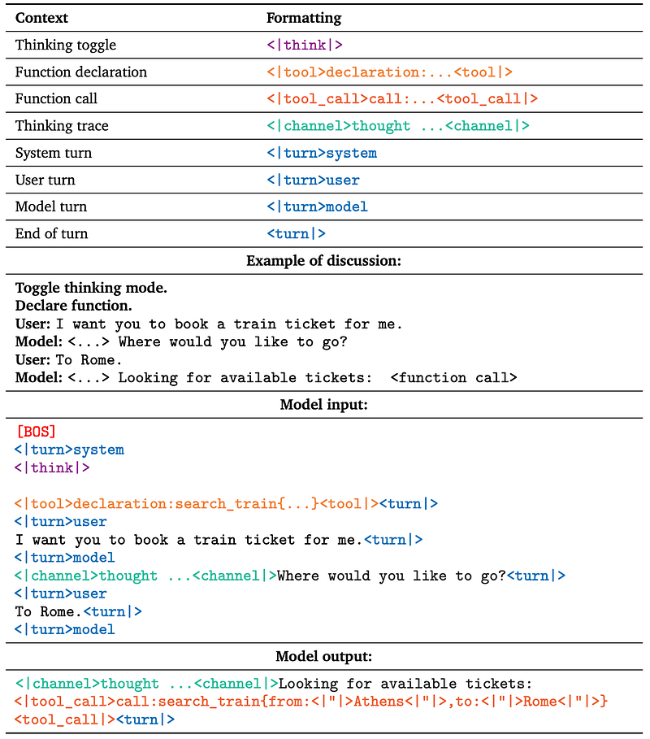 | Formatting for Gemma IT models. | Post-Training |
| 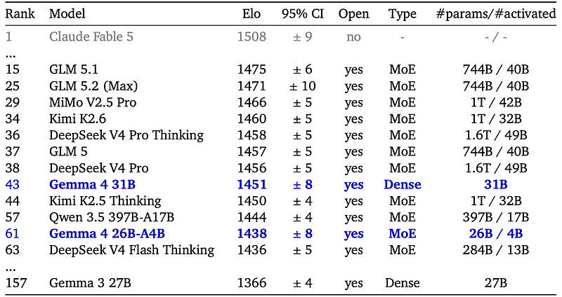 | Leading open-weight models on Arena Text. | Evaluation |
|  | Performance comparison of Gemma 3 27B and Gemma 4 models on diverse benchmarks. | Evaluation |
| 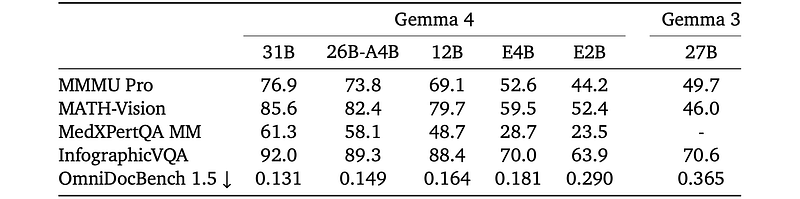 | Gemma 4 models performance on vision benchmarks at different resolutions. | Evaluation |
| 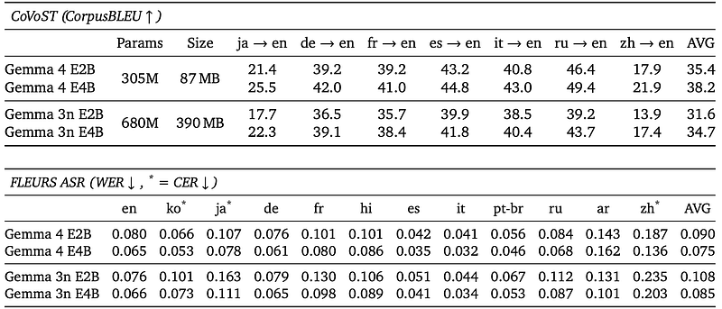 | Audio performance for Gemma 4 and Gemma 3n models. | Evaluation |
| 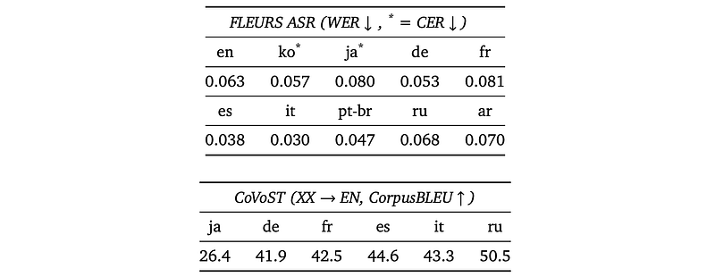 | Audio performance of Gemma 4 12B model on supported languages. | Evaluation |
| 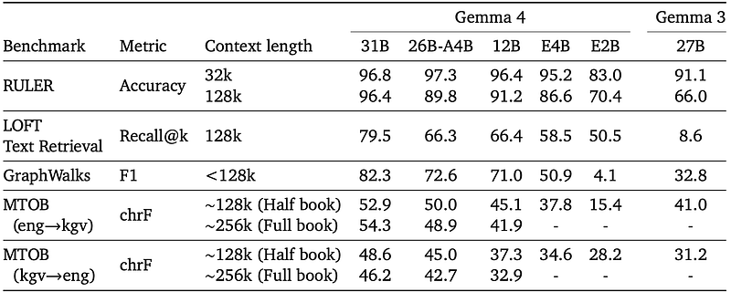 | Long context performance of Gemma 3 and Gemma 4 models. | Evaluation |

## Entities

- [[Google DeepMind]] — research organization developing the Gemma family.
- [[Large Language Models]] — open-weight foundational language model family.
- [[Vision Language Models]] — native multimodal vision support with ViT and encoder-free projection.
- [[Audio Models]] — native continuous audio representation ingestion.
- [[Per-Layer Embedding]] — flash-memory layer-wise token representation mechanism.
- [[p-RoPE]] — partial rotary position embedding reducing KV cache memory.
- [[Multi-Token Prediction]] — speculative decoding drafter head.
- [[Papers Explained 329 - Gemma 3]] — predecessor architecture.

## Questions & Gaps

- Flash memory access latencies across varied mobile and edge hardware platforms are not benchmarked in the article.
- Tradeoffs between encoder-free 12B and encoder-based 31B on fine-grained visual OCR/document reasoning remain to be fully mapped.
- Clustered vocabulary mapping specifics and cluster assignment algorithms are summarized conceptually without cluster count ablation.

## Related

- [[Gemma 4]] — Google announcement summary.
- [[Gemma 4 Technical Report]] — technical report overview.
- [[Gemma 4 12B]] — dedicated summary of the encoder-free 12B variant.
- [[Gemma 4 Multi-Token Prediction]] — MTP speculative decoding analysis.
- [[Papers Explained 329 - Gemma 3]] — prior Gemma generation.
- [[Model Compression and Efficiency]] — architectural efficiency techniques (PLE, $p$-RoPE, MTP).
- [[KV Cache]] — cache reduction via $p$-RoPE and $K=V$ sharing.
- [[Speculative Decoding]] — accelerated inference with MTP drafter heads.
