# Papers Explained 587: OpenThoughts Agent

**Source**: `raw/2026-08-04_Papers-Explained-587--OpenThoughts-Agent-567cddd67283.md`  
**Paper**: https://arxiv.org/abs/2606.24855  
**Dataset**: https://huggingface.co/open-thoughts/OpenThinker-Agent-v1  
**Ingested**: 2026-08-23  
**Tags**: #summary

## Summary

**OpenThoughts-Agent (OT-Agent)** is a fully open data curation pipeline and recipe suite for training agentic language models. Developed by the OpenThoughts project, it investigates the impact of task sources, synthetic data generation, task filtering, teacher model selection, rollout filtering, and reinforcement learning (RL) data mixtures through more than 100 controlled ablation experiments. Fine-tuning Qwen3-32B on the resulting 100K curated dataset yields **OpenThinker-Agent-v1**, achieving an average accuracy of **44.8%** across seven agentic benchmarks—a 3.9 percentage point improvement over the previous best open-data model with superior scaling dynamics.

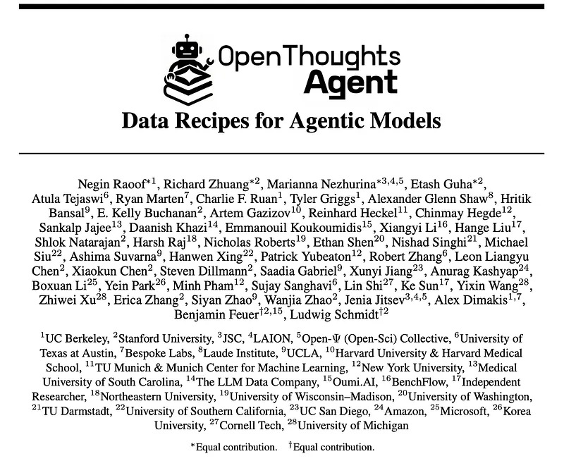

### SFT Data Pipeline & Ablation Framework

The OT-Agent pipeline treats downstream benchmark performance as the sole optimization signal. For each ablation stage, candidate strategies generate 10,000 trajectories for Qwen3-8B full-parameter SFT (learning rate $4\times 10^{-5}$ with cosine decay, global batch size 96, 7 epochs, 32,768 context length). Trajectories are generated using GLM-4.7-AWQ as the teacher model within the **terminus-2** agent harness running inside isolated **Daytona** sandboxes.

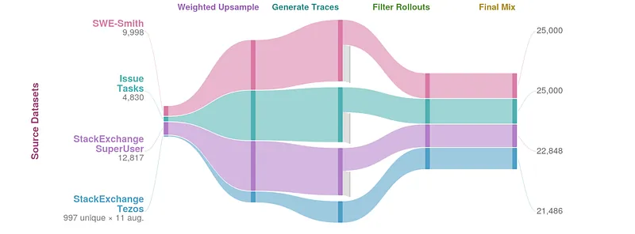

Candidate strategies are scored using the average $z$-score across three core benchmarks:
1. **OpenThoughts-TBLite** (100 tasks): Curated Terminal-Bench style tasks across four difficulty tiers acting as a fast proxy for Terminal-Bench 2.0.
2. **SWE-Bench Verified-100** (100 tasks): Repository-stratified subsample of human-validated SWE-Bench Verified evaluated against upstream unit tests.
3. **Terminal-Bench 2.0** (89 tasks): Human-crafted, multi-domain SWE, biology, system administration, and security tasks.

Evaluations exclude a held-out out-of-distribution (OOD) suite (Aider Polyglot, BFCL, MedAgentBench, GAIA, FinanceAgent-Terminal) to measure true generalization.

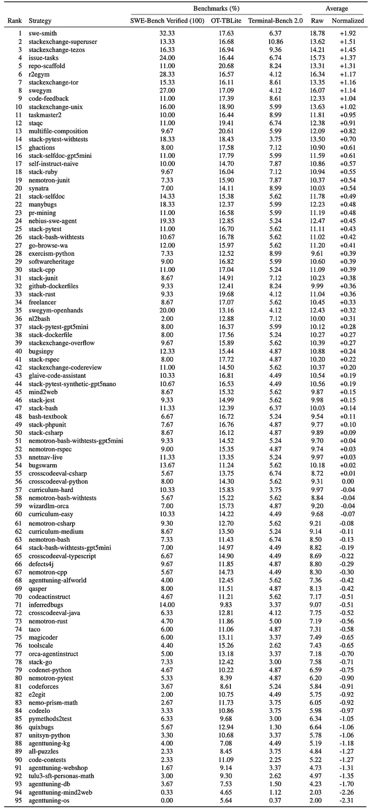

### Key Pipeline Insights

- **Task Sourcing & Mixing**: Across 95 task generation strategies, top performers include synthetic issue-resolution datasets (`swe-smith`, `issue-tasks`) and human-written computer-use questions (`stackexchange-superuser`, `stackexchange-tezos`). Mixing the Top 4 to Top 8 strategies (sampling $10,000 / N$ per source) outperforms narrower or overly broad mixtures (Top 16 degrades across all benchmarks).

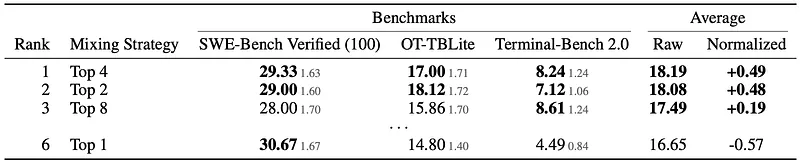

- **Task Augmentation Ineffectiveness**: Prompt-based task augmentation (combining tasks, hardening constraints, adding synthetic requirements) fails to improve upon leaving base task descriptions untouched.

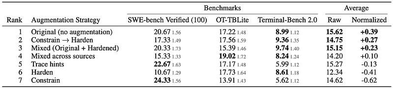

- **LLM Difficulty Filtering**: Filtering task descriptions using teacher token generation length (e.g., tasks requiring more tokens for GPT-5 to solve) delivers a ~3 percentage point boost across all benchmarks.

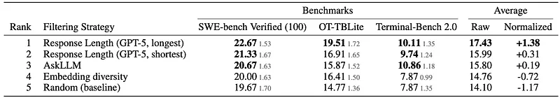

- **Teacher Mismatch ("Stronger Model $\neq$ Better Teacher")**: GPT-5.3-Codex and Kimi K2.5 produce lower student downstream accuracy (e.g., a ~5% drop on Terminal-Bench 2.0) compared to GLM-4.7-AWQ. GLM-4.7 rollouts feature more explicit, reproducible reasoning and exploration steps that transfer effectively to student policies.

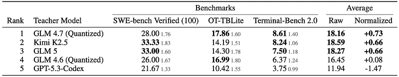

- **Rollout Length Filtering**: Discarding trajectories with fewer than 5 turns provides the single largest improvement among rollout heuristic filters.

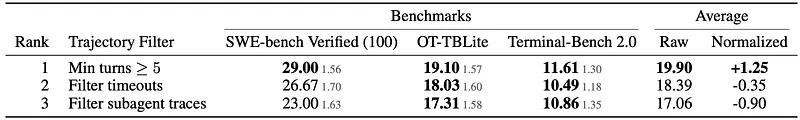

- **Scaling SFT Data via Instruction Rewriting**: Scaling rollouts on fixed tasks plateaus between 31.6K and 100K due to task diversity bottlenecks. OT-Agent circumvents source scarcity (e.g., Tezos having only 997 tasks) by applying surface-form instruction rewriting to expand Tezos to >21K varied prompts without changing the underlying problem, paired with GPT-5-nano response-length proportional upsampling.

### Agentic Reinforcement Learning

For post-training RL in the 8B regime, OT-Agent uses the **RLOO** (REINFORCE Leave-One-Out) algorithm with binary verifier rewards, starting from an `OT-Agent-ColdSFT` checkpoint distilled from SWE-Smith traces.

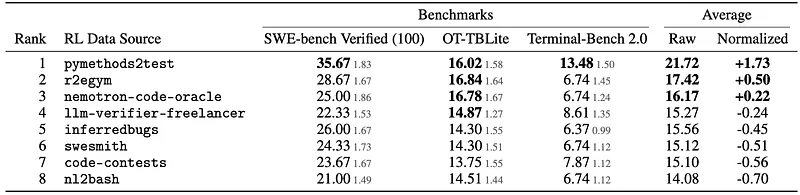

- **Data Source Supremacy of Python Contracts**: Comparing six RL sources, **`pymethods2test`** (competitive programming problems recast as single-function Python contracts with auto-generated unit tests) dramatically outperforms real-repo bug-fixing (`inferredbugs`, `swe-smith`, `r2egym`) and multi-turn tool datasets (`llm-verifier-freelancer`, `nl2bash`).
- **Policy Compression**: The concise structure, clean build environments, and moderate difficulty ceiling of single-function contracts incentivize the agent to replace verbose thinking loops and exploratory `sed`/`grep` calls with a compact **explore $\rightarrow$ patch $\rightarrow$ submit** workflow.

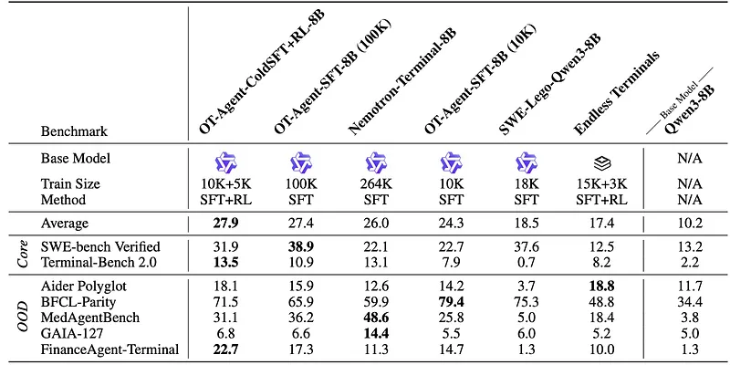

- **SFT & RL Synergy**: RL applied on top of a moderately trained SFT checkpoint outperforms both pure distillation and RL-only training from base checkpoints, confirming that SFT provides foundational harness familiarity while RL sharpens execution precision.

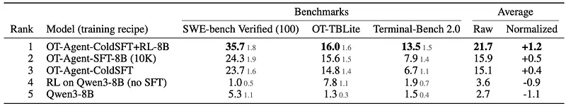

## Key Claims

- An open data pipeline built on systematic ablations can outperform proprietary data baselines on agentic benchmarks (Qwen3-32B reaching 44.8% on 7 benchmarks).
- Top-4 to Top-8 mixing of diverse task sources outperforms single-source and broadly diluted mixtures.
- In-place LLM task description augmentation is ineffective, whereas LLM difficulty filtering (response length signal) yields ~3pp gains.
- Stronger teacher models do not necessarily yield better student agents: GLM-4.7-AWQ produces superior agentic training traces compared to GPT-5.3-Codex and Kimi K2.5.
- Pruning agent trajectories with fewer than 5 turns significantly boosts downstream execution capability.
- SFT scaling plateaus unless task description diversity is scaled; surface-form rewriting expands base tasks (e.g., 902 Tezos tasks $\rightarrow$ 21K) effectively.
- In RL post-training, single-function unit-test contracts (`pymethods2test`) transfer better than real-world multi-file repos, inducing compact explore-patch-submit policies.
- RL on moderately strong SFT checkpoints beats both pure distillation and RL-from-scratch.

## Figures

| Figure | Caption | Page |
|--------|---------|------|
|  | Papers Explained 587: OpenThoughts Agent overview and benchmark performance. | Overview |
|  | OpenThoughts-Agent Full Data Pipeline. | SFT Pipeline |
|  | Full task generation strategy ranking across 95 strategies. | SFT Pipeline |
|  | Mixing top-ranked task generation strategies, random shuffle within task. | SFT Pipeline |
|  | Task description augmentation strategies are within noise. | SFT Pipeline |
|  | Filtering task descriptions with LLM-based difficulty signals improves performance. | SFT Pipeline |
|  | Teacher model ablation: stronger model $\neq$ better teacher. | SFT Pipeline |
|  | Filtering agent rollouts: keeping longer trajectories (≥5 turns) helps. | SFT Pipeline |
|  | Data source strongly influences agentic RL performance. | Reinforcement Learning |
|  | RL main results (8B scale) across core and out-of-distribution benchmarks. | Reinforcement Learning |
|  | RL on top of moderately strong SFT outperforms other strategies. | Reinforcement Learning |

## Entities

- [[OpenThoughts]] — research collective producing open data recipes and datasets for reasoning and agentic models.
- [[Qwen]] — base model family (Qwen3-8B for ablations, Qwen3-32B for final OpenThinker-Agent-v1).
- [[Agent Harness]] — execution wrapper (`terminus-2`) running in Daytona sandboxes for rollout generation and evaluation.
- [[Agentic AI]] — task-oriented autonomous problem solving, tool use, and environment interaction.
- [[RL Environments]] — sandbox environments used for trajectory collection and binary test verification.
- [[Reinforcement Learning Topic]] — post-training RL via RLOO with verifier feedback.
- [[Synthetic Data]] — task synthesis, instruction rewriting, and rollout curation recipes.
- [[Evaluation and Benchmarks]] — benchmark suite including OpenThoughts-TBLite, SWE-Bench Verified, Terminal-Bench 2.0, GAIA, BFCL.

## Questions & Gaps

- The precise failure modes of GPT-5.3-Codex as a teacher (e.g., whether it relies on latent assumptions not verbalized in the trajectory) warrant deeper qualitative analysis.
- Transferability of the single-function `pymethods2test` RL policy to massive multi-repo industrial codebases with deeply nested build tools requires further exploration.
- The compute cost of running Daytona sandboxes across 100K trajectories versus lighter local containerization was not detailed.

## Related

- [[Papers Explained 394 - OpenThoughts]] — original OpenThoughts reasoning dataset.
- [[Papers Explained 468 - NaturalThoughts]] — naturalistic reasoning trace curation.
- [[Papers Explained 547 - Terminal-Bench]] — terminal execution benchmark referenced in TBLite.
- [[Agent Harness]] — agent harness design and execution sandboxes.
- [[RL Environments in the LLM Era]] — environment scaling and sandbox architecture.
- [[Putting RL Back in RLHF]] — RLOO formulation used for agentic RL.
- [[Synthetic Data]] — synthetic instruction generation and data curation.
- [[On-Policy Distillation]] — teacher-to-student rollout distillation dynamics.
