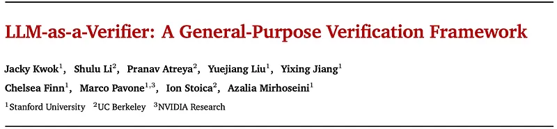
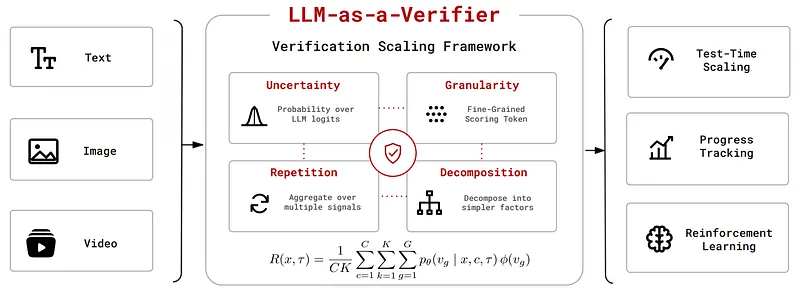
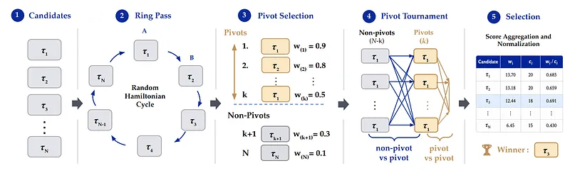
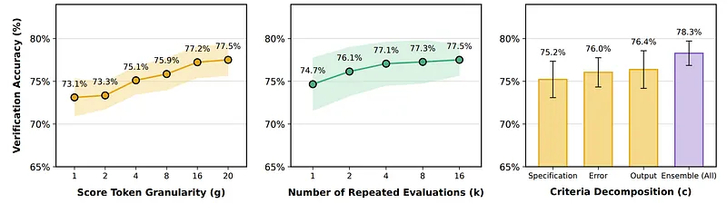
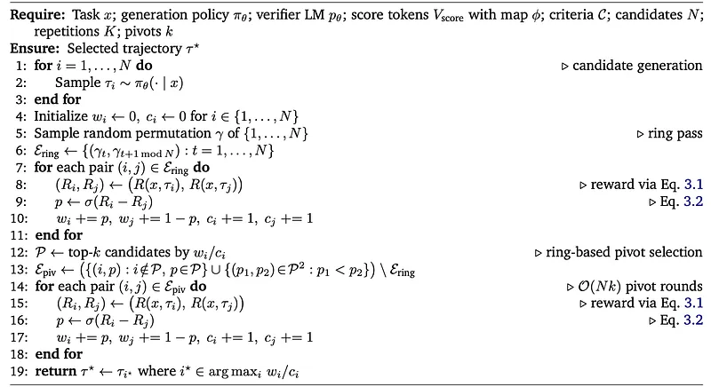

# Papers Explained 588: LLM-as-a-Verifier

**Source**: `raw/2026-08-05_Papers-Explained-588--LLM-as-a-Verifier-58c8ab45fb3f.md`  
**Paper**: https://arxiv.org/abs/2607.05391  
**GitHub**: https://github.com/llm-as-a-verifier/llm-as-a-verifier  
**Ingested**: 2026-08-23  
**Tags**: #summary

## Summary

**LLM-as-a-Verifier** is a general-purpose verification framework that provides fine-grained, continuous feedback for agentic tasks without requiring additional training or dedicated reward models. Unlike standard LLM judges that produce discrete, coarse scores for candidate solutions, LLM-as-a-Verifier extracts the conditional next-token distribution over an ordered set of scoring tokens $V_{score} = \{v_1, \dots, v_G\}$ and calculates the expectation over the score token logits. This yields a continuous, high-resolution reward $R(x, \tau) \in [0, 1]$ for any trajectory $\tau$ conditioned on task prompt $x$ and domain criterion $c$.

### Continuous Reward & Bradley–Terry Preferences

For two candidate trajectories $\tau_i$ and $\tau_j$, the verifier prompts an off-the-shelf LLM (such as Gemini 2.5 Flash) with task $x$, sub-criteria $c$, and candidate trajectories, prompting it to output scores within `<score_A>` and `<score_B>` tags using a letter-based scale (mapped to scalars $\varphi(v_g)$). The trajectory reward is computed by averaging across $C$ evaluation sub-criteria and $K$ repeated evaluations:

$$R(x, \tau) = \frac{1}{C} \sum_{c=1}^C \frac{1}{K} \sum_{k=1}^K \sum_{g=1}^G p_\theta(v_g \mid x, c, \tau) \varphi(v_g)$$

These continuous rewards are converted into pairwise preferences using the Bradley–Terry formulation, treating $R(x, \tau)$ as latent solution quality:

$$P(\tau_i \succ \tau_j \mid x) = \frac{1}{1 + e^{-(R(x, \tau_i) - R(x, \tau_j))}}$$

### Probabilistic Pivot Tournament (PPT)

Standard round-robin pairwise verification across $N$ candidate trajectories requires $\mathcal{O}(N^2)$ LLM calls, becoming prohibitively expensive as $N$ grows. The authors propose the **Probabilistic Pivot Tournament (PPT)**, which cuts query complexity to $\mathcal{O}(Nk)$ where $k \ll N$:

1. **Ring Pass**: Sample a uniformly random Hamiltonian cycle $\gamma$ over $\{1, \dots, N\}$ and evaluate adjacent pairs $(\tau_i, \tau_{\gamma(i)})$.
2. **Pivot Selection**: Rank all candidates by their ring-pass win-rates $w_i / c_i$ and select the top-$k$ candidates as the pivot set $\mathcal{P}$.
3. **Pivot Rounds**: Evaluate all non-pivot vs. pivot pairs and pivot vs. pivot pairs. Aggregate all comparison scores into normalized preference tallies $w_i / c_i$.

### Verification Scaling Levers

Verification accuracy scales along three independent, complementary axes:
- **Granularity ($G$)**: Increasing the number of discrete score tokens (e.g., $G=1 \to 20$) maps subtle distinctions in model belief into continuous output, boosting accuracy from 73.1% to 77.5%.
- **Repetition ($K$)**: Repeated evaluations shrink the variance by $\mathcal{O}(1/K)$, increasing accuracy from 74.7% ($K=1$) to 77.4% ($K=16$).
- **Criteria Decomposition ($C$)**: Decomposing monolithic instructions into $C$ distinct sub-criteria prevents conflation and improves accuracy from 75.2% to 78.3%.

### VOC & Dense RL Rewards

The continuous verifier output acts as an effective proxy for intermediate task progress, measured by the **Value-Order Correlation (VOC)** (Spearman rank correlation between step index and prefix verification score). Using continuous PPT scores as dense rewards in on-policy and off-policy RL provides sample-efficient policy optimization without needing specialized PRM training or domain-specific reward engineering.

## Key Claims

- Expectation over score-token logprobs turns standard LLMs into continuous, high-resolution verifiers without training.
- Probabilistic Pivot Tournament (PPT) cuts verification cost from $\mathcal{O}(N^2)$ to $\mathcal{O}(Nk)$ while allocating budget to top candidates.
- Three independent scaling levers (Granularity $G$, Repetition $K$, Criteria $C$) synergistically improve verification accuracy on Terminal-Bench 2.0.
- Value-Order Correlation (VOC) confirms continuous verifier scores track true step-by-step agent progress.
- Continuous verifier rewards act as drop-in dense rewards for RL, improving sample efficiency across reasoning and agent tasks.

## Figures

| Figure | Caption | Page |
|--------|---------|------|
|  | Papers Explained 588: LLM-as-a-Verifier overview banner. | Overview |
|  | Scoring prompt and logprob extraction setup. | Methodology |
|  | Continuous reward formulation. | Methodology |
|  | Bradley-Terry preference probability conversion. | Methodology |
|  | Round-robin tournament formulation. | Methodology |
|  | Probabilistic Pivot Tournament (PPT) workflow. | PPT |
|  | PPT with Ring-based Pivot Selection algorithm diagram. | PPT |
|  | Verification scaling across Granularity G, Repetition K, and Criteria C. | Scaling |
|  | Value-Order Correlation (VOC) formulation for step-level progress. | VOC |

## Entities

- [[LLM-as-a-Verifier]] — general-purpose continuous logprob expectation verification framework.
- [[Probabilistic Pivot Tournament]] — budget-efficient tournament selection algorithm scaling at $\mathcal{O}(Nk)$.
- [[Value-Order Correlation]] — Spearman rank correlation metric measuring alignment between step index and prefix verifier score.
- [[Agentic AI]] — multi-step trajectory evaluation and tool-use verification.
- [[Evaluation and Benchmarks]] — agent and reasoning evaluation benchmarks (Terminal-Bench 2.0).
- [[Reinforcement Learning Topic]] — dense reward guidance for on-policy and off-policy RL.

## Questions & Gaps

- Sensitivity to logprob calibration across different model families (e.g. proprietary closed API logprob truncation).
- Runtime overhead of running multi-turn PPT on large candidate sets ($N > 64$) during online RL rollouts.
- Robustness of criteria decomposition against adversarial or contradictory sub-rubrics.

## Related

- [[Understanding the 4 Main Approaches to LLM Evaluation (From Scratch)]] — LLM-as-a-Judge and verifier paradigms.
- [[Papers Explained 587: OpenThoughts Agent]] — agentic trajectory filtering and verifier feedback.
- [[Papers Explained 553 - Rubrics as Rewards]] — rubric-based reward signals.
- [[Papers Explained 600: Rubric Dropout]] — mitigating verifier exploitation in rubric RL.
- [[Reward Hacking]] — verifier exploitation failure modes.
