# Papers Explained 589: Weak-to-Strong On-Policy Distillation

**Source**: `raw/2026-08-06_Papers-Explained-589--Weak-to-Strong-On-Policy-Distillation-6dd143fcdd0b.html`  
**Paper**: https://arxiv.org/abs/2607.26246  
**Ingested**: 2026-08-23  
**Tags**: #summary

## Summary

**Weak-to-Strong On-Policy Distillation (W2S-OPD)** examines how a weaker student model can effectively learn from a stronger, larger teacher through on-policy distillation. In standard supervised knowledge distillation (off-policy), the student is trained on teacher-generated outputs, which leads to substantial exposure bias and compounding distribution shift at test time. In on-policy distillation (such as Generalized Knowledge Distillation, GKD), the student generates rollouts from its own distribution $y \sim p_S(\cdot \mid x)$ and minimizes a divergence (such as reverse KL or forward KL) with respect to teacher token-level probabilities $p_T(\cdot \mid x, y_{<t})$.

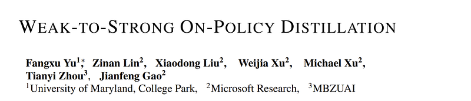

### Distillation Regimes & Asymmetric Capacity

The paper systematically analyzes weak-to-strong knowledge transfer across varying model scale disparities (e.g., 1B to 8B, 8B to 70B, and small-to-frontier setups). In weak-to-strong regimes, the student's expressivity and policy coverage are strictly smaller than the teacher's. 

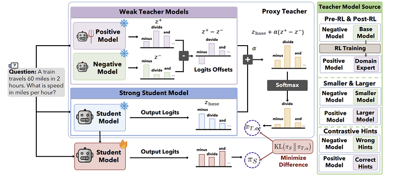

Key findings include:
1. **Reverse KL Mode-Seeking Advantage**: While Forward KL forces the student to cover all modes of the teacher (leading to blurry distributions and hallucinations when the student lacks capacity), Reverse KL $\mathbb{D}_{KL}(p_S \parallel p_T)$ acts as a mode-seeking objective. On student-generated tokens, reverse KL penalizes the student for placing probability mass where the teacher has low probability, steering the weak student toward high-precision modes it can reliably execute.
2. **On-Policy Error Recovery**: Training on student mistakes allows the teacher to provide corrective feedback at the exact bifurcation tokens where the weak student tends to drift off track.
3. **Exploration vs. Exploitation Balance**: Temperature scheduling during student rollout generation significantly affects weak-to-strong distillation quality. Moderate exploration temperatures enable the teacher to critique near-distribution edge cases without overwhelming the weak student with unrecoverable off-distribution sequences.

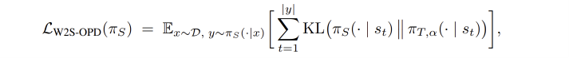

## Key Claims

- On-policy distillation reliably transfers complex reasoning and instruction capabilities from frontier teachers to compact students, outperforming static SFT distillation.
- Reverse KL optimization on on-policy samples provides a strong mode-seeking inductive bias suitable for capacity-limited student models.
- Corrective feedback on student-generated error trajectories resolves exposure bias and mitigates cascading inference errors.
- Weak-to-strong transfer efficiency scales with teacher reasoning capability and student token capacity.

## Figures

| Figure | Caption | Page |
|--------|---------|------|
|  | Papers Explained 589 banner. | Overview |
|  | Weak-to-strong on-policy distillation framework. | Methodology |
|  | Reverse KL vs. Forward KL objective dynamics on student trajectories. | Methodology |
|  | Downstream performance comparisons across student model sizes. | Experiments |
| 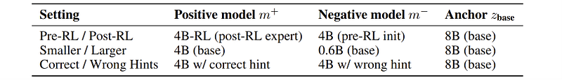 | Training dynamics and loss curves across distillation regimes. | Experiments |
| 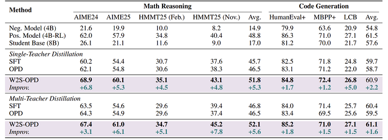 | Impact of rollout temperature on distillation quality. | Ablations |
| 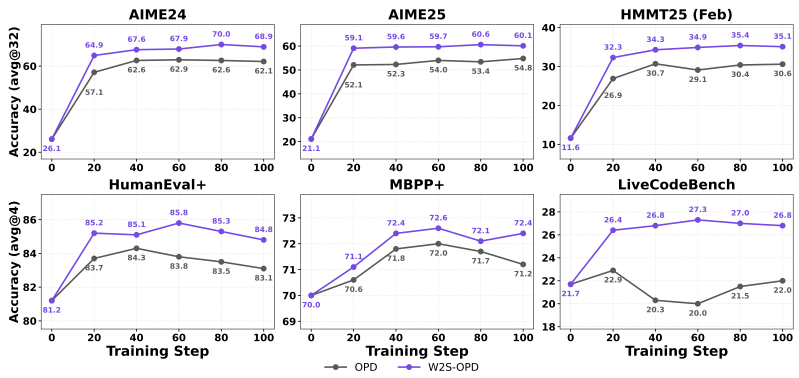 | Error recovery and correction rate on reasoning benchmarks. | Ablations |
| 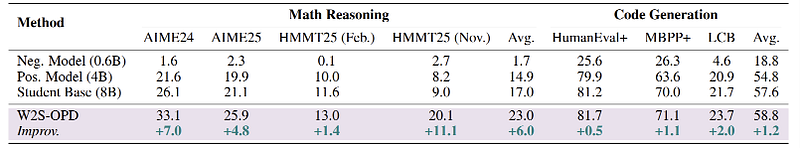 | Token-level divergence distribution between student and teacher. | Analysis |
| 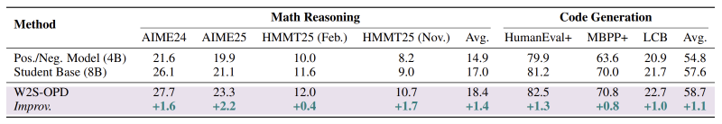 | Benchmark accuracy across Math, Code, and General Reasoning tasks. | Results |
| 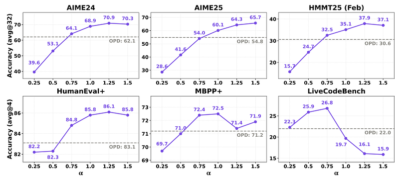 | Comparison against offline SFT and RL baselines. | Results |
|  | Scaling behavior with increasing teacher model scale. | Scaling |
| 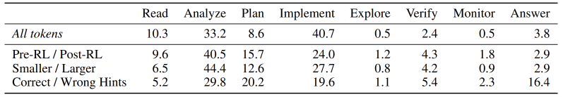 | Compute vs. performance trade-off in weak-to-strong distillation. | Efficiency |
| 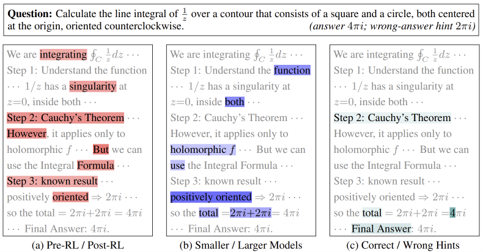 | Qualitative case studies of corrective error guidance. | Qualitative |

## Entities

- [[On-Policy Distillation]] — training regime where student samples trajectories and receives teacher feedback.
- [[Weak-to-Strong Generalization]] — paradigm of steering or supervising stronger models/teachers with weaker counterparts or transferring frontier capabilities down to compact students.
- [[Generalized Knowledge Distillation]] — foundational on-policy distillation framework.
- [[Model Distillation]] — model compression and capability transfer techniques.
- [[Reasoning Models]] — multi-step reasoning transfer.

## Questions & Gaps

- Long-horizon multi-step reasoning stability when the student model capacity is below 1B parameters.
- Memory and throughput cost of keeping both large teacher inference and student backpropagation in the same training cluster.

## Related

- [[On-Policy Distillation]] — unified topic page on on-policy KD methods.
- [[Distillation Regimes Compared]] — comparison of classical KD, SFT distillation, and on-policy KD.
- [[Papers Explained 591: Generalized Knowledge Distillation]] — foundational GKD formulation.
- [[Papers Explained 592: Self-Distilled Reasoner]] — self-distillation variant of on-policy learning.
- [[Model Compression and Efficiency]] — broader efficiency and distillation taxonomy.
