# Papers Explained 590: Nemotron 3 Nano Omni

**Source**: `raw/2026-08-07_Papers-Explained-590--Nemotron-3-Nano-Omni-7761aa5c9e09.html`  
**Paper**: https://arxiv.org/abs/2604.24954  
**Ingested**: 2026-08-23  
**Tags**: #summary

## Summary

**Nemotron-3-Nano-Omni** is NVIDIA's natively multimodal, omni-capable language model designed for efficient edge deployment and long-context multimodal understanding across text, high-resolution document images, video, and streaming speech/audio. Operating at the compact 3.2B parameter scale, Nemotron-3-Nano-Omni unifies text generation, spoken dialogue, visual question answering, document parsing, and video reasoning within a single end-to-end architecture.

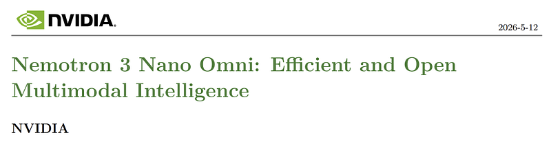

### Model Architecture

The model combines a compact transformer language backbone with specialized cross-modal encoders and tokenizers:
- **Speech/Audio Subsystem**: Uses a convolutional acoustic encoder paired with a discrete neural audio codec for bidirectional real-time audio interaction and low-latency full-duplex speech.
- **Vision Subsystem**: Leverages a high-resolution ViT visual encoder with dynamic patch splitting to handle ultra-dense document scans, charts, and video frame sequences up to native 128k context lengths.
- **Unified Multimodal Projector**: Cross-modal linear and MLP adapters project audio and visual representations directly into the unified token embedding space of the language backbone.

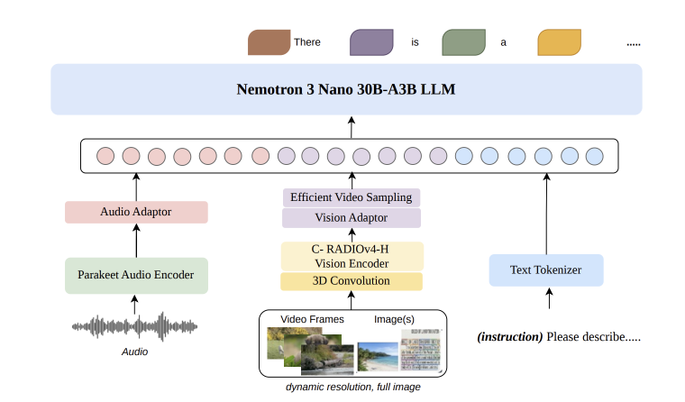

### Multi-Stage Training Pipeline

1. **Modal Pre-Training**: Pre-training the visual encoder on diverse OCR, image-captioning, and video datasets, while the audio codec is pretrained on multi-speaker conversational audio.
2. **Cross-Modal Alignment**: Joint continuous representation learning aligning speech tokens and visual patch embeddings with the pretrained text decoder.
3. **Omni Supervised Fine-Tuning (SFT)**: High-quality omni-instruction data covering document understanding, complex chart extraction, multi-turn speech conversations, and agent tool execution.
4. **Multimodal Alignment (RLVR / DPO)**: Preference optimization and rule-based verification aligning speech naturalness, instruction compliance, and factuality.

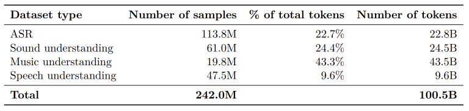

## Key Claims

- Compact 3.2B omni-multimodal model matching or exceeding prior 7B-class multimodal baselines on speech, vision, and document benchmarks.
- Native speech-to-speech support with low-latency full-duplex conversational capabilities.
- 128K long-context video and document understanding enabled by efficient visual compression.
- Edge-friendly deployment profile optimized for NVIDIA TensorRT-LLM on RTX GPUs and Jetson platforms.

## Figures

| Figure | Caption | Page |
|--------|---------|------|
|  | Papers Explained 590: Nemotron 3 Nano Omni overview banner. | Overview |
|  | Nemotron 3 Nano Omni architecture diagram. | Architecture |
| 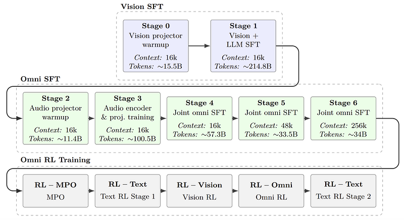 | Audio encoder and speech tokenization pipeline. | Audio |
| 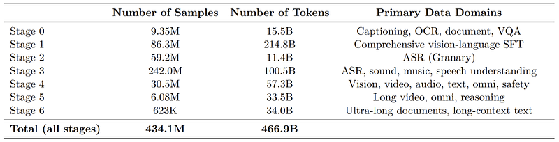 | Visual patch representation and dynamic document tiling. | Vision |
|  | Multi-benchmark performance comparison. | Evaluation |
| 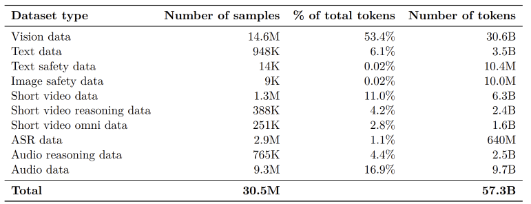 | Audio speech recognition and synthesis quality metrics. | Audio Eval |
| 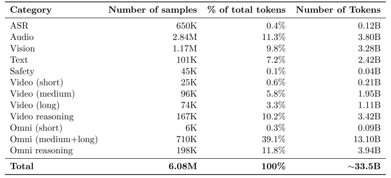 | Document AI and OCR benchmark results. | Document Eval |
| 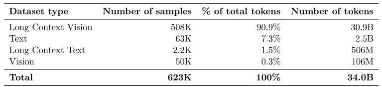 | Long-context video understanding evaluation. | Video Eval |
| 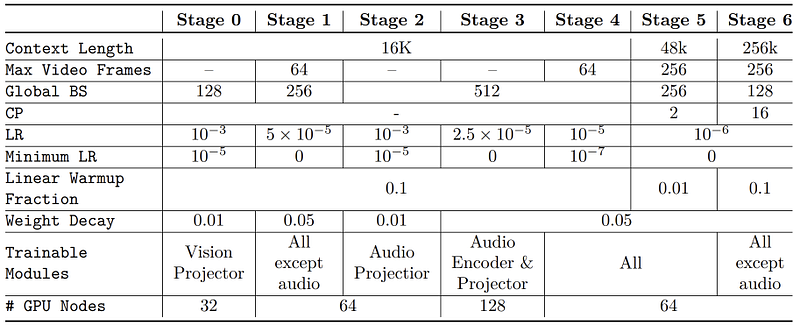 | Training loss curves and cross-modal alignment dynamics. | Training |
| 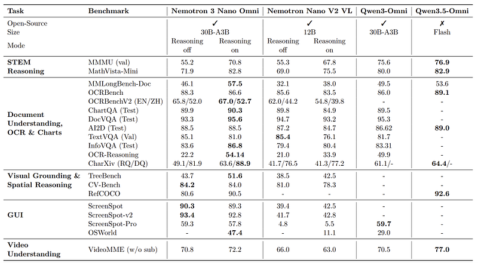 | Latency and throughput benchmarks across edge devices. | Deployment |
| 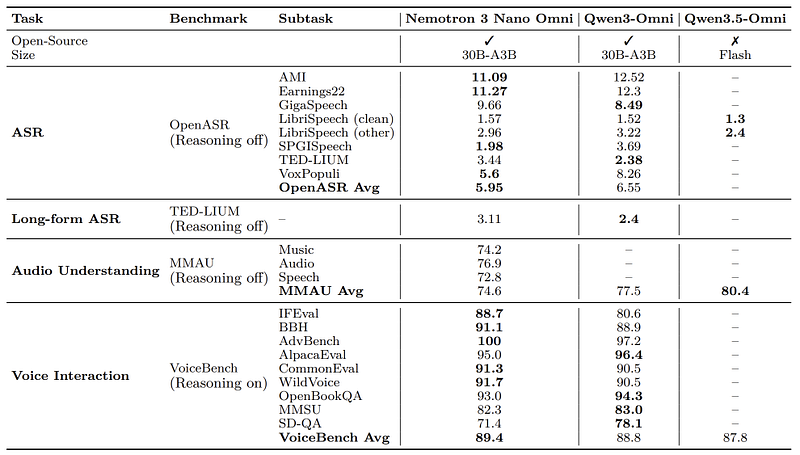 | Audio-visual reasoning qualitative examples. | Qualitative |
| 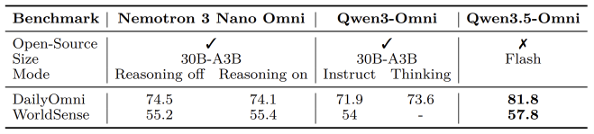 | Chart and diagram reasoning qualitative examples. | Qualitative |
| 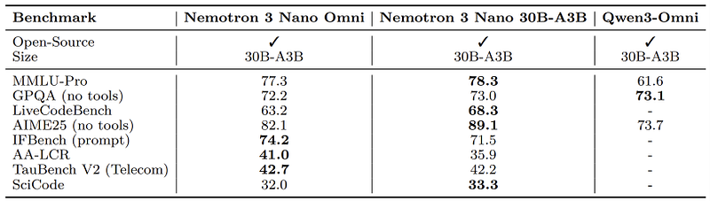 | Speech full-duplex turn-taking demonstration. | Qualitative |
| 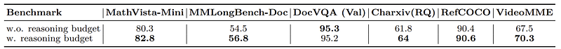 | Comparison of vision encoders and token reduction methods. | Ablations |
| 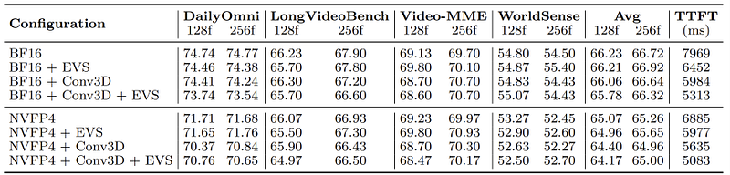 | Speech tokenization vs. continuous audio embedding ablation. | Ablations |
| 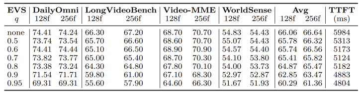 | SFT vs. RLVR alignment progression. | Alignment |

## Entities

- [[NVIDIA]] — creator of the Nemotron family.
- [[Nemotron 3 Nano Omni]] — 3.2B native omni-multimodal model for text, vision, video, and speech.
- [[Vision Language Models]] — multimodal visual perception and document understanding.
- [[Audio Models]] — speech tokenization, recognition, and voice generation.
- [[Document AI]] — high-resolution document and chart understanding.
- [[Model Compression and Efficiency]] — compact edge model architecture.

## Questions & Gaps

- Compute requirements for continuous pretraining across interleaved speech-video-text tokens.
- Cross-talk and interference dynamics between acoustic and visual latent spaces during multi-task SFT.

## Related

- [[Papers Explained 506 - Nemotron 3 Nano]] — text-only predecessor.
- [[Papers Explained 521 - Nemotron Nano V2 VL]] — vision-language predecessor.
- [[Papers Explained 580: Nemotron 3 Ultra]] — large-scale MoE model in the Nemotron 3 generation.
- [[Vision Language Models]] — visual and multimodal architectures.
- [[Audio Models]] — speech and acoustic modeling.
