# Papers Explained 591: Generalized Knowledge Distillation

**Source**: `raw/2026-08-10_Papers-Explained-591--Generalized-Knowledge-Distillation-52bebe2e0252.md`  
**Paper**: https://arxiv.org/abs/2306.13649  
**Ingested**: 2026-08-23  
**Tags**: #summary

## Summary

**Generalized Knowledge Distillation (GKD)** provides a unified mathematical and algorithmic framework for knowledge distillation in autoregressive sequence models. Standard sequence-level knowledge distillation trains the student on teacher-generated outputs via supervised cross-entropy (Forward KL on teacher data). However, this creates a severe **exposure bias** / distribution shift: at test time, the student generates from its own policy, encounters prefixes the teacher never demonstrated, and quickly accumulates errors.

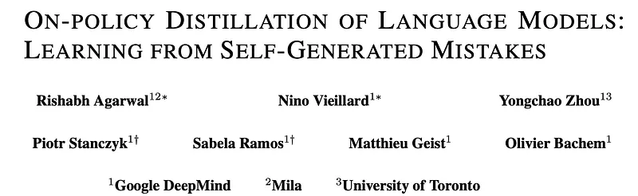

### GKD Framework Formulation

GKD generalizes distillation along two fundamental dimensions:
1. **Sampling Distribution**: The data distribution over which sequence prefixes are sampled. GKD interpolates between teacher/data distribution $p_{data}(y \mid x)$ and on-policy student distribution $p_S(y \mid x)$ using an on-policy mixture parameter $\lambda \in [0, 1]$:
$$y \sim (1 - \lambda) p_{data}(\cdot \mid x) + \lambda p_S(\cdot \mid x)$$
2. **Divergence Metric**: The statistical divergence minimized between teacher and student next-token probability distributions at each token step $t$. Options include:
   - **Forward KL**: $\mathbb{D}_{KL}(p_T \parallel p_S)$ (mode-covering; standard distillation)
   - **Reverse KL**: $\mathbb{D}_{KL}(p_S \parallel p_T)$ (mode-seeking; penalizes student hallucination on on-policy samples)
   - **Generalized Jensen-Shannon Divergence (JSD)**: $\text{JSD}_\beta(p_T, p_S) = \beta \mathbb{D}_{KL}(p_T \parallel m) + (1-\beta) \mathbb{D}_{KL}(p_S \parallel m)$ where $m = \beta p_T + (1-\beta) p_S$.

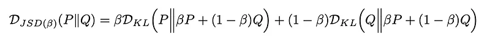

### On-Policy Student Rollouts & Error Recovery

When sampling on-policy ($\lambda = 1$), the student generates trajectories from its own current model parameters $p_S$. For every prefix $y_{<t}$, the teacher provides its full next-token probability distribution $p_T(\cdot \mid x, y_{<t})$. This teaches the student how to recover from its own sub-optimal prefixes, eliminating distribution shift and drastically improving generation quality, task accuracy, and robustness.

## Key Claims

- Standard distillation suffers from severe distribution shift because students never see their own mistakes during training.
- GKD unifies on-policy vs. off-policy data generation with flexible statistical divergences (Forward KL, Reverse KL, JSD).
- On-policy distillation with student rollouts ($y \sim p_S$) substantially outperforms standard teacher-forcing SFT across translation, summarization, and reasoning.
- Reverse KL on on-policy trajectories prevents mode-blurring and hallucinations in capacity-constrained student models.

## Figures

| Figure | Caption | Page |
|--------|---------|------|
|  | Papers Explained 591: GKD overview banner. | Overview |
|  | Unified GKD framework diagram. | Method |
|  | Divergence formulations: Forward KL, Reverse KL, and JSD. | Method |
| 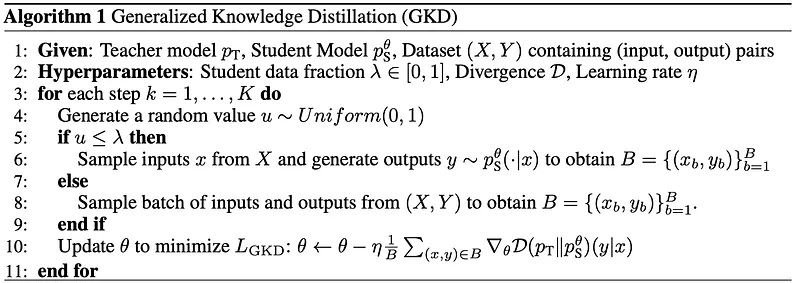 | Comparison of training trajectories between off-policy and on-policy KD. | Method |
|  | Downstream performance on text summarization and translation tasks. | Experiments |
| 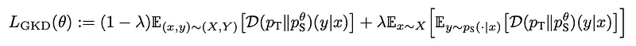 | Exposure bias analysis and error compounding curves. | Analysis |
|  | Impact of the on-policy mixing parameter lambda. | Ablations |
| 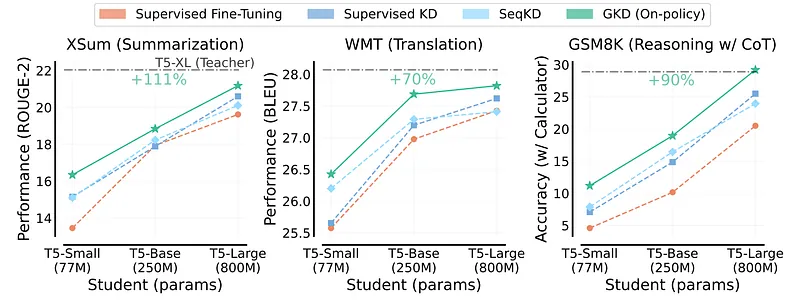 | Forward KL vs Reverse KL vs JSD comparative evaluation. | Ablations |
| 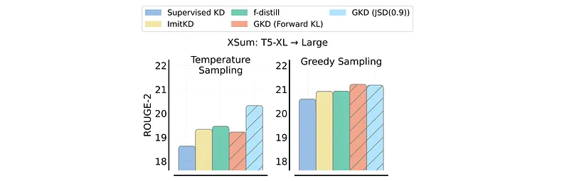 | Student model scale vs distillation efficiency. | Scaling |
| 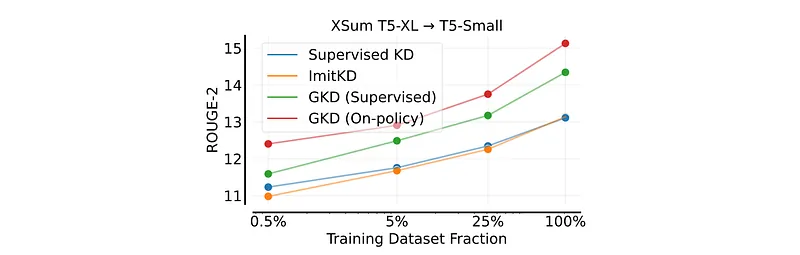 | Auto-regressive recovery rate from perturbed prefixes. | Analysis |
| 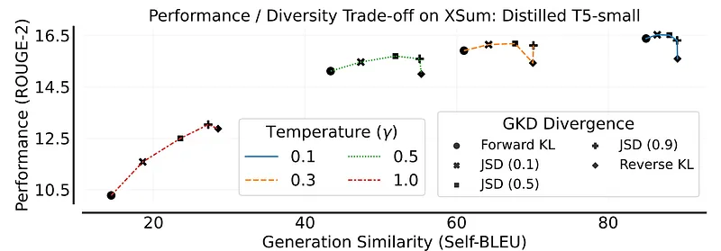 | Token-level cross-entropy loss progression during GKD training. | Training |
| 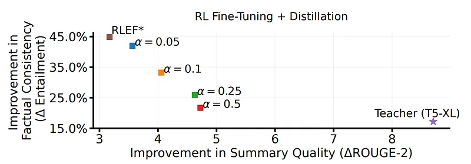 | Sample efficiency of on-policy distillation vs offline SFT. | Efficiency |
| 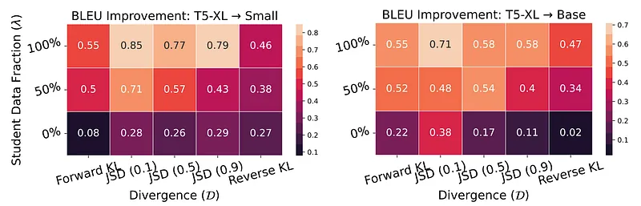 | Qualitative translation comparison showing error recovery. | Qualitative |
| 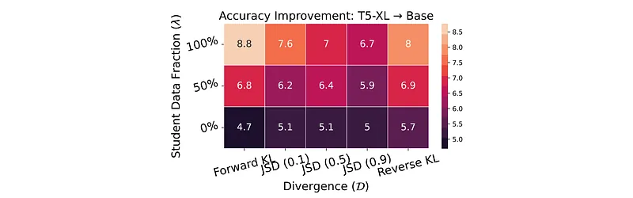 | Impact of student sampling temperature during rollout collection. | Ablations |
| 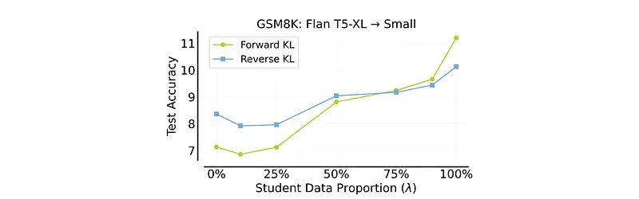 | Full-vocabulary vs top-p truncated teacher logit distillation. | Ablations |
| 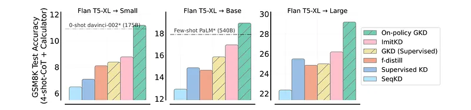 | GKD on instruction-tuned conversational benchmarks. | Results |
| 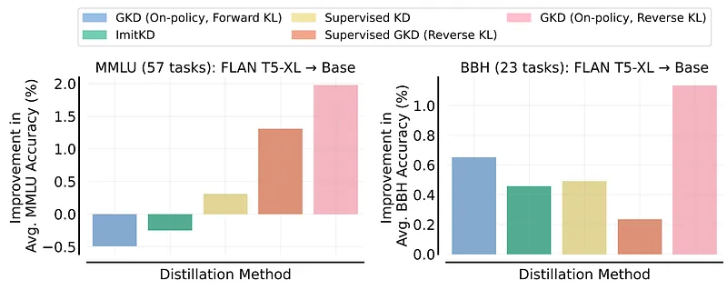 | Summary of mathematical guarantees and divergence bounds. | Theory |

## Entities

- [[Generalized Knowledge Distillation]] — Agarwal et al. (2023) unified on-policy distillation framework.
- [[On-Policy Distillation]] — general class of distillation algorithms sampling from student policies.
- [[Model Distillation]] — model compression and student-teacher transfer.
- [[KL Regularization]] — divergence constraints in policy learning.

## Questions & Gaps

- High compute overhead of online teacher forward-passes for every student-generated token.
- Applicability to multi-turn agentic environments with non-differentiable tool outputs.

## Related

- [[On-Policy Distillation]] — broader overview and taxonomy of on-policy KD.
- [[Distillation Regimes Compared]] — SFT vs KD vs On-Policy Distillation.
- [[Papers Explained 589: Weak-to-Strong On-Policy Distillation]] — weak-to-strong scaling extension.
- [[Papers Explained 592: Self-Distilled Reasoner]] — self-distillation application of on-policy KD.
- [[Papers Explained 593: Self-Distillation Fine-Tuning]] — continual learning via self-distillation.
