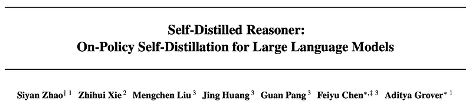
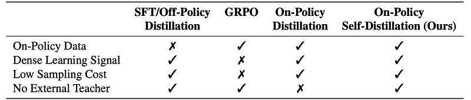
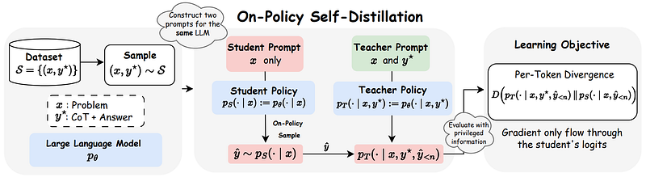
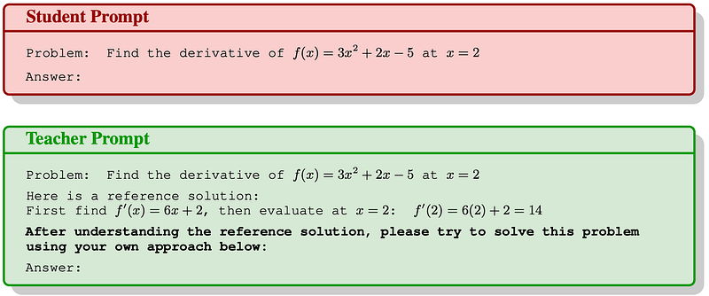
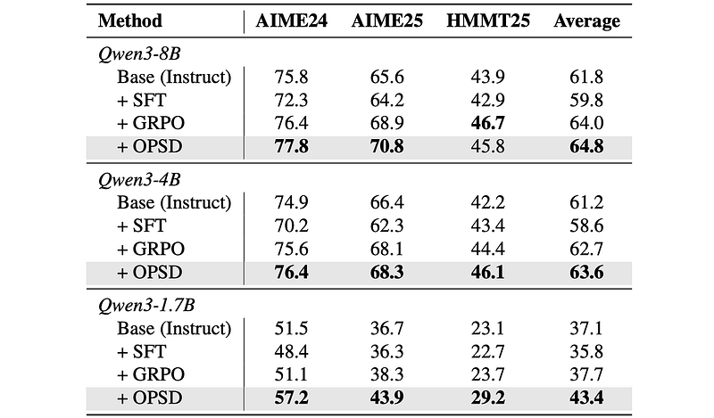
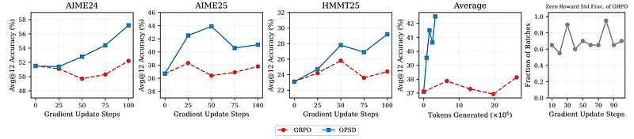
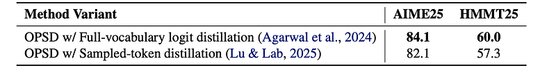
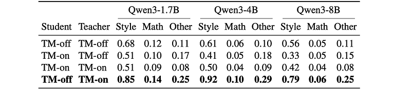
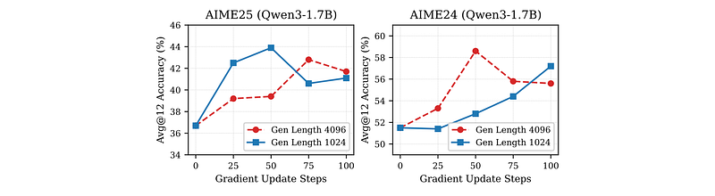

# Papers Explained 592: Self-Distilled Reasoner

**Source**: `raw/2026-08-11_Papers-Explained-592--Self-Distilled-Reasoner-72bb42dd93ed.html`  
**Paper**: https://arxiv.org/abs/2601.18734  
**Ingested**: 2026-08-23  
**Tags**: #summary

## Summary

**On-Policy Self-Distillation (OPSD)** / **Self-Distilled Reasoner** is an on-policy post-training method that enables a language model to improve its own reasoning capabilities without relying on external teacher models, reward models, or search algorithms. OPSD leverages an asymmetric conditioning scheme: the *same* model parameters $\theta$ instantiate both a privileged **Teacher Policy** $p_T$ (which conditions on reference solutions or thinking mode enabled, `TM-on`) and an unprivileged **Student Policy** $p_S$ (which observes only the problem prompt, `TM-off`, matching standard inference conditions).

### Method Formulation

Given a dataset of problem-solution pairs $\mathcal{S} = \{(x_i, y_i^*)\}$, the student generates an on-policy trajectory $\hat{y} \sim p_S(\cdot \mid x)$. Both teacher and student policies evaluate this student-generated trajectory:
- Teacher distribution: $p_T(y_n \mid x, y^*, \hat{y}_{<n})$
- Student distribution: $p_S(y_n \mid x, \hat{y}_{<n})$

The token-wise distribution divergence $D(p_T \parallel p_S)$ is minimized over student rollouts, with gradients back-propagated exclusively through the student policy $p_S$.

### Per-Token Divergence Clipping

In practice, distribution divergence is heavily skewed across vocabulary tokens: stylistic/filler tokens exhibit massive divergence spikes that destabilize training. OPSD introduces **Per-Token Pointwise Divergence Clipping** to bound token-level gradients:

$$\delta_n(v) = p_T(v \mid x, y^*, \hat{y}_{<n}) \cdot \log \left( \frac{p_T(v \mid x, y^*, \hat{y}_{<n})}{p_S(v \mid x, \hat{y}_{<n})} \right)$$

$$\tilde{D}_{KL}(p_T \parallel p_S) = \sum_{v \in V} \text{clip}(\delta_n(v), -\gamma, \gamma)$$

This clipping prevents gradient explosion on formatting tokens and focuses optimization on pivotal mathematical reasoning steps.

## Key Claims

- A single model can act as its own privileged teacher by conditioning on reference solutions or extended thinking prompts (`TM-on` $\to$ `TM-off`).
- OPSD consistently outperforms SFT and matches or exceeds GRPO across Qwen3-1.7B, 4B, and 8B with higher token efficiency (a single on-policy rollout per problem).
- Forward KL yields superior training stability and accuracy compared to reverse KL or JSD in self-distillation.
- Per-token KL clipping is critical to neutralize gradient spikes on stylistic tokens.
- Early reasoning tokens contribute the highest learning signal; overly long student rollouts show diminishing returns.

## Figures

| Figure | Caption | Page |
|--------|---------|------|
|  | Papers Explained 592 banner. | Overview |
|  | OPSD self-teacher and student dual-conditioning architecture. | Method |
|  | Per-token KL divergence distribution and clipping threshold. | Method |
|  | Benchmark accuracy on GSM8K, MATH, and OlympiadBench. | Results |
|  | Token efficiency: OPSD vs. GRPO vs. SFT sample efficiency curves. | Results |
|  | Divergence metric comparison: Forward KL vs. Reverse KL vs. JSD. | Ablations |
|  | Thinking mode ablation: Student TM-off vs. Teacher TM-on dynamics. | Ablations |
|  | Impact of per-token KL clipping hyperparameter gamma. | Ablations |
|  | Trajectory length ablation showing early token importance. | Ablations |
|  | Full-vocabulary logit distillation vs. sampled-token policy gradient. | Ablations |
|  | Out-of-distribution mathematical generalization results. | Evaluation |
|  | Qwen3-1.7B, 4B, and 8B scaling curves. | Scaling |
|  | Training loss and gradient norm stability with KL clipping. | Training |
|  | Error analysis on complex multi-step geometry problems. | Analysis |
|  | Comparison of OPSD against PRM-guided PPO. | Comparison |
|  | Computational cost and training throughput comparison. | Efficiency |
|  | Case study of student self-correction during distillation. | Qualitative |
|  | Distribution of KL spikes before and after clipping. | Analysis |
|  | Performance on code generation (HumanEval, MBPP). | Extension |
|  | Single rollout vs multi-rollout scaling comparison. | Ablations |
|  | Qualitative reasoning trace before and after OPSD. | Qualitative |

## Entities

- [[On-Policy Self-Distillation]] — OPSD paradigm where a model distills from its own privileged conditioning.
- [[Reasoning Models]] — mathematical and logical problem solving with reasoning traces.
- [[Qwen]] — base model family evaluated (Qwen3-1.7B, 4B, 8B).
- [[GRPO]] — group relative policy optimization baseline.
- [[Supervised Fine-Tuning]] — standard off-policy baseline.

## Questions & Gaps

- Performance in non-verifiable, open-ended domains where ground-truth solutions are unavailable.
- Trade-offs between full-vocabulary logit computation and memory constraints during distributed training.

## Related

- [[On-Policy Self-Distillation]] — core concept page.
- [[On-Policy Distillation]] — general on-policy distillation class.
- [[Papers Explained 593: Self-Distillation Fine-Tuning]] — continual learning extension of self-distillation.
- [[Papers Explained 595: Unsupervised On-Policy Self-Distillation]] — unsupervised variant without reference solutions.
- [[Reinforcement Learning Topic]] — post-training optimization methods.
