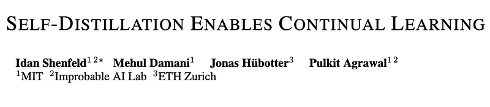
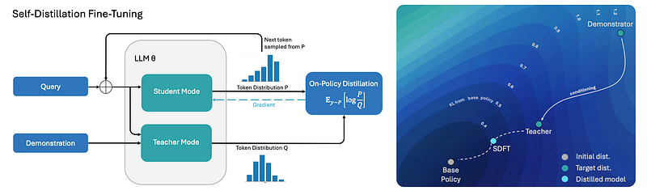
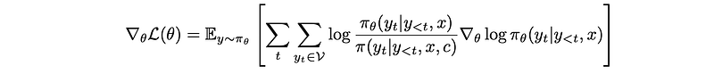
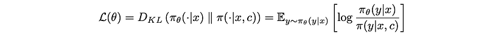
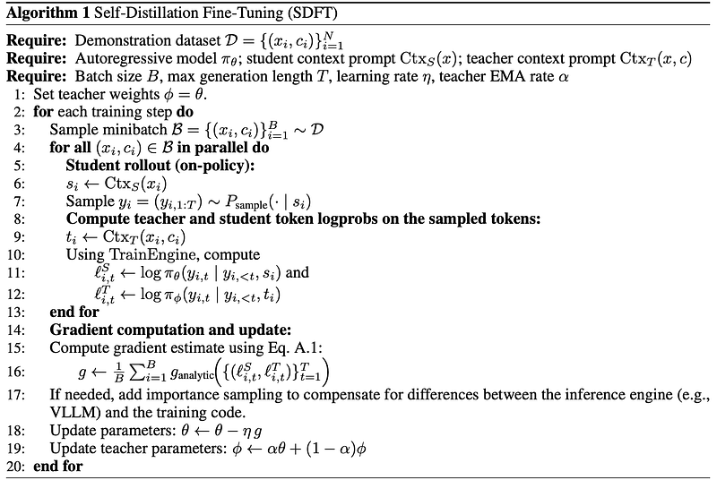
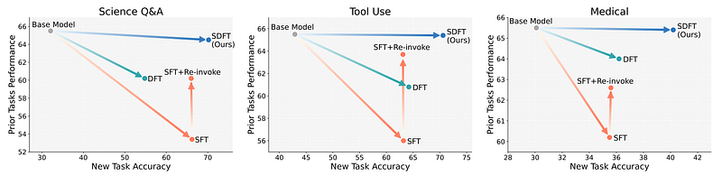
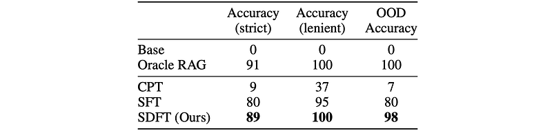
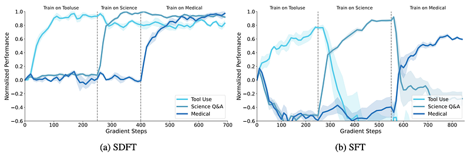
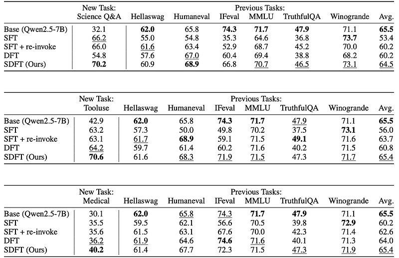

# Papers Explained 593: Self-Distillation Fine-Tuning

**Source**: `raw/2026-08-12_Papers-Explained-593--Self-Distillation-Fine-Tuning-651ba44d1163.html`  
**Paper**: https://arxiv.org/abs/2601.19897  
**Ingested**: 2026-08-23  
**Tags**: #summary

## Summary

**Self-Distillation Fine-Tuning (SDFT)** is an on-policy post-training technique that enables language models to acquire new skills and incorporate factual knowledge without catastrophic forgetting of prior capabilities. Standard supervised fine-tuning (SFT) forces the model to memorize static demonstrations, which frequently overwrites pre-existing representations and causes sharp degradation on general reasoning benchmarks. SDFT leverages in-context learning to construct an in-context teacher model $\pi(\cdot \mid x, c)$ from task demonstrations $c$ and trains the base model $\pi_\theta(\cdot \mid x)$ to match this in-context teacher on student-generated on-policy samples.

### Method and Reverse-KL Objective

For every prompt $x$, the student policy generates a response $y \sim \pi_\theta(\cdot \mid x)$. SDFT minimizes the token-level reverse Kullback-Leibler divergence with respect to the in-context teacher:

$$\mathcal{L}_{SDFT}(\theta) = \mathbb{E}_{x \sim \mathcal{D}, y \sim \pi_\theta(\cdot \mid x)} \left[ \sum_{t=1}^{|y|} \mathbb{D}_{KL}(\pi_\theta(\cdot \mid x, y_{<t}) \parallel \pi(\cdot \mid x, c, y_{<t})) \right]$$

Gradients are computed solely with respect to the student parameters $\theta$. Crucially, the in-context teacher is prompted to produce reasoned explanations rather than verbatim reproduction, allowing the student to internalize the underlying cognitive process.

### Skill Learning vs. Knowledge Acquisition

SDFT is evaluated on two primary post-training adaptation regimes:
1. **Skill Learning**: Acquiring narrowly defined capabilities (e.g. Science Q&A on SciKnowEval, Tool Use on ToolAlpaca, Clinical Reasoning on HuatuoGPT) without degrading broad world knowledge.
2. **Knowledge Acquisition**: Integrating new factual content not present during pretraining, evaluated via direct and indirect out-of-distribution (OOD) queries.

## Key Claims

- On-policy SDFT outperforms standard SFT on new downstream tasks in both in-distribution and out-of-distribution generalization.
- In sequential multi-task continual learning, SDFT retains prior benchmark capabilities (HellaSwag, TruthfulQA, ARC) with minimal degradation, whereas SFT suffers catastrophic forgetting.
- Eliminates oscillatory training losses in multi-task skill adaptation, supporting true cumulative learning directly from demonstrations.

## Figures

| Figure | Caption | Page |
|--------|---------|------|
|  | Papers Explained 593 banner. | Overview |
|  | SDFT in-context teacher construction and on-policy loss. | Method |
|  | Continual learning setup across sequential tasks. | Setup |
|  | In-distribution vs. previous capabilities retention (SDFT vs. SFT). | Results |
|  | Sequential multi-task learning accuracy curves over training rounds. | Results |
|  | Knowledge acquisition evaluation on direct and indirect OOD questions. | Results |
|  | Tool-use performance retention and API execution fidelity. | Results |
|  | Reverse KL vs. Forward KL loss comparison during continual fine-tuning. | Ablations |
|  | Number of in-context demonstration examples scaling analysis. | Ablations |

## Entities

- [[Self-Distilled Fine-Tuning]] — SDFT continual learning method.
- [[Supervised Fine-Tuning]] — traditional fine-tuning baseline.
- [[Catastrophic Forgetting]] — degradation of prior skills during sequential adaptation.
- [[Continual Learning]] — cumulative skill and knowledge acquisition in foundation models.

## Questions & Gaps

- Context window limitations when constructing in-context teachers for complex tasks requiring massive few-shot demonstration sets.
- Efficiency of compute during long continual learning trajectories compared to parameter-efficient fine-tuning (LoRA).

## Related

- [[Self-Distilled Fine-Tuning]] — existing concept page.
- [[On-Policy Self-Distillation]] — self-distillation family.
- [[Papers Explained 592: Self-Distilled Reasoner]] — reasoning-oriented self-distillation.
- [[Papers Explained 591: Generalized Knowledge Distillation]] — theoretical foundation.
