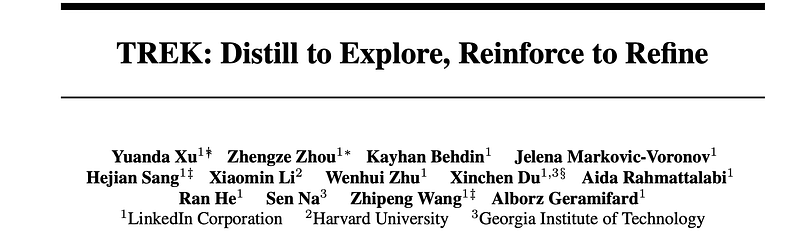
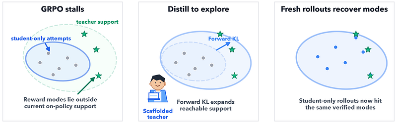
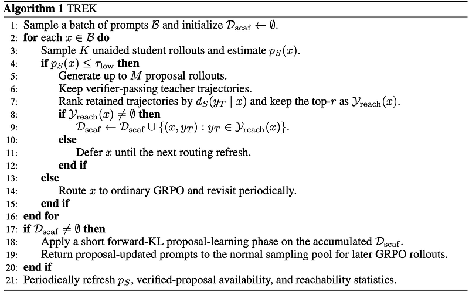
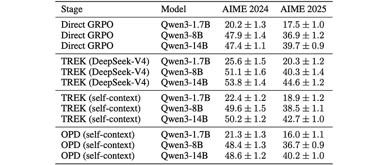
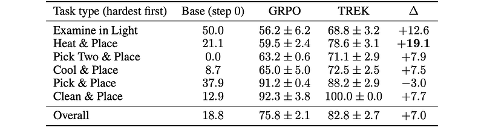

# Papers Explained 594: Teacher-Routed Exploration via Forward KL (TREK)

**Source**: `raw/2026-08-13_Papers-Explained-594--Teacher-Routed-Exploration-via-Forward-KL--TREK--da20a690b2ad.html`  
**Paper**: https://arxiv.org/abs/2607.05339  
**Ingested**: 2026-08-23  
**Tags**: #summary

## Summary

**Teacher-Routed Exploration via Forward KL (TREK)** addresses a fundamental exploration failure in reinforcement learning with verifiable rewards (RLVR) and on-policy distillation: when a student policy has near-zero probability on the correct reasoning path, standard on-policy sampling never generates it, causing RL updates to stall. Standard teacher guidance (such as SFT or standard distillation) often induces distribution mismatch or forces the student into paths it cannot complete. TREK introduces an intelligent **Prompt Routing** mechanism combined with **Forward KL** guidance: when a student fails to reach a correct solution, prompts are dynamically routed to a stronger teacher to supply high-probability proposal trajectories, while on-policy exploration refines the student policy.

### Method and Reachability Mechanism

TREK formally defines the *reachability* of a problem: whether the student policy $\pi_\theta$ can generate at least one valid trajectory with non-zero probability.
1. **Prompt Routing**: Prompts are categorized into Student-Reachable and Student-Unreachable sets. Unreachable prompts trigger teacher intervention.
2. **Proposal Learning (Forward KL)**: The student is guided toward teacher proposals using Forward KL divergence $\mathbb{D}_{KL}(p_T \parallel p_S)$, which exhibits mode-covering behavior that broadens the student's reachability envelope without collapsing into premature local minima.
3. **On-Policy Refinement**: Once reachability is restored, on-policy policy gradients (or reverse KL distillation) refine the student policy toward mode-seeking precision.

## Key Claims

- Unreachable reasoning tasks cause standard on-policy RLVR and reverse-KL distillation to plateau due to lack of positive reward signals.
- Forward KL guidance on teacher-routed proposals expands the support of the student policy, restoring reachability.
- Combining teacher-routed forward KL exploration with on-policy refinement significantly accelerates convergence on difficult math and coding benchmarks.

## Figures

| Figure | Caption | Page |
|--------|---------|------|
|  | Papers Explained 594 banner. | Overview |
|  | TREK prompt routing and exploration mechanism. | Method |
|  | Reachability bottleneck in standard on-policy RL. | Analysis |
|  | Forward KL proposal learning vs on-policy refinement. | Method |
|  | Benchmark accuracy progression on complex reasoning datasets. | Results |
|  | Sample efficiency comparison: TREK vs RLVR vs GKD. | Efficiency |
|  | Exploration coverage heatmaps across problem difficulty tiers. | Analysis |
|  | Routing threshold and teacher query budget ablation. | Ablations |
|  | Forward KL vs Reverse KL during proposal phase. | Ablations |
|  | Performance on MATH, AIME, and Codeforces problems. | Evaluation |
|  | Training stability curves and policy entropy. | Training |
|  | Reachability recovery rate across training iterations. | Results |
|  | Qualitative trajectory case study of teacher routing. | Qualitative |

## Entities

- [[TREK]] — Teacher-Routed Exploration via Forward KL framework.
- [[On-Policy Distillation]] — distillation with on-policy trajectories.
- [[Reasoning Models]] — multi-step reasoning capabilities.
- [[Reinforcement Learning Topic]] — RL exploration techniques.

## Questions & Gaps

- Managing teacher query budgets when scaling to millions of synthetic reasoning problems.
- Dynamic adaptation of the routing threshold during training as the student becomes progressively stronger.

## Related

- [[On-Policy Distillation]] — core distillation framework.
- [[Papers Explained 591: Generalized Knowledge Distillation]] — Forward vs. Reverse KL foundations.
- [[Papers Explained 592: Self-Distilled Reasoner]] — self-distillation reasoning.
- [[Exploration Strategies in Deep Reinforcement Learning]] — exploration methods.
