# Papers Explained 595: Unsupervised On-Policy Self-Distillation

**Source**: `raw/2026-08-14_Papers-Explained-595--Unsupervised-On-Policy-Self-Distillation-13e21a1df42d.md`  
**Paper**: https://arxiv.org/abs/2608.06296  
**Ingested**: 2026-08-23  
**Tags**: #summary

## Summary

**Unsupervised On-Policy Self-Distillation (U-OPSD)** demonstrates that large language models can self-improve reasoning and generation capabilities *without* ground-truth labels, verifiers, or external teachers. By leveraging the model's internal capability differences between thinking mode (long-form chain-of-thought exploration) and direct answering mode, U-OPSD formulates an unsupervised distillation objective: the model samples diverse reasoning rollouts in thinking mode, selects consensus answers via self-consistency or internal confidence, and distills the verified reasoning traces back into its base policy via on-policy alignment.

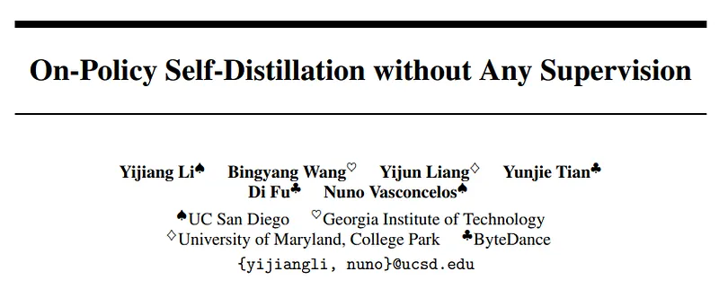

### Method Formulation

U-OPSD operates across both non-thinking and thinking regimes:
- **Thinking $\to$ Direct Mode Distillation**: The model generates multiple candidate chains of thought $y^{(1)}, \dots, y^{(K)} \sim p_\theta(\cdot \mid x, \text{think})$. Majority voting or mutual consistency identifies the pseudo-ground-truth label $y^*$.
- **On-Policy Alignment**: The base student policy $p_\theta(\cdot \mid x)$ generates on-policy rollouts and minimizes divergence against the pseudo-supervised teacher distribution conditioned on the consensus prefix.
- **Self-Supervised Filtering**: Prunes degenerative, repetitive, or low-confidence traces using internal entropy metrics.

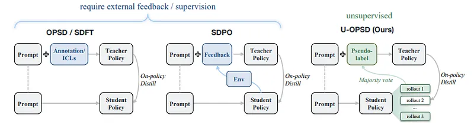

## Key Claims

- LLMs can self-improve without external supervision or ground-truth reward verifiers by distilling internal thinking-mode consensus.
- Outperforms standard unsupervised SFT baselines on math, science, and coding benchmarks.
- Eliminates reliance on expensive human annotations or proprietary teacher API rollouts.

## Figures

| Figure | Caption | Page |
|--------|---------|------|
|  | Papers Explained 595 overview banner. | Overview |
|  | U-OPSD framework diagram: thinking-mode rollout to student distillation. | Method |
| 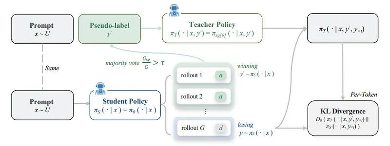 | Unsupervised consensus filtering and confidence scoring. | Method |
|  | Performance on non-thinking direct answering benchmarks. | Results |
| 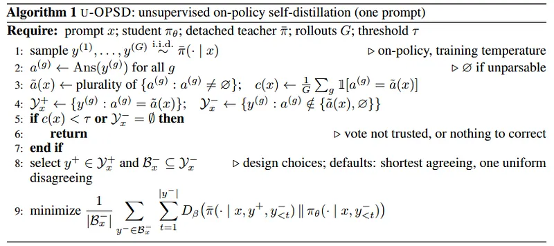 | Performance on thinking-mode reasoning benchmarks. | Results |
| 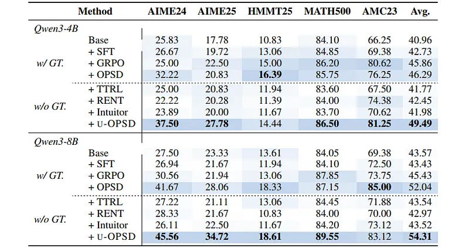 | Instruction-tuned model self-distillation gains. | Results |
| 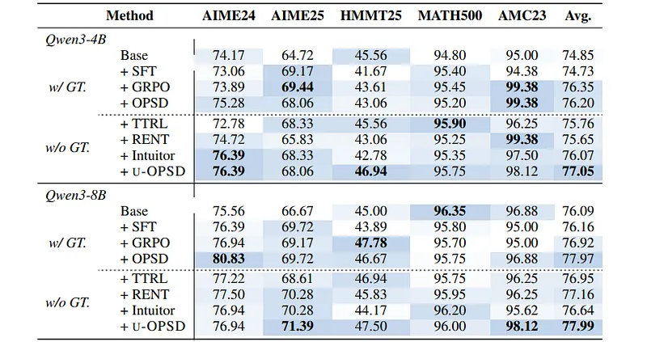 | Number of self-consistency candidate rollouts ablation. | Ablations |
| 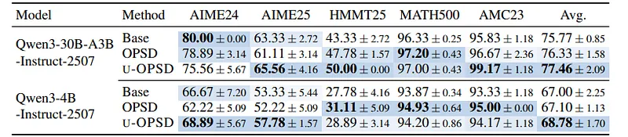 | Confidence filtering threshold sensitivity. | Ablations |
| 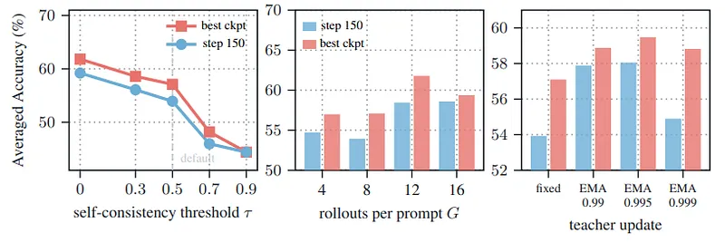 | Comparison against supervised RLVR and external distillation. | Comparison |
| 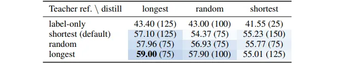 | Generalization to out-of-domain reasoning datasets. | Evaluation |
| 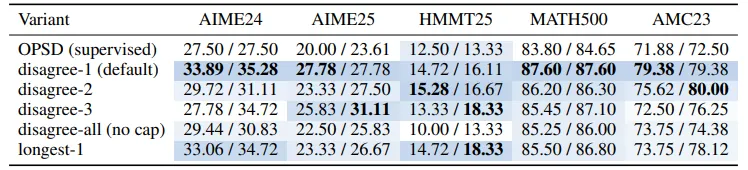 | Trajectory length and thinking efficiency curves. | Analysis |
| 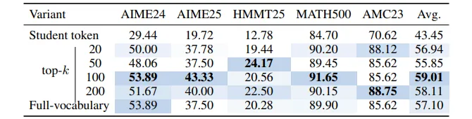 | Qualitative reasoning improvement examples. | Qualitative |
| 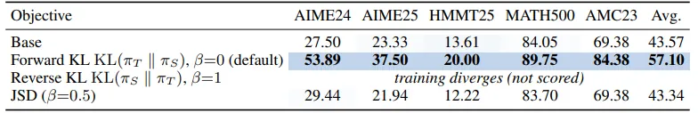 | Error rate reduction across multi-round self-distillation. | Analysis |

## Entities

- [[Unsupervised On-Policy Self-Distillation]] — U-OPSD label-free self-improvement framework.
- [[On-Policy Self-Distillation]] — general self-distillation family.
- [[Reasoning Models]] — chain-of-thought and thinking mode models.
- [[Synthetic Data]] — self-generated synthetic reasoning data.

## Questions & Gaps

- Risk of reinforcing systematic misconceptions or shared hallucinations when majority voting on extremely difficult problems.
- Scaling limits across iterative multi-generation self-distillation loops without external ground truth.

## Related

- [[Papers Explained 592: Self-Distilled Reasoner]] — supervised OPSD with ground-truth pairs.
- [[On-Policy Self-Distillation]] — core concept.
- [[Reasoning Models]] — reasoning capabilities.
- [[Synthetic Data]] — self-generated data curation.
