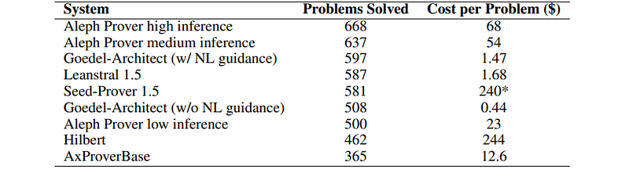
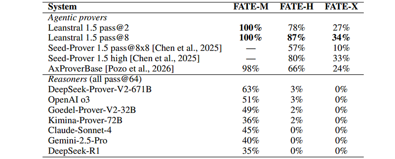
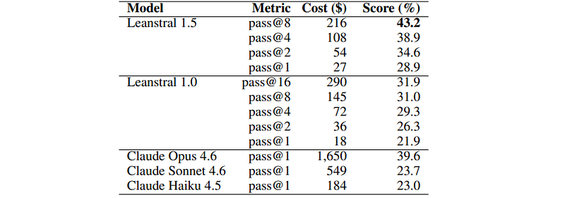

# Papers Explained 597: Leanstral

**Source**: `raw/2026-08-18_Papers-Explained-597--Leanstral-06f0927fe5b0.html`  
**Paper**: https://github.com/mistralai/LeanstralSafeVerify/blob/main/LeanstralReport.pdf  
**Ingested**: 2026-08-23  
**Tags**: #summary

## Summary

**Leanstral** (and **Leanstral 1.5**) is Mistral AI's series of generalist code-agent models tailored for formal theorem proving and proof engineering in **Lean 4**. With **119B total parameters and only 6B active parameters**, Leanstral operates natively within the open-source **Mistral Vibe** code-agent scaffold rather than requiring custom, specialized search trees. It resolves formal verification issues across competition mathematics, graduate-level pure mathematics, mathematical finance, and verified software development.

### Three-Stage Training Pipeline & Lean Environments

1. **Mid-Training**: Initialized from Mistral Small 4, continuing pretraining on 6.5B deduplicated Lean-specific tokens and general code-agent traces.
2. **SFT**: Trained on a Lean-agent mixture (50% Lean traces) filtered to prevent unverified completion claims, task refusals, or context hallucinations.
3. **RL with Verifiable Feedback (CISPO)**:
   - **Prove-or-Disprove Multiturn Environment**: Model attempts self-contained theorems, receives compiler error messages across multiple turns, and receives rewards only for proofs compiling in the Lean interact verifier without invalid axioms (`#print axioms`).
   - **LeanGym PR Environment**: Full repository interaction using `bash` and the Lean language server (`lean-lsp-mcp`), resolving missing theorems from real GitHub pull requests verified via SafeVerify.
   - **CISPO Training**: Uses Clipped Importance Sampling Policy Optimization with finite truncation thresholds $\bar{\rho}_{i,t}$ on interleaved tool-action trajectories.

### Empirical Benchmarks

- **MiniF2F**: Leanstral 1.5 (pass@4) saturates the benchmark, achieving 244/244 on MiniF2F-valid and 242/244 on MiniF2F-test.
- **PutnamBench**: Solves 587 / 672 problems with pass@8, setting the open-source state of the art.
- **FATE Benchmark**: Achieves 100% on undergraduate math (FATE-M), 87% on graduate math (FATE-H), and 34% on PhD/expert math (FATE-X).
- **FLTEval**: Scores 43.2% at pass@8 on realistic Lean software engineering pull requests, surpassing Claude Opus 4.6 (pass@1) at less than 1/7th inference cost.

## Key Claims

- Generalist code agent scaffold outperforms specialized prover architectures when paired with compiler feedback and Lean LSP tooling.
- Sparse 119B-A6B MoE architecture delivers frontier formal mathematical reasoning at low active inference cost.
- CISPO truncated importance sampling stabilizes long-horizon multi-turn tool trajectories in LeanGym.
- Saturates MiniF2F (244/244) and sets new SOTA on PutnamBench (587/672) and FATE-H (87%).

## Figures

| Figure | Caption | Page |
|--------|---------|------|
|  | Papers Explained 597: Leanstral banner. | Overview |
|  | CISPO truncated importance sampling RL objective for LeanGym trajectories. | Training |
|  | PutnamBench leaderboard results. | Evaluation |
|  | FATE benchmark performance across M, H, and X difficulty tiers. | Evaluation |
|  | FLTEval real-repository pull request verification results. | Evaluation |

## Entities

- [[Mistral AI]] — creator of Leanstral.
- [[Leanstral]] — sparse 119B-A6B Lean 4 proof-engineering code agent.
- [[CISPO]] — clipped importance sampling policy optimization.
- [[Reasoning Models]] — formal proof generation and mathematical reasoning.
- [[Agentic AI]] — repository-level proof engineering in Mistral Vibe with Lean LSP MCP.
- [[Code Models]] — verified software synthesis.

## Questions & Gaps

- Proof search performance on massive industrial formal codebases exceeding 100k lines of Lean code.
- Generalization of LeanGym RL recipes to other interactive proof assistants (Coq/Rocq, Isabelle).

## Related

- [[Leanstral]] — official launch summary page.
- [[CISPO]] — core policy optimization algorithm.
- [[devstral-2-vibe-cli]] — Mistral Vibe CLI harness.
- [[Reasoning Models]] — formal reasoning topic.
