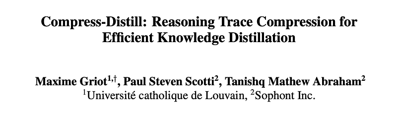
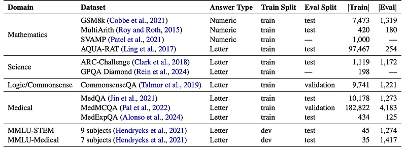
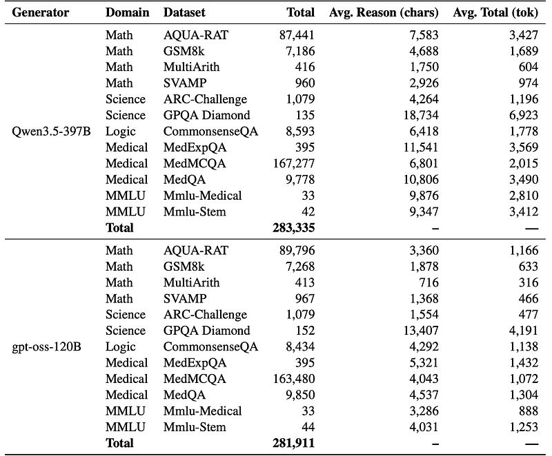
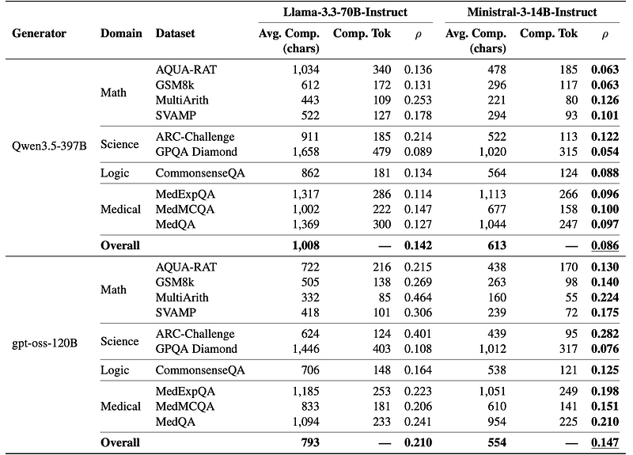
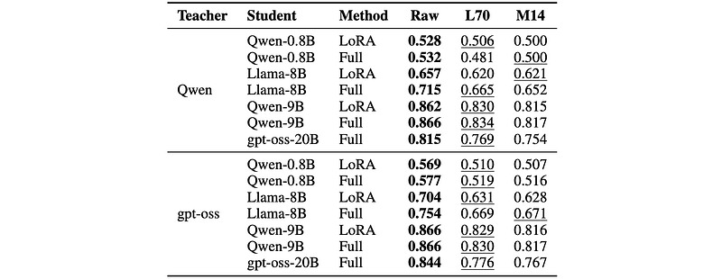
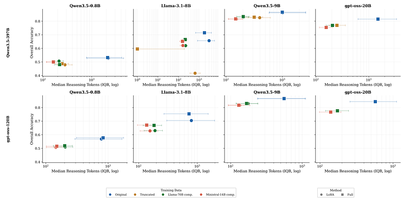

# Papers Explained 598: Compress & Distil

**Source**: `raw/2026-08-19_Papers-Explained-598--Compress-Distil-c5f78c8c8a18.html`  
**Paper**: https://arxiv.org/abs/2606.05988  
**Ingested**: 2026-08-23  
**Tags**: #summary

## Summary

**Compress-Distill** investigates reasoning trace compression for efficient knowledge distillation. Large reasoning models (such as Qwen3.5-397B or gpt-oss-120B) generate verbose, multi-thousand-token reasoning chains that contain redundant verification loops and exploratory dead ends. Training compact student models (e.g. 0.8B to 9B) on these massive raw traces is compute-heavy and creates cognitive mismatch: small models lack the capacity to execute ultra-long thinking trajectories without losing coherence. Compress-Distill evaluates whether intermediate compressor models can condense verbose teacher reasoning into concise, high-density rationale traces while preserving downstream student accuracy.

### Compression Dynamics & Findings

- **Compression Ratios**: Compressors (e.g., Llama-3.3-70B-Instruct or Ministral-3-14B) reduce raw traces to compression ratios $\rho \in [0.14, 0.21]$ (an 80–85% token reduction).
- **Task Dependency**: Hard reasoning problems (GPQA Diamond) compress most effectively, whereas short arithmetic traces (MultiArith) leave little redundancy.
- **Accuracy Trade-off**: Raw traces provide the upper-bound accuracy under unconstrained training budgets; however, high-quality compressed traces retain 90–95% of student accuracy while reducing training FLOPs and inference latency by up to $5\times$.
- **Rewriting vs. Truncation**: Semantic trace rewriting by intermediate LLMs decisively outperforms naive token truncation.

## Key Claims

- Intermediate LLM compressors can reduce reasoning distillation trace length by over 80% with minimal student accuracy drop.
- Semantic rewriting preserves logical validity far better than token truncation or heuristic sentence pruning.
- Compact student models trained on concise rationales show higher inference efficiency and lower cognitive drift.

## Figures

| Figure | Caption | Page |
|--------|---------|------|
|  | Papers Explained 598 overview banner. | Overview |
|  | Compress-Distill pipeline: Raw teacher trace to compressed rationale to student KD. | Method |
|  | Compression ratio rho across benchmark difficulty domains. | Analysis |
|  | Student downstream accuracy: Raw vs. Compressed vs. Truncated traces. | Evaluation |
|  | Training FLOPs vs. benchmark accuracy Pareto frontier. | Efficiency |
|  | Qualitative comparison of raw and compressed reasoning chains. | Qualitative |

## Entities

- [[Compress-Distill]] — reasoning trace compression for knowledge distillation.
- [[Model Distillation]] — sequence-level distillation techniques.
- [[Reasoning Models]] — chain-of-thought rationale distillation.
- [[Model Compression and Efficiency]] — efficient training and serving.

## Questions & Gaps

- Preserving subtle intermediate proof steps when compressing formal mathematical derivations.
- Distortion risks introduced by hallucinated shortcuts in intermediate compressor models.

## Related

- [[Model Distillation]] — core distillation topic.
- [[Papers Explained 591: Generalized Knowledge Distillation]] — on-policy distillation.
- [[Reasoning Models]] — reasoning efficiency.
