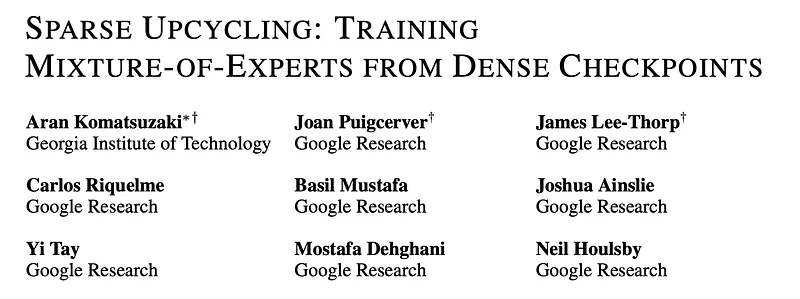
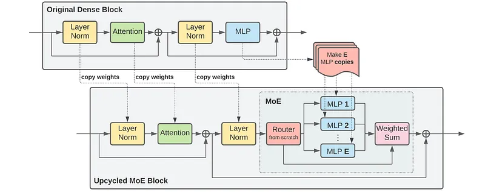
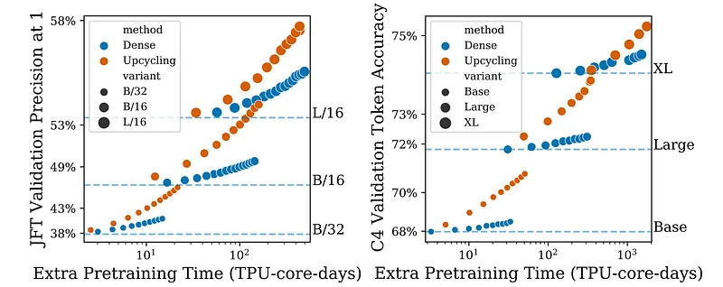
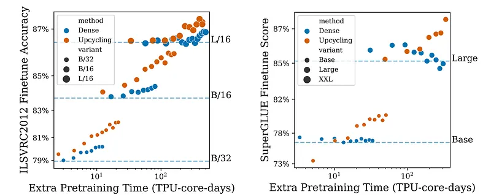
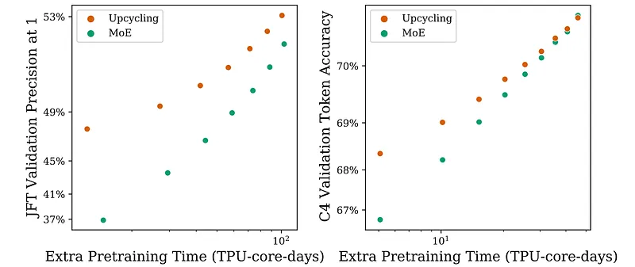
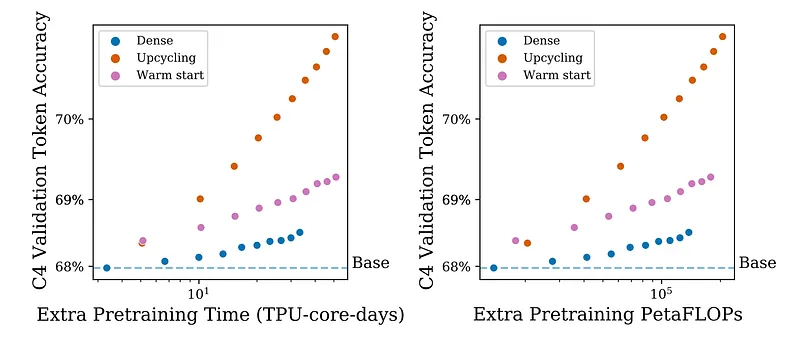

# Papers Explained 599: Sparse Upcycling

**Source**: `raw/2026-08-20_Papers-Explained-599--Sparse-Upcycling-804de5de9c18.md`  
**Paper**: https://arxiv.org/abs/2212.05055  
**Ingested**: 2026-08-23  
**Tags**: #summary

## Summary

**Sparse Upcycling** is a compute-efficient model recycling technique introduced by Komatsuzaki et al. (Google Research) that reuses sunk training costs by initializing a sparsely activated **Mixture-of-Experts (MoE)** model directly from a pretrained dense checkpoint. Instead of training sparse MoE models from scratch (which requires massive datasets and unstable early routing phases), Sparse Upcycling duplicates the dense MLP layers $E$ times to form $E$ parallel experts per MoE layer, initializes a lightweight routing gate, and continues pretraining for a fraction of the original compute budget.

### The Upcycling Algorithm & Router Designs

- **Model Surgery**: Transformer blocks remain identical, but a subset of MLP layers are expanded into MoE layers with $E$ experts copied directly from the dense checkpoint's MLP weights.
- **Routing Strategies**:
  - **Expert Choice Routing**: Each expert selects its top-$C$ tokens based on capacity factor $C=2$, eliminating load imbalance and token dropping (used in Vision MoE / encoders).
  - **Top-K Routing**: Each token is assigned to its top-$K$ experts (standard in decoder language models).
- **Optimizer & State Resumption**: Warm-starting optimizer momentum states and normalizing weights post-routing smooths initial loss spikes.

### Key Empirical Findings

- **Compute Efficiency**: Upcycled MoE models achieve the quality of from-scratch MoEs with only ~20–50% of the total pretraining compute.
- **Gains over Dense Continuation**: Continued training of the upcycled MoE dramatically outperforms continuing the dense baseline under the same FLOP budget.
- **Vision & Language Transfer**: Upstream performance gains in Vision Transformers (V-MoE on JFT-300M) and language models (T5 on C4) transfer directly to downstream classification, fine-tuning, and reasoning benchmarks.

## Key Claims

- Initializing MoE experts by duplicating dense MLP weights reuses sunk compute and bypasses cold-start routing instability.
- Upcycling outperforms continuing dense training by a wide margin under equivalent additional compute.
- Expert Choice and Top-K routing integrate seamlessly into upcycled vision and language backbones.

## Figures

| Figure | Caption | Page |
|--------|---------|------|
|  | Papers Explained 599 overview banner. | Overview |
|  | Sparse Upcycling model surgery and expert initialization. | Algorithm |
|  | Expert Choice vs Top-K router mechanisms. | Routers |
|  | Vision Transformer (V-MoE) scaling curves on JFT-300M. | Vision Eval |
|  | Language model pretraining loss: Upcycled vs. Dense continuation. | Language Eval |
|  | Downstream fine-tuning transfer performance across benchmarks. | Results |

## Entities

- [[Sparse Upcycling]] — MoE initialization from dense checkpoints.
- [[Mixture of Experts]] — sparse architecture family.
- [[Google Research]] — creators of Sparse Upcycling.
- [[Model Compression and Efficiency]] — compute reuse and architectural efficiency.

## Questions & Gaps

- Expert specialization diversity and whether copied experts suffer from persistent parameter redundancy without explicit divergence penalties.
- Upcycling dense checkpoints into modern hybrid architectures (e.g., Gated DeltaNet or linear attention).

## Related

- [[Mixture of Experts]] — core MoE architecture page.
- [[Papers Explained 270 - OLMoE]] — sparse MoE pretraining.
- [[Papers Explained 448 - Sparsely-Gated Mixture-of-Experts Layer]] — foundational MoE layer.
- [[Papers Explained 449 - Switch Transformers]] — single-expert routing.
