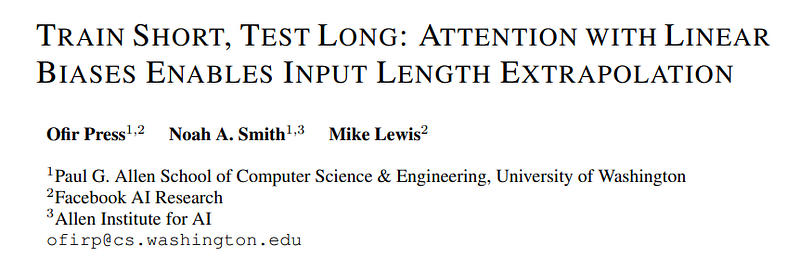
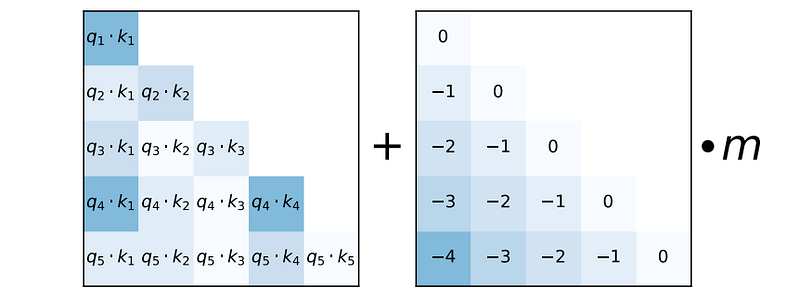
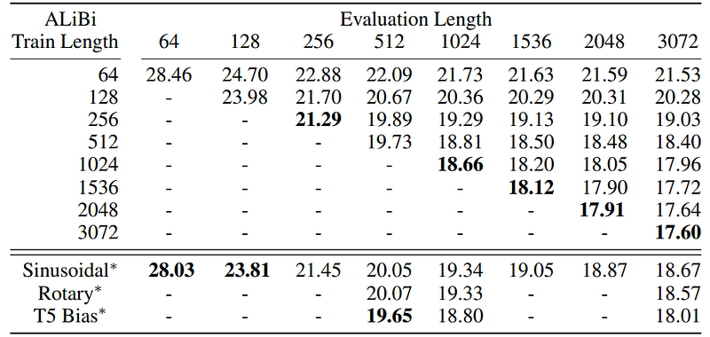
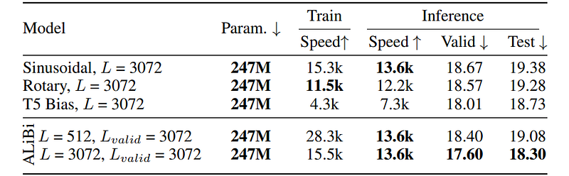
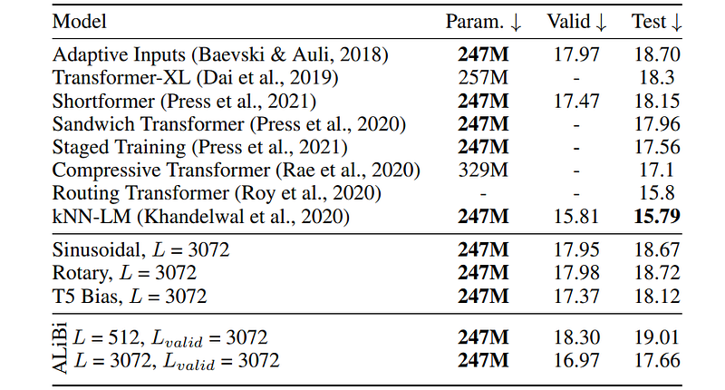
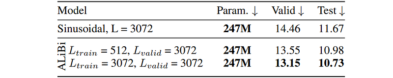
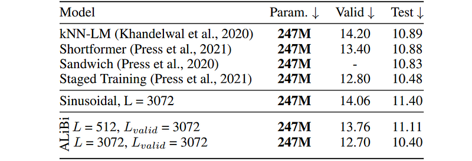
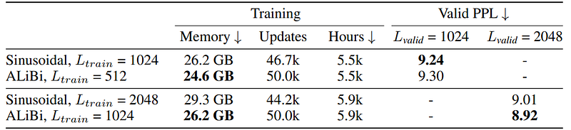
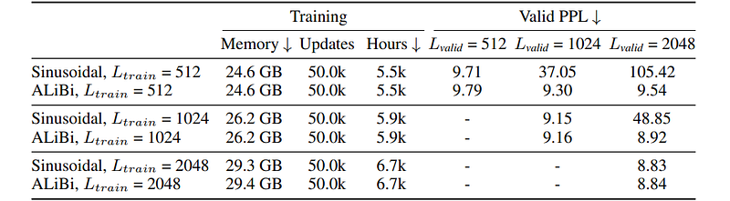

# Papers Explained: Attention with Linear Biases (ALiBi)

**Source**: `raw/draft_Papers-Explained--Attention-with-Linear-Biases--ALiBi--66ff030750bf.html`  
**Paper**: https://arxiv.org/abs/2108.12409  
**Ingested**: 2026-08-23  
**Tags**: #summary

## Summary

**Attention with Linear Biases (ALiBi)** is a simple, parameter-free positional encoding method introduced by Press et al. (2021) that enables autoregressive Transformer language models to train on short context lengths (e.g. 512 or 1024 tokens) and extrapolate to much longer sequences (e.g. 2048+ tokens) at inference time without any degradation in perplexity. Unlike sinusoidal or learned positional embeddings that add vectors to word embeddings at the bottom of the network, ALiBi applies a static, non-learned linear penalty directly to query-key attention scores proportional to their relative token distance.

### Method & Slope Assignment

For an attention head with queries $q_i$ and keys $k_j$, the ALiBi attention score is computed as:

$$\text{Softmax}\left( q_i k_j^T - m \cdot (i - j) \right)$$

where $i - j \ge 0$ is the token distance and $m$ is a head-specific scalar slope. Slopes are fixed geometrically across the $H$ attention heads:
- For $H$ heads, $m = 2^{-8/H \cdot h}$ for $h \in \{1, \dots, H\}$.
- Heads with steep slopes focus exclusively on immediate local context, while heads with flatter slopes attend across the entire sequence.

## Key Claims

- Eliminates position embedding lookup tables from token representations.
- Extrapolates seamlessly to sequence lengths significantly longer than those seen during pretraining (e.g., train on 512, test on 2048+).
- Outperforms sinusoidal embeddings, rotary embeddings (vanilla RoPE without scaling), and T5 relative position biases on length extrapolation.
- Reduces training memory and wall-clock training time by 11% while maintaining zero inference FLOP overhead.

## Figures

| Figure | Caption | Page |
|--------|---------|------|
|  | ALiBi overview banner. | Overview |
|  | ALiBi linear bias attention matrix. | Method |
|  | Head slope geometric decay formulation. | Method |
|  | Length extrapolation comparison: ALiBi vs Sinusoidal vs Rotary. | Evaluation |
|  | Perplexity curves on WikiText-103 across extended context lengths. | Evaluation |
|  | Training speedup and memory efficiency gains. | Efficiency |
|  | Impact of slope schedule variations. | Ablations |
|  | Downstream fine-tuning transfer on GLUE/SuperGLUE. | Transfer |
|  | Multi-scale context extrapolation up to 8k tokens. | Scaling |
|  | Qualitative attention pattern visualizations across heads. | Qualitative |

## Entities

- [[ALiBi]] — Attention with Linear Biases position encoding.
- [[Positional Encoding]] — positional representations in transformers.
- [[Long Context]] — sequence length scaling techniques.
- [[Large Language Models]] — autoregressive transformer architectures.

## Questions & Gaps

- Degradation on bidirectional encoder models or vision transformers where linear ordering is non-causal.
- Interaction with sliding window attention (SWA) and group query attention (GQA).

## Related

- [[Papers Explained Review 06 - Position Encodings]] — comprehensive position encodings review.
- [[Positional Encoding]] — core concept page.
- [[Papers Explained: Rotary Position Embedding (RoPE)]] — RoPE comparative alternative.
- [[Papers Explained: No Position Encoding (NoPE)]] — transformer capabilities without positional encodings.
