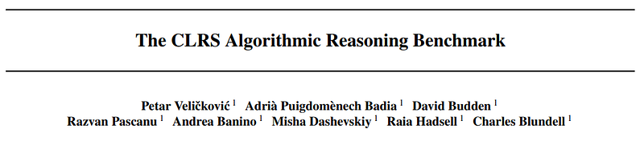
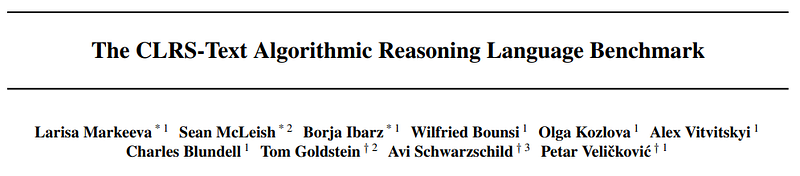
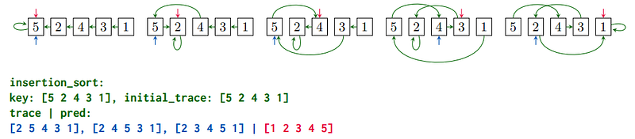
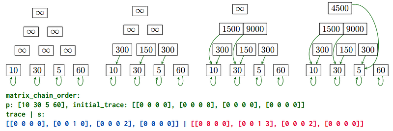

# Papers Explained: CLRS and CLRS-Text Benchmark

**Source**: `raw/draft_Papers-Explained--CLRS-and-CLRS-Text-Benchmark-60a80a8e43ef.html`  
**Papers**: https://arxiv.org/abs/2205.15659, https://arxiv.org/abs/2406.04229  
**Ingested**: 2026-08-23  
**Tags**: #summary

## Summary

The **CLRS Algorithmic Reasoning Benchmark** (Veličković et al., DeepMind) and its text-based extension **CLRS-Text** establish a comprehensive benchmark suite designed to evaluate algorithmic reasoning in neural networks and large language models. Covering 30+ classical algorithms from the *Introduction to Algorithms* textbook (CLRS)—spanning sorting, searching, dynamic programming, graph algorithms (Dijkstra, Bellman-Ford, Prim), geometry, and string matching—CLRS probes whether models learn generalizable algorithmic execution step-by-step rather than memorizing pattern shortcuts.

### Representations & Probes

- **Graph & Probe Representation (CLRS-30)**: Algorithms are represented as graph networks with intermediate state transitions recorded as node, edge, and graph-level probe trajectories. Models predict intermediate execution states (pointers, colors, distances).
- **CLRS-Text Extension**: Translates graph algorithm executions into natural language and tokenized execution traces, allowing standard autoregressive LLMs to be tested on multi-step algorithmic execution, variable tracking, and out-of-distribution graph scale extrapolation.

## Key Claims

- Provides standard execution trajectories for 30+ classical computer science algorithms across diverse algorithmic paradigms.
- Neural algorithmic reasoners (such as Triplet-GMPNN) achieve high algorithmic alignment on graph probes.
- CLRS-Text benchmarks frontier LLMs on algorithmic execution, revealing severe extrapolation failures as graph size $N$ and step horizon grow.

## Figures

| Figure | Caption | Page |
|--------|---------|------|
|  | CLRS and CLRS-Text overview banner. | Overview |
|  | CLRS algorithmic categorization and probe representations. | Method |
|  | Dataset statistics across graph algorithms and sorting routines. | Statistics |
|  | Benchmark accuracy across graph and text algorithmic reasoning models. | Evaluation |

## Entities

- [[CLRS Benchmark]] — DeepMind algorithmic reasoning benchmark.
- [[DeepMind]] — creators of the CLRS benchmark suite.
- [[Evaluation and Benchmarks]] — reasoning and algorithmic evaluation.
- [[Reasoning Models]] — algorithmic reasoning in neural architectures.

## Questions & Gaps

- Context length explosion when serializing complex graph states for 1000+ node graphs in CLRS-Text.
- Integration of tool-use compilers to verify intermediate algorithmic steps.

## Related

- [[Evaluation and Benchmarks]] — core benchmark topic page.
- [[Reasoning Models]] — multi-step reasoning models.
