# Papers Explained: Is One Layer Enough?

**Source**: `raw/draft_Papers-Explained--Is-One-Layer-Enough-36b5241b379b.md`  
**Paper**: https://arxiv.org/abs/2607.01232  
**Ingested**: 2026-08-23  
**Tags**: #summary

## Summary

**Is One Layer Enough?** systematically investigates the per-layer contribution to post-training in deep language models (specifically during Reinforcement Learning with Verifiable Rewards, RLVR, and Supervised Fine-Tuning, SFT). By training only a single transformer block at a time while keeping all other layers frozen, the authors discover that **layer contribution varies dramatically across depth but remains remarkably consistent across datasets, algorithms, and tasks**. In modern architectures like Qwen3 and Llama, middle-to-deep layers account for nearly 80%+ of the total downstream reasoning gains achieved by full-parameter tuning.

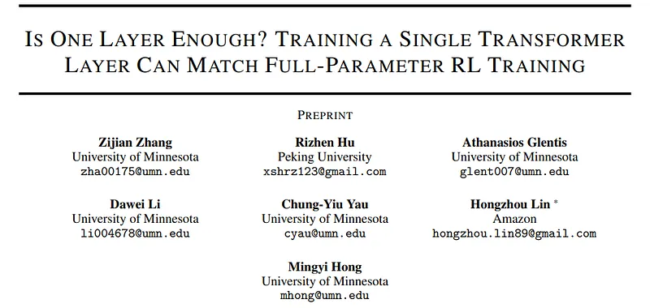

### Key Insights & Layer-Adaptive Optimization

1. **Single-Layer Training Power**: Training just *one* carefully chosen middle-to-deep layer can match up to 85–90% of the accuracy gains of full-parameter RLVR on MATH and GSM8K.
2. **Layer Contribution Profile**:
   - Initial layers (embedding and early attention) contribute negligible reasoning improvements.
   - Middle-to-deep layers (e.g. layers 18–28 in a 36-layer model) exhibit peak learning velocity and representational plastic capacity.
   - The final layers before the LM head show moderate, formatting-oriented gains.
3. **Layer-Adaptive Learning Rate (LALR)**: Scaling learning rates proportionally to empirical layer contribution profiles accelerates convergence and improves final full-parameter performance by 2–3 percentage points.
4. **Layer-Selective Training (LST)**: Freezing low-contribution early layers cuts backward-pass memory and compute by 40–50% with zero loss in downstream benchmark accuracy.

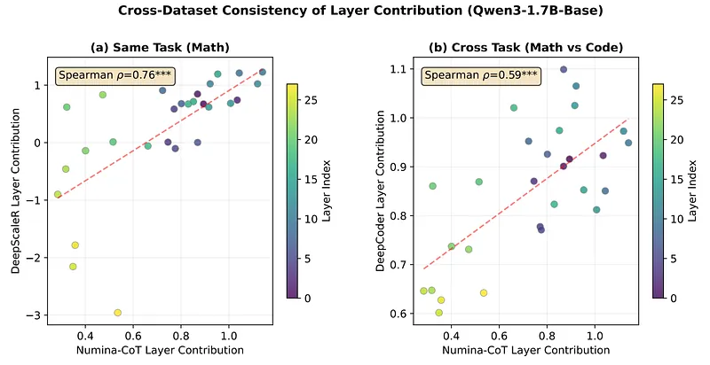

## Key Claims

- Layer contribution to post-training reasoning is highly heterogeneous across depth but invariant across tasks and datasets.
- A single middle-to-deep layer can recover the vast majority of full-parameter RLVR reasoning performance.
- Layer-Adaptive Learning Rates (LALR) and Layer-Selective Training (LST) dramatically improve training speed and memory efficiency.

## Figures

| Figure | Caption | Page |
|--------|---------|------|
|  | Overview banner. | Overview |
| 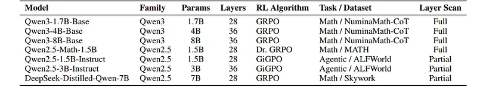 | Experimental setup across Qwen3 and Llama model families. | Setup |
| 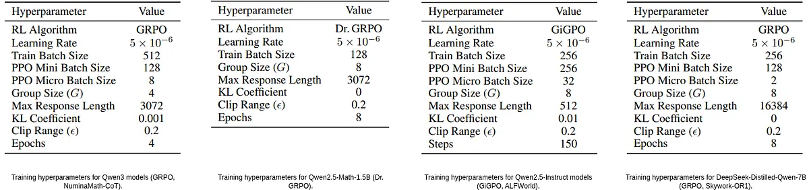 | Single-layer training contribution across all layers on MATH. | Analysis |
|  | Layer contribution consistency across GSM8K, Olympiad, and Codeforces. | Analysis |
| 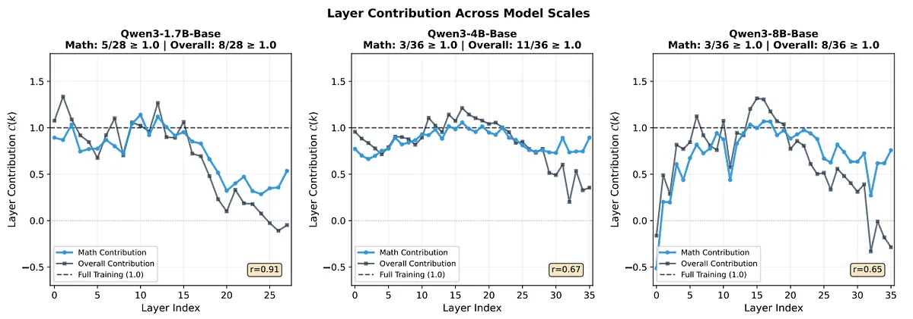 | Comparison across RLVR (GRPO) and SFT training algorithms. | Comparison |
| 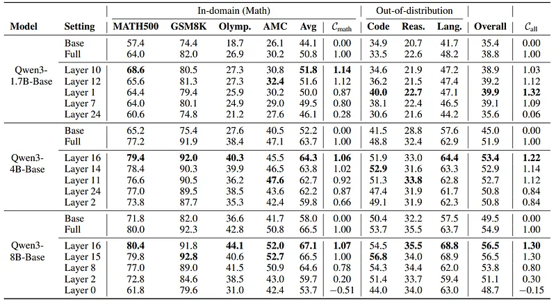 | Layer-Adaptive Learning Rate (LALR) formulation and schedule. | Method |
|  | Full-parameter training acceleration with LALR. | Results |
| 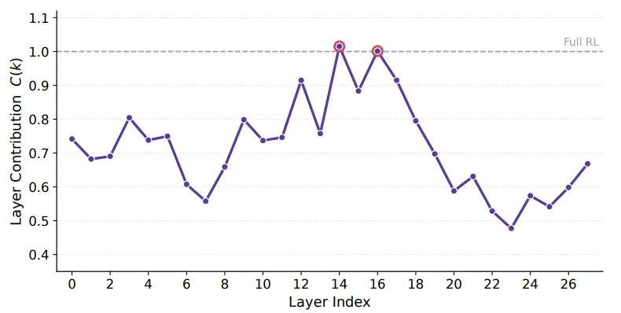 | Layer-Selective Training (LST) compute vs. accuracy Pareto curve. | Efficiency |
| 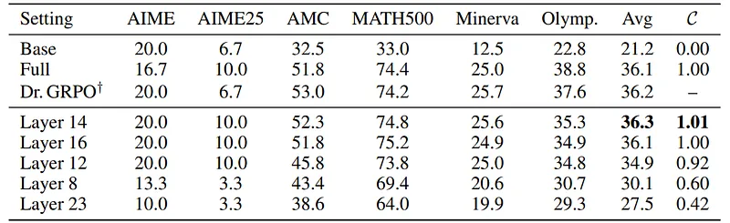 | Heuristic layer selection guidelines for arbitrary model depths. | Heuristics |
| 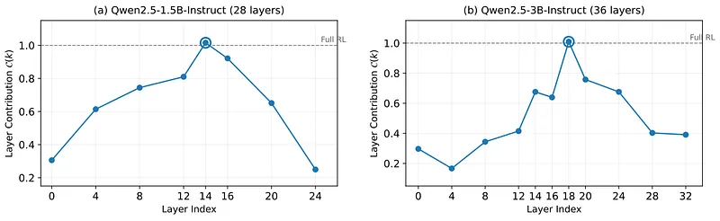 | Representational drift and weight delta analysis across layers. | Analysis |
| 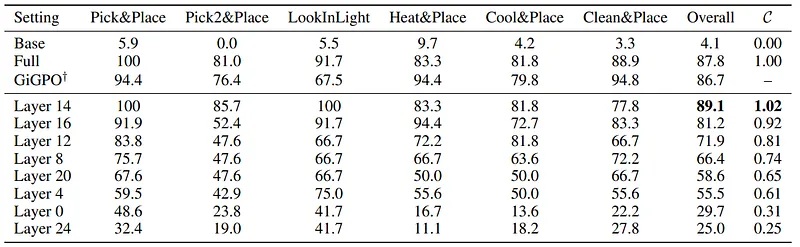 | Cross-architecture validation on Gemma and Mistral. | Generalization |
| 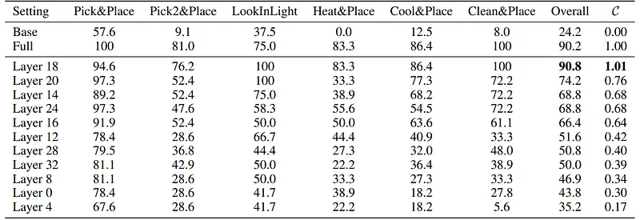 | Memory savings during single-layer and selective-layer backpropagation. | Efficiency |
| 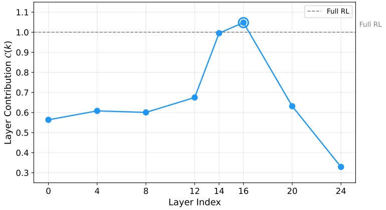 | Gradient norm distribution across transformer depth. | Dynamics |
| 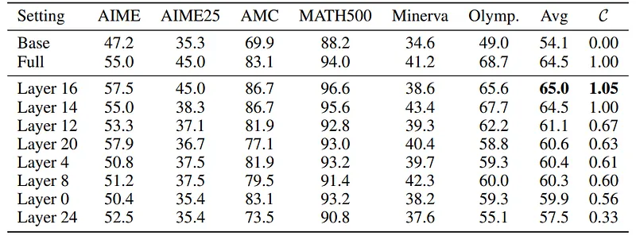 | Qualitative reasoning trace changes under middle-layer training. | Qualitative |
| 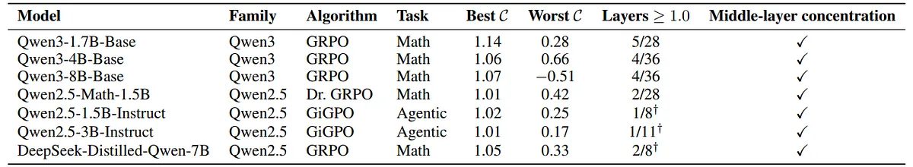 | Comparison against LoRA rank scaling across depth. | Comparison |
| 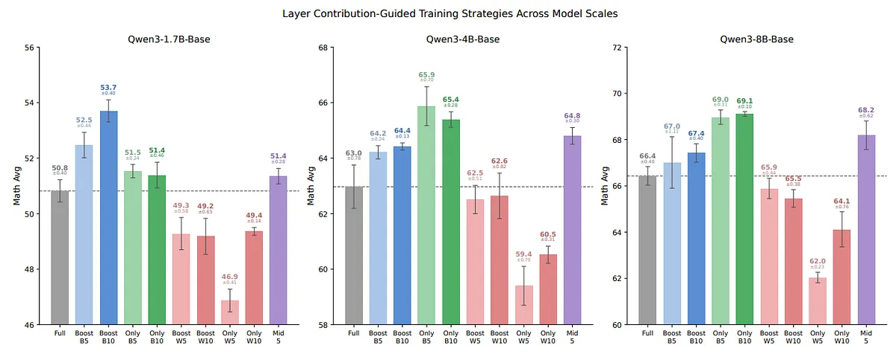 | Synthesis of layer contribution principles for post-training. | Summary |

## Entities

- [[Layer-Adaptive Learning Rate]] — depth-aware learning rate scheduling.
- [[Layer-Selective Training]] — compute-efficient post-training updating only high-contribution layers.
- [[Reasoning Models]] — mathematical and logical reasoning post-training.
- [[Model Compression and Efficiency]] — training compute optimization.

## Questions & Gaps

- Whether layer contribution profiles shift in multimodal vision-language architectures where early layers process visual tokens.
- Impact of Layer-Selective Training on long-term safety alignment and catastrophic forgetting.

## Related

- [[Model Compression and Efficiency]] — core efficiency topic.
- [[Reinforcement Learning Topic]] — post-training RLVR.
- [[Beyond LoRA: Can You Beat the Most Popular Fine-Tuning Technique?]] — parameter-efficient fine-tuning alternatives.
