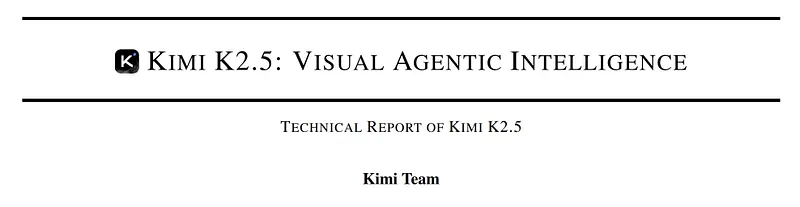
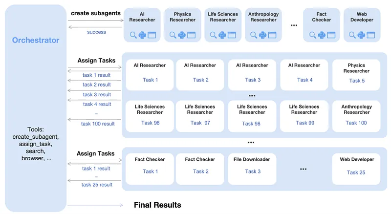
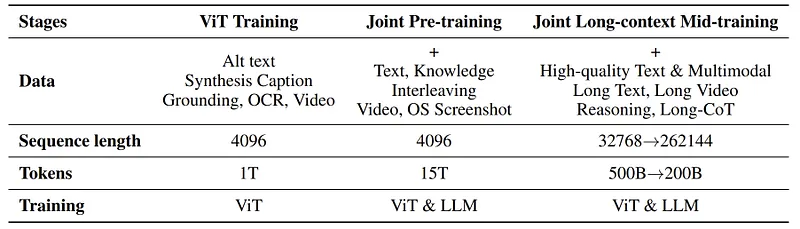
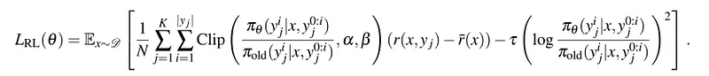
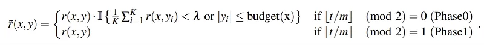
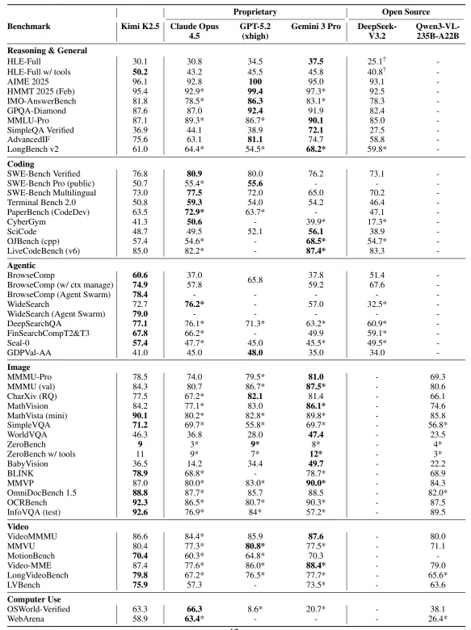
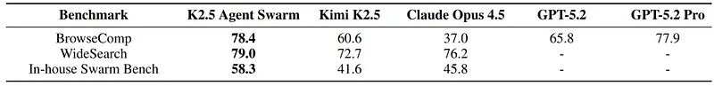

# Papers Explained: Kimi K2.5

**Source**: `raw/draft_Papers-Explained--Kimi-K2-5-2598a949ad61.md`  
**Paper**: https://arxiv.org/abs/2602.02276  
**Ingested**: 2026-08-23  
**Tags**: #summary

## Summary

**Kimi K2.5** is Moonshot AI's frontier multimodal reasoning and agentic foundation model. Building on the ultra-sparse Mixture-of-Experts architecture of Kimi K2, Kimi K2.5 introduces native **Joint Optimization of Text and Vision**, **Zero-Vision SFT**, **Joint Multimodal Reinforcement Learning**, and **Parallel Agent Reinforcement Learning (PARL)** for large-scale agent swarm orchestration. Operating at frontier scale (trillion-parameter MoE with 32B active parameters), Kimi K2.5 achieves parity with proprietary frontier systems across vision-language reasoning, mathematical proof, and multi-agent software engineering.

### Key Architectural & Algorithmic Innovations

1. **Native Joint Multimodal Pretraining**: Integrates continuous visual representations into the MoE routing backbone from early pretraining stages rather than stitching a frozen vision encoder onto a pretrained text model.
2. **Zero-Vision SFT**: Discovers that high-quality text-only reasoning SFT transfers zero-shot to complex visual reasoning when paired with joint multimodal pretraining, preventing catastrophic forgetting of pure text reasoning during vision adaptation.
3. **Joint Multimodal RL**: End-to-end reinforcement learning with verifiable rewards across interleaved text-image reasoning, GUI execution, and chart synthesis.
4. **Agent Swarm & PARL**: Parallel Agent Reinforcement Learning enables K2.5 to coordinate multi-agent swarms, decomposing massive coding and research tasks into parallel sub-agents with asynchronous synchronization and unified reward attribution.

## Key Claims

- Frontier multimodal MoE model matching top proprietary systems on multimodal math, coding, and document analysis.
- Zero-Vision SFT demonstrates strong cross-modal transfer of pure textual chain-of-thought capabilities into visual domains.
- Parallel Agent Reinforcement Learning (PARL) successfully scales multi-agent swarm collaboration and tool execution.

## Figures

| Figure | Caption | Page |
|--------|---------|------|
|  | Kimi K2.5 overview banner. | Overview |
|  | Joint text-vision MoE architecture and pretraining pipeline. | Architecture |
|  | Zero-Vision SFT cross-modal transfer dynamics. | SFT |
|  | Joint Multimodal Reinforcement Learning pipeline. | RL |
|  | Parallel Agent Reinforcement Learning (PARL) swarm framework. | Agent Swarm |
|  | Multimodal benchmark results (MathVista, MMMU, ChartQA). | Evaluation |
|  | Coding and SWE-Bench Verified performance. | Coding |
|  | Long-context visual document retrieval and reasoning. | Long Context |
|  | Qualitative agent swarm execution on complex software repositories. | Qualitative |

## Entities

- [[Moonshot AI]] — creator of the Kimi model family.
- [[Kimi K2.5]] — frontier multimodal MoE model.
- [[Agentic AI]] — multi-agent swarm orchestration and PARL.
- [[Vision Language Models]] — native multimodal reasoning.
- [[Mixture of Experts]] — sparse MoE architecture.

## Questions & Gaps

- Compute overhead of running large-scale PARL multi-agent swarm environments during online RL training.
- Synchronization latency across distributed sub-agents in production serving harnesses.

## Related

- [[Papers Explained 451 - Kimi K2]] — text-only predecessor.
- [[Papers Explained: Kimi K3]] — successor model with multi-teacher distillation.
- [[Vision Language Models]] — multimodal models.
- [[Agentic AI]] — agent architectures and swarms.
