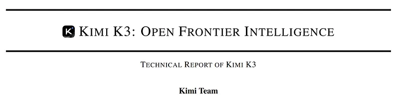
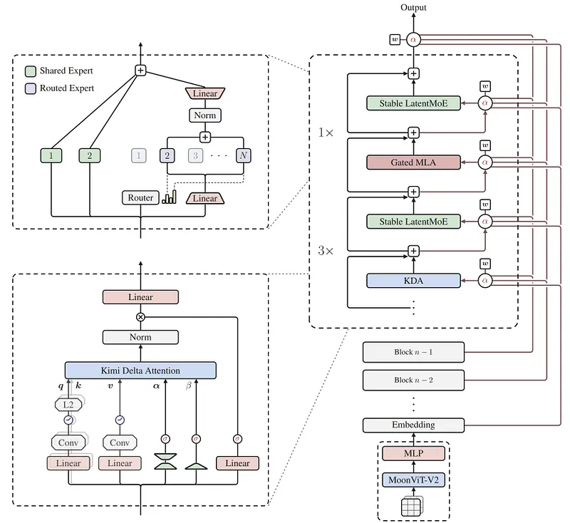
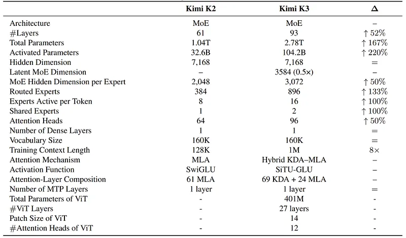
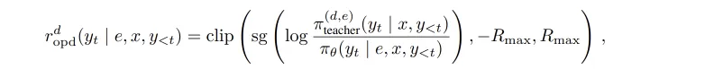
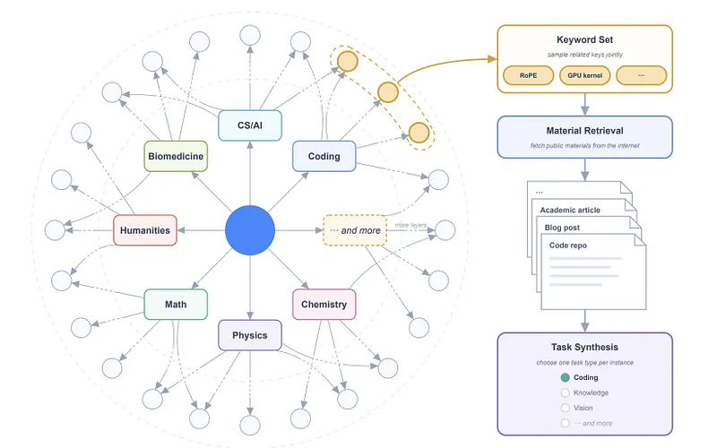
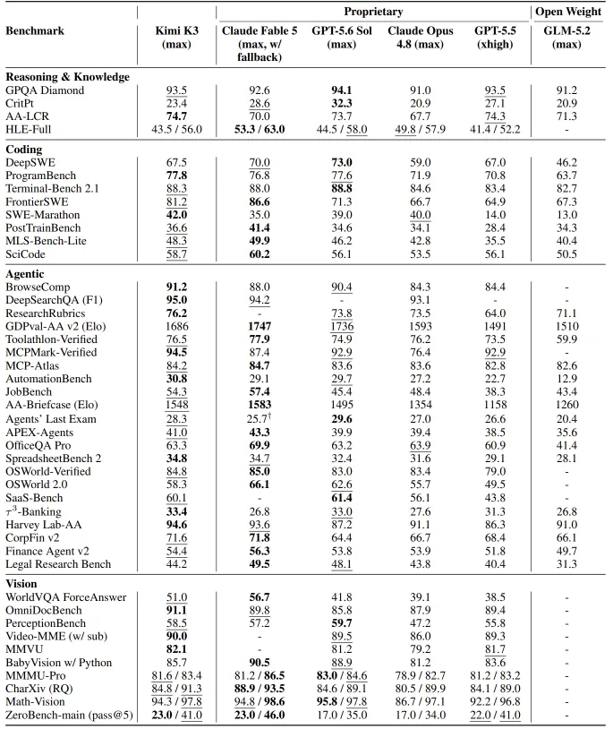

# Papers Explained: Kimi K3

**Source**: `raw/draft_Papers-Explained--Kimi-K3-97c6b5e539bb.md`  
**Paper**: https://arxiv.org/abs/2607.24653  
**Ingested**: 2026-08-23  
**Tags**: #summary

## Summary

**Kimi K3** represents Moonshot AI's next-generation reasoning and agentic foundation model. Advancing beyond K2.5, Kimi K3 integrates **Multi-Teacher On-Policy Distillation**, **Massive RL Task Synthesis**, and specialized **Agentic Sandboxes** for multi-step software engineering and scientific discovery. By combining asynchronous multi-teacher guidance (distilling from specialized mathematics, coding, and multimodal teachers simultaneously) with verifiable reward RL, Kimi K3 achieves state-of-the-art results on competitive programming, formal theorem proving, and SWE-Bench Verified.

### Core Technologies

1. **Multi-Teacher On-Policy Distillation**: Assembles an ensemble of specialized frontier teachers. During student on-policy rollout, a dynamic routing gate assigns token-level distillation targets from the domain-expert teacher.
2. **RL Task Synthesis**: Automates generation of complex verifiable environments across repository debugging, terminal administration, and mathematical conjecture proving.
3. **Architecture Enhancements**: Features refined Multi-Head Latent Attention (MLA) with extreme sparse routing and dynamic compute allocation per token.

## Key Claims

- Multi-teacher on-policy distillation enables a single student model to inherit specialized domain expertise across math, code, and multimodal tasks.
- Sets new open-weights benchmarks on SWE-Bench Verified, LiveCodeBench, and AIME 2026.
- Scaled agentic sandboxes allow continuous self-play and tool-use optimization during post-training.

## Figures

| Figure | Caption | Page |
|--------|---------|------|
|  | Kimi K3 overview banner. | Overview |
|  | Kimi K3 multi-teacher on-policy distillation architecture. | Method |
|  | RL task synthesis and agentic sandbox environment. | Environments |
|  | Benchmark performance across Coding, Math, and Tool-use. | Evaluation |
|  | Multi-teacher vs single-teacher distillation ablation curves. | Ablations |
|  | Qualitative long-horizon software engineering case study. | Qualitative |

## Entities

- [[Moonshot AI]] — creator of Kimi K3.
- [[Kimi K3]] — next-generation reasoning and agentic foundation model.
- [[On-Policy Distillation]] — multi-teacher trajectory distillation.
- [[Agentic AI]] — sandbox execution and repository coding.
- [[Reasoning Models]] — competitive math and reasoning.

## Questions & Gaps

- Load balancing and throughput optimization when querying multiple large teacher models in parallel during student rollout generation.
- Policy interference when conflicting domain teachers emit contradictory token probability distributions.

## Related

- [[Papers Explained: Kimi K2.5]] — predecessor model.
- [[Papers Explained 451 - Kimi K2]] — architecture foundation.
- [[On-Policy Distillation]] — distillation framework.
